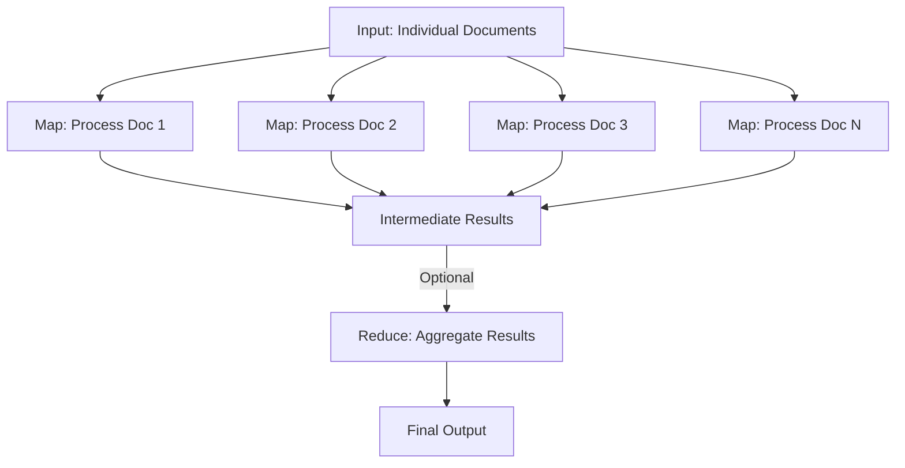

**Map Reduce** chains enable efficient parallel processing of multiple documents by dividing the task into two stages:

1. **Map:** Each document is processed independently and concurrently—similar to having multiple readers analyze different books at the same time.
2. **Reduce (optional):** The individual outputs are then aggregated into a single, cohesive result.

This method is particularly valuable in two scenarios:

* When processing **many large documents** that, together, would exceed the context window of a language model.
* When documents are **independent** and can be processed in parallel to improve efficiency.

By splitting the workload, Map Reduce helps scale processing while maintaining performance and coherence.




```python
from langchain.documents import Document

documents = [
    Document(
        page_content=(
            "Richard Feynman was born on May 11, 1918, in Queens, New York. He showed an early "
            "interest in science, especially radios and engineering. As a teenager, he repaired "
            "radios as a hobby and even earned some money doing it.\n\n"
            "He attended the Massachusetts Institute of Technology (MIT) for his undergraduate "
            "studies and later earned his PhD in physics from Princeton University in 1942. At "
            "Princeton, he impressed many with his quick mind and problem-solving skills.\n\n"
            "After completing his PhD, he joined the Los Alamos Laboratory as part of the Manhattan Project."
        ),
        metadata={"source": "early_life"},
        id="1"
    ),
    Document(
        page_content=(
            "During World War II, Feynman worked on the Manhattan Project, the top-secret effort "
            "to build the first atomic bomb. He was based at Los Alamos Laboratory in New Mexico.\n\n"
            "There, he worked under physicist Hans Bethe and was known for his creativity and sense "
            "of humor. One of his habits was picking locks and cracking safes—not to steal secrets, "
            "but to prove how insecure they were.\n\n"
            "Feynman’s contributions helped the U.S. develop nuclear weapons, which were used in "
            "1945 to end the war."
        ),
        metadata={"source": "manhattan_project"},
        id="2"
    ),
    Document(
        page_content=(
            "After the war, Feynman became a professor at Cornell University and later at the "
            "California Institute of Technology (Caltech). In 1965, he won the Nobel Prize in "
            "Physics for his work on quantum electrodynamics, shared with Julian Schwinger and "
            "Sin-Itiro Tomonaga.\n\n"
            "He became famous for his lectures, especially the Feynman Lectures on Physics, which "
            "are still used today. In 1986, he served on the Rogers Commission that investigated "
            "the Space Shuttle Challenger disaster.\n\n"
            "Feynman died on February 15, 1988, in Los Angeles, California, after a long battle "
            "with cancer."
        ),
        metadata={"source": "later_career"},
        id="3"
    ),
]
```


```python
from langchain.chains import create_map_reduce_chain
from langchain.chat_models import init_chat_model

model = init_chat_model("claude-opus-4-20250514", max_tokens=32_000)

chain = (
    create_map_reduce_chain(
        model, 
        map_prompt="Which locations are mentioned in the document?",
    )
    .compile(name='location-extractor')
)


response = chain.invoke({"documents": documents})
for mapped_result in response['map_results']:
    print(mapped_result)
    print('--')


# And examine the default reduce result
print(response['result'])
```
```output
{'indexes': [0], 'result': "Based on the document, the following locations are mentioned:\n\n1. **Queens, New York** - Richard Feynman's birthplace\n2. **Massachusetts Institute of Technology (MIT)** - Where he attended undergraduate studies\n3. **Princeton University** - Where he earned his PhD in physics in 1942\n4. **Los Alamos Laboratory** - Where he worked after completing his PhD as part of the Manhattan Project\n\nThese locations trace Feynman's early life journey from his birth in New York through his education in Massachusetts and New Jersey, to his work on the Manhattan Project in New Mexico."}
--
{'indexes': [1], 'result': "Based on the document, the following locations are mentioned:\n\n1. **Los Alamos Laboratory** - Where Feynman was based during his work on the Manhattan Project\n2. **New Mexico** - The state where Los Alamos Laboratory is located\n3. **U.S. (United States)** - The country that developed the nuclear weapons\n\nThese are the only specific locations mentioned in this document about Feynman's work during World War II on the Manhattan Project."}
--
{'indexes': [2], 'result': 'Based on the document, the following locations are mentioned:\n\n1. **Cornell University** - Where Feynman became a professor after the war\n2. **California Institute of Technology (Caltech)** - Where he later became a professor\n3. **Los Angeles, California** - Where Feynman died on February 15, 1988\n\nThese are the only specific locations explicitly mentioned in this document.'}
--
Based on the documents, here are the locations associated with Richard Feynman's life and career:

**Early Life and Education:**
- **Queens, New York** - Birthplace
- **Massachusetts Institute of Technology (MIT)** - Undergraduate studies
- **Princeton University** - PhD in physics (1942)

**Manhattan Project:**
- **Los Alamos Laboratory, New Mexico** - Worked on nuclear weapons development during World War II

**Academic Career:**
- **Cornell University** - Professor position after the war
- **California Institute of Technology (Caltech)** - Later professor position

**Death:**
- **Los Angeles, California** - Died February 15, 1988

These locations trace Feynman's journey from his New York origins through his education in the Northeast, his wartime service in New Mexico, his post-war academic positions at prestigious universities, and his final years in California.
```
# Rate Limiting

You may need to rate limit the requests to the LLM when issuing requests in parallel.

Please see the documentation in **CHAT MODELS** for information on how to add a rate limiter.
