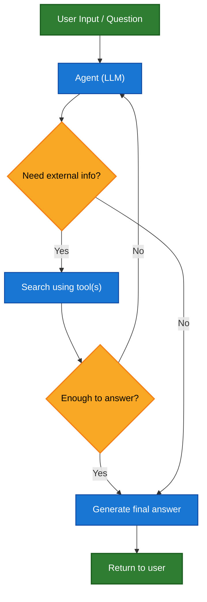
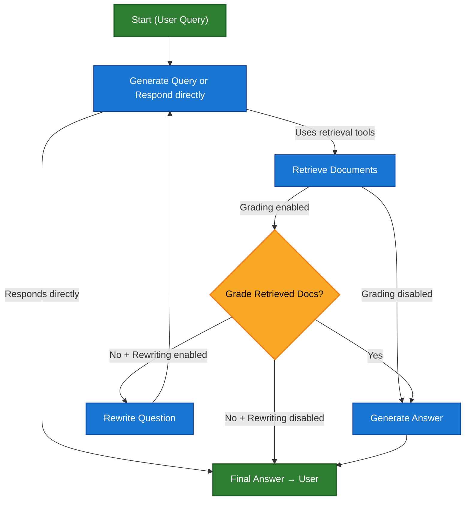
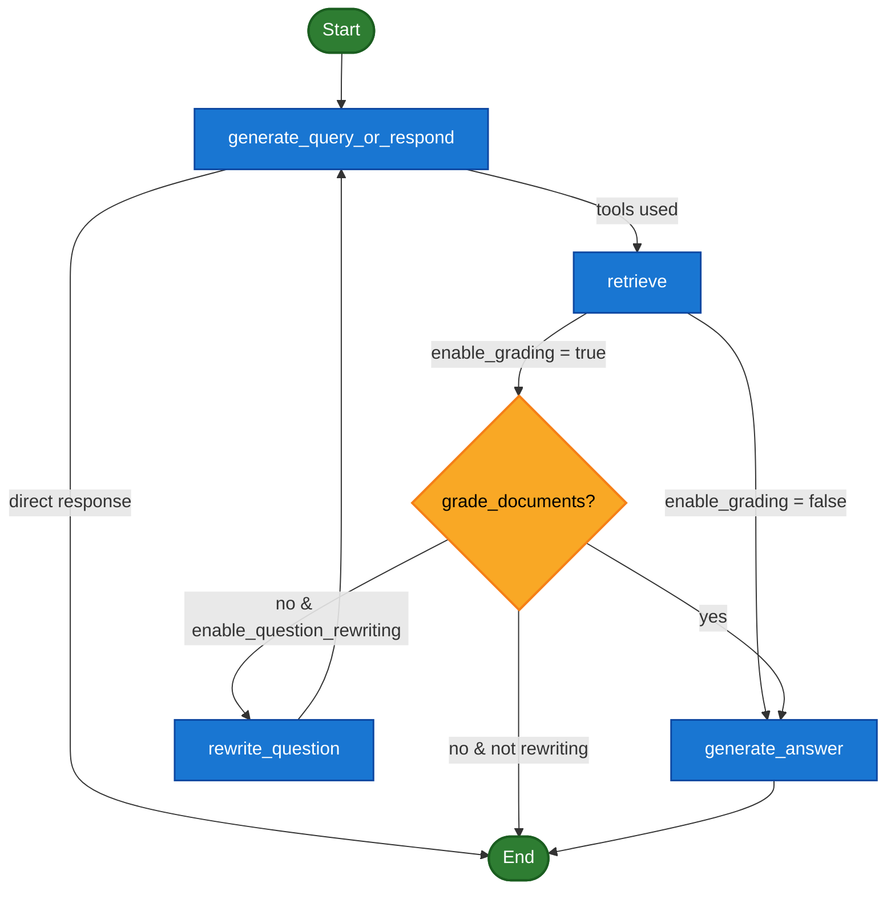

**Agentic Retrieval-Augmented Generation (RAG)** combines the strengths of Retrieval-Augmented Generation with agent-based reasoning. Instead of retrieving documents before answering, an agent (powered by an LLM) reasons step-by-step and decides **when** and **how** to retrieve information during the interaction.

<Tip>
The only thing an agent needs to enable RAG behavior is access to one or more **tools** that can fetch external knowledge — such as documentation loaders, web APIs, or database queries. This tool-based architecture makes Agentic RAG modular, flexible, and ideal for evolving knowledge environments.
</Tip>




### 🧪 Example: Agentic RAG with LangGraph Documentation

This example implements an **Agentic RAG system** to assist users in querying LangGraph documentation. The agent begins by loading `llms.txt`, which lists available documentation URLs, and can then dynamically use a `fetch_documentation` tool to retrieve and process the relevant content based on the user’s question.


```python
from markdownify import markdownify
import requests

from langchain_core.tools import tool
from langgraph.prebuilt import create_react_agent
from langchain.chat_models import init_chat_model

ALLOWED_DOMAINS = ["https://langchain-ai.github.io/"]
LLMS_TXT = 'https://langchain-ai.github.io/langgraph/llms.txt'

@tool
def fetch_documentation(url: str) -> str:
    """Fetch and convert documentation from a URL"""
    if not any(url.startswith(domain) for domain in ALLOWED_DOMAINS):
        return f"Error: URL not allowed. Must start with one of: {', '.join(ALLOWED_DOMAINS)}"
    response = requests.get(url, timeout=10.0)
    response.raise_for_status()
    return markdownify(response.text)

# We will fetch the content of llms.txt, so this can be done ahead of time without requiring an LLM request.
llms_txt_content = requests.get(LLMS_TXT).text

# System prompt for the agent
system_prompt = f"""
You are an expert Python developer and technical assistant. 
Your primary role is to help users with questions about LangGraph and related tools.

Instructions:

1. If a user asks a question you're unsure about — or one that likely involves API usage, 
   behavior, or configuration — you MUST use the `fetch_documentation` tool to consult the relevant docs.
2. When citing documentation, summarize clearly and include relevant context from the content.
3. Do not use any URLs outside of the allowed domain.
4. If a documentation fetch fails, tell the user and proceed with your best expert understanding.

You can access official documentation from the following approved sources:

{llms_txt_content}

You MUST consult the documentation to get up to date documentation 
before answering a user's question about LangGraph.

Your answers should be clear, concise, and technically accurate.
"""

tools = [fetch_documentation]

model = init_chat_model('claude-sonnet-4-0', max_tokens=32_000)

agent = create_react_agent(
    model=model,
    tools=tools,
    prompt=system_prompt,
)

response = agent.invoke({
    'messages': [{
        'role': 'user',
        'content': (
            "Write a short example of a langgraph agent using the 
            prebuilt create react agent. the agent should be able 
            to loook up stock pricing information."
        )
    }]
})

print(response['messages'][-1].content)
```

```output
  Cell In[46], line 60
    "Write a short example of a langgraph agent using the
    ^
SyntaxError: unterminated string literal (detected at line 60)
```

## Dedicated RAG architecture

## Dedicated RAG Architecture (Improved Visualization)







## Misc

Here's another idea of a tool we could use for demoing.

We could do something with the open library API. But it might be a bit less interesting since it involves querying a structured search engine; i.e., it's not open ended enough!


```python
import requests
from typing import Optional, Annotated
from langchain_core.tools import tool

@tool
def search_books(
    title: Optional[str] = None,
    author: Optional[str] = None,
    subject: Optional[str] = None,
    year: Optional[int] = None,
    max_results: Annotated[int, "Maximum number of results to return"] = 5,
) -> str:
    """Search for books using the Open Library API.

    You can search by title, author, subject, and optional publication year.
    Returns a list of matching books with title, author, and link.
    """

    # Base URL
    base_url = "https://openlibrary.org/search.json"

    # Build query parameters
    params = {}
    if title:
        params["title"] = title
    if author:
        params["author"] = author
    if subject:
        params["subject"] = subject
    if year:
        params["publish_year"] = year

    try:
        response = requests.get(base_url, params=params, timeout=10)
        response.raise_for_status()
        data = response.json()
    except Exception as e:
        return f"Error fetching data from Open Library: {str(e)}"

    docs = data.get("docs", [])
    if not docs:
        return "No books found for the given query."

    # Format top N results
    results = []
    for i, book in enumerate(docs[:max_results]):
        title = book.get("title", "Unknown Title")
        authors = ", ".join(book.get("author_name", ["Unknown Author"]))
        year = book.get("first_publish_year", "Unknown Year")
        key = book.get("key", "")
        url = f"https://openlibrary.org{key}" if key else "N/A"

        results.append(
            f"{i+1}. Title: {title}\n   Author(s): {authors}\n   First Published: {year}\n   URL: {url}"
        )

    return "Top results:\n\n" + "\n\n".join(results)
```


```python
print(search_books.invoke({"title": "Foundation", "author": "Asimov"}))
```
```output
Top results:

1. Title: Foundation
   Author(s): Isaac Asimov
   First Published: 1951
   URL: https://openlibrary.org/works/OL46125W

2. Title: Foundation and Empire
   Author(s): Isaac Asimov
   First Published: 1945
   URL: https://openlibrary.org/works/OL46224W

3. Title: Second Foundation
   Author(s): Isaac Asimov
   First Published: 1953
   URL: https://openlibrary.org/works/OL46309W

4. Title: Foundation's Edge
   Author(s): Isaac Asimov
   First Published: 1977
   URL: https://openlibrary.org/works/OL46302W

5. Title: The Foundation Trilogy
   Author(s): Isaac Asimov
   First Published: 1950
   URL: https://openlibrary.org/works/OL46390W
```