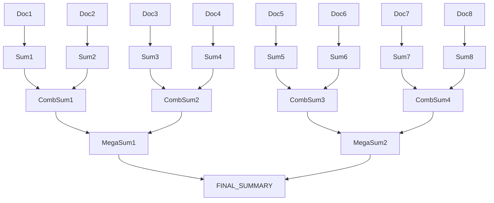

<Warning>
This chain will not be released! 
    
It seems pretty unimportant these days and replceable with a simple map reduce given that context windows are so large.

Likely it'll appear for some speciality use cases and in these cases users will probably can optimize the graph on their own.
</Warning>





## Example dataset


This text is sourced from [Project Gutenberg](https://www.gutenberg.org/ebooks/2600) and is in the public domain. Redistribution is permitted, but the following attribution must be preserved:

> This eBook is for the use of anyone anywhere at no cost and with
> almost no restrictions whatsoever. You may copy it, give it away or
> re-use it under the terms of the Project Gutenberg License included
> with this eBook or online at [www.gutenberg.org](https://www.gutenberg.org).
>
> Public domain text provided by Project Gutenberg:
> [https://www.gutenberg.org/ebooks/2600](https://www.gutenberg.org/ebooks/2600)


## 🛠️ Step 1: Download the Text


```python
from pathlib import Path
import requests

# URL of the plain text file from Project Gutenberg
url = "https://www.gutenberg.org/cache/epub/1184/pg1184.txt"
output_path = Path("war_and_peace_gutenberg.txt")

# Check if file already exists
if output_path.exists():
    print(f"File '{output_path}' already exists. Skipping download.")
else:
    response = requests.get(url)
    if response.status_code == 200:
        output_path.write_text(response.text + attribution, encoding="utf-8")
        print(f"Downloaded and saved to '{output_path}' with attribution.")
    else:
        print(f"Failed to download. Status code: {response.status_code}")

```
```output
File 'war_and_peace_gutenberg.txt' already exists. Skipping download.
```
## 🧱 Step 2: Split Text into Chunks


```python
from langchain_text_splitters import RecursiveCharacterTextSplitter

text = output_path.read_text()

splitter = RecursiveCharacterTextSplitter(
    chunk_size=100_000,
    chunk_overlap=500,
)

texts = splitter.split_text(text)
print(f"Chunks created: {len(texts)}")
```
```output
Chunks created: 27
```
## 🧾 Step 3: Convert to Document Format


```python
from langchain_core.documents import Document

documents = [Document(page_content=chunk) for chunk in texts]
```

## 🔄 Step 4: Define Output Schema (Optional)


```python
from pydantic import BaseModel, Field

class Person(BaseModel):
    name: str
    age: str | None = None
    hair_color: str | None = None
    source_doc_ids: list[str] = Field(
        default=[],
        description="The IDs of the documents where the information was found."
    )

class PeopleRoot(BaseModel):
    people: list[Person]

```

## 🤖 Step 5: Build Recursive Summarizer


```python
from langchain.chains import create_recursive_document_chain
from langchain.chat_models import init_chat_model

# Choose model ID (adjust to what your setup supports)
model = init_chat_model("claude-opus-4-20250514")

summarizer = create_recursive_document_chain(
    model,
    map_prompt="Produce a summary in bullet points with up to 3 bullets.",
).compile(name="RecursiveSummarizer")
```

## 🚀 Step 6: Run Summarization


```python
output = summarizer.invoke({"documents": documents[:8]})
print(output)
```
```output
Output parser received a `max_tokens` stop reason. The output is likely incomplete—please increase `max_tokens` or shorten your prompt.
Traceback (most recent call last):
  File "/home/eugene/.cache/uv/archive-v0/H7PJAEZVghiAsX_gNYVSD/lib/python3.12/site-packages/langchain_core/output_parsers/openai_tools.py", line 336, in parse_result
    pydantic_objects.append(name_dict[res["type"]](**res["args"]))
                            ^^^^^^^^^^^^^^^^^^^^^^^^^^^^^^^^^^^^^
  File "/home/eugene/.cache/uv/archive-v0/H7PJAEZVghiAsX_gNYVSD/lib/python3.12/site-packages/pydantic/main.py", line 253, in __init__
    validated_self = self.__pydantic_validator__.validate_python(data, self_instance=self)
                     ^^^^^^^^^^^^^^^^^^^^^^^^^^^^^^^^^^^^^^^^^^^^^^^^^^^^^^^^^^^^^^^^^^^^^
pydantic_core._pydantic_core.ValidationError: 1 validation error for PeopleRoot
people
  Field required [type=missing, input_value={}, input_type=dict]
    For further information visit https://errors.pydantic.dev/2.11/v/missing
```
```output
---------------------------------------------------------------------------
``````output
ValidationError                           Traceback (most recent call last)
``````output
Cell In[6], line 1
----> 1 output = summarizer.invoke({"documents": documents[:8]})
      2 print(output)
``````output
File ~/src/docs/.venv/lib/python3.12/site-packages/langgraph/pregel/main.py:3015, in Pregel.invoke(self, input, config, context, stream_mode, print_mode, output_keys, interrupt_before, interrupt_after, durability, **kwargs)
   3012 chunks: list[dict[str, Any] | Any] = []
   3013 interrupts: list[Interrupt] = []
-> 3015 for chunk in self.stream(
   3016     input,
   3017     config,
   3018     context=context,
   3019     stream_mode=["updates", "values"]
   3020     if stream_mode == "values"
   3021     else stream_mode,
   3022     print_mode=print_mode,
   3023     output_keys=output_keys,
   3024     interrupt_before=interrupt_before,
   3025     interrupt_after=interrupt_after,
   3026     durability=durability,
   3027     **kwargs,
   3028 ):
   3029     if stream_mode == "values":
   3030         if len(chunk) == 2:
``````output
File ~/src/docs/.venv/lib/python3.12/site-packages/langgraph/pregel/main.py:2642, in Pregel.stream(self, input, config, context, stream_mode, print_mode, output_keys, interrupt_before, interrupt_after, durability, subgraphs, debug, **kwargs)
   2640 for task in loop.match_cached_writes():
   2641     loop.output_writes(task.id, task.writes, cached=True)
-> 2642 for _ in runner.tick(
   2643     [t for t in loop.tasks.values() if not t.writes],
   2644     timeout=self.step_timeout,
   2645     get_waiter=get_waiter,
   2646     schedule_task=loop.accept_push,
   2647 ):
   2648     # emit output
   2649     yield from _output(
   2650         stream_mode, print_mode, subgraphs, stream.get, queue.Empty
   2651     )
   2652 loop.after_tick()
``````output
File ~/src/docs/.venv/lib/python3.12/site-packages/langgraph/pregel/_runner.py:253, in PregelRunner.tick(self, tasks, reraise, timeout, retry_policy, get_waiter, schedule_task)
    251 # panic on failure or timeout
    252 try:
--> 253     _panic_or_proceed(
    254         futures.done.union(f for f, t in futures.items() if t is not None),
    255         panic=reraise,
    256     )
    257 except Exception as exc:
    258     if tb := exc.__traceback__:
``````output
File ~/src/docs/.venv/lib/python3.12/site-packages/langgraph/pregel/_runner.py:511, in _panic_or_proceed(futs, timeout_exc_cls, panic)
    509                 interrupts.append(exc)
    510             elif fut not in SKIP_RERAISE_SET:
--> 511                 raise exc
    512 # raise combined interrupts
    513 if interrupts:
``````output
File ~/src/docs/.venv/lib/python3.12/site-packages/langgraph/pregel/_executor.py:81, in BackgroundExecutor.done(self, task)
     79 """Remove the task from the tasks dict when it's done."""
     80 try:
---> 81     task.result()
     82 except GraphBubbleUp:
     83     # This exception is an interruption signal, not an error
     84     # so we don't want to re-raise it on exit
     85     self.tasks.pop(task)
``````output
File ~/.local/share/uv/python/cpython-3.12.8-linux-x86_64-gnu/lib/python3.12/concurrent/futures/_base.py:449, in Future.result(self, timeout)
    447     raise CancelledError()
    448 elif self._state == FINISHED:
--> 449     return self.__get_result()
    451 self._condition.wait(timeout)
    453 if self._state in [CANCELLED, CANCELLED_AND_NOTIFIED]:
``````output
File ~/.local/share/uv/python/cpython-3.12.8-linux-x86_64-gnu/lib/python3.12/concurrent/futures/_base.py:401, in Future.__get_result(self)
    399 if self._exception:
    400     try:
--> 401         raise self._exception
    402     finally:
    403         # Break a reference cycle with the exception in self._exception
    404         self = None
``````output
File ~/.local/share/uv/python/cpython-3.12.8-linux-x86_64-gnu/lib/python3.12/concurrent/futures/thread.py:59, in _WorkItem.run(self)
     56     return
     58 try:
---> 59     result = self.fn(*self.args, **self.kwargs)
     60 except BaseException as exc:
     61     self.future.set_exception(exc)
``````output
File ~/src/docs/.venv/lib/python3.12/site-packages/langgraph/pregel/_retry.py:42, in run_with_retry(task, retry_policy, configurable)
     40     task.writes.clear()
     41     # run the task
---> 42     return task.proc.invoke(task.input, config)
     43 except ParentCommand as exc:
     44     ns: str = config[CONF][CONFIG_KEY_CHECKPOINT_NS]
``````output
File ~/src/docs/.venv/lib/python3.12/site-packages/langgraph/_internal/_runnable.py:657, in RunnableSeq.invoke(self, input, config, **kwargs)
    655     # run in context
    656     with set_config_context(config, run) as context:
--> 657         input = context.run(step.invoke, input, config, **kwargs)
    658 else:
    659     input = step.invoke(input, config)
``````output
File ~/src/docs/.venv/lib/python3.12/site-packages/langgraph/_internal/_runnable.py:401, in RunnableCallable.invoke(self, input, config, **kwargs)
    399         run_manager.on_chain_end(ret)
    400 else:
--> 401     ret = self.func(*args, **kwargs)
    402 if self.recurse and isinstance(ret, Runnable):
    403     return ret.invoke(input, config)
``````output
File ~/src/langchain/libs/langchain_v1/langchain/chains/documents/recursive.py:329, in _RecursiveSummarizer.create_map_node.<locals>._map_node(state, runtime, config)
    325 def _map_node(
    326     state: MapState, runtime: Runtime, config: RunnableConfig
    327 ) -> dict[str, list[str]]:
    328     prompt = self._get_map_prompt(state, runtime)
--> 329     response = cast("AIMessage", self.model.invoke(prompt, config=config))
    330     result = response if self.response_format else response.text()
    331     return {"summaries": [str(result)]}
``````output
File ~/.cache/uv/archive-v0/H7PJAEZVghiAsX_gNYVSD/lib/python3.12/site-packages/langchain_core/runnables/base.py:3046, in RunnableSequence.invoke(self, input, config, **kwargs)
   3044                 input_ = context.run(step.invoke, input_, config, **kwargs)
   3045             else:
-> 3046                 input_ = context.run(step.invoke, input_, config)
   3047 # finish the root run
   3048 except BaseException as e:
``````output
File ~/.cache/uv/archive-v0/H7PJAEZVghiAsX_gNYVSD/lib/python3.12/site-packages/langchain_core/output_parsers/base.py:196, in BaseOutputParser.invoke(self, input, config, **kwargs)
    188 @override
    189 def invoke(
    190     self,
   (...)    193     **kwargs: Any,
    194 ) -> T:
    195     if isinstance(input, BaseMessage):
--> 196         return self._call_with_config(
    197             lambda inner_input: self.parse_result(
    198                 [ChatGeneration(message=inner_input)]
    199             ),
    200             input,
    201             config,
    202             run_type="parser",
    203         )
    204     return self._call_with_config(
    205         lambda inner_input: self.parse_result([Generation(text=inner_input)]),
    206         input,
    207         config,
    208         run_type="parser",
    209     )
``````output
File ~/.cache/uv/archive-v0/H7PJAEZVghiAsX_gNYVSD/lib/python3.12/site-packages/langchain_core/runnables/base.py:1939, in Runnable._call_with_config(self, func, input_, config, run_type, serialized, **kwargs)
   1935     child_config = patch_config(config, callbacks=run_manager.get_child())
   1936     with set_config_context(child_config) as context:
   1937         output = cast(
   1938             "Output",
-> 1939             context.run(
   1940                 call_func_with_variable_args,  # type: ignore[arg-type]
   1941                 func,
   1942                 input_,
   1943                 config,
   1944                 run_manager,
   1945                 **kwargs,
   1946             ),
   1947         )
   1948 except BaseException as e:
   1949     run_manager.on_chain_error(e)
``````output
File ~/.cache/uv/archive-v0/H7PJAEZVghiAsX_gNYVSD/lib/python3.12/site-packages/langchain_core/runnables/config.py:429, in call_func_with_variable_args(func, input, config, run_manager, **kwargs)
    427 if run_manager is not None and accepts_run_manager(func):
    428     kwargs["run_manager"] = run_manager
--> 429 return func(input, **kwargs)
``````output
File ~/.cache/uv/archive-v0/H7PJAEZVghiAsX_gNYVSD/lib/python3.12/site-packages/langchain_core/output_parsers/base.py:197, in BaseOutputParser.invoke.<locals>.<lambda>(inner_input)
    188 @override
    189 def invoke(
    190     self,
   (...)    193     **kwargs: Any,
    194 ) -> T:
    195     if isinstance(input, BaseMessage):
    196         return self._call_with_config(
--> 197             lambda inner_input: self.parse_result(
    198                 [ChatGeneration(message=inner_input)]
    199             ),
    200             input,
    201             config,
    202             run_type="parser",
    203         )
    204     return self._call_with_config(
    205         lambda inner_input: self.parse_result([Generation(text=inner_input)]),
    206         input,
    207         config,
    208         run_type="parser",
    209     )
``````output
File ~/.cache/uv/archive-v0/H7PJAEZVghiAsX_gNYVSD/lib/python3.12/site-packages/langchain_core/output_parsers/openai_tools.py:336, in PydanticToolsParser.parse_result(self, result, partial)
    334     raise ValueError(msg)
    335 try:
--> 336     pydantic_objects.append(name_dict[res["type"]](**res["args"]))
    337 except (ValidationError, ValueError):
    338     if partial:
``````output
File ~/.cache/uv/archive-v0/H7PJAEZVghiAsX_gNYVSD/lib/python3.12/site-packages/pydantic/main.py:253, in BaseModel.__init__(self, **data)
    251 # `__tracebackhide__` tells pytest and some other tools to omit this function from tracebacks
    252 __tracebackhide__ = True
--> 253 validated_self = self.__pydantic_validator__.validate_python(data, self_instance=self)
    254 if self is not validated_self:
    255     warnings.warn(
    256         'A custom validator is returning a value other than `self`.\n'
    257         "Returning anything other than `self` from a top level model validator isn't supported when validating via `__init__`.\n"
    258         'See the `model_validator` docs (https://docs.pydantic.dev/latest/concepts/validators/#model-validators) for more details.',
    259         stacklevel=2,
    260     )
``````output
ValidationError: 1 validation error for PeopleRoot
people
  Field required [type=missing, input_value={}, input_type=dict]
    For further information visit https://errors.pydantic.dev/2.11/v/missing
``````output
During task with name 'map_summarize' and id '8137de8e-dab2-7a83-871c-1b1c8975ef4d'
```
