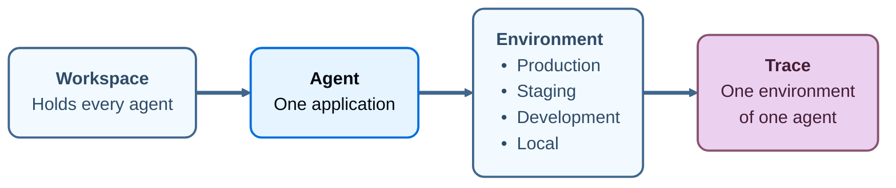

<Note>
**Private beta:** Agent-based workspaces are in [beta](/langsmith/release-stages), available to a private group of customers rather than publicly. LangChain enables the change per workspace, and it applies to workspaces created after that, so an existing workspace stays [project-based](/langsmith/observability-concepts#tracing-projects). To ask about access, contact your LangChain account team.
</Note>

An _agent_ is a container for the traces, datasets, and monitors of one application. Point your tracing at an agent once it exists, and everything that application records collects under it.

An agent is the unit LangSmith organizes the rest of your data around. Where a [tracing project](/langsmith/observability-concepts#tracing-projects) groups traces and nothing else, an agent groups the traces, the datasets you evaluate it against, and the dashboards and alerts you watch it with.

Read that chain in either direction. A workspace holds your agents, each agent's traces divide across the same four environments, and every trace belongs to one environment of one agent. Given a trace, the application that produced it and the deployment it ran on are both already known, so neither has to be recovered from a naming convention or a filter.

## Environments

An _environment_ records which deployment of an application produced a trace. There are four: Production, Staging, Development, and Local.

Every trace lands in one environment of one agent, so a question about production behavior never has to exclude test traffic by hand. An environment does not change how an agent is instrumented, and the same code can send traces to a different environment by configuration alone.

## Identifiers and display names

Every agent has two names, and they do different work:

- **Identifier**: Derived from the name you give the agent when you create it, lowercased, with each run of other characters replaced by a hyphen. Once set, it cannot be changed. LangSmith uses it to address traces, so it stays stable even when the display name changes.
- **Display name**: Shown wherever the agent appears in the UI. Edit it at any time. Editing it does not move existing traces or change where new traces land.

The identifier is not the UUID in the browser address bar. An agent page URL carries an internal identifier for the record, which is a separate value and is not what tracing configuration takes.

## Why an agent rather than a project with environments

A tracing project holds whatever you point at it, so LangSmith can make no assumption about what is inside one. Two projects named `checkout-prod` and `checkout-staging` are two unrelated containers as far as the platform is concerned, and keeping them related is a naming convention you maintain by hand.

An agent states what the application is, and an environment states which deployment of it produced a trace. That context lets LangSmith act on your behalf rather than asking you to filter every time. [Insights](/langsmith/insights) can read production traffic alone. A dashboard can compare the same agent across environments without a saved filter per environment. An alert can watch production and stay quiet about local runs.

The tracing project has not gone away. `LANGSMITH_PROJECT` remains supported, and tracing projects remain in the API. See [Log traces to a project](/langsmith/log-traces-to-project).

## Next steps

<CardGroup cols={3}>

<Card
  title="Environments"
  cta="Learn more"
  href="/langsmith/agent-environments"
  icon="stack"
>
The four deployments an agent's traces divide into, and the tracing project behind each one.
</Card>

<Card
  title="Navigate agents"
  cta="Learn more"
  href="/langsmith/navigate-agents"
  icon="compass"
>
The agent switcher, the agent list, the agent Overview, and where creation starts.
</Card>

<Card
  title="Log traces to an agent"
  cta="Learn more"
  href="/langsmith/log-traces-to-agent"
  icon="target"
>
How agent addressing sends traces to an agent and an environment, and why it cannot be combined with project addressing.
</Card>

</CardGroup>

## See also

- [Observability concepts](/langsmith/observability-concepts)
- [Log traces to a project](/langsmith/log-traces-to-project)

---

<Callout icon="terminal-2">
    [Connect these docs](/use-these-docs) to Claude, VSCode, and more via MCP for real-time answers.
</Callout>
<Callout icon="edit">
    [Edit this page on GitHub](https://github.com/langchain-ai/docs/edit/main/src/langsmith/agents.mdx) or [file an issue](https://github.com/langchain-ai/docs/issues/new/choose).
</Callout>

