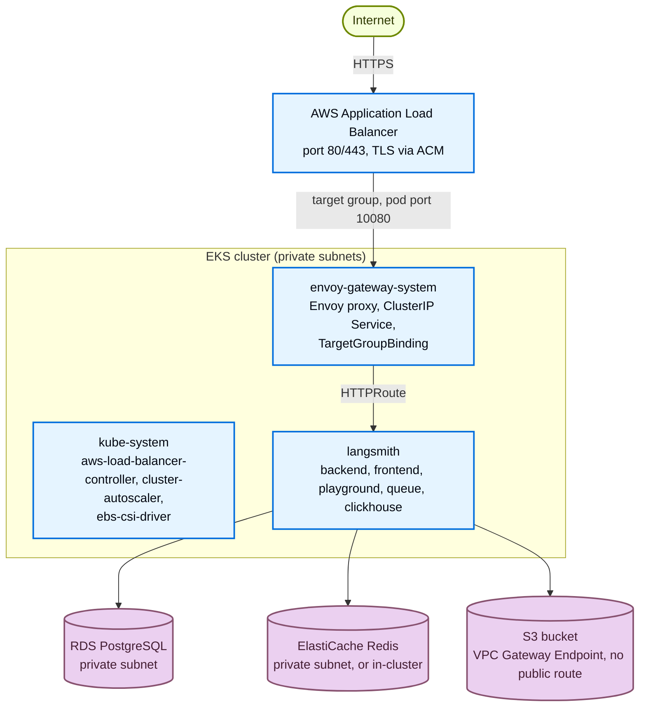
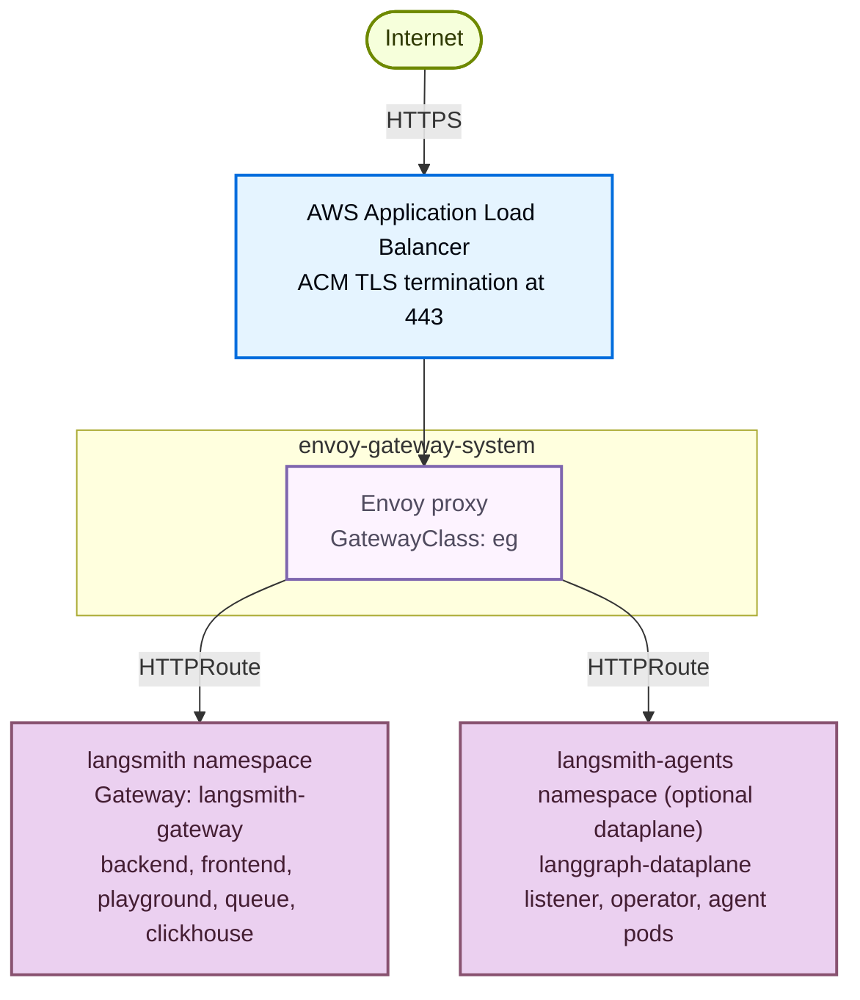

Understand what the [AWS Terraform modules](https://github.com/langchain-ai/terraform/tree/main/modules/aws) provision and how the pieces fit together, so you can size, secure, and customize your LangSmith deployment before running `make apply`.

Use this page as a reference while planning a rollout or troubleshooting an existing one. It covers:

- Platform layers and application core services.
- AWS managed services, IRSA roles, and cluster infrastructure.
- Network topology, ingress options, and TLS/DNS strategies.
- LangSmith Deployment add-on.
- Module dependency graph and opt-in security modules.

If you are ready to install, start with the [deployment walkthrough](/langsmith/self-host-terraform-aws-deploy).

## Platform layers

LangSmith on AWS deploys in two stages with one optional add-on. The infrastructure stage provisions the cloud foundation. The application stage installs the LangSmith Helm chart. The LangSmith Deployment add-on is opt-in and adds the host-backend, listener, and operator services for managing LangGraph applications from the UI.


| Stage | Layer | What it adds |
|---|---|---|
| Infrastructure | AWS infrastructure | VPC + private/public subnets + single NAT gateway, EKS cluster + managed node group + cluster autoscaler, RDS PostgreSQL, ElastiCache Redis, S3 bucket + VPC Gateway Endpoint, ALB + ALB controller + EBS CSI driver + metrics server, k8s-bootstrap (KEDA, ESO, Envoy Gateway by default). Optional: Network Firewall, WAF, CloudTrail, ALB access logs, SmithDB, sandboxes. |
| Application | LangSmith application | backend, frontend, playground, queue, ace-backend, clickhouse. Storage: RDS PostgreSQL (metadata) + S3 (trace blobs via VPC endpoint). Ingress: the Terraform ALB forwards to Envoy Gateway (default), Istio, or NGINX. With `enable_envoy_gateway = false`, the ALB controller provisions its own ALB for the Ingress. |
| Add-on (`enable_deployments = true`) | LangSmith Deployment | host-backend, listener, operator. Per deployed graph: api-server, queue, redis, postgres (operator-managed). Requires KEDA (installed alongside infrastructure via k8s-bootstrap). |

## Component to storage mapping

| Component | Storage backend | Access method |
|---|---|---|
| `backend` | RDS PostgreSQL | Private subnet, security group |
| `backend` | S3 bucket | IRSA + VPC Gateway Endpoint |
| `clickhouse` | EBS volume (GP3, EKS PVC) | Local |
| `redis` | ElastiCache or in-cluster | Private subnet, security group |
| LGP operator | RDS PostgreSQL (shared) | Private subnet, security group |

## Application core services

These pods run on every deployment. All write logs and metrics; the busier components (backend, queue, ingest-queue) scale horizontally.

| Service | Purpose | Port | HPA | IRSA | Depends on |
|---|---|---|---|---|---|
| `langsmith-frontend` | React UI | 3000 | 1 to 10 | No | `backend`, `platform-backend` |
| `langsmith-backend` | Main API (traces, runs, projects, API keys, feedback) | 1984 | 3 to 10 | Yes (S3) | Postgres, Redis, ClickHouse, S3 |
| `langsmith-platform-backend` | Org and user management, auth, billing, settings | 1986 | 1 to 10 | Yes (S3) | Postgres, Redis, S3 |
| `langsmith-playground` | LLM prompt playground UI | 3001 | 1 to 10 | Yes (Bedrock, when `enable_bedrock_access = true`) | `backend` |
| `langsmith-queue` | Trace ingestion worker (Redis to ClickHouse + S3) | None | 3 to 10 + KEDA | Yes | Redis, ClickHouse, S3 |
| `langsmith-ingest-queue` | Dedicated high-throughput ingestion worker | None | 3 to 10 + KEDA | Yes | Redis, S3 |
| `langsmith-ace-backend` | Async compute (dataset runs, evaluations, background jobs) | None | 1 to 5 | No | Postgres, Redis |
| `langsmith-clickhouse` | Columnar store (trace spans, run metadata, eval results) | None | StatefulSet, single replica | No | EBS GP3 PVC |

<Warning>
In-cluster ClickHouse is dev/POC only (single pod, no replication, no backups). For production use [LangChain Managed ClickHouse](/langsmith/langsmith-managed-clickhouse) or a self-managed external cluster.
</Warning>

<Note>
[SmithDB](https://www.langchain.com/blog/introducing-smithdb?utm_source=docs) is LangSmith's purpose-built observability backend, available for self-hosted starting with chart v16 (see [self-hosted support](/langsmith/smithdb-sdk-migration#about-self-hosted)). The AWS modules provision ClickHouse by default. Setting `enable_smithdb = true` also provisions SmithDB's dependencies: a dedicated metastore RDS PostgreSQL instance (with `smithdb_metastore_source = "create"`, the default), an S3 object-store bucket, an IRSA role, and Karpenter NodePools for NVMe instance-store nodes. ClickHouse stays enabled on chart v16 and v17. See [SmithDB](/langsmith/self-host-terraform-aws-deploy#smithdb) in the deployment guide.
</Note>

### One-time jobs

The Helm chart runs three jobs at install and upgrade time:

| Job | Purpose |
|---|---|
| `langsmith-backend-migrations` | PostgreSQL schema migrations |
| `langsmith-backend-ch-migrations` | ClickHouse schema migrations |
| `langsmith-backend-auth-bootstrap` | Creates the initial org and admin account from `initial_org_admin_password` in `langsmith-config` |

## LangSmith Deployment add-on

When `enable_deployments = true`, three additional services are installed and a `LangGraphPlatform` CRD is registered. Each deployment the user creates in the LangSmith UI produces a Kubernetes Deployment in the `langsmith` namespace, managed by the operator.

| Service | Purpose |
|---|---|
| `langsmith-host-backend` | LangGraph control plane API. Manages deployment lifecycle, serves deployment metadata. IRSA for S3 access. |
| `langsmith-listener` | Watches host-backend for deployment state changes, creates and updates `LangGraphPlatform` CRDs. IRSA for S3 access. |
| `langsmith-operator` | Kubernetes operator. Reconciles `LangGraphPlatform` CRDs, creates and deletes Deployments and Services for each agent. |

## AWS managed services

When `postgres_source = "external"` and `redis_source = "external"` (the recommended production setting), Terraform provisions the following AWS managed services.

When Fleet, LangSmith Chat, or Insights use external storage, they share the RDS instance and the Redis cluster. An in-cluster Job creates each feature's logical database, and each feature gets its own Redis DB index: 1 for Fleet, 2 for LangSmith Chat, 3 for Insights. DB 0 belongs to the main install.

### RDS PostgreSQL

- Default size: `db.t3.large`, private subnets, port 5432.
- Defaults: PostgreSQL 16, storage encrypted, 10GB autoscaling to 100GB, 7-day backups, deletion protection on, IAM database authentication enabled.
- Holds orgs, users, projects, API keys, settings.
- Secret flow: `setup-env.sh` stores the password at SSM `/langsmith/{base_name}/postgres-password` and passes it to Terraform, which sets it on the instance and writes the `connection_url` into the `langsmith-postgres` Kubernetes Secret.

### ElastiCache Redis

- Default size: `cache.m6g.xlarge`, private subnets, TLS port 6379.
- Redis 7.1, a single cache node, encryption at rest and in transit.
- Trace ingestion queue, pub/sub, short-lived cache.
- Secret flow: `setup-env.sh` stores the auth token at SSM `/langsmith/{base_name}/redis-auth-token` and passes it to Terraform, which sets it on the replication group and writes the `connection_url` into the `langsmith-redis` Kubernetes Secret.

### Sandbox JuiceFS Redis

When `enable_sandboxes = true`, Terraform provisions a second, dedicated ElastiCache Redis (`{base_name}-jfs-redis`, default `cache.m6g.large`, `noeviction` parameter group, 7-day snapshots) for the JuiceFS sandbox filesystem. It also adds a `sandbox-host` managed node group (default `m5d.metal`, tainted `sandbox.langsmith.com/host`).

### S3 bucket

- Trace payloads: large inputs and outputs, attachments.
- IRSA via `langsmith_irsa_role` (no static keys). VPC Gateway Endpoint, no public internet.
- Encrypted with SSE-S3, or SSE-KMS when `s3_kms_key_arn` is set. Public access is blocked, and the bucket policy grants the LangSmith IRSA role access through the VPC endpoint.
- Prefixes: `ttl_s/` (short TTL) and `ttl_l/` (long TTL).
- The S3 bucket is always required, regardless of tier. Disabling blob storage breaks the cluster on large payloads.

### SSM Parameter Store

- Centralized secret store for all LangSmith secrets.
- Flow: `source infra/scripts/setup-env.sh` writes secrets to SSM. The ESO `ClusterSecretStore` reads them and projects a `langsmith-config` Kubernetes Secret that the Helm chart mounts via `config.existingSecretName`.
- Prefix: `/langsmith/{name_prefix}-{environment}/`.

## Cluster infrastructure

Two Terraform modules install the cluster-level services LangSmith depends on. The `eks` module installs the AWS-integration controllers through `eks-blueprints-addons` and the EBS CSI driver as an EKS add-on; the `k8s-bootstrap` module installs the workload dependencies and the ingress gateways (see [Ingress options](#ingress-options)):

| Service | Installed by | Namespace | IRSA | Purpose |
|---|---|---|---|---|
| `aws-load-balancer-controller` | `eks` | `kube-system` | Yes | Registers pods with the Terraform-managed ALB through `TargetGroupBinding`, and provisions an ALB from Kubernetes Ingress objects in ALB Ingress mode. |
| `cluster-autoscaler` | `eks` | `kube-system` | Yes | Scales EC2 node groups based on pod scheduling pressure. |
| `ebs-csi-driver` | `eks` | `kube-system` | Yes | Provisions EBS volumes for PersistentVolumeClaims (used by ClickHouse). |
| Karpenter | `eks` | `karpenter` | Yes | Provisions SmithDB's NVMe instance-store and compute nodes. Installed only when `enable_smithdb = true`. |
| KEDA | `k8s-bootstrap` | `keda` | No | Kubernetes Event-driven Autoscaling. Scales `queue` and `ingest-queue` on Redis queue depth. Required for the LangSmith Deployment add-on. |
| Envoy Gateway | `k8s-bootstrap` | `envoy-gateway-system` | No | Default ingress gateway behind the ALB. Skipped when you select Istio, NGINX, or ALB Ingress. |
| cert-manager | `k8s-bootstrap` | `cert-manager` | Optional | Automates TLS certificate issuance. With `tls_certificate_source = letsencrypt` it uses an HTTP-01 issuer through the ALB and needs no IRSA. With `create_cert_manager_irsa = true` it uses DNS-01 through Route 53 with an IRSA role. Installed only in those two cases. |
| External Secrets Operator | `k8s-bootstrap` | `external-secrets` | Yes | Syncs SSM parameters into the `langsmith-config` Kubernetes Secret. |

## IRSA roles

IRSA replaces static credentials. IAM trusts the EKS cluster's OIDC issuer; service accounts in `langsmith`, `kube-system`, `external-secrets`, `cert-manager`, and (with SmithDB) `karpenter` are annotated with role ARNs and pods receive temporary credentials via the EKS token webhook.

| Role | Defined in | Used by | Permissions |
|---|---|---|---|
| `langsmith_irsa_role` (`{cluster_name}-irsa-role`) | `modules/eks` | Any service account in the LangSmith namespace: `backend`, `platform-backend`, `queue`, `ingest-queue`, `playground`, host-backend, listener, operator, and the Fleet, LangSmith Chat, and Insights workers | `s3:GetObject`, `s3:PutObject`, `s3:DeleteObject`, `s3:ListBucket` on the LangSmith bucket, plus `bedrock:InvokeModel*`, `bedrock:ListFoundationModels`, and `bedrock:GetFoundationModel` when `enable_bedrock_access = true` |
| `aws_iam_role.eso` | `aws/infra/main.tf` | ESO controller | `ssm:GetParameter`, `ssm:GetParameters`, `ssm:GetParametersByPath` on `/langsmith/{base_name}/*` in the deployment region |
| `aws_iam_role.cert_manager` | `modules/cert-manager` | `cert-manager` | Route 53 `ChangeResourceRecordSets` and `ListResourceRecordSets` on the zone, plus `GetChange` and `ListHostedZonesByName`. Exists only when `create_cert_manager_irsa = true`. |
| `aws_iam_role.smithdb` | `modules/smithdb` | SmithDB pods | Read, write, and multipart access on the SmithDB bucket, plus KMS when that key is set. Exists only when `enable_smithdb = true`. |
| `AmazonEKSTFEBSCSIRole-*` | `modules/eks` | `ebs-csi-controller-sa` | EBS volume management |

## Network topology

### VPC and private endpoints

With `create_vpc = true`, the module builds a `10.0.0.0/16` VPC across up to three availability zones, and works in two-AZ regions such as `us-west-1`. It uses /21 private and public subnets and a single NAT gateway.

The module creates one VPC endpoint, an S3 gateway endpoint. When you bring a VPC without NAT or internet egress (`create_vpc = false`), create `com.amazonaws.<region>.ecr.api` and `com.amazonaws.<region>.ecr.dkr` interface endpoints with private DNS enabled, attached to a security group that allows TCP 443 from the VPC CIDR, so nodes can pull images.

Set `alb_existing_security_group_id`, `postgres_existing_security_group_id`, `redis_existing_security_group_id`, or `bastion_existing_security_group_id` to attach a security group you manage. Terraform attaches it but never writes rules to it.

### Default ingress (ALB and Envoy Gateway)



### Envoy Gateway split dataplane

With the default Envoy Gateway, the ALB forwards to the Envoy proxy pods on port 10080 through a `TargetGroupBinding` on the internal `ClusterIP` Envoy Service (port 80). The ALB terminates TLS. Agent pods can run in a separate `langsmith-agents` namespace:



Both `langsmith` and `langsmith-agents` attach to the shared `langsmith-gateway` through an `HTTPRoute` with `allowedRoutes: All`.

### Egress path with Network Firewall

When `create_firewall = true`, all outbound internet traffic from private subnets is inspected before reaching the NAT gateway:

```txt
EKS pods / RDS / ElastiCache (private subnets)
  → AWS Network Firewall (TLS SNI + HTTP Host inspection)
     ALLOWLIST: firewall_allowed_fqdns (default: beacon.langchain.com)
     DROP: all other established connections
  → NAT Gateway (public subnet)
  → Internet
```

Pod-to-pod, pod-to-RDS, and pod-to-ElastiCache traffic uses the local VPC route and never touches the firewall.

## Ingress options

Four mutually exclusive ingress options ship with the modules. The Terraform-managed ALB fronts Envoy Gateway, NGINX, and Istio. In ALB Ingress mode, the AWS Load Balancer Controller provisions its own ALB and the Terraform ALB goes unused. The choice determines whether split dataplane (agent pods in a separate namespace) is supported.

| Option | Variable | Split | Traffic path | When to use |
|---|---|---|---|---|
| Envoy Gateway | _default_ (`enable_envoy_gateway` unset) | Yes | `ALB → TGB → Envoy pods:10080 → HTTPRoute → services` | Default. Cross-namespace HTTPRoute routing and split dataplane. |
| ALB Ingress (AWS LBC) | `enable_envoy_gateway = false` | No | `ALB (controller-managed, target type ip) → frontend pods` | Single-namespace deployments that want plain Kubernetes Ingress. |
| NGINX Ingress | `enable_nginx_ingress = true` | No | `ALB → TGB → NGINX controller → frontend ClusterIP` | When NGINX is the standard ingress in your organization. |
| Istio | `enable_istio_gateway = true` | Yes | `ALB → TGB → istio-ingressgateway:80 → VirtualService → services` | Clusters with Istio already installed, or when an mTLS mesh is required. |

Envoy is on unless you set `enable_istio_gateway` or `enable_nginx_ingress`. Set `enable_envoy_gateway = false` explicitly to use ALB Ingress.

### Why ALB Ingress cannot support split dataplane

Standard Kubernetes Ingress is namespace-scoped. The ALB controller routes only to services in the same namespace as the Ingress resource. Agent pods in `langsmith-agents` are invisible to an Ingress in `langsmith`. Envoy Gateway and Istio both support cross-namespace routing via the Kubernetes Gateway API.

### ALB in front of Envoy Gateway

In the default layout, the ALB handles TLS and DNS, with Envoy Gateway behind it. Optional WAF attaches to the ALB:

```txt
Internet
  → ALB (TLS, DNS, optional WAF)
    → Envoy proxy pods (ClusterIP Service, TargetGroupBinding from k8s-bootstrap)
       → HTTPRoute → langsmith namespace        (control plane)
       → HTTPRoute → langsmith-agents namespace (split dataplane)
```

The ALB target group forwards to the Envoy proxy pods on port 10080. No values overlay is needed; `make init-values` writes the gateway settings.

## TLS and DNS

The `tls_certificate_source` variable controls the certificate strategy:

| Mode | Behavior | Compatible gateways |
|---|---|---|
| `none` | HTTP only, no certificate | Any |
| `acm` | HTTPS:443 with HTTP to HTTPS redirect. ACM certificate, auto-provisioned or BYO. | Any (TLS terminates at the ALB) |
| `letsencrypt` | HTTPS via cert-manager and Let's Encrypt, using an HTTP-01 challenge solved through the ALB | ALB Ingress only |

### Why ACM versus cert-manager

ACM certificates are non-exportable. AWS attaches them directly to the ALB, which makes ACM the right choice when TLS terminates at the ALB. With the module's gateways, TLS still terminates at the ALB, so ACM works with Envoy, Istio, and NGINX. cert-manager is only needed when you want TLS to terminate inside the cluster.

The `letsencrypt` source is a reference implementation for the ALB path: it installs cert-manager with a Let's Encrypt HTTP-01 `ClusterIssuer` bound to the ALB ingress class. For in-cluster TLS on Istio, set `create_cert_manager_irsa = true` instead, which uses a DNS-01 `ClusterIssuer` validated through Route 53. HTTP-01 (via ALB) and DNS-01 (via Route 53) are mutually exclusive. In production, swap the `ClusterIssuer` for any cert-manager-compatible issuer.

| Issuer | When to use |
|---|---|
| Let's Encrypt _(default)_ | Public domain, internet access, free |
| ACM Private CA (`aws-privateca-issuer`) | AWS-native, air-gap friendly, private domains, paid |
| Venafi (`cert-manager-venafi`) | Enterprise PKI, regulated environments |
| HashiCorp Vault (`cert-manager-vault`) | Self-hosted PKI |
| DigiCert, Sectigo, others | ACME or custom issuer plugins |

With `create_cert_manager_irsa = true`, the Terraform module provisions the cert-manager IRSA role and Route 53 permissions. Only the `ClusterIssuer` manifest changes between issuers.

### Auto-provisioned DNS

When `langsmith_domain` is set and `acm_certificate_arn` is empty, Terraform activates the `dns` module which creates:

- A Route 53 public hosted zone for the domain, or, with `dns_create_zone = false` and `dns_existing_zone_id`, records in an existing public zone (the exact zone or a parent zone; no NS delegation needed).
- An ACM certificate with DNS validation records. Add a `*.<domain>` SAN with `dns_include_wildcard_san = true`.
- A Route 53 alias record pointing the domain to the ALB.

**Staged deploy pattern:** Set `langsmith_domain` with `tls_certificate_source = "none"` first. Terraform creates the hosted zone and certificate without blocking on validation. Delegate the NS records at your registrar, then flip to `tls_certificate_source = "acm"` in a later apply. Terraform blocks until the certificate validates and wires it into the HTTPS listener.

### Bring your own certificate

Set `acm_certificate_arn` directly to skip the `dns` module. For TLS that terminates inside the cluster, create a Kubernetes TLS Secret manually and reference it in the Gateway or VirtualService.

## Module dependency graph

```txt
vpc ─► firewall (optional, create_firewall = true)
│
├─► eks ─► k8s-bootstrap (KEDA, ESO, Envoy Gateway [default])
│            └─► cert-manager (optional: HTTP-01 via ALB, or DNS-01 via the cert_manager IRSA module)
│
├─► postgres    (RDS, private subnets from VPC)
├─► redis       (ElastiCache, private subnets from VPC)
├─► storage     (S3 bucket + VPC Gateway Endpoint)
├─► alb         (always created; public subnets, or private when alb_scheme = internal)
│     └─► alb_access_logs (S3 bucket for access logs, opt-in)
├─► dns         (Route 53 zone + ACM cert, optional)
├─► cert_manager (IRSA role for DNS-01, create_cert_manager_irsa = true)
├─► sandbox_juicefs_redis (dedicated ElastiCache, enable_sandboxes = true)
├─► smithdb     (metastore RDS + S3 + IRSA, enable_smithdb = true)
├─► bastion     (jump host for private EKS access, optional)
├─► cloudtrail  (audit logging, optional)
└─► waf         (WAF ACL on ALB, optional)
       all ─► langsmith (root module)
```

### Opt-in security modules

| Module | Variable | Default | Purpose |
|---|---|---|---|
| Network Firewall | `create_firewall` | `false` | FQDN-based egress filtering. Allows only domains in `firewall_allowed_fqdns` (TLS SNI + HTTP Host). Requires `create_vpc = true`. Cost ≈ `$0.40/hr/endpoint + $0.065/GB processed`. |
| ALB access logs | `alb_access_logs_enabled` | `false` | Traffic analysis and compliance |
| CloudTrail | `create_cloudtrail` | `false` | API call logging. Skip if an organization trail already exists. |
| WAF | `create_waf` | `false` | WAFv2 Web ACL: OWASP Top 10, IP reputation, known bad inputs |

## Default resource sizes

| Resource | Default | vCPU | Memory |
|---|---|---|---|
| EKS node | `m5.4xlarge` | 16 | 64 GB |
| RDS PostgreSQL | `db.t3.large` | 2 | 8 GB |
| ElastiCache Redis | `cache.m6g.xlarge` | 4 | 13.07 GB |
| RDS storage | 10 GB | Not applicable | Not applicable |

`terraform.tfvars.production`, `terraform.tfvars.dev`, and `terraform.tfvars.minimum` change these sizes. Production uses `db.r6g.xlarge`. Dev uses `m5.2xlarge` nodes with `db.t3.medium` and `cache.t3.medium`. Minimum uses `m5.xlarge` with `db.t3.small` and `cache.t3.small`. `sizing_profile` (`production`, `production-large`, `dev`, `minimum`, or `default`) selects the matching Helm sizing overlay; `default` leaves chart defaults in place.

For production sizing recommendations, see the [scaling guide](/langsmith/self-host-scale) and the [AWS deployment guide](/langsmith/self-host-terraform-aws-deploy#cluster-sizing-reference).

## Validated behaviors and known constraints

These constraints were validated during the April 2026 gateway permutation test run.

| # | Area | Constraint or fix |
|---|---|---|
| 1 | ACM wildcard SANs | `langchain.com` has `0 issue "amazon.com"` CAA but not `0 issuewild "amazon.com"`. Wildcard SANs fail with `CAA_ERROR`. By default the `dns` module requests only the apex domain. `dns_include_wildcard_san = true` adds `*.<domain>`, which needs an `issuewild` CAA record for Amazon. |
| 2 | In-cluster Redis | The LangSmith Helm chart deploys Redis without `requirepass`. The `k8s_bootstrap` module writes `redis://langsmith-redis:6379`. Do not add an auth token unless you also configure the Helm chart Redis values. |
| 3 | `name_prefix` length | Maximum 15 characters. Names like `dz-nginx-tst` (12 characters) are valid. |
| 4 | Istio port | Istio 1.23 or later ingressgateway listens on port 80 via `NET_BIND_SERVICE`, not port 8080. ALB TGB health check and security group rules must target port 80. |
| 5 | NGINX TGB port | NGINX ingress-nginx controller pods listen on port 80. The TargetGroupBinding target type is `ip`. |
| 6 | Envoy Gateway port | The Envoy proxy pods listen on port 10080 (the Gateway's port 80 plus Envoy's 10000 offset for non-root). The ALB target group and node security group rule use 10080; the TargetGroupBinding references the Envoy `ClusterIP` Service on port 80, with target type `ip`. |
| 7 | Destroy order | Run `make uninstall`, then `make destroy`. Do not pre-delete namespaces: Helm cannot uninstall cleanly into a terminating namespace, so the `helm_release` resource times out. |
| 8 | Stuck terminating namespaces | KEDA's stale `external.metrics.k8s.io/v1beta1` API group causes `NamespaceDeletionDiscoveryFailure`. Fix: clear the namespace's `spec.finalizers` and submit the result to the finalize subresource with `kubectl replace --raw "/api/v1/namespaces/<ns>/finalize" -f -`, then re-run `make destroy`. |

## Verification commands

```bash
# EKS cluster status
aws eks describe-cluster --name <cluster-name> --query "cluster.status"

# Node health
kubectl get nodes -o wide

# ALB target registration and routes (default Envoy Gateway mode)
kubectl get targetgroupbinding -A
kubectl get httproute -n langsmith

# ALB Ingress or NGINX mode only
kubectl get ingress -n langsmith

# RDS status
aws rds describe-db-instances \
  --query "DBInstances[?DBInstanceIdentifier=='<db-id>'].DBInstanceStatus"

# ElastiCache status
aws elasticache describe-replication-groups \
  --query "ReplicationGroups[?ReplicationGroupId=='<group-id>'].Status"

# S3 access from a pod (via VPC endpoint)
kubectl run s3-test --rm -it --image=amazon/aws-cli -n langsmith -- \
  aws s3 ls s3://<bucket-name>
```

---

<div className="source-links">
<Callout icon="terminal-2">
    [Connect these docs](/use-these-docs) to your agent of choice via MCP for real-time answers.
</Callout>
<Callout icon="edit">
    [Edit this page on GitHub](https://github.com/langchain-ai/docs/edit/main/src/langsmith/self-host-terraform-aws-architecture.mdx) or [file an issue](https://github.com/langchain-ai/docs/issues/new/choose).
</Callout>
</div>
