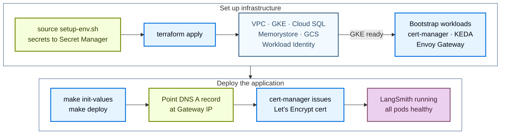

Deploy LangSmith to GCP with the public [Terraform modules](https://github.com/langchain-ai/terraform/tree/main/modules/gcp). Managing the deployment as code lets you version, review, and reproduce your LangSmith environment across projects instead of clicking through the Google Cloud console.

The install runs in two stages:

1. **Infrastructure**: Terraform provisions VPC, GKE, Cloud SQL, Memorystore, GCS, and Workload Identity.
2. **Application**: the LangSmith Helm chart, installed with the deploy script or with `helm` directly.

After the base install, enable optional add-ons by setting flags and redeploying.



The DNS and certificate steps apply when you set a domain with `tls_certificate_source = "letsencrypt"`. With `tls_certificate_source = "none"` and `langsmith_domain = ""`, LangSmith serves HTTP on the Gateway IP.

## Prerequisites

### Required tools

| Tool | Version | Purpose |
|---|---|---|
| Google Cloud SDK (`gcloud`) | 450 | Authenticate, query GCP resources, manage GKE credentials |
| Terraform | 1.11 | Run the infrastructure modules |
| `kubectl` | 1.28 | Inspect the GKE cluster |
| Helm | 3.12 | Install and manage the LangSmith chart |

Install on macOS:

```bash
brew install --cask google-cloud-sdk
brew install kubectl helm
brew tap hashicorp/tap && brew install hashicorp/tap/terraform

gcloud version
terraform version
kubectl version --client
helm version
```

### Required GCP APIs

Terraform enables these automatically on first apply, but `cloudresourcemanager.googleapis.com` must be enabled first so Terraform can enable the rest. Enable everything manually for fast first runs:

```bash
gcloud services enable \
  container.googleapis.com \
  compute.googleapis.com \
  sqladmin.googleapis.com \
  redis.googleapis.com \
  storage.googleapis.com \
  iam.googleapis.com \
  secretmanager.googleapis.com \
  certificatemanager.googleapis.com \
  servicenetworking.googleapis.com \
  cloudresourcemanager.googleapis.com \
  logging.googleapis.com \
  monitoring.googleapis.com \
  --project <your-project-id>
```

### Required IAM roles

The principal running Terraform needs the following roles on the target project. Trim to least-privilege after the initial deployment is stable.

| Role | Purpose |
|---|---|
| `roles/container.admin` | Create and manage GKE clusters |
| `roles/compute.networkAdmin` | Create VPC, subnets, firewall rules |
| `roles/iam.serviceAccountAdmin` | Create service accounts for Workload Identity |
| `roles/cloudsql.admin` | Create and manage Cloud SQL instances |
| `roles/redis.admin` | Create and manage Memorystore Redis |
| `roles/storage.admin` | Create GCS buckets and lifecycle policies |
| `roles/resourcemanager.projectIamAdmin` | Grant IAM bindings during provisioning |
| `roles/servicenetworking.networksAdmin` | Create private service connections (required for Cloud SQL and Redis) |
| `roles/compute.securityAdmin` | Create firewall rules and SSL certificates |
| `roles/iam.serviceAccountUser` | Attach service accounts to GKE nodes |
| `roles/serviceusage.serviceUsageAdmin` | Enable the required GCP APIs |

Add `roles/secretmanager.admin` so `setup-env.sh` and the optional `secrets` module can write to Secret Manager, `roles/dns.admin` when `enable_dns_module = true`, and `roles/cloudkms.admin` on the key when `smithdb_bucket_kms_key` is set. The module's [PERMISSIONS.md](https://github.com/langchain-ai/terraform/blob/main/modules/gcp/PERMISSIONS.md) lists the full set.

### Authenticate

```bash
gcloud auth login
gcloud config set project <your-project-id>
gcloud auth application-default login
```

You also need a LangSmith license key ([contact our sales team](https://www.langchain.com/contact-sales)). For HTTPS, you also need a domain or subdomain whose DNS you control.

## Quickstart

<Tip>
For a condensed cheat sheet of `make` targets, required variables, and common constraints, see the [GCP quick reference](/langsmith/self-host-terraform-gcp-quick-reference).
</Tip>

For the fastest path from zero to a running LangSmith instance, run these commands in order. They deploy Helm chart 0.17. To deploy chart 0.16, see [Clone and configure](#clone-and-configure).

```bash
# 1. Clone the public modules
git clone https://github.com/langchain-ai/terraform.git
cd terraform/modules/gcp

# 2. Generate terraform.tfvars interactively (Enter accepts current values)
make quickstart

# 3. Load secrets into Secret Manager
#    Must be sourced, not executed
source infra/scripts/setup-env.sh
export LANGSMITH_ADMIN_EMAIL="admin@example.com"

# 4. Validate environment
make preflight

# 5. Provision infrastructure (~25 to 35 min)
make init
make plan
make apply

# 6. Configure kubectl
make kubeconfig
kubectl get nodes

# 7. Deploy LangSmith via Helm (~8 to 12 min)
make init-values
make deploy

# 8. Get the Gateway IP for DNS
kubectl get gateway -n envoy-gateway-system \
  -o jsonpath='{.items[0].status.addresses[0].value}'
```

The following sections cover each phase in detail.

## Provision infrastructure

Terraform provisions the following GCP resources:

| Resource | Purpose |
|---|---|
| VPC + subnet + Cloud NAT | Private network for the cluster and managed services |
| Private service connection | VPC peering for Cloud SQL and Memorystore private IPs |
| GKE cluster (Standard or Autopilot) | Kubernetes compute, Workload Identity enabled |
| Cloud SQL PostgreSQL | LangSmith operational data, HA standby, private IP |
| Memorystore Redis | Queue and cache, STANDARD_HA tier, private IP |
| GCS bucket | Trace payload blob storage, lifecycle rules |
| Workload Identity service account | Per-pod GCP access without static keys |
| cert-manager, KEDA, Envoy Gateway | Bootstrap workloads installed alongside infrastructure |

### Clone and configure

```bash
git clone https://github.com/langchain-ai/terraform.git
cd terraform/modules/gcp
```

All subsequent commands run from `modules/gcp/`. Run `make help` for the full target list.

<Note>
The `main` branch and `v0.17.x` release tags deploy Helm chart 0.17, and this guide describes them. `v0.16.x` tags deploy chart 0.16. To stay on chart 0.16, list the tags and check out the latest `v0.16.x` tag:

```bash
git tag -l 'v0.16.*' --sort=-v:refname | head -1
git checkout <tag>
```

Notes that start with "On chart 0.16" describe where the 0.16 line differs. To move an existing deployment to chart 0.17, see [Upgrade from chart 0.16](#upgrade-from-chart-016).
</Note>

Generate `terraform.tfvars` with the interactive wizard:

```bash
make quickstart
```

The wizard asks you to choose a Dev/POC or Production profile, then prompts for project ID, naming prefix, region, GKE sizing, TLS source, external vs in-cluster services, and the optional add-on flags. The Production profile offers the add-ons; the Dev/POC profile turns them off. It writes `infra/terraform.tfvars`. Re-running preselects existing values; press Enter at each prompt to keep the current config.

Prefer to edit manually:

```bash
cp infra/terraform.tfvars.example infra/terraform.tfvars
vi infra/terraform.tfvars
```

For a smallest-footprint dev install, start from `infra/terraform.tfvars.minimum` instead. A typical production configuration:

```hcl
project_id       = "<your-gcp-project-id>"
name_prefix      = "ls"
environment      = "prod"
langsmith_domain = "langsmith.example.com"

region = "us-west2"
zone   = "us-west2-a"

postgres_source = "external"
redis_source    = "external"

clickhouse_source = "in-cluster"

tls_certificate_source = "letsencrypt"
letsencrypt_email      = "ops@example.com"

enable_langsmith_deployment = true
```

Keep the license key and passwords out of `terraform.tfvars`. `setup-env.sh` stores them in Secret Manager and exports them as `TF_VAR_*` variables. See the [GCP variables reference](/langsmith/self-host-terraform-gcp-variables) for every input variable.

<Tip>
Configure a remote state backend before applying. Copy `infra/backend.tf.example` to `infra/backend.tf` and point it at a GCS bucket you control. Local state is fragile and can be lost during directory restructuring.
</Tip>

### Load secrets into Secret Manager

```bash
source infra/scripts/setup-env.sh
```

The script reads `project_id`, `name_prefix`, `environment`, and `region` from `terraform.tfvars` and stores each secret as `langsmith-<name_prefix>-<environment>-<key>`. For each secret it reuses an exported value, reads the existing Secret Manager secret, auto-generates one (for the API key salt, JWT secret, and Fernet keys), or prompts you. You supply the Postgres password, the license key, and the initial admin password. The admin password needs at least 12 characters with a lowercase letter, an uppercase letter, and a symbol. The script must be sourced because `make` cannot export environment variables back to the parent shell.

`make deploy` reads these `TF_VAR_*` values and `LANGSMITH_ADMIN_EMAIL` from the same shell, so run it from the shell where you sourced the script. To list, read, or rotate a secret later, run `make secrets`.

### Preflight checks

```bash
make preflight
```

`make preflight` validates the `gcloud` authentication, project billing, the required GCP APIs, the IAM permissions Terraform needs, and regional quotas such as CPUs. Pass `ARGS="--domain <your-domain>"` to also check for a matching Cloud DNS zone. Catching gaps here is faster than discovering them mid-`terraform apply`.

### Apply

<Note>
Provisioning the GCP cloud foundation takes 25 to 35 minutes on a clean project. Do not interrupt the apply.
</Note>

```bash
make init
make plan
make apply
```

`make plan` shows the proposed diff. Review the output before applying. `make apply` provisions in dependency order: VPC and networking, then GKE (about 10 to 15 minutes), private service connection, Cloud SQL (about 10 minutes with HA), Memorystore, GCS, and the bootstrap workloads.

Equivalent direct Terraform flow:

```bash
cd modules/gcp/infra

terraform init
terraform plan
terraform apply
```

### Configure kubectl

```bash
make kubeconfig
kubectl get nodes
```

All nodes should report `Ready`.

### Verify bootstrap components

```bash
kubectl get pods -n cert-manager
kubectl get pods -n keda
kubectl get secrets -n langsmith
```

cert-manager, KEDA, and the LangSmith namespace secrets should all be in place.

## Deploy LangSmith

Use one of the two supported deployment paths:

| Path | Command | When to use |
|---|---|---|
| [Script-driven Helm deploy _(recommended)_](#script-driven-helm-deploy-recommended) | `make init-values && make deploy` | Interactive output, kubeconfig refresh, preflight checks. Best for first-time deploys and day-2 re-deploys. |
| [Manual Helm install](#manual-helm-install) | `helm upgrade --install langsmith langchain/langsmith ...` | Direct `helm` usage without the wrapper scripts. Best for teams with existing Helm tooling. |

### Script-driven Helm deploy (recommended)

Two commands install the LangSmith chart with sensible defaults wired from Terraform outputs:

```bash
cd modules/gcp

make init-values
make deploy
```

`init-values.sh` takes the admin email from `LANGSMITH_ADMIN_EMAIL` (or prompts for it), then reads `sizing_profile` and the `enable_*` flags from `terraform.tfvars` and copies matching values files from `helm/values/examples/` into `helm/values/`. It also generates `values-overrides.yaml` with your hostname, Workload Identity annotations, and GCS bucket name.

`make deploy` runs `helm/scripts/deploy.sh`, which refreshes the kubeconfig, runs preflight checks, builds the `langsmith-config` Kubernetes Secret from the `TF_VAR_*` values and `LANGSMITH_ADMIN_EMAIL`, applies the layered values files, and runs `helm upgrade --install`.

<Note>
The deploy script installs Helm chart version `~0.17.0` by default and refuses versions outside the 0.17 line. To pin a specific 0.17 release, set `langsmith_helm_chart_version` in `terraform.tfvars` or export `CHART_VERSION`.

On chart 0.16, the default is `~0.16.0`, and the script refuses versions outside the 0.16 line.
</Note>

Expect 8 to 12 minutes for the chart to install and pods to become ready.

If you completed the script-driven deploy, skip to [Verify and configure DNS](#verify-and-configure-dns). The following path is an alternative to the script-driven deploy.

### Manual Helm install

Best for teams running `helm` directly without the scripts. Generate the required secrets first:

```bash
export API_KEY_SALT=$(openssl rand -base64 32)
export JWT_SECRET=$(openssl rand -base64 32)
export AGENT_BUILDER_ENCRYPTION_KEY=$(python3 -c \
  "from cryptography.fernet import Fernet; print(Fernet.generate_key().decode())")
export INSIGHTS_ENCRYPTION_KEY=$(python3 -c \
  "from cryptography.fernet import Fernet; print(Fernet.generate_key().decode())")
export ADMIN_EMAIL="admin@example.com"
export ADMIN_PASSWORD="<strong-password>"
```

The shipped `helm/values/values.yaml` sets `config.blobStorage.engine: GCS` (native GCS mode), so blob storage authenticates through Workload Identity with no HMAC keys. The per-component Workload Identity annotations live in `values-overrides.yaml`; generate it with `make init-values`, or add each component's `serviceAccount.annotations."iam.gke.io/gcp-service-account"` by hand.

The following command installs chart 0.17. On chart 0.16, use `--version ~0.16.0`.

```bash
helm repo add langchain https://langchain-ai.github.io/helm
helm repo update

helm upgrade --install langsmith langchain/langsmith \
  --namespace langsmith \
  --create-namespace \
  --version ~0.17.0 \
  -f helm/values/values.yaml \
  -f helm/values/values-overrides.yaml \
  --set config.langsmithLicenseKey="<your-license-key>" \
  --set config.apiKeySalt="$API_KEY_SALT" \
  --set config.basicAuth.jwtSecret="$JWT_SECRET" \
  --set config.hostname="<your-langsmith-domain>" \
  --set config.basicAuth.initialOrgAdminEmail="$ADMIN_EMAIL" \
  --set config.basicAuth.initialOrgAdminPassword="$ADMIN_PASSWORD" \
  --set config.agentBuilder.encryptionKey="$AGENT_BUILDER_ENCRYPTION_KEY" \
  --set insights.encryptionKey="$INSIGHTS_ENCRYPTION_KEY" \
  --set config.blobStorage.bucketName="$(terraform -chdir=infra output -raw storage_bucket_name)" \
  --set gateway.enabled=true \
  --set ingress.enabled=false \
  --wait --timeout 15m
```

<Note>
To use S3-compatible blob storage instead of Workload Identity, add `--set config.blobStorage.engine=S3` and pass HMAC keys with `--set config.blobStorage.accessKey=<key>` and `--set config.blobStorage.accessKeySecret=<secret>`. Create the HMAC key under **Cloud Storage** > **Settings** > **Interoperability**.
</Note>

### Verify and configure DNS

```bash
kubectl get pods -n langsmith

EXTERNAL_IP=$(kubectl get gateway -n envoy-gateway-system \
  -o jsonpath='{.items[0].status.addresses[0].value}')

echo "Create A record: $EXTERNAL_IP -> <your-langsmith-domain>"

kubectl get certificate -n langsmith
```

Terraform also records the address: `make tf ARGS="output -raw ingress_ip"`. The Gateway is named `<name_prefix>-<environment>-gateway`.

cert-manager cannot issue the Let's Encrypt certificate until the DNS A record resolves to the Gateway IP. Create the record at your DNS provider, wait for propagation, then re-check the certificate status.

### Sizing profiles

Set `sizing_profile` in `terraform.tfvars`, then re-run `make init-values && make deploy`.

```hcl
sizing_profile = "production"   # default | minimum | dev | production | production-large
```

| Profile | When to use |
|---|---|
| `default` | Chart defaults, no overlay applied |
| `minimum` | Absolute floor, fits `e2-standard-4`. Cost parking or CI smoke tests |
| `dev` | Single replica, minimal resources |
| `production` | Multi-replica with HPA. Recommended for real workloads |
| `production-large` | High memory, high CPU. 50+ users or 1000+ traces/sec |

### Expected pods

```txt
langsmith-ace-backend-xxx          1/1  Running    0
langsmith-backend-xxx              1/1  Running    0
langsmith-backend-auth-bootstrap   0/1  Completed  0
langsmith-backend-migrations       0/1  Completed  0
langsmith-clickhouse-0             1/1  Running    0
langsmith-frontend-xxx             1/1  Running    0
langsmith-ingest-queue-xxx         1/1  Running    0
langsmith-platform-backend-xxx     1/1  Running    0
langsmith-playground-xxx           1/1  Running    0
langsmith-queue-xxx                1/1  Running    0
```

## Enable add-ons

Each add-on is gated by a flag in `infra/terraform.tfvars`. Set the flag, then re-run `make init-values && make deploy`. Run `make apply` first for add-ons that create cloud resources: Fleet, standalone Polly, and standalone Insights (with external Postgres or Redis), SmithDB, and Sandboxes.

<Note>
The add-ons in this section require Helm chart version 0.16.0 or later.
</Note>

### LangSmith Deployment

Adds `host-backend`, `listener`, and `operator`. Required before enabling the deprecated Agent Builder path or `enable_polly`. KEDA is installed by Terraform when `enable_langsmith_deployment = true` (the default).

```hcl
# infra/terraform.tfvars
enable_deployments = true
```

```bash
cd modules/gcp

make init-values  # copy langsmith-values-agent-deploys.yaml
make deploy       # roll out host-backend + listener + operator
```

Verify:

```bash
kubectl get pods -n langsmith | grep -E "host-backend|listener|operator"
kubectl get lgp -n langsmith
kubectl get crd | grep langchain
kubectl get pods -n keda
```

<Warning>
`config.deployment.url` must include `https://`. Without the protocol, operator-spawned agents stay stuck in `DEPLOYING` indefinitely.
</Warning>

### Fleet

<Note>
Fleet is the current form of the feature formerly called Agent Builder, deployed as a standalone service.
</Note>

You can enable Fleet with `enable_fleet`. Unlike the deprecated `enable_agent_builder` path, it does not require LangSmith Deployment. With external Postgres and Redis, Terraform provisions a dedicated `langsmith_fleet` database on Cloud SQL and creates the `langsmith-fleet-postgres` and `langsmith-fleet-redis` secrets that point at the existing Cloud SQL and Memorystore instances. Fleet reuses `langsmith_agent_builder_encryption_key`, so migrating from `enable_agent_builder` keeps the same key and data.

<Note>
Fleet requires the Agent Builder or Fleet entitlement in your license.
</Note>

```hcl
# infra/terraform.tfvars
enable_fleet = true
```

```bash
cd modules/gcp

make apply        # provision the Fleet Cloud SQL database + secrets
make init-values  # copy langsmith-values-fleet.yaml
make deploy       # roll out the standalone-fleet-* services
```

Verify:

```bash
kubectl get pods -n langsmith | grep standalone-fleet
```

<Warning>
Do not enable `enable_fleet` and `enable_agent_builder` together. The deploy script refuses the combination, because Fleet replaces the legacy Agent Builder path.
</Warning>

### Agent Builder (deprecated)

<Note>
On GCP, `enable_agent_builder` is deprecated in favor of [Fleet](#fleet) (`enable_fleet`). Use Fleet for new deployments. This section documents the older path for existing installs.
</Note>

Prerequisite: LangSmith Deployment healthy. Adds the Agent Builder UI and its tool and trigger servers. Helm chart 0.16 removed the bundled agent bootstrap Job, so this path no longer registers an agent runtime, and the deploy script warns when you enable it without Fleet.

```hcl
# infra/terraform.tfvars
enable_agent_builder = true
```

```bash
make init-values
make deploy
```

Verify:

```bash
kubectl get pods -n langsmith | grep -E "tool-server|trigger-server"
```

### Insights and Polly

Insights enables ClickHouse-backed trace analytics. Polly is the AI eval and monitoring agent.

```hcl
# infra/terraform.tfvars
enable_insights = true
enable_polly    = true   # requires enable_deployments = true
```

```bash
make init-values
make deploy
```

With `clickhouse_source = "in-cluster"`, `init-values.sh` writes the Insights values file directly. With an external ClickHouse, it prompts for the connection details and creates the `langsmith-clickhouse` Kubernetes Secret.

To run Insights or Polly against the Cloud SQL and Memorystore instances instead of in-cluster databases, also set `enable_standalone_insights = true` or `enable_standalone_polly = true`. Neither requires LangSmith Deployment. With external Postgres and Redis, run `make apply` first so Terraform creates the dedicated databases and secrets.

Verify:

```bash
kubectl get pods -n langsmith | grep -E "insights|polly"
kubectl get pods -n langsmith -w
```

<Warning>
`langsmith_insights_encryption_key` and `langsmith_polly_encryption_key` must never change after first enable. Rotating either permanently breaks existing encrypted data.
</Warning>

### SmithDB

SmithDB is the columnar store and query engine that runs alongside ClickHouse in the LangSmith release. `enable_smithdb` provisions a dedicated Cloud SQL metastore (PostgreSQL 18), a GCS object-store bucket, a Workload Identity service account, and cache and compute node pools. SmithDB requires GKE Standard; Terraform rejects it on Autopilot.

Two variables shape the deployment:

- **`smithdb_sizing`**: `minimal`, `small`, `medium`, or `large`. When unset, it follows `sizing_profile`. The `minimal` size creates no SmithDB node pools and runs on the general node pool.
- **`smithdb_cache_storage`**: `local-ssd` for Local SSD cache nodes, or `network-disk` for a Hyperdisk Balanced volume per pod on a C3 cache pool. When unset, `minimal` uses `network-disk` and the other sizes use `local-ssd`.

For the node pool and metastore defaults each size resolves to, see the [SmithDB variables](/langsmith/self-host-terraform-gcp-variables#smithdb).

```hcl
# infra/terraform.tfvars
enable_smithdb = true
```

```bash
make apply
make init-values  # copy langsmith-values-smithdb.yaml and generate its sizing and overrides files
make deploy
```

The generated `langsmith-values-smithdb-sizing.yaml` sets the SmithDB resources, cache volumes, and node placement. Do not set those in `langsmith-values-smithdb.yaml`. To change the size or cache later, run `make smithdb-configure SIZING=<size> [CACHE=<local-ssd|network-disk>]`, then `make deploy-all`.

LangSmith then moves to SmithDB in stages. ClickHouse stays enabled throughout. `make smithdb-phase` sets the stage flags in `terraform.tfvars`. Run `make deploy-all` after each stage, and move to the next stage only after the previous one is healthy:

1. `make smithdb-phase PHASE=dual-write` sets `smithdb_ingestion_enabled = true`, which routes new writes to SmithDB as well as ClickHouse. `make quickstart` starts new installs in this stage.
2. `make smithdb-phase PHASE=backfill` also sets `smithdb_migration_enabled = true`, which backfills historical data from ClickHouse. To choose where the backfill starts, add `START_TIME=<RFC 3339 timestamp>`.
3. `make smithdb-phase PHASE=cutover` sets `smithdb_query_enabled = true` and turns the backfill off, so UI and API reads come from SmithDB. The target refuses cutover until the backfill finishes. With no backfill to wait for, add `FORCE=true`.

`make smithdb-status` reports the current stage, sizing, pods, Jobs, and backfill progress.

While the backfill runs, every chart version change requires deleting the backfill Job before the next deploy. `make deploy` stops and prints the `kubectl delete job` command. Backfill progress is kept, so the new Job resumes rather than starting over.

<Note>
On chart 0.16, SmithDB always uses Local SSD and compute node pools, and `smithdb_sizing`, `smithdb_cache_storage`, and the `make smithdb-*` targets do not exist. Set the three stage flags in `terraform.tfvars` by hand, and run `make init-values && make deploy` after each change. The backfill stage requires Helm chart version 0.16.6 or later.
</Note>

Verify:

```bash
kubectl get pods -n langsmith | grep smithdb
```

### Sandboxes

`enable_sandboxes` provisions the infrastructure for LangSmith Sandboxes: a KVM-capable sandbox-host node pool, a dedicated Memorystore instance for JuiceFS metadata, and the JuiceFS configuration Secret. The sandbox-host pods mount JuiceFS themselves, and a `juicefs-format` Job prepares the volume on the first deploy. Sandboxes require GKE Standard and `enable_gcp_iam_module = true`, and the module expects external Redis (`redis_source = "external"`).

```hcl
# infra/terraform.tfvars
enable_sandboxes = true
```

```bash
make apply
source infra/scripts/setup-env.sh   # generates the sandbox callback signing key
make init-values
make deploy
```

If your Helm release name is not `langsmith`, set `platform_backend_component_label` to `<release-name>-platform-backend` so the sandbox host can reach the platform backend.

The deploy script sets the sandbox-host image tag from the chart's app version, so the image always matches the chart.

<Note>
On chart 0.16, sandboxes mount JuiceFS through a JuiceFS CSI driver that the chart installs, and `sandbox_host_image_tag` is required in `terraform.tfvars`. Chart 0.17 ignores that variable.
</Note>

### Expected pods by add-on

**LangSmith Deployment adds:** `langsmith-host-backend`, `langsmith-listener`, `langsmith-operator`.

**Fleet adds:** `langsmith-standalone-fleet-api-server` and the other `standalone-fleet-*` workloads.

**Agent Builder adds:** `langsmith-agent-builder-tool-server`, `langsmith-agent-builder-trigger-server`.

**Standalone Insights and Polly add:** `langsmith-standalone-insights-api-server`, `langsmith-standalone-polly-api-server`, and their queue workloads.

**SmithDB adds:** `langsmith-smithdb-cluster-manager`, `langsmith-smithdb-ingestion`, `langsmith-smithdb-query`, `langsmith-smithdb-compaction`, `langsmith-smithdb-compaction-worker`.

## Upgrade from chart 0.16

To move a deployment from a `v0.16.x` tag to chart 0.17:

1. Check out `main` or the latest `v0.17.x` tag.
2. Remove `sandbox_host_image_tag` from `infra/terraform.tfvars` if it is set.
3. Run `make apply`. With SmithDB enabled, `make init-values` fails until the Terraform state includes the 0.17 module outputs.
4. With SmithDB enabled, replace the 0.16 overlay, which chart 0.17 rejects. Then add back only the edits that do not set `nodeSelector`, `tolerations`, `volumes`, `volumeMounts`, or `resources`:

   ```bash
   cp helm/values/langsmith-values-smithdb.yaml helm/values/langsmith-values-smithdb-0.16.yaml
   cp helm/values/examples/langsmith-values-smithdb.yaml helm/values/langsmith-values-smithdb.yaml
   ```

5. Run `make init-values` to regenerate the sandbox values without the chart 0.16 `sandboxes.juicefs.csi` block.
6. Run `make deploy`. With Sandboxes enabled, the deploy stops while sandbox volumes are still mounted through the JuiceFS CSI driver, and prints the `kubectl delete` commands for the sandbox-host workload and JuiceFS claims. Run them, wait until only `juicefs-csi-*` pods remain, then run `make deploy` again. Running sandboxes stop, but their data stays in object storage and Redis, and chart 0.17 mounts the same JuiceFS volume.

The 0.17 module also stops granting the LangSmith service account project-wide Secret Manager access. If a workload you added reads Secret Manager as that service account, set `grant_project_secret_accessor = true` or grant access to the specific secrets.

## Key watchouts

- `config.deployment.url` must include `https://`. Without it, operator-spawned agents stay stuck in `DEPLOYING`.
- `config.deployment.enabled: true` is required for LangSmith Deployment. Setting only the URL without `enabled: true` causes the chart to silently skip `listener` and `operator`.
- Encryption keys must never change after first enable. Rotating `langsmith_insights_encryption_key` or `langsmith_polly_encryption_key` permanently breaks existing encrypted data.
- Envoy Gateway IP changes on teardown. GCP releases the external IP when the Gateway is deleted. After a re-apply, a new IP is issued, so update your DNS A record.
- `langsmith-ksa` annotation is not permanent. The operator creates `langsmith-ksa` at runtime; it does not survive namespace deletion. `deploy.sh` re-annotates it idempotently. Re-run `make deploy` if operator pods lose GCS access after a cluster rebuild.

## Next steps

- Reference the [GCP variables](/langsmith/self-host-terraform-gcp-variables) and the [quick reference](/langsmith/self-host-terraform-gcp-quick-reference).
- Review the [GCP architecture](/langsmith/self-host-terraform-gcp-architecture) for module structure, traffic flow, and Workload Identity.
- When something breaks, check the [GCP troubleshooting guide](/langsmith/self-host-terraform-gcp-troubleshooting).
- Enable agent deployment in the UI with [LangSmith Deployment](/langsmith/deploy-self-hosted-full-platform).

---

<div className="source-links">
<Callout icon="terminal-2">
    [Connect these docs](/use-these-docs) to your agent of choice via MCP for real-time answers.
</Callout>
<Callout icon="edit">
    [Edit this page on GitHub](https://github.com/langchain-ai/docs/edit/main/src/langsmith/self-host-terraform-gcp-deploy.mdx) or [file an issue](https://github.com/langchain-ai/docs/issues/new/choose).
</Callout>
</div>
