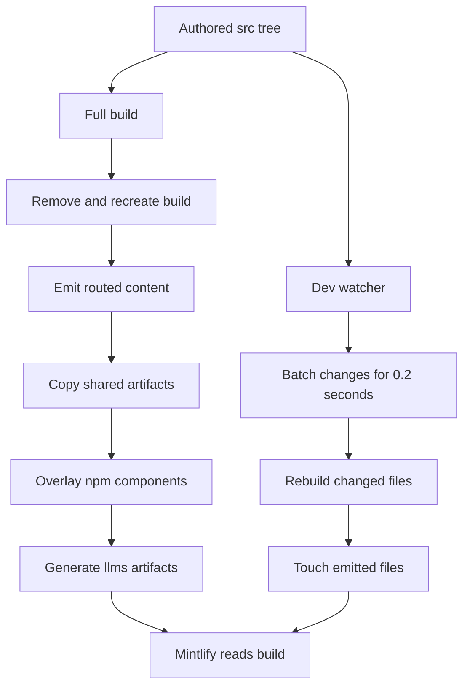

# Build System Architecture

`DocumentationBuilder` is the boundary between the authored `src/` tree and the Mintlify deployment tree, `build/`. Mintlify deploys the generated directory, but it is disposable: contributors edit `src/`, run a build, and never patch `build/` directly. A full build deletes and recreates `build/`, so any manual output change will be lost.

## Entrypoints and lifecycle

`docs build` routes to `build_command`, which verifies `src/`, creates `build/` if necessary, then instantiates `DocumentationBuilder(src, build)` and calls `build_all()`. `make build` is the usual repository command. `docs dev` normally performs that full build first, starts a recursive watcher on `src/`, and launches `mint dev --port 3000` with `build/` as its working directory. `--skip-build` instead uses an existing build tree and warns if it does not exist.

This shows the full build, which owns derived artifacts, alongside the narrower development rebuild path.

`build_all()` has a deliberate order: clear output; emit Python and JavaScript OSS variants; emit the two unversioned OSS products; emit ordinary LangSmith; emit Managed Deep Agents variants; copy shared files; overlay npm-provided components; then generate `llms.txt` and `llms-full.txt`. The ordering ensures the LLM artifacts index the final tree and that package components win over source-tree copies.

## Output routing domains

The builder does not mirror `src/` mechanically. It selects an output domain from a file's source-relative path and a target language.

| Source domain | Output | Target language behavior |
| --- | --- | --- |
| Most `src/oss/` | `build/oss/python/...` and `build/oss/javascript/...` | One render per language; source folders named `python` or `javascript` are included only in their matching build and lose that folder in the output path. |
| `src/oss/deepagents/code/` | `build/oss/deepagents/code/...` | One unprefixed render using the Python conditional branch. |
| `src/oss/openwiki/` | `build/oss/openwiki/...` | One unprefixed render using the Python conditional branch. |
| Ordinary `src/langsmith/` | `build/langsmith/...` | One unversioned render using the Python conditional branch. |
| Direct `src/langsmith/managed-deep-agents*.mdx` pages | `build/langsmith/python/...` and `build/langsmith/javascript/...` | Two language renders; ordinary unversioned LangSmith emission excludes these pages. |
| Shared or root files | source-relative location under `build/` | Copied once, not language-duplicated. |

Managed Deep Agents is the important exception to LangSmith's otherwise unversioned model. Its unversioned URLs redirect to the Python routes through `docs.json`; the builder therefore emits no unversioned Managed Deep Agents pages. During a variant render it also changes unversioned Managed Deep Agents links to the matching language route.

For versioned output, absolute `/oss/...` links receive `/oss/python/...` or `/oss/javascript/...`. Already-prefixed links and image paths are left alone. Links to the two intentionally unversioned product roots—Deep Agents Code and OpenWiki—also remain unprefixed. This lets a language-agnostic page link to itself without creating a route that the build does not emit.

## Markdown is transformed at the output boundary

Markdown and MDX are not mutated in `src/`. When the builder writes one, it applies standard preprocessing, then language-aware snippet-import rewriting, OSS-link rewriting, and Managed Deep Agents-link rewriting; finally it appends the contributor footer where applicable. `.md` inputs are written as `.mdx` output.

Standard preprocessing resolves scoped `@[LinkName]` references using `SCOPE_LINK_MAPS`, adds tracking parameters to conversion-oriented `smith.langchain.com` CTA links, and resolves language fences. `:::python` content is retained only for the Python target and `:::js` only for the JavaScript target; unsupported fence labels are preserved. Escaped `\:::` syntax is unescaped and remains literal. Missing autolinks are logged rather than failing the build. The UTM pass ignores fenced code and leaves functional LangSmith links unchanged.

All source markdown except the root `index.mdx` and files anywhere below `snippets/` receives a generated callout containing a link to edit the source on GitHub and a link to file an issue. This is output-only decoration, not authored page content.

## Shared artifacts and snippets

`is_shared_file()` classifies `docs.json`; the named root pages `index.mdx`, `use-these-docs.mdx`, `playground.mdx`, and `build-overview.mdx`; anything in a `snippets`, `images`, `.well-known`, or `fonts` path component; and every `.js` or `.css` file as shared. The classifier prevents those inputs from being duplicated by the OSS passes. Supported types comprise Markdown, JSON, YAML, common image/video formats, CSS and JavaScript, JSX/TSX, text/HTML, and WOFF/TTF fonts; other extensions and `TEMPLATE.mdx` are skipped. A file named `docs.yml` or `docs.yaml` is converted to JSON rather than copied as YAML.

Markdown snippets need additional treatment because the same import can be consumed from pages at different nesting depths. For each source snippet, the builder emits:

- a default source-relative snippet containing Python-resolved links, for unversioned consumers;
- `build/snippets/python/...`, with Python-resolved links; and
- `build/snippets/javascript/...`, with JavaScript-resolved links.

A versioned page importing `from '/snippets/foo.mdx'` is rewritten to the corresponding language-specific path. JSX and TSX snippet components are simply shared files. After all source shared files are processed, the builder copies `PatternEmbed.jsx` and `ExampleEmbed.jsx` from `@langchain/docs-sandbox` into `build/snippets/`, and `ChatLangChainEmbed.js` to the build root. Missing package directories or expected files produce warnings; when present, these copies deliberately overwrite source-provided versions.

## Full versus incremental builds

A full build is the consistency operation: it removes stale output and regenerates routing, shared artifacts, package overlays, and both LLM artifacts. Use it after configuration, navigation, package, or broad routing changes.

The dev watcher is intentionally narrower. It queues supported create/modify events, de-duplicates rapid changes with a 0.2-second debounce, invokes `build_file()` in a worker thread (up to four for a batch), then touches the expected output files so Mintlify reloads. `build_file()` follows the same routing rules as the full build for an existing source file, so a versioned OSS source refreshes both language outputs while OpenWiki and Deep Agents Code refresh once.

There are boundaries to account for when operating it:

- The watcher ignores editor backup files and selected hidden temporary files.
- A deletion removes only the source-relative output path. It does not apply the full routing map, so deletion of a versioned or special-routed source can leave generated variants behind until the next full build.
- An incremental rebuild does not rerun shared-file collection, npm overlays, or LLM artifact generation. In particular, a `docs.json` edit is copied but does not refresh indexes derived later by `build_all()`.

Treat `make build` as the recovery and release path whenever these derived or cross-file effects matter.

## LLM-oriented generated artifacts

After the final output tree is ready, the builder writes two related artifact families at its root.

`llms.txt` is an index of every eligible MDX page plus Mintlify-generated OpenAPI operation pages inferred from `build/docs.json` and the referenced specifications. It omits snippets and pages with `noindex: true`. To avoid truncation, small sections are listed in the root, while large sections are partitioned by directory into `llms.txt` files linked directly from the root. The builder validates that the root and each section remain below 50,000 characters, that section indexes do not link to another index level, and that every eligible page is listed exactly once. A violation raises `ValueError` and fails the full build.

`llms-full.txt` is a textual corpus. It strips frontmatter, inlines recognized snippet imports recursively to a maximum depth of six, and omits snippets and `noindex` pages themselves. The root corpus contains unversioned material and pointers to separate full corpora for `oss/python` and `oss/javascript`, avoiding a single language-duplicated corpus. Generated OpenAPI pages have no MDX body, so their headings and source URLs are represented in the root corpus while `llms.txt` carries their detailed index entries.

## Safety and focused tests

Source collection rejects every symlink and verifies that each resolved regular file remains below the requested source root. The builder also uses containment checks before reading an OpenAPI spec, following a snippet import, or writing a section index, because MDX and `docs.json` are editable inputs. An escaping path is ignored or refused rather than read from or written outside `build/`.

The focused builder tests cover routing exceptions and their link effects: unversioned OpenWiki and Deep Agents Code output, Managed Deep Agents dual routes, language-scoped snippet imports and resolved links, symlink rejection, and containment of snippet imports. They also verify LLM index coverage, size and one-hop invariants, full-corpus language splitting, snippet inlining, and OpenAPI entry handling. Extend these tests when changing a routing or generated-artifact boundary.

## Related pages

- [Source directory map](/openwiki/architecture/source-map.md) for authored domains and navigation ownership.
- [Preprocessing](/openwiki/concepts/preprocessing.md) for author-facing markup transformations.
- [Versioning](/openwiki/concepts/versioning.md) for language-specific documentation conventions.
- [Mintlify integration](/openwiki/integrations/mintlify.md) for the deployment consumer.
- [Builder tests](/openwiki/testing/builder-tests.md) for test guidance.
- [Local development](/openwiki/workflows/local-development.md) for running the watcher and preview server.
