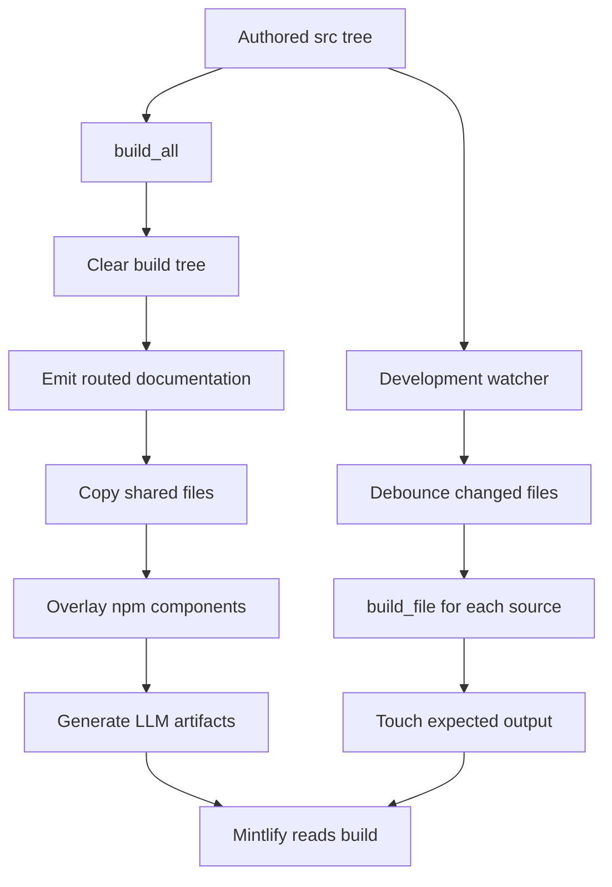

# Build System Architecture

`DocumentationBuilder` is the boundary between authored `src/` content and Mintlify's deployment input, `build/`. The output tree is generated and disposable: Mintlify deploys it, but contributors change `src/` and rebuild rather than editing `build/`. A full build removes the existing output tree first, so manual output changes cannot persist.

## Entrypoints and full-build lifecycle

`docs build` invokes `build_command`, which verifies that `src/` exists, constructs `DocumentationBuilder(src, build)`, and runs `build_all()`; a missing source directory returns exit code 1. `make build` is the normal repository entrypoint. `docs dev` performs that full build unless `--skip-build` is set, creates a watcher for `src/`, and starts `mint dev --port 3000` with `build/` as its working directory. It returns failure when the initial build fails, Mint cannot be started, or the Mint process exits unsuccessfully.

This shows why a full build owns whole-tree derived artifacts while the watcher only refreshes changed source files.

`build_all()` deliberately orders its work: clear output; build Python and JavaScript OSS variants; build unversioned Deep Agents Code and OpenWiki; build ordinary LangSmith content; build Managed Deep Agents variants; copy shared files; overlay npm components; generate `llms.txt`; then generate `llms-full.txt`. Therefore the LLM artifacts see the final output tree, and the package overlay wins over same-named source components.

## Routing domains

The builder selects an output domain from a file's path rather than mirroring all of `src/`.

| Source domain | Emitted location | Behavior |
| --- | --- | --- |
| Most `src/oss/` | `build/oss/python/...` and `build/oss/javascript/...` | Rendered independently for Python and JavaScript. Source folders named `python` or `javascript` apply only to the matching variant and are removed from the emitted relative path. |
| `src/oss/deepagents/code/` | `build/oss/deepagents/code/...` | Rendered once, using the Python branch for language conditionals. |
| `src/oss/openwiki/` | `build/oss/openwiki/...` | Rendered once, using the Python branch for language conditionals. |
| Ordinary `src/langsmith/` | `build/langsmith/...` | Rendered once, using the Python branch for language conditionals. |
| Direct `src/langsmith/managed-deep-agents*.mdx` pages | `build/langsmith/python/...` and `build/langsmith/javascript/...` | Rendered for both languages; ordinary LangSmith emission excludes them. |
| Shared and root inputs | Source-relative location under `build/` | Copied or processed once. |

Managed Deep Agents is the exception to unversioned LangSmith. The builder emits only language-prefixed Managed Deep Agents pages and rewrites unversioned Managed Deep Agents links in a variant to that variant's route. `src/docs.json` supplies redirects from legacy or unversioned Managed Deep Agents routes to Python routes.

For a language-targeted render, absolute `/oss/...` links become `/oss/python/...` or `/oss/javascript/...`. Already-prefixed links, image paths, and the intentionally unversioned Deep Agents Code and OpenWiki roots are not rewritten. This preserves routes that the builder actually emits.

## Markdown and shared content

Markdown and MDX are transformed only on the way to `build/`: standard preprocessing runs first, followed by language-specific snippet-import rewriting, OSS link rewriting, Managed Deep Agents link rewriting, and finally a contributor footer where eligible. `.md` inputs become `.mdx` output.

Preprocessing resolves scoped `@[LinkName]` references via `SCOPE_LINK_MAPS`, adds tracking parameters to eligible LangSmith conversion links, and resolves language fences. `:::python` content is retained for Python builds and removed for JavaScript; `:::js` has the inverse behavior. Unsupported labels are retained, and escaped `\:::` remains literal after unescaping. An unresolved autolink is logged rather than turning the build into an error.

Except for root `index.mdx` and any path below `snippets/`, emitted markdown receives an output-only callout with GitHub edit and issue links. It does not alter the authored source.

`is_shared_file()` classifies `docs.json`; selected root pages; paths containing `snippets`, `images`, `.well-known`, or `fonts`; and all `.js` and `.css` files as shared. The supported set includes Markdown, JSON and YAML, common image and video types, CSS and JavaScript, JSX/TSX, text/HTML, and supported fonts. `TEMPLATE.mdx` and unsupported extensions are skipped. `docs.yml` is converted to JSON; other supported non-Markdown files use `copy2`.

### Snippet variants and containment

Markdown snippets are shared source material but must carry links that work in consumers at any nesting depth. The builder emits each shared snippet as:

- the original `build/snippets/...` path, with Python-resolved links for unversioned consumers;
- `build/snippets/python/...`, with Python-resolved links; and
- `build/snippets/javascript/...`, with JavaScript-resolved links.

A versioned page importing `from '/snippets/foo.mdx'` is rewritten to the matching language-specific copy. This avoids fragile relative links in deeply nested pages. JSX and TSX snippet components are simply shared files. After shared source files are processed, the builder copies `PatternEmbed.jsx` and `ExampleEmbed.jsx` from `@langchain/docs-sandbox` to `build/snippets/` and `ChatLangChainEmbed.js` to the build root. Present package artifacts intentionally overwrite source-tree versions; missing package directories or expected files only generate warnings.

## Full builds versus the development watcher

A full build is the consistency operation: it removes stale output and regenerates routes, shared material, package overlays, and LLM artifacts. Use `make build` after navigation, routing, package, deletion, or other cross-file changes.

The development watcher queues supported create and modification events, ignores editor backup and temporary files, de-duplicates bursts with a 0.2-second debounce, rebuilds a batch in worker threads, and touches expected outputs so Mintlify reloads. `build_file()` follows the same existing-file routing policy, including both OSS variants and the two unversioned OSS products.

Its intentional limitations matter operationally:

- A deletion removes only the source-relative `build/` path; it does not apply routing rules. Generated variants of a deleted versioned or special-routed source can remain until a full build clears the tree.
- Per-file rebuilds do not run shared-file collection, npm overlays, or either LLM-generation stage. For example, copying a changed `docs.json` incrementally does not regenerate OpenAPI-derived index entries.

## LLM artifacts: complete index and full corpus

After the final tree is ready, the builder writes two artifact families.

`llms.txt` indexes every eligible emitted MDX page and also derives Mintlify OpenAPI operation pages from `build/docs.json` and referenced specifications. OpenAPI operations are included because Mintlify generates their pages without corresponding MDX files. Hidden operations are omitted; tag slugs preserve underscores, and duplicate operation slugs receive numeric suffixes to model Mintlify routes. Snippets and pages with `noindex: true` are excluded.

To avoid platform truncation, small sections remain in the root index and large sections are split by directory into files named `llms.txt`, linked directly from the root. The generated index is validated after writing: the root and each linked section must be at most 50,000 characters, section indexes must not link to another index level, and the combined indexes must list every eligible page exactly once. A violation raises `ValueError`, failing the full build rather than publishing a partial index.

`llms-full.txt` is the textual corpus. It strips frontmatter and replaces recognized snippet component usages with recursively expanded snippet bodies, stopping recursion after depth six. Snippets and `noindex` pages are not corpus pages themselves. The root corpus contains unversioned content and pointers to separate `oss/python/llms-full.txt` and `oss/javascript/llms-full.txt` corpora, keeping duplicated language variants out of one root file. Generated OpenAPI pages have no MDX body, so the root corpus records each page title and source URL while `llms.txt` provides its indexed entry.

## Safety boundaries and focused tests

Source collection rejects symlinks and regular files resolving outside the requested root. The builder also applies `_resolve_within()` before following snippet imports, reading OpenAPI specifications, and writing section indexes. These inputs originate in editable MDX or `docs.json`; an escaping path is ignored or refused instead of reading from or writing outside the build tree.

`tests/unit_tests/test_builder.py` protects the high-value boundaries: unversioned OpenWiki and Deep Agents Code routes, Managed Deep Agents dual routes and link rewrites, language-scoped snippet imports and absolute link variants, source symlink rejection, and snippet-import containment. Its LLM-focused tests cover excluded pages, OpenAPI hidden and duplicate operations, index size, one-hop and exactly-once coverage invariants, section naming, language corpus splitting, and snippet expansion. Extend these tests when changing routing, full-corpus expansion, OpenAPI inference, or containment behavior.

## Related pages

- [Source directory map](/openwiki/architecture/source-map.md)
- [Versioning](/openwiki/concepts/versioning.md)
- [Mintlify integration](/openwiki/integrations/mintlify.md)
- [Builder tests](/openwiki/testing/builder-tests.md)
- [Local development](/openwiki/workflows/local-development.md)
