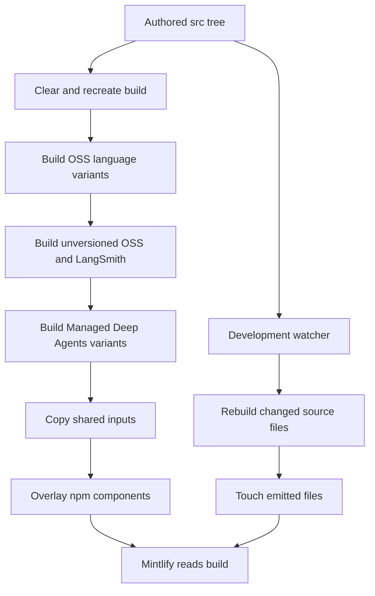

# Build System Architecture

`DocumentationBuilder` is the filesystem boundary between authored `src/` inputs and `build/`, the generated tree that Mintlify consumes. `build/` is disposable: a full build deletes and recreates it, so contributors must change `src/` and rebuild rather than patch output. The Python pipeline materializes authored pages, configuration, assets, and components; Mintlify separately renders and deploys that completed tree. In particular, deployment-time OpenAPI endpoint pages are not locally authored build artifacts.

## Entrypoints and full-build lifecycle

`make build` installs npm dependencies and runs `uv run pipeline build`. Its command handler requires `src/`, creates `build/` when needed, constructs `DocumentationBuilder(src, build)`, and calls `build_all()`; a missing source directory returns exit code 1.

```mermaid
flowchart TD
    Source["Authored src tree"] --> Clear["Clear and recreate build"]
    Clear --> Oss["Build OSS language variants"]
    Oss --> Unversioned["Build unversioned OSS and LangSmith"]
    Unversioned --> Managed["Build Managed Deep Agents variants"]
    Managed --> Shared["Copy shared inputs"]
    Shared --> Overlay["Overlay npm components"]
    Overlay --> Mint["Mintlify reads build"]
    Source --> Watch["Development watcher"]
    Watch --> Incremental["Rebuild changed source files"]
    Incremental --> Reload["Touch emitted files"]
    Reload --> Mint
```

This is the boundary between an authoritative full reconstruction and the narrower incremental preview path.

A full build runs in this order: ordinary OSS Python output, ordinary OSS JavaScript output, unversioned Deep Agents Code, unversioned OpenWiki, ordinary LangSmith, Managed Deep Agents language variants, shared files, then the npm component overlay. The order matters: shared files are available before the overlay, and installed package components deliberately win over same-destination source copies. The current builder **does not generate `llms.txt` or `llms-full.txt`**; claims that such artifacts are a build stage are obsolete.

## Routing families

The builder selects output paths from source location rather than mechanically mirroring the whole tree.

| Source family | Generated location | Rendering behavior |
| --- | --- | --- |
| Most `src/oss/` | `build/oss/python/...` and `build/oss/javascript/...` | Built once for `python` and once for `js`. A source first segment named `python` or `javascript` is accepted only by its matching pass and removed from the output path. |
| `src/oss/deepagents/code/` | `build/oss/deepagents/code/...` | Built once, with the Python conditional branch. |
| `src/oss/openwiki/` | `build/oss/openwiki/...` | Built once, with the Python conditional branch. |
| Ordinary `src/langsmith/` | `build/langsmith/...` | Built once, with the Python conditional branch. |
| Direct `src/langsmith/managed-deep-agents*.mdx` | `build/langsmith/python/...` and `build/langsmith/javascript/...` | Built for both languages; excluded from ordinary LangSmith output. |
| Shared and root files | Source-relative path under `build/` | Built or copied once. |

Managed Deep Agents is the LangSmith exception. The builder emits its direct `.mdx` pages only under language-prefixed routes, while `src/docs.json` redirects unversioned Managed Deep Agents URLs to Python routes. Its language render also rewrites unversioned Managed Deep Agents links to the matching language route.

During a language-targeted render, absolute `/oss/...` links become `/oss/python/...` or `/oss/javascript/...`. Existing language prefixes, image paths, and the unversioned Deep Agents Code and OpenWiki roots are intentionally not rewritten. This preserves routes which the builder does not duplicate.

## Output transformations

Markdown and MDX remain unchanged in `src`. Before writing output, the builder applies standard preprocessing, rewrites language-scoped snippet imports when applicable, rewrites OSS and Managed Deep Agents links, and appends a source-contribution footer. `.md` inputs are output as `.mdx`.

Standard preprocessing resolves scoped `@[LinkName]` references through `SCOPE_LINK_MAPS`, adds UTM parameters to eligible `smith.langchain.com` CTA links, and evaluates conditional blocks. `:::python` is retained only for the Python target and `:::js` only for JavaScript; other labels are left intact. Escaped `\:::` delimiters become literal delimiters. Missing autolinks are logged rather than failing the build, and the CTA pass skips fenced code and leaves functional LangSmith URLs alone.

The generated footer is omitted for root `index.mdx` and any file below a `snippets` path. Other source Markdown gets output-only calls to connect the docs, edit the source on GitHub, or file an issue.

## Shared inputs and snippet copies

`is_shared_file()` prevents selected inputs from entering versioned passes. It classifies `docs.json`; selected root pages (`index.mdx`, `use-these-docs.mdx`, `playground.mdx`, and `build-overview.mdx`); all paths containing `snippets`, `images`, `.well-known`, or `fonts`; and every `.js` or `.css` file. Supported inputs include Markdown, JSON and YAML, common image/video formats, CSS/JS, JSX/TSX, text/HTML, and common web fonts. Unsupported extensions and `TEMPLATE.mdx` are skipped; `docs.yml` is converted to JSON, while other supported non-Markdown inputs are copied with metadata.

A Markdown snippet is written three times: at its source-relative path with Python-resolved links for unversioned consumers, and under both `build/snippets/python/` and `build/snippets/javascript/` with the corresponding link and conditional rendering. A versioned page importing `from '/snippets/foo.mdx'` is rewritten to its matching language-specific Markdown copy. JSX and TSX components stay shared rather than being language-expanded.

After source shared files are processed, the builder attempts to copy `PatternEmbed.jsx` and `ExampleEmbed.jsx` from `node_modules/@langchain/docs-sandbox/dist` to `build/snippets/`, plus `ChatLangChainEmbed.js` to the build root. Missing package directories or mapped files produce warnings; present package files overwrite earlier source-tree copies.

## Development and incremental limits

`make dev` installs npm dependencies and starts `pipeline dev`. Unless `--skip-build` is supplied, development mode first performs the full build, then watches `src/` recursively and starts `mint dev --port 3000` in `build/`. It returns failure for an initial build failure, an unavailable Mint executable, a nonzero Mint exit, or an unexpectedly stopped watcher. On shutdown it stops the watcher and terminates Mint, escalating to a kill after the wait timeout.

The watcher queues supported create and modification events, ignores common editor backup and temporary files, de-duplicates rapid changes with a 0.2-second debounce, and rebuilds a batch in worker threads (up to four). It then touches expected output files to trigger Mintlify hot reload. For an existing source file, `build_file()` follows the same routing classification as the full build.

Incremental mode is not a substitute for reconstruction:

- Deletion handling removes only the source-relative output path, not every routed variant. A deleted versioned or Managed Deep Agents source can therefore leave generated files until the next full build.
- `build_file()` does not rerun whole-tree shared-file collection or the npm overlay. Use a full build for cross-file effects, package changes, deletions, navigation changes, or suspicious preview state.
- Managed Deep Agents output is rebuilt correctly into both language routes, but the touch logic treats LangSmith as unversioned and does not touch those emitted routes. A full build is the reliable refresh path for this case.

## Safety and tests

Whole-tree collection rejects symlinks, including symlinks to regular files, and accepts only regular files whose resolved paths stay under the requested source root. This prevents a committed link from bringing host paths into generated artifacts.

Focused builder tests cover the language-routing exceptions, language-aware OSS and snippet links, Managed Deep Agents dual routes, source-snippet copies, and symlink rejection. Extend these observable output tests when changing routing, rewriting, shared-file policy, or overlay precedence.

## Related pages

- [Source directory map](/openwiki/architecture/source-map.md)
- [Preprocessing](/openwiki/concepts/preprocessing.md)
- [Versioning](/openwiki/concepts/versioning.md)
- [Mintlify integration](/openwiki/integrations/mintlify.md)
- [npm snippets](/openwiki/integrations/npm-snippets.md)
- [Builder tests](/openwiki/testing/builder-tests.md)
- [Local development](/openwiki/workflows/local-development.md)
