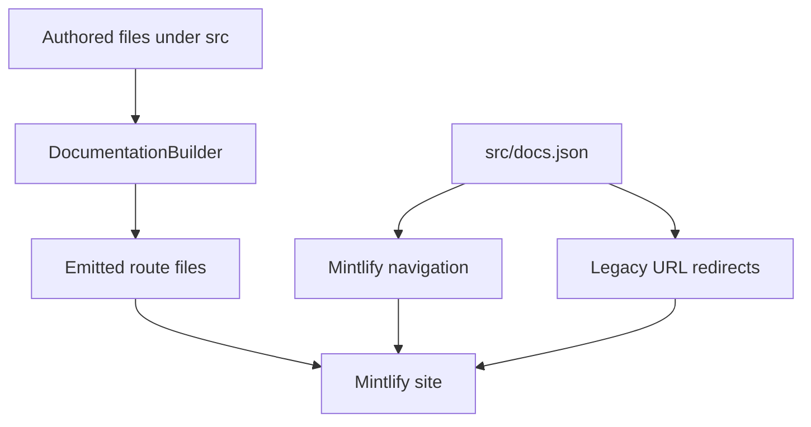

`src/` is the authored documentation tree. Three independent contracts determine where a change belongs:

1. **Source ownership** is the file or directory that authors edit.
2. **Route emission** is the builder's output path and target-language preprocessing.
3. **Visible navigation and redirects** are `src/docs.json` configuration.

Do not infer any one contract from another. A source directory normally influences the emitted path, but it does not select a navigation label; navigation can also expose a route whose source belongs to a different product domain.

This diagram shows separate ownership: the builder emits content, while `docs.json` makes routes visible and maps legacy URLs.

## Source-to-route ownership

| Change surface | Authored owner | Emitted route family | Navigation relationship |
| --- | --- | --- | --- |
| Shared OSS framework documentation | `src/oss/langchain/`, `src/oss/langgraph/`, and `src/oss/deepagents/` except `code/` | `/oss/python/...` and `/oss/javascript/...` | Build language dropdowns select the corresponding routes. |
| Language-specific OSS documentation | `src/oss/python/` or `src/oss/javascript/` | Only `/oss/python/...` or `/oss/javascript/...`; the source-language directory is removed from the emitted suffix | The matching Build dropdown lists that language's route. |
| Provider catalog | `src/oss/python/integrations/providers/all_providers.mdx` or `src/oss/javascript/integrations/providers/all_providers.mdx` | The matching language route, `/oss/python/integrations/providers/all_providers` or `/oss/javascript/integrations/providers/all_providers` | Both appear in their respective Build → Integrations tab. |
| OpenWiki | `src/oss/openwiki/` | `/oss/openwiki/...` once | Listed in the OpenWiki Build tab in both language dropdowns. |
| Deep Agents Code | `src/oss/deepagents/code/` | `/oss/deepagents/code/...` once | Listed as Products and setup → Deep Agents Code. |
| Ordinary LangSmith documentation | `src/langsmith/`, including `fleet/` | `/langsmith/...` | `docs.json` assigns it to a lifecycle or Products and setup location. |
| Managed Deep Agents | Direct `src/langsmith/managed-deep-agents*.mdx` files | `/langsmith/python/...` and `/langsmith/javascript/...` | Listed under Build → Managed Deep Agents for each language. |
| Reusable snippets | `src/snippets/` | Importable content, including language-scoped copies for versioned consumers | Not public page navigation. |
| Site configuration and API inputs | `src/docs.json` and committed OpenAPI JSON under `src/langsmith/` | Copied/configured inputs; Mintlify generates configured endpoint pages at deploy time | `docs.json` owns navigation, redirects, and OpenAPI sections. |

Most authored OSS content is emitted as separate Python and TypeScript route trees: `/src/oss/python/` and `/src/oss/javascript/` are included only in their matching output, while shared OSS directories such as `/src/oss/langchain/`, `/src/oss/langgraph/`, and `/src/oss/deepagents/` are built for both languages with conditional fences resolved per target.

OpenWiki and Deep Agents Code are the two OSS exceptions to language duplication: `/src/oss/openwiki/` builds once at `/oss/openwiki/...` and `/src/oss/deepagents/code/` builds once at `/oss/deepagents/code/...`, both using the Python conditional-content branch. The OSS-link rewriter keeps either exception unversioned but adds the active language segment to other unqualified `/oss/...` links. `docs.json` also redirects the old language-prefixed Deep Agents Code paths back to the unversioned family.

## Navigation is not source ownership

Directory structure constrains URL routes, but directory names do not perfectly mirror navigation labels; for example, `/src/langsmith/fleet/` maps to 'No-code agents' in the navigation UI. The Build menu deliberately combines OSS routes with Managed Deep Agents routes authored in `src/langsmith/`.

- **AGENT DEVELOPMENT LIFECYCLE** has Home, Build, Test, Deploy, and Monitor. Build has Python and TypeScript dropdowns with ten tabs each; Test, Deploy, and Monitor use flat LangSmith-topic route lists rather than language splits.
- **PRODUCTS AND SETUP** has LangSmith setup, LLM Gateway, No-code agents, Engine, and Deep Agents Code. LangSmith setup alone is tabbed; the other items are page/group lists.
- Test, Deploy, and Monitor draw their pages from flat `src/langsmith/` topic files. Separately, `src/langsmith/fleet/` is nested because it owns the Fleet route family, even though the visible label is No-code agents.
- BYOC is also a flat LangSmith source surface: its overview, architecture, onboarding, and FAQ are direct `src/langsmith/byoc*.mdx` files at corresponding `/langsmith/byoc...` routes, while `docs.json` places them in the BYOC setup tab.
- Engine follows the same flat-file convention for `src/langsmith/engine*.mdx`; `docs.json` exposes its overview, issue workflow, GitHub integration, issue categories, webhooks, security, and self-hosted routes as the Engine menu item.

When adding or moving a page, choose its source owner first, then update its exact `docs.json` product, menu item, tab, and group. Add or retain a redirect whenever a public URL changes. A valid output path does not make a page visible in navigation.

## Managed Deep Agents routing invariant

Managed Deep Agents is a routing exception, not an ordinary unversioned LangSmith surface. Files named `managed-deep-agents*.mdx` directly in `src/langsmith/` bypass the unversioned LangSmith pass and are emitted once for each target language. The same source uses language fences and unversioned internal links; target preprocessing chooses the language-specific fence content and rewrites those links.

Files named managed-deep-agents*.mdx in /src/langsmith/ generate language-prefixed routes (/langsmith/python/managed-deep-agents-... and /langsmith/javascript/managed-deep-agents-...) appearing in the Build tab Managed Deep Agents, with unversioned URLs redirecting to the Python routes.

For each target language, the builder preprocesses MDX, rewrites versioned snippet imports, rewrites unqualified OSS links unless they are already language-qualified or belong to an unversioned OSS product, and rewrites unversioned Managed Deep Agents links to the target-language route. This permits source pages such as the agent-definition and connections pages to retain portable imports and links while each emitted variant resolves to its own route family.

## Configuration and generated inputs

`src/docs.json` is both Mintlify configuration and the source of truth for visible placement and redirects; it is not derived from source directories. It also declares three OpenAPI navigation sections: Agent Server API uses committed `langsmith/agent-server-openapi.json` with output directory `langsmith/agent-server-api`, Control Plane API uses the remote `https://api.host.langchain.com/openapi.json`, and LangSmith REST API uses committed `langsmith/langsmith-platform-openapi.json` with directory `langsmith/smith-api`. Mintlify generates endpoint pages for these sections at deploy time, so they are configuration-driven routes rather than hand-authored MDX pages.

## Safe-change and verification checklist

1. Select the source owner from the table; do not relocate Fleet, BYOC, or Managed Deep Agents merely to match a navigation label.
2. Update the route entry at the exact `docs.json` navigation location. Update redirects for moved or reorganized public URLs.
3. For shared OSS or Managed Deep Agents changes, inspect both language outputs, including rewritten MDX snippet imports and links. For OpenWiki and Deep Agents Code, verify that no language-prefixed duplicate is emitted.
4. Run `make build` and `make broken-links` after route or link changes. Extend builder tests when changing emission, rewriting, or source containment behavior.

Focused builder tests assert the key route boundaries: language-prefix rewriting, one-time unversioned OSS output, dual Managed Deep Agents routes, language-scoped snippet imports, and source-symlink exclusion. The source collector rejects symlinks and files resolving outside the collection root, preventing a committed source path from pulling host files into build artifacts.

## Related pages

- [Build system architecture](/openwiki/architecture/build-system.md)
- [Preprocessing](/openwiki/concepts/preprocessing.md)
- [Versioning](/openwiki/concepts/versioning.md)
- [Mintlify integration](/openwiki/integrations/mintlify.md)
- [Adding pages](/openwiki/operations/adding-pages.md)
- [Quickstart](/openwiki/quickstart.md)
