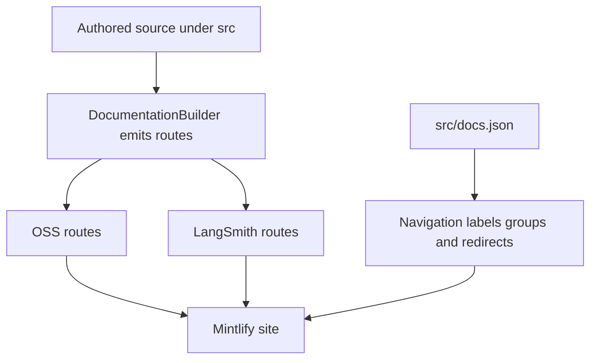

`src/` is the authored documentation tree. Route emission and visible navigation are separate contracts: `pipeline/core/builder.py` decides which files are emitted and how language-sensitive content is transformed, while `src/docs.json` assigns those routes to products, menu items, tabs, groups, and redirects. A source directory is therefore not a navigation label. In particular, `src/langsmith/fleet/` is shown as **No-code agents**, and `src/oss/deepagents/code/` is a Products and setup surface rather than part of the language-versioned Deep Agents SDK tree.

This diagram shows the ownership boundary: emission creates route files; `docs.json` makes selected routes visible and retains old URLs through redirects.

## Select the source owner

| Change surface | Authored source | Emitted route family | Navigation owner |
| --- | --- | --- | --- |
| Shared OSS framework material | `src/oss/langchain/`, `src/oss/langgraph/`, `src/oss/deepagents/` except `code/` | `/oss/python/...` and `/oss/javascript/...` | Lifecycle → Build language dropdowns |
| Language-specific OSS material | `src/oss/python/` or `src/oss/javascript/` | Only its matching language route, without the source-language path segment | The matching Build dropdown |
| OpenWiki | `src/oss/openwiki/` | `/oss/openwiki/...` once | Build → OpenWiki in both dropdowns |
| Deep Agents Code | `src/oss/deepagents/code/` | `/oss/deepagents/code/...` once | Products and setup → Deep Agents Code |
| Ordinary LangSmith material | `src/langsmith/`, including `fleet/` | `/langsmith/...` | Lifecycle or Products and setup according to `docs.json` |
| Managed Deep Agents | Direct `src/langsmith/managed-deep-agents*.mdx` files | `/langsmith/python/...` and `/langsmith/javascript/...` | Build → Managed Deep Agents |
| Reusable content | `src/snippets/` | Imported, not a public page route | Referenced by authored MDX |
| Shared site inputs | `src/docs.json`, images, fonts, root CSS and JavaScript | Copied once | `docs.json` is Mintlify configuration |

Most authored OSS content is emitted as separate Python and TypeScript route trees: `/src/oss/python/` and `/src/oss/javascript/` are included only in their matching output, while shared OSS directories such as `/src/oss/langchain/`, `/src/oss/langgraph/`, and `/src/oss/deepagents/` are built for both languages with conditional fences resolved per target. Use `:::python` and `:::js` in shared material instead of duplicating a page solely for fenced content.

OpenWiki and Deep Agents Code are the two OSS exceptions to language duplication: `/src/oss/openwiki/` builds once at `/oss/openwiki/...` and `/src/oss/deepagents/code/` builds once at `/oss/deepagents/code/...`, both using the Python conditional-content branch. The OSS-link rewriter preserves those product roots but adds the current language segment to another unqualified `/oss/...` link. Consequently, a Deep Agents Code page can intentionally link into `/oss/python/...` SDK documentation without acquiring a language-prefixed Deep Agents Code URL.

## Navigation is a configuration contract

Directory structure constrains URL routes, but directory names do not perfectly mirror navigation labels; for example, `/src/langsmith/fleet/` maps to 'No-code agents' in the navigation UI. When adding or moving a page, change the source MDX, its exact `docs.json` entry, and a redirect when a public URL changes.

- **AGENT DEVELOPMENT LIFECYCLE** has Home, Build, Test, Deploy, and Monitor. Build has Python and TypeScript dropdowns with ten tabs each. Test, Deploy, and Monitor are flat LangSmith-topic tabs rather than language splits.
- **PRODUCTS AND SETUP** has LangSmith setup, LLM Gateway, No-code agents, Engine, and Deep Agents Code. LangSmith setup alone is tabbed; the other four are page/group lists.

Test, Deploy, and Monitor menu items draw from files flat in `/src/langsmith/` organized by functional topic without directory structure constraints. The Build landing page is itself one shared route and links to both language-specific SDK routes, the corresponding Managed Deep Agents variant, the unversioned Fleet route, and unversioned Deep Agents Code.

### LangSmith setup and BYOC

All setup pages are direct `src/langsmith/` files and emit unversioned `/langsmith/...` routes. **LangSmith setup** has the Overview, Account, Cloud, BYOC, Self-hosted, and Govern tabs. BYOC remains a flat source surface even though navigation places its related pages together in the BYOC tab: overview, why, architecture, shared responsibility, onboarding, migration, usage, operations, billing, and FAQ all remain direct `src/langsmith/byoc*.mdx` files.

BYOC is a flat LangSmith setup source surface: its overview, architecture, onboarding, and FAQ pages are direct src/langsmith files at the corresponding /langsmith/byoc... routes, while docs.json places them in the BYOC setup tab. Its control plane runs in LangChain's cloud and its data plane runs in the customer AWS account. Onboarding creates a data plane through `Requested` → `Provisioning` → `Active`; a failed provisioning state requires LangChain support, and a workspace belongs to one data plane permanently. Keep those lifecycle and security promises in the dedicated BYOC pages rather than treating a navigation rearrangement as a product change.

### LLM Gateway, No-code agents, and Engine

LLM Gateway is a Beta Products and setup item sourced from flat src/langsmith/llm-gateway*.mdx files; its navigation separates Core capabilities, Administration and governance, and Advanced, placing credits in the first group and model-access policies in the second. The landing page is the route-level entrypoint: an administrator enables the gateway, stores provider credentials, and grants workspace access; callers then use a workspace-scoped LangSmith API key with a supported API format. Model IDs select configured provider credentials or Gateway Credits, and the gateway traces calls while applying centralized policies. Model-access policies return `403` when they block a provider or model; the most-specific scope replaces broader scopes and same-tier matches intersect.

**No-code agents** is the UI label for Fleet. Its content is physically nested at `src/langsmith/fleet/` and emits `/langsmith/fleet/...`; `docs.json` groups it as Get started, Configure, Tools and automation, Advanced, and Additional resources. Keep Fleet pages in that directory even when neighboring Gateway, Engine, and setup pages are flat.

**Engine** is likewise flat `src/langsmith/engine*.mdx` content, but its visible product label is Engine. Its pages are listed directly rather than tabbed: overview, issue workflow, GitHub integration, issue categories, webhooks, security, and self-hosted. This is a navigation relationship, not evidence that all LangSmith product documentation must be flat or that a file prefix determines its menu placement.

### Deep Agents Code

Deep Agents Code is an unversioned Products and setup surface whose expanded Configuration group is rooted at oss/deepagents/code/configuration and contains credentials, config file, hooks, and MCP tools; the configuration landing page documents distinct precedence for general options, provider keys, dotenv files, and provider endpoints. Its top-level navigation also includes overview, quickstart, CLI reference, approval modes, goals and rubrics, plugins, extensions, memory and skills, remote sandboxes, subagents, providers, and changelog.

The configuration page is the index of the hierarchy, not a generic SDK page. General options resolve from `managed_config.toml`, then `DEEPAGENTS_CODE_` overrides, canonical environment variables, user `config.toml`, and built-in defaults. Dotenv loading is a separate startup flow: the nearest project `.env` wins over the global profile dotenv, while inherited shell exports win over both. Some process- and trust-sensitive variables are rejected from dotenv files; `DEEPAGENTS_HOME` is captured before dotenv loading so a project dotenv cannot relocate the trusted profile root. Use `dcode config`, `dcode config get <key>`, and `dcode config path` to inspect effective configuration without starting a session.

## Managed Deep Agents routing invariant

A Managed Deep Agents page is a `.md` or `.mdx` file directly under `src/langsmith/` whose filename starts `managed-deep-agents`. Ordinary LangSmith emission excludes it; the dedicated builder path emits each source once for Python and once for JavaScript.

Files named managed-deep-agents*.mdx in /src/langsmith/ generate language-prefixed routes (/langsmith/python/managed-deep-agents-... and /langsmith/javascript/managed-deep-agents-...) appearing in the Build tab Managed Deep Agents, with unversioned URLs redirecting to the Python routes. Do not add an unversioned duplicate for a legacy URL—declare or retain the redirect in `docs.json`.

For each target language, the builder preprocesses MDX, rewrites versioned snippet imports, rewrites unqualified OSS links unless they are already language-qualified or belong to an unversioned OSS product, and rewrites unversioned Managed Deep Agents links to the target-language route. This ordering keeps nested MDX imports and intra-product links resolvable in each emitted tree.

## Change and verification checklist

1. Choose the source owner from the table before creating a file. A valid output path alone does not select a navigation location.
2. Update the precise product, menu item, tab, and group in `src/docs.json`; add a redirect for a moved public route.
3. For shared OSS or Managed Deep Agents changes, inspect both language outputs and rewritten imports/links. For OpenWiki and Deep Agents Code, verify that no language-prefixed duplicate appears.
4. Preserve the Fleet directory boundary and the Deep Agents Code exception. Do not move either merely to align a directory with a visible label.
5. Run `make build` and `make broken-links` after route or link changes. Extend builder tests when altering emission, link rewriting, or source containment.

Focused builder tests assert the key route boundaries: language-prefix rewriting, one-time unversioned OSS output, dual Managed Deep Agents routes, language-scoped snippet imports, and source-symlink exclusion. The symlink check is also a source-containment safeguard: collection rejects symlinks and files resolving outside the intended root so build artifacts cannot pull host paths into the site.

## Related pages

- [Build system architecture](/openwiki/architecture/build-system.md)
- [Versioning](/openwiki/concepts/versioning.md)
- [Mintlify integration](/openwiki/integrations/mintlify.md)
- [Adding pages](/openwiki/operations/adding-pages.md)
- [Agent skills](/openwiki/operations/agent-skills.md)
- [Quickstart](/openwiki/quickstart.md)
