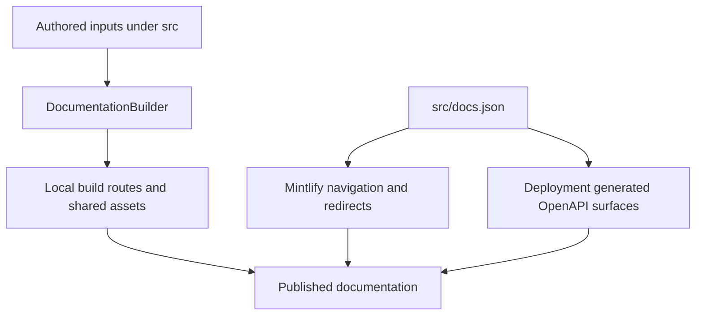

`src/` is the authored documentation tree, not the site map. `DocumentationBuilder` turns supported source files into the local `build/` tree; `src/docs.json` independently defines Mintlify navigation, redirects, and OpenAPI reference configuration. Consequently, a route may be unlisted, a menu label may not match its folder or URL, and one emitted route can deliberately appear in more than one navigation location. For example, `src/langsmith/fleet/` emits below `/langsmith/fleet/` but is presented as **No-code agents**.

This diagram separates repository-owned route emission from Mintlify presentation and deployment-generated API surfaces.

## Ownership boundaries

| Concern | Owner | Safe change rule |
| --- | --- | --- |
| Authored pages and route transformation | `src/` plus `pipeline/core/builder.py` | Choose the source family by route behavior, then verify the emitted path. |
| Visible product, menu, dropdown, tab, group, and ordering | `src/docs.json` | Add the emitted route explicitly; folder placement does not add navigation. |
| Historical and compatibility URLs | `src/docs.json` redirects | Redirect old URLs instead of retaining duplicate authored pages. |
| Reusable content and static inputs | `src/snippets/`, images, fonts, root CSS/JS, `.well-known`, and `docs.json` | Treat these as imports or copied site inputs, not normal navigation pages. |
| API endpoints | OpenAPI configuration in `docs.json` and Mintlify at deployment | Change the specification or configuration; do not author endpoint MDX. |

## Route-emission families

The builder clears `build/`, emits the two language OSS trees, emits the two unversioned OSS products, emits LangSmith content and Managed Deep Agents variants, then copies shared inputs. `TEMPLATE.mdx` is skipped and only supported extensions are copied.

| Authored input | Emitted route or artifact | Notes |
| --- | --- | --- |
| Root pages such as `src/index.mdx` and `src/build-overview.mdx` | Matching root paths | These are shared files, not language copies. |
| Shared `src/oss/` content, including `langchain/`, `langgraph/`, and `deepagents/` except `code/` | `/oss/python/...` and `/oss/javascript/...` | Conditional `:::python` and `:::js` content resolves per target. |
| `src/oss/python/` and `src/oss/javascript/` | Only the matching language route tree, without that source-language segment | A file in the other language subtree is skipped for that build. |
| `src/oss/openwiki/` | `/oss/openwiki/...` once | Uses the Python conditional-content branch. |
| `src/oss/deepagents/code/` | `/oss/deepagents/code/...` once | Uses the Python conditional-content branch. |
| Ordinary `src/langsmith/` files, including `fleet/` | `/langsmith/...` | Built as the Python target, so language fences resolve consistently. |
| Direct `src/langsmith/managed-deep-agents*.mdx` files | `/langsmith/python/...` and `/langsmith/javascript/...` | Excluded from ordinary LangSmith emission. |
| `src/snippets/` | Importable MDX and component inputs | Versioned consumers receive language-scoped MDX snippet imports. |
| Images, fonts, `.well-known`, root CSS/JS, and `docs.json` | Copied shared paths | `docs.json` remains site configuration in the build output. |

### Language-aware transformation

For a language-targeted MDX file, preprocessing runs before link rewrites. The builder scopes MDX snippet imports to `/snippets/python/` or `/snippets/javascript/`, prefixes eligible absolute `/oss/` links, and maps unversioned Managed Deep Agents links to the target-language route. It preserves already language-qualified URLs, image paths, and the unversioned Deep Agents Code and OpenWiki roots.

This makes a shared page portable across the two OSS route trees, but it also means authored absolute links have semantics: use an explicit `/oss/python/` or `/oss/javascript/` path only when deliberately targeting one language; use an unqualified eligible `/oss/` path when the builder should select the current target.

OpenWiki and Deep Agents Code are exceptions to the usual OSS duplication. They emit once, yet their conditional fences resolve with the Python target. Thus links from either product to ordinary shared OSS content resolve to the Python route, while links inside their own product roots remain unprefixed. Builder tests cover both one-time emission and this link behavior.

## Navigation is a separate projection

`docs.json` has two products. The **AGENT DEVELOPMENT LIFECYCLE** menu has Home, Build, Test, Deploy, and Monitor. Build has Python and TypeScript dropdowns, while the LangSmith-oriented stages point at routes from `src/langsmith/`; the source directory alone does not tell a reader which product surface displays a page.

Important deliberate projections include:

- **No-code agents** presents the `/langsmith/fleet/` route family, demonstrating that menu labels and path segments are independent.
- The two Build dropdowns list the same unversioned `/oss/openwiki/...` routes in their **OpenWiki** tab. This is duplicated presentation, not two route trees. The tab includes overview, quickstart, Modes, integrations, visualization, CLI reference, customization, providers, update automation, and changelog.
- **Integrations** is genuinely language-specific. Python uses **Popular Providers** and **Integrations by component**; TypeScript uses **Popular Providers**, **General integrations**, and **RAG integrations**. An integration needs both the correct language source family and explicit navigation placement.
- **Deep Agents Code** is an unversioned **Products and setup** surface. Its Configuration group is rooted at `oss/deepagents/code/configuration` and lists credentials, config file, hooks, and MCP tools. The authored configuration page distinguishes general-setting precedence, provider-key resolution, dotenv loading, and paired provider endpoints.

### Managed Deep Agents redirects and variants

A direct `managed-deep-agents*.mdx` source has two emitted variants. `docs.json` places those variants under the Build **Managed Deep Agents** tab and redirects unversioned legacy routes to the Python variant. Do not add an unversioned MDX duplicate: it would contradict the builder's deliberate exclusion and can create an orphaned route.

## OpenAPI and generated inputs

`docs.json` configures three OpenAPI reference surfaces:

| Surface | Specification source | Route directory when configured |
| --- | --- | --- |
| Agent Server API | Committed `src/langsmith/agent-server-openapi.json` | `/langsmith/agent-server-api/` |
| Control Plane API | Remote `https://api.host.langchain.com/openapi.json` | Mintlify default reference surface |
| LangSmith REST API | Committed `src/langsmith/langsmith-platform-openapi.json` | `/langsmith/smith-api/` |

Mintlify generates endpoint pages during deployment; they are not authored MDX pages and do not appear as local route files merely because this repository copies a committed specification. The builder can inspect locally configured OpenAPI specifications when generating its `llms` indexes, but that does not make this repository the producer of the deployed API reference pages.

## Operational invariants and checks

- Source traversal rejects symlinks and any resolved file outside the collection root. This prevents a committed path from pulling host files into build artifacts.
- Changes to source placement, language routing, snippet imports, or link rewriting should extend `tests/unit_tests/test_builder.py`; the focused tests cover unversioned product emission, link preservation, language-scoped snippets, and source containment.
- Run `make build` to inspect emitted paths. Then run `make broken-links`: it builds first, invokes Mintlify with redirect validation, and filters deployment-only OpenAPI routes and standalone snippet reports that would otherwise be local false positives.

## Change checklist

1. Start from the intended public route, then identify its source family; do not infer it from a navigation label.
2. For shared OSS content, inspect both `/oss/python/` and `/oss/javascript/` output. For OpenWiki and Deep Agents Code, inspect only their unversioned output.
3. Make `docs.json` placement and route-emission changes separately. Keep both OpenWiki tab references aligned.
4. Preserve URLs with redirects. For Managed Deep Agents, target the language-prefixed route and retain Python as the unversioned redirect destination.
5. For an API reference change, update or validate the specification and OpenAPI configuration rather than creating an endpoint page.
6. Run the focused builder tests and link checks before relying on navigation or redirect behavior.

## Related pages

- [Build system architecture](/openwiki/architecture/build-system.md)
- [Versioning](/openwiki/concepts/versioning.md)
- [Mintlify integration](/openwiki/integrations/mintlify.md)
- [Reference docs](/openwiki/integrations/reference-docs.md)
- [Adding pages](/openwiki/operations/adding-pages.md)
- [Versioned content workflow](/openwiki/workflows/versioned-content.md)
