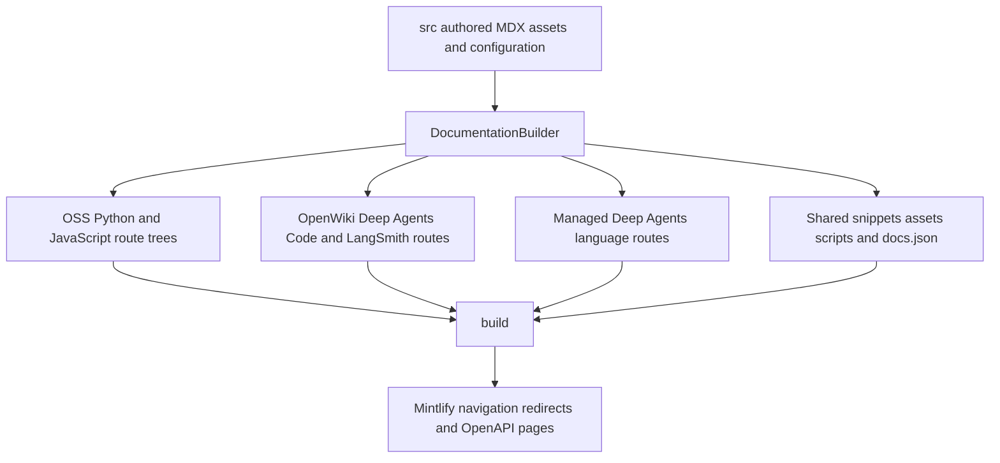

## Scope and ownership

`src/` is the manually authored documentation tree. `build/` is disposable, preprocessed output from which Mintlify deploys the site. Make content and configuration changes in `src/`, then regenerate; never patch `build/`.

`src/docs.json` is the navigation and site-configuration authority. Its nested products, menu items, dropdowns, tabs, groups, page entries, OpenAPI declarations, and redirects determine public placement and routing. A directory identifies an authored domain, but does **not** establish navigation or reliably predict its customer-facing label. For example, `src/langsmith/fleet/` supplies the **No-code agents** menu item.

The builder transforms authored inputs into the deployable tree; Mintlify consumes the resulting `build/docs.json` and creates configured OpenAPI endpoint pages.

## Choose the authored domain

| Need | Author here | Resulting route family / navigation owner |
| --- | --- | --- |
| Site landing page | `src/index.mdx` | `/`; Lifecycle → Home |
| Shared OSS framework or conceptual content | `src/oss/langchain/`, `src/oss/langgraph/`, `src/oss/deepagents/` (except `code/`), plus shared `concepts/`, `reference/`, and `contributing/` content | Both `/oss/python/...` and `/oss/javascript/...`; Build dropdown entries in `docs.json` |
| Python-only or TypeScript-only OSS content | `src/oss/python/` or `src/oss/javascript/` | Only the matching `/oss/python/...` or `/oss/javascript/...` tree |
| OpenWiki | `src/oss/openwiki/` | One `/oss/openwiki/...` tree; Build → OpenWiki |
| Deep Agents Code | `src/oss/deepagents/code/` | One `/oss/deepagents/code/...` tree; Products and setup → Deep Agents Code |
| Ordinary LangSmith page | `src/langsmith/`, including `fleet/` | `/langsmith/...`; its specific Test, Deploy, Monitor, setup, Gateway, Engine, or No-code agents entry in `docs.json` |
| Managed Deep Agents page | Direct `src/langsmith/managed-deep-agents*.mdx` file | `/langsmith/python/...` and `/langsmith/javascript/...`; Build → Managed Deep Agents |
| Reusable MDX or local snippet component | `src/snippets/` | Imported shared input, with processed language copies when used by versioned pages |
| Executable documentation example | `src/code-samples/` | Testable supporting source, not a documentation route family |

The regular OSS builder emits shared OSS sources for both languages. It includes a language-specific source subtree only while making its matching target, removes that source-language segment in the output, and resolves `:::python` / `:::js` conditional content per target. Thus author a shared page once and fence differing material rather than copying generated variants.

OpenWiki and Deep Agents Code are deliberate exceptions to OSS duplication. They build once, use the Python conditional-content branch, and retain unprefixed product URLs. The link rewriter likewise leaves their product roots alone while prefixing an otherwise unqualified `/oss/...` link for the target language. This is why an unqualified OSS link can be appropriate in versioned source, but an explicit language prefix is needed when an unversioned LangSmith page must intentionally point to one language.

### Managed Deep Agents lifecycle

Files whose names begin with `managed-deep-agents` and are directly under `src/langsmith/` are withheld from ordinary LangSmith output, then emitted for both language routes. The builder rewrites unversioned Managed Deep Agents links inside each variant to that variant's language route. `docs.json` retains redirects from former and unversioned URLs to the Python routes, so do not add an unversioned output file to compensate for a redirect.

## Navigation map from `docs.json`

The current configuration contains two products. Use the exact page entry under the appropriate product/menu/dropdown/tab/group as the source of truth; the following is a contributor-oriented map, not a substitute for that entry.

### AGENT DEVELOPMENT LIFECYCLE

| Menu item | Shape in current navigation | Principal source domains |
| --- | --- | --- |
| Home | One page | `src/index.mdx` |
| Build | Python and TypeScript dropdowns, each with 10 tabs | `src/oss/`, `src/build-overview.mdx`, and Managed Deep Agents files in `src/langsmith/` |
| Test | Six unversioned LangSmith tabs | Topic pages in `src/langsmith/` |
| Deploy | Six unversioned LangSmith tabs | Topic pages in `src/langsmith/`; OpenAPI groups in the Get started → Reference area |
| Monitor | Five unversioned LangSmith tabs | Topic pages in `src/langsmith/`; LangSmith REST API OpenAPI group |

The Build tabs are Overview, Deep Agents, Managed Deep Agents, LangChain, LangGraph, OpenWiki, Integrations, Learn, Reference, and Contribute. The two dropdowns—not merely the source directory—bind entries to Python or TypeScript. Their integrations entries draw from `oss/python/integrations/` and `oss/javascript/integrations/`; OpenWiki is intentionally listed from its one unversioned route family in both dropdowns.

Test, Deploy, and Monitor have no language dropdown. Their navigation groups classify flat LangSmith topic files by workflow, rather than mirroring source directories.

### PRODUCTS AND SETUP

| Menu item | Shape in current navigation | Authored location and route family |
| --- | --- | --- |
| LangSmith setup | Six tabs | `src/langsmith/` at `/langsmith/...` |
| LLM Gateway | Grouped page list | `src/langsmith/llm-gateway*.mdx` at `/langsmith/llm-gateway...` |
| No-code agents | Grouped page list | `src/langsmith/fleet/` at `/langsmith/fleet/...` |
| Engine | Flat page list | `src/langsmith/engine*.mdx` at `/langsmith/engine...` |
| Deep Agents Code | Page list plus Configuration group | `src/oss/deepagents/code/` at `/oss/deepagents/code/...` |

“Fleet” remains the source and URL term, while **No-code agents** is the navigation label. Conversely, Deep Agents Code is physically below a normally versioned framework but is a standalone unversioned product.

## Shared inputs and generated surfaces

### Snippets, assets, and scripts

`src/snippets/` holds reusable MDX and local components. Imports from language-versioned pages are rewritten to `/snippets/python/...` or `/snippets/javascript/...` processed copies so their links resolve in the consuming route. Because snippets can be imported from different depths, write snippet links with carefully chosen absolute paths. Snippets do not receive the generated source-edit footer.

Shared site inputs include `src/docs.json`, `src/style.css`, `src/images/` (including brand assets and dark/light provider variants), `src/fonts/`, `.well-known` content, and root JavaScript such as `src/integration-downloads-table.js`. The builder copies these as shared files. It skips symlinks and any file resolving outside the traversed source root, preventing a source-tree link from bringing host files into artifacts.

`src/code-samples/` is a distinct supporting domain for standalone, testable examples. Keep runnable sample fixtures and their language dependencies there; it should not be treated as a navigation source or copied route tree.

### Integration listing metadata and tables

Hosted integration guides are authored under `src/oss/{python,javascript}/integrations/`. The integration-download refresh script reads their frontmatter—identity, package registry name, optional featured/deprecated state, and component-specific capability fields—and combines it with package download data to render snippets under `src/snippets/oss/`.

`scripts/data/integration_external_docs.yaml` supplies third-party rows that do **not** yet have hosted guides. These rows appear in the same component tables, but their names link to the declared `docs_url` instead of a `docs.langchain.com` page. Use HTTPS, HTTP, or a single-slash site-relative URL; the refresh script has a no-network `--check-docs-urls` validation mode. An external row is a discovery-listing record, not authored documentation: when a guide is accepted, add the guide in the matching language/component source domain and remove the external record.

The rendered `src/snippets/oss/{language}-{component}-{downloads|featured}.mdx` tables are **generated output**, marked not to edit by hand. Regenerate them with `uv run python scripts/refresh_integration_downloads.py --write` (optionally scoped by language or component). `packages.yml` is a separate package metadata source used for package indexes, partner tables, and download data; it is not the API-reference build. On the client, `src/integration-downloads-table.js` makes generated table headers sortable and refreshes download sort values from badge SVGs after render. Change the generator, metadata, or table-enhancement script—not generated table rows—when altering this surface.

## OpenAPI-backed navigation

Mintlify generates endpoint pages from OpenAPI declarations in `docs.json`; they are not authored MDX and do not appear as local endpoint files in `build/`. Maintain the declaration, optional `directory`, containing navigation group, and specification together.

| Section | Navigation location | Spec source | Generated route root |
| --- | --- | --- | --- |
| Agent Server API | Deploy → Get started → Reference | `src/langsmith/agent-server-openapi.json` | `/langsmith/agent-server-api/` |
| Control Plane API | Deploy → Get started → Reference | `https://api.host.langchain.com/openapi.json` | `/api-reference/` |
| LangSmith REST API | Monitor → Reference | `src/langsmith/langsmith-platform-openapi.json` | `/langsmith/smith-api/` |

The daily refresh workflow runs `scripts/process_langsmith_openapi.py --write`, which fetches only the allow-listed `api.smith.langchain.com` host, applies public-documentation filtering and group metadata, and updates the committed LangSmith platform specification through one standing refresh PR. Do not hand-edit that refreshed spec. Local broken-link checking excludes deployment-time OpenAPI pages (and standalone snippets), since those otherwise produce false positives.

## Safe change procedure

1. Choose the source domain and route model from the table above; do not create or edit generated route copies.
2. Add or move the authored MDX, snippet, example, metadata record, spec, or asset at its owning source surface.
3. Update the exact `src/docs.json` navigation location in the same change. For a public move, add or revise a redirect there.
4. For an integration list change, update guide frontmatter or `integration_external_docs.yaml`, validate external URLs when applicable, then regenerate snippets rather than editing table output.
5. Run `make build` and inspect the relevant route family. Run `make broken-links`; run `make check-openapi` for OpenAPI changes; run the focused builder tests when changing route, link, snippet, or containment behavior.

Builder tests explicitly cover language prefixing, unversioned OSS exceptions, Managed Deep Agents dual routes and link rewriting, language-scoped snippet imports, and symlink exclusion. Extend those boundary tests with routing-rule changes rather than relying only on inspection of `build/`.

See [Build system](/openwiki/architecture/build-system.md) for preprocessing mechanics, [Preprocessing](/openwiki/concepts/preprocessing.md) for authored syntax, [Versioning](/openwiki/concepts/versioning.md) for language variants, [Mintlify integration](/openwiki/integrations/mintlify.md) for deployment ownership, [Adding pages](/openwiki/operations/adding-pages.md) for contributor workflow details, and [Integration listing automation](/openwiki/workflows/integration-listing-automation.md) for table refresh operations.
