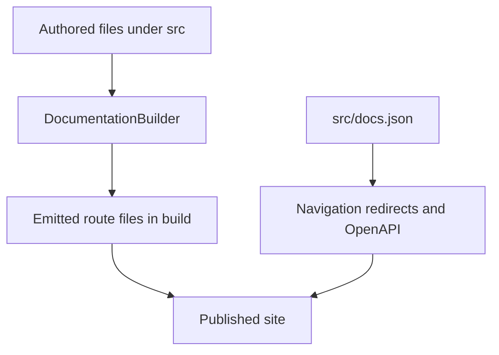

`src/` is the authored documentation tree, but it is not the site map. `pipeline/core/builder.py` produces the local `build/` route tree, while `src/docs.json` owns Mintlify presentation: product/menu placement, tabs and groups, redirects, and OpenAPI reference configuration. A generated route can be absent from the intended navigation, and a visible label can differ from both its source directory and URL. For example, `src/langsmith/fleet/` routes below `/langsmith/fleet/` but is presented as **No-code agents**.

This separates builder-owned route emission from Mintlify-owned presentation and generated API surfaces.

## Source-to-route map

| Authored domain or input | Emitted route family | Presentation ownership |
| --- | --- | --- |
| Root pages, including `src/index.mdx` and `src/build-overview.mdx` | Matching root routes, such as `/` and `/build-overview` | Lifecycle **Home** and shared **Build → Overview** |
| Shared `src/oss/` content, such as `langchain/`, `langgraph/`, `deepagents/`, concepts, contribution, and reference material | `/oss/python/...` and `/oss/javascript/...` | Corresponding Build-language dropdown |
| `src/oss/python/` and `src/oss/javascript/` | Only their matching language tree; the source language segment is removed | Corresponding Build-language dropdown |
| `src/oss/openwiki/` | `/oss/openwiki/...` once | The same unversioned **OpenWiki** tab is listed in both Build dropdowns |
| `src/oss/deepagents/code/` | `/oss/deepagents/code/...` once | **Products and setup → Deep Agents Code** |
| Direct `src/langsmith/*.mdx`, except `managed-deep-agents*.mdx` | `/langsmith/...` | Test, Deploy, Monitor, or Products and setup, as declared in `docs.json` |
| Direct `src/langsmith/managed-deep-agents*.mdx` | `/langsmith/python/...` and `/langsmith/javascript/...` | **Build → Managed Deep Agents** in each language dropdown |
| `src/langsmith/fleet/` | `/langsmith/fleet/...` | **Products and setup → No-code agents** |
| `src/oss/{python,javascript}/integrations/` | Matching language route tree | **Build → Integrations**, whose provider and component groups differ by language |
| `src/snippets/` | Importable MDX/components rather than public navigation pages | Reusable source; language-specific copies are produced when required by versioned content |
| `src/code-samples/` | Standalone sample inputs rather than route pages | Testable samples, not Mintlify navigation |
| `src/images/`, `src/fonts/`, `.well-known/`, root CSS/JS, and `src/docs.json` | Copied shared paths | Static/site configuration inputs |
| OpenAPI JSON and remote OpenAPI URLs named in `docs.json` | Mintlify endpoint routes at deployment | Generated API reference, not authored MDX endpoint pages |

## Builder-owned route rules

`DocumentationBuilder.build_all()` clears `build/`, emits Python and JavaScript OSS trees, emits Deep Agents Code and OpenWiki once, emits ordinary LangSmith content, then emits Managed Deep Agents variants and copies shared assets. Shared OSS files are built twice with `:::python`/`:::js` fences resolved for the target. Files in `oss/python/` and `oss/javascript/` only participate in their respective outputs.

OpenWiki and Deep Agents Code are deliberate unversioned exceptions. Each uses the Python conditional-content branch, so a bare ordinary OSS link from one of those pages resolves to the Python route. Their own roots are excluded from language-prefix rewriting.

For a language-targeted MDX file, the builder preprocesses autolinks, UTM links, and conditional content before it scopes unqualified snippet imports to `/snippets/python/` or `/snippets/javascript/`, prefixes eligible absolute `/oss/` links, and maps bare Managed Deep Agents links to the target-language URL. It does not re-prefix already-qualified links, image paths, or the two unversioned product roots.

Source discovery is also a containment boundary: the builder skips symlinks and files that resolve outside the collection root. Builder tests cover dual versus one-time emission, link and snippet rewriting, Managed Deep Agents variants, and source containment.

## Build navigation: language trees and duplicated placement

The **AGENT DEVELOPMENT LIFECYCLE** product has **Home**, **Build**, **Test**, **Deploy**, and **Monitor**. Build exposes Python and TypeScript dropdowns with ten tabs each; Test, Deploy, and Monitor use direct flat `src/langsmith/` route families whose grouping is configured rather than inferred from folders.

The two Build dropdowns both reference the *same* unversioned OpenWiki routes. This duplication is navigation presentation, not evidence of two emitted OpenWiki trees. The OpenWiki tab lists its overview and quickstart, the **Modes** subgroup, integrations, visualization, CLI reference, customization, providers, update automation, and changelog in each dropdown.

The language-specific **Integrations** tab is different: it points to `oss/python/integrations/...` or `oss/javascript/integrations/...` routes. Python navigation has **Popular Providers** and **Integrations by component**; TypeScript has **Popular Providers**, **General integrations**, and **RAG integrations**. Add an integration in the matching authored tree, then explicitly place its emitted route in the matching `docs.json` group.

### Managed Deep Agents and shared Deep Agents

A direct `src/langsmith/managed-deep-agents*.mdx` page is excluded from ordinary LangSmith emission and generated at both language-prefixed locations. The unversioned and legacy URLs are redirects to Python; they are not duplicate authored pages. Both Build dropdowns use **Get started** (Beta), **Agent capabilities** (with a nested Channels group), and **Build and deploy**.

The source is authored once with language fences. Its project-structure page requires a root named `agent`: `agent.py` with `define_deep_agent` for Python, or `agent.ts`/`agent.tsx` with `defineDeepAgent` for TypeScript. Managed paths enable capabilities, while ordinary application modules must be imported by the agent entry; `.env` and generated `.mda/evals/` content are excluded from the deployment archive.

Shared Deep Agents content emits below both language trees. `src/oss/deepagents/subagents.mdx` is in **Delegation** in both: synchronous delegation blocks the coordinator, and disabling both the default and caller-provided synchronous subagents removes `SubAgentMiddleware` and the `task` tool. Async subagents use distinct middleware and tools.

## LangSmith and Products and setup surfaces

**Test**, **Deploy**, and **Monitor** are flat-source LangSmith navigation surfaces. Deploy includes Sandboxes as direct routes for the landing page, snapshots, service URLs, download links, auth proxy, mounts, permissions, CLI, SDK, and Harbor integrations. Monitor keeps `langsmith/observability` as its Overview landing page, separate from Trace, Debug, Observe, and Reference; the Trace developer-tools group includes the Claude Code tracing guide.

**PRODUCTS AND SETUP** has **LangSmith setup**, **LLM Gateway**, **No-code agents**, **Engine**, and **Deep Agents Code**. LangSmith setup alone is tabbed: Overview, Account, Cloud, BYOC, Self-hosted, and Govern.

- **LLM Gateway** is the Beta, flat `src/langsmith/llm-gateway*.mdx` family. Navigation separates Core capabilities, Administration and governance, and Advanced; credits are in Core capabilities and model-access policies are in Administration and governance.
- **No-code agents** is the label for the `fleet/` source and route prefix.
- **Engine** is the flat `engine*.mdx` family. Its workflow detects recurring trace issues, diagnoses them against traces and connected source, proposes a PR, tracks matching traces and dataset examples, and reopens a resurfacing issue.
- **Deep Agents Code** is the unversioned terminal-agent surface. Its expanded Configuration group uses `oss/deepagents/code/configuration` as root and includes credentials, config file, hooks, and MCP tools. Its configuration documentation distinguishes precedence for general options, provider keys, dotenv files, and provider endpoints; `DEEPAGENTS_HOME` is captured before dotenv loading and config inspection reports origin without revealing secrets.
- BYOC separates the LangChain cloud control plane from customer-AWS data-plane resources. Onboarding assumes a cross-account IAM role; a data plane progresses Requested → Provisioning → Active, and a workspace cannot later move to another data plane.
- The Self-hosted tab places direct `/langsmith/self-host...` routes in its groups. Its SmithDB group is hidden, but its metrics route is visible in Reference.

## OpenAPI, redirects, and verification

`docs.json` configures three OpenAPI-generated sections. Agent Server API uses committed `langsmith/agent-server-openapi.json` under `/langsmith/agent-server-api/`; Control Plane API obtains a remote specification; and LangSmith REST API uses committed `langsmith/langsmith-platform-openapi.json` under `/langsmith/smith-api/`. Mintlify generates endpoint pages during deployment rather than from authored MDX, so do not add endpoint files to `src/` or expect them in local `build/` output.

When changing a page or surface:

1. Identify the authored domain and expected emitted route; do not infer either from a menu label.
2. Update the source and the exact `docs.json` product/menu/dropdown-or-tab/group placement as separate operations. For OpenWiki, keep the two Build-tab references aligned while retaining one route tree.
3. Preserve public URLs with redirects rather than authored duplicates. Keep unversioned Managed Deep Agents URLs aimed at the Python route.
4. Inspect both language outputs for shared OSS, language-specific integrations, and Managed Deep Agents; inspect only the unversioned tree for OpenWiki and Deep Agents Code.
5. Validate OpenAPI changes through their specifications, not invented endpoint MDX.
6. Run `make build` and `make broken-links`. The latter builds first, validates redirects with Mintlify, and filters deployment-only OpenAPI and standalone-snippet false positives. Extend `tests/unit_tests/test_builder.py` when changing route emission, rewriting, or containment.

## Related pages

- [Build system architecture](/openwiki/architecture/build-system.md)
- [Versioning](/openwiki/concepts/versioning.md)
- [Mintlify integration](/openwiki/integrations/mintlify.md)
- [Reference docs](/openwiki/integrations/reference-docs.md)
- [Adding pages](/openwiki/operations/adding-pages.md)
- [Versioned content workflow](/openwiki/workflows/versioned-content.md)
