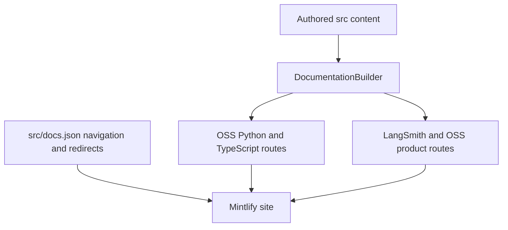

`src/` is the editable documentation tree. `src/docs.json` is the navigation and redirect authority consumed by Mintlify; the builder turns source domains into the route trees that those entries name. Do not infer a page's public placement from its directory alone: the Build landing page itself is a shared root page, Fleet's directory is presented as **No-code agents**, and Deep Agents Code is an unversioned OSS exception.

This shows the separate responsibilities: the builder determines emitted files and `docs.json` places those routes in navigation and preserves moved URLs.

## Choose the source owner

| What is changing | Authoritative source | Emitted route and navigation |
| --- | --- | --- |
| Build landing page | `src/build-overview.mdx` | One shared `/build-overview` page, used as the Overview tab in both Build language dropdowns |
| Shared OSS framework content | `src/oss/langchain/`, `src/oss/langgraph/`, `src/oss/deepagents/` except `code/` | Both `/oss/python/...` and `/oss/javascript/...`; Build tabs select the visible language |
| Language-specific OSS material | `src/oss/python/` or `src/oss/javascript/` | Only the matching `/oss/python/...` or `/oss/javascript/...` tree; the source language directory is removed from the route suffix |
| OpenWiki | `src/oss/openwiki/` | One `/oss/openwiki/...` family, listed in both Build dropdowns |
| Deep Agents Code | `src/oss/deepagents/code/` | One `/oss/deepagents/code/...` family under Products and setup → Deep Agents Code |
| Ordinary LangSmith content | `src/langsmith/`, including `fleet/` | One `/langsmith/...` tree; the topic determines its Lifecycle or Products and setup entry |
| Managed Deep Agents | Direct `src/langsmith/managed-deep-agents*.mdx` files | Parallel `/langsmith/python/...` and `/langsmith/javascript/...` routes in Build → Managed Deep Agents |
| Reusable MDX and components | `src/snippets/` | Imported content rather than a public route; versioned MDX consumers receive language-scoped processed copies |
| Images, fonts, styles, scripts, and site config | `src/images/`, `src/fonts/`, `src/style.css`, root JavaScript, and `src/docs.json` | Shared build inputs copied once |

Most authored OSS content is emitted as separate Python and TypeScript route trees: `/src/oss/python/` and `/src/oss/javascript/` are included only in their matching output, while shared OSS directories such as `/src/oss/langchain/`, `/src/oss/langgraph/`, and `/src/oss/deepagents/` are built for both languages with conditional fences resolved per target. Use `:::python` and `:::js` in shared material instead of duplicating a page solely for fenced content.

OpenWiki and Deep Agents Code are the two OSS exceptions to language duplication: `/src/oss/openwiki/` builds once at `/oss/openwiki/...` and `/src/oss/deepagents/code/` builds once at `/oss/deepagents/code/...`, both using the Python conditional-content branch. The link rewriter leaves those product roots unchanged but prefixes another unqualified `/oss/...` link for the target language. Consequently, an unversioned product page may intentionally link to `/oss/python/...` when it links into the language-versioned SDK documentation.

## Navigation is a configuration contract

Directory structure constrains URL routes, but directory names do not perfectly mirror navigation labels; for example, `/src/langsmith/fleet/` maps to 'No-code agents' in the navigation UI. Add, move, or remove a page as one coherent change: update the source MDX, the exact `docs.json` page entry, and redirects if an existing URL changes. `src/docs.json` has two products:

- **AGENT DEVELOPMENT LIFECYCLE** has Home, Build, Test, Deploy, and Monitor. Build has Python and TypeScript dropdowns with ten tabs each; Test, Deploy, and Monitor are flat LangSmith-topic tabs rather than language splits.
- **PRODUCTS AND SETUP** has LangSmith setup, LLM Gateway, No-code agents, Engine, and Deep Agents Code. Only LangSmith setup uses tabs; the remaining four entries are page/group lists.

The Build page mirrors this boundary: its language tabs link to `/oss/python/...` or `/oss/javascript/...` for the OSS stack and to the matching Managed Deep Agents variant, while its Fleet card points at the single `/langsmith/fleet` surface and its Deep Agents Code card points at `/oss/deepagents/code/overview`.

### Current LangSmith setup map

All setup pages are direct `src/langsmith/` files and emit unversioned `/langsmith/...` routes. The **LangSmith setup** item has six tabs: Overview, Account, Cloud, BYOC, Self-hosted, and Govern. BYOC is therefore a setup tab—not a separate build product—and its source pages remain flat alongside other LangSmith pages:

| BYOC route | Source | Role in the writer journey |
| --- | --- | --- |
| `/langsmith/byoc` | `src/langsmith/byoc.mdx` | Overview, availability, responsibility split, prerequisites, and links into onboarding |
| `/langsmith/byoc-architecture` | `src/langsmith/byoc-architecture.mdx` | Control-plane/data-plane boundaries, provisioned AWS resources, IAM, connectivity, and data traffic |
| `/langsmith/byoc-onboarding` | `src/langsmith/byoc-onboarding.mdx` | Enablement, IAM role, data-plane creation, provisioning state, connectivity, and workspace steps |
| `/langsmith/byoc-faq` | `src/langsmith/byoc-faq.mdx` | Operational and security answers, including failure and decommissioning guidance |

Keep cross-page operational facts aligned: onboarding defines the data-plane lifecycle as `Requested` → `Provisioning` → `Active` and directs `Provisioning Failed` to the LangChain team; it also establishes that a workspace belongs to exactly one data plane and cannot later move. The architecture page is the detailed source for the security boundary: the control plane is in LangChain's cloud and the data plane in the customer's AWS account; sensitive application data resides in the data plane, while management and runtime connections use PrivateLink.

### LLM Gateway and Fleet

**LLM Gateway** is a Beta Products and setup item sourced from flat `src/langsmith/llm-gateway*.mdx` files. Its navigation is deliberately organized around Core capabilities, Administration and governance, and Advanced. Put hosted-model and credit material in `llm-gateway-credits.mdx`; place organization/workspace/user/API-key access controls in `llm-gateway-model-access-policies.mdx`, which is in Administration and governance. The latter page documents the important policy behavior: no applicable policy permits all models, a denied provider or model returns `403`, and the most-specific matching tier replaces broader policies while same-tier policies intersect.

**No-code agents** is the UI label for Fleet. Its content is physically nested at `src/langsmith/fleet/` and routes to `/langsmith/fleet/...`; current groups are Get started, Configure, Tools and automation, Advanced, and Additional resources. Keep a Fleet page in that directory even though neighboring LangSmith setup and Gateway pages are flat.

### Deep Agents Code

**Deep Agents Code** is a Products and setup item even though it is authored under `src/oss/deepagents/code/`. Its top-level pages cover overview, quickstart, CLI, approvals, goals, plugins, extensions, memory and skills, sandboxes, subagents, and providers. The expanded Configuration group has `configuration` as its root and includes credentials, config file, hooks, and MCP tools.

`configuration.mdx` is the configuration landing page, not a generic Deep Agents SDK page. It defines the route's links and resolution model: general settings prefer administrator-managed config, then `DEEPAGENTS_CODE_` overrides, canonical environment variables, user `config.toml`, and built-in defaults; dotenv loading is separate and shell exports win. Keep changes to configuration subsections in their dedicated pages where navigation points, and retain the configuration landing page as the index of that hierarchy.

## Managed Deep Agents routing invariant

A Managed Deep Agents page is identified by location and filename: it is a `.md` or `.mdx` file directly under `src/langsmith/` whose name starts `managed-deep-agents`. Ordinary LangSmith emission excludes it. The dedicated path renders each file once for Python and once for JavaScript, resolving fences, scoping snippet imports, rewriting ordinary OSS links, and changing unversioned Managed Deep Agents links to the current variant.

Files named `managed-deep-agents*.mdx` in `/src/langsmith/` generate language-prefixed routes (`/langsmith/python/managed-deep-agents-...` and `/langsmith/javascript/managed-deep-agents-...`) appearing in the Build tab Managed Deep Agents, with unversioned URLs redirecting to the Python routes. Do not create an unversioned duplicate solely to serve a legacy route; maintain the redirect declarations instead.

## Safe change checklist

1. Choose the owning source domain from the table before creating a file. A correct route does not guarantee correct navigation placement.
2. Update the page's precise `docs.json` product, menu item, tab, and group in the same change. Add a redirect for a public move.
3. For versioned OSS or Managed Deep Agents content, verify both emitted language routes and link rewriting. For OpenWiki and Deep Agents Code, verify that no language-prefixed duplicate is introduced.
4. For BYOC, Gateway, Fleet, and Deep Agents Code, retain the source-domain boundary above; do not flatten Fleet or move Deep Agents Code into the ordinary language-versioned Deep Agents tree.
5. Run `make build`; use `make broken-links` after page or link changes. Extend focused builder tests when modifying an emission, link-rewrite, or source-containment boundary.

Focused builder tests cover language-prefix rewriting, one-time unversioned OSS output, dual Managed Deep Agents routes, language-scoped snippet imports, and source-symlink exclusion.

## Related pages

- [Build system architecture](/openwiki/architecture/build-system.md)
- [Versioning](/openwiki/concepts/versioning.md)
- [Reference docs](/openwiki/integrations/reference-docs.md)
- [Adding pages](/openwiki/operations/adding-pages.md)
- [Quickstart](/openwiki/quickstart.md)
