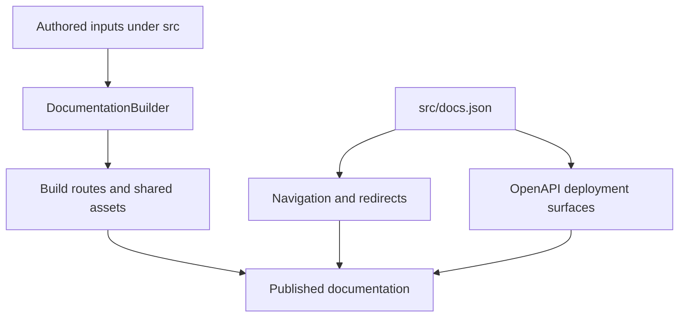

`src/` is an authored-content tree, not the public site map. `DocumentationBuilder` materializes supported inputs in `build/`; `src/docs.json` independently defines Mintlify navigation, redirects, and OpenAPI configuration. Treat `docs.json` as the authority for public placement: a route may be emitted but unlisted, listed under a label unrelated to its directory, or shown in more than one menu location. For example, `/src/langsmith/fleet/` emits under `/langsmith/fleet/` but is presented as **No-code agents**.

This shows the separation between route emission, Mintlify presentation, and deployment-generated API reference.

## Ownership boundaries

| Concern | Authority | Safe change rule |
| --- | --- | --- |
| Page transformation and emitted paths | `src/` and `pipeline/core/builder.py` | Select the source family from builder behavior, then inspect the emitted path. |
| Menu, dropdown, tab, group, ordering, and visibility | `src/docs.json` | Add the emitted route explicitly; directory placement alone does not create navigation. |
| Historical URLs | `docs.json` redirects | Redirect retired paths rather than retaining duplicate authored pages. |
| Snippets and static inputs | `src/snippets/`, images, fonts, `.well-known`, root CSS/JS, and `docs.json` | These are imports or copied inputs, not ordinary navigation pages. |
| API endpoint reference | OpenAPI entries in `docs.json` and Mintlify deployment | Change the specification/configuration, not an imagined endpoint MDX file. |

## Builder route families

`build_all()` clears the output, emits Python and JavaScript OSS trees, emits Deep Agents Code and OpenWiki once, emits ordinary LangSmith content and Managed Deep Agents variants, then copies shared inputs and generates `llms` indexes. `TEMPLATE.mdx` and unsupported types are skipped.

| Authored input | Emitted route or artifact | Important behavior |
| --- | --- | --- |
| Shared OSS content such as `src/oss/langchain/`, `langgraph/`, and `deepagents/` except `code/` | `/oss/python/...` and `/oss/javascript/...` | Conditional `:::python` and `:::js` content resolves per target. |
| `src/oss/python/` and `src/oss/javascript/` | Only the matching language route tree | The source language segment is removed from output; the other subtree is skipped. |
| `src/oss/openwiki/` | `/oss/openwiki/...` once | Uses the Python conditional-content branch; no language copies. |
| `src/oss/deepagents/code/` | `/oss/deepagents/code/...` once | Uses the Python conditional-content branch; no language copies. |
| Ordinary `src/langsmith/` files | `/langsmith/...` | Built through the Python target, including evaluation and tracing guides. |
| Direct `src/langsmith/managed-deep-agents*.mdx` files | `/langsmith/python/...` and `/langsmith/javascript/...` | Excluded from ordinary unversioned LangSmith emission. |
| `src/snippets/` | Importable MDX and component inputs | Shared inputs, not navigation pages. |
| Images, fonts, `.well-known`, root CSS/JS, and `docs.json` | Corresponding shared build paths | Copied once. |

### Language-aware transformation

For a language-targeted MDX file, the builder preprocesses MDX before link rewrites, scopes MDX snippet imports to `/snippets/python/` or `/snippets/javascript/`, prefixes eligible absolute `/oss/` links, and maps unversioned Managed Deep Agents links to the target-language route. Already-qualified OSS paths, image paths, and the unversioned OpenWiki and Deep Agents Code roots remain unchanged.

Use an explicit `/oss/python/` or `/oss/javascript/` link only when intentionally targeting one language. Use an eligible unqualified `/oss/` link when the current target should choose the language. Unversioned products use the Python transform, so links from their pages to shared OSS routes resolve to Python while links within their own product root remain unprefixed.

## Navigation is a projection, not a directory listing

The **AGENT DEVELOPMENT LIFECYCLE** product has Home, Build, Test, Deploy, and Monitor. Build has Python and TypeScript dropdowns; its tabs combine OSS and LangSmith routes. **PRODUCTS AND SETUP** contains setup and standalone product surfaces. Thus `src/langsmith/` is not a public section by itself: ordinary files are assigned to Test, Deploy, Monitor, setup, or product items by `docs.json`.

### Build: language surfaces and exceptions

- **OpenWiki** places the same unversioned `/oss/openwiki/...` routes in both Build language dropdowns. This is duplicated Mintlify presentation, not duplicate route emission.
- **Deep Agents Code** is an unversioned **Products and setup** item. Its expanded Configuration group is rooted at `oss/deepagents/code/configuration` and contains credentials, config file, hooks, and MCP tools. The landing page describes distinct precedence for general options, provider keys, dotenv files, and provider endpoints.
- The Build **Integrations** tab differs by language. Python has **Popular Providers** and **Integrations by component**; TypeScript has **Popular Providers**, **General integrations**, and **RAG integrations**. The Python AWS provider route is explicitly in **Popular Providers**. Its content is a Python-specific `langchain-aws` surface covering AWS integrations including Bedrock Mantle, Bedrock Converse, embeddings, and document loaders.
- Python's component group includes `oss/python/integrations/checkpointers/index` and `oss/python/integrations/long-term-memory/index`: checkpointers support LangGraph state persistence/resumption, and stores support long-term memory across threads.

### Managed Deep Agents variants and redirects

A direct `managed-deep-agents*.mdx` source has two emitted variants. `docs.json` lists Python variants under the Python Build **Managed Deep Agents** tab and JavaScript variants under the TypeScript tab; both place Identity in **Agent capabilities** and Deploy in **Build and deploy**. Unversioned Managed Deep Agents URLs, including `/langsmith/managed-deep-agents-overview`, redirect to Python. Do not add an unversioned MDX duplicate: the builder deliberately omits it.

The rendered variants resolve the source's conditional fences. For example, the Deploy page presents language-appropriate `mda deploy` commands, and its deployment flow compiles the local project, syncs deploy-owned context to Context Hub, uploads compiled source, and triggers a hosted deployment build. Identity documents that the default LangSmith API-key mode authenticates a caller but does not give end users separate private threads; Supabase or a backend identity declaration provides per-user identity. Workspace-authorized Studio users remain able to read/search deployment threads irrespective of the end-user identity mode.

### Test and Monitor: LangSmith evaluation and tracing

`langsmith/evaluation-concepts` is in **Test → Get started**. It establishes the route family’s central distinction: offline evaluation runs against dataset examples and can compare reference outputs, while online evaluation runs against production runs or threads without reference outputs. The navigation’s **Test → Evaluators → Evaluator types → UI** group places `langsmith/decision-model-evaluator` alongside UI evaluator guides. That page is UI-only: it configures a SemIf or Jev judge, maps dataset or tracing-project values to state, and turns each configured question into a feedback key. After saving, it runs on new dataset experiments or on incoming matching runs/threads, respectively.

`langsmith/trace-with-mastra` is an ordinary unversioned LangSmith route placed at **Monitor → Trace → Tracing setup → Integrations → Agent frameworks**. It is a TypeScript integration guide rather than a language-duplicated OSS page: Mastra's LangSmith exporter sends agent/workflow traces to LangSmith. The guide requires Mastra storage for tracing, configures `LangSmithExporter` with the LangSmith API key, and sends traces to `LANGCHAIN_PROJECT` or the default project.

### Other product projections

- **No-code agents** is the navigation label for the `/langsmith/fleet/` source and route family.
- **Engine** is a distinct **Products and setup** item with six flat routes: `langsmith/engine-overview`, `engine`, `engine-github`, `engine-notifications`, `engine-security`, and `engine-self-hosted`. Its issue workflow detects recurring trace issues, diagnoses them, proposes a pull request, tracks matching traces and dataset examples, and reopens resurfacing issues.

## OpenAPI and generated inputs

`docs.json` configures three OpenAPI reference surfaces:

| Surface | Specification source | Route directory when configured |
| --- | --- | --- |
| Agent Server API | Committed `src/langsmith/agent-server-openapi.json` | `/langsmith/agent-server-api/` |
| Control Plane API | Remote `https://api.host.langchain.com/openapi.json` | Mintlify reference surface |
| LangSmith REST API | Committed `src/langsmith/langsmith-platform-openapi.json` | `/langsmith/smith-api/` |

Mintlify creates endpoint pages during deployment; they are not authored MDX. For local OpenAPI groups with a `directory`, the builder derives `llms` index entries from the specification, omits hidden operations, and skips unavailable or out-of-build specifications.

## Invariants, validation, and safe changes

- Source traversal rejects symlinks and files resolving outside the collection root, so committed source paths cannot incorporate host files into artifacts.
- Extend `tests/unit_tests/test_builder.py` for routing, unversioned-product handling, snippets, or link rewriting. Focused tests cover language-specific snippets, unversioned output, Managed Deep Agents variants, link preservation, and source containment.
- Run `make build` to inspect output. Then run `make broken-links`: it builds first, invokes Mintlify with redirect validation, and filters deployment-only OpenAPI routes and standalone snippet reports that would otherwise be local false positives.

## Change checklist

1. Start with the required public route and identify its emission family; do not infer it from a menu label.
2. Update route emission and `docs.json` placement independently. For a normal shared OSS page, verify both languages; for OpenWiki and Deep Agents Code, verify only the unversioned route.
3. Place a Python integration in its current explicit Python group. Do not assume an analogous TypeScript group has the same taxonomy.
4. For Managed Deep Agents, change the source once, validate both variants, and preserve the unversioned-to-Python redirect convention.
5. For an ordinary LangSmith page, find its Test, Deploy, Monitor, setup, or product position in `docs.json`; directory proximity is not placement evidence.
6. For API reference, change the spec/configuration rather than adding endpoint MDX. Run focused tests and link checks before relying on a route or redirect.

## Related pages

- [Versioning](/openwiki/concepts/versioning.md)
- [Mintlify integration](/openwiki/integrations/mintlify.md)
- [Adding pages](/openwiki/operations/adding-pages.md)
- [Quickstart](/openwiki/quickstart.md)
- [Versioned content workflow](/openwiki/workflows/versioned-content.md)
