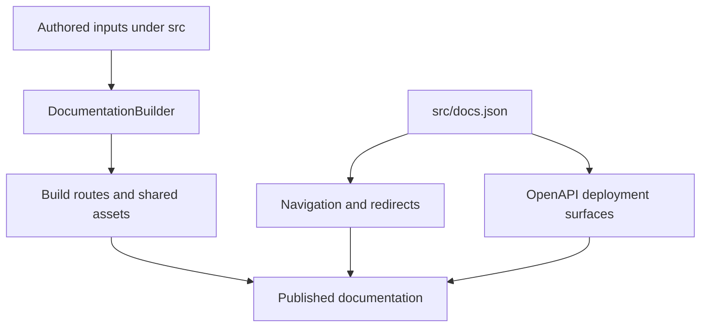

`src/` is an authored-content tree, not the public site map. `DocumentationBuilder` materializes supported inputs in `build/`; `src/docs.json` separately declares Mintlify navigation, redirects, and OpenAPI configuration. A route can therefore be emitted but unlisted, listed under a label unrelated to its directory, or listed in more than one navigation location. For example, `src/langsmith/fleet/` maps to `/langsmith/fleet/` but appears as **No-code agents**.

This diagram separates builder-owned route emission from Mintlify presentation and deployment-generated API reference.

## Ownership boundaries

| Concern | Owner | Safe change rule |
| --- | --- | --- |
| Page transformation and emitted paths | `src/` and `pipeline/core/builder.py` | Pick the source family based on output behavior, then inspect the emitted path. |
| Menu, dropdown, tab, group, ordering, and visibility | `src/docs.json` | Add an emitted route explicitly; source placement alone does not create navigation. |
| Historical URLs | `docs.json` redirects | Redirect old paths instead of keeping duplicate authored pages. |
| Snippets and static inputs | `src/snippets/`, images, fonts, `.well-known`, root CSS/JS, and `docs.json` | Treat them as imports or copied inputs, not ordinary navigation pages. |
| API endpoint reference | OpenAPI entries in `docs.json` and Mintlify deployment | Change the specification/configuration, not an imagined endpoint MDX file. |

## Builder route families

`build_all()` clears the output, emits Python and JavaScript OSS trees, emits Deep Agents Code and OpenWiki once, emits ordinary LangSmith content and Managed Deep Agents variants, then copies shared inputs and generates `llms` indexes. `TEMPLATE.mdx` and unsupported file types are skipped.

| Authored input | Emitted route or artifact | Important behavior |
| --- | --- | --- |
| Shared OSS content such as `src/oss/langchain/`, `langgraph/`, and `deepagents/` except `code/` | `/oss/python/...` and `/oss/javascript/...` | Conditional `:::python` and `:::js` content resolves for each target. |
| `src/oss/python/` and `src/oss/javascript/` | Only the corresponding language route tree | The source-language segment is removed from the output path; the other language subtree is skipped. |
| `src/oss/openwiki/` | `/oss/openwiki/...` once | Python conditional-content branch; no language copies. |
| `src/oss/deepagents/code/` | `/oss/deepagents/code/...` once | Python conditional-content branch; no language copies. |
| Ordinary `src/langsmith/` files | `/langsmith/...` | Built through the Python target, including ordinary product pages such as Engine. |
| Direct `src/langsmith/managed-deep-agents*.mdx` files | `/langsmith/python/...` and `/langsmith/javascript/...` | Excluded from ordinary unversioned LangSmith emission. |
| `src/snippets/` | Importable MDX and component inputs | Snippets are shared inputs, not navigation pages. |
| Images, fonts, `.well-known`, root CSS/JS, and `docs.json` | Corresponding shared build paths | Site assets and configuration are copied once. |

### Language-aware transformation

For a language-targeted MDX file, preprocessing happens before link rewrites. The builder scopes MDX snippet imports to `/snippets/python/` or `/snippets/javascript/`, prefixes eligible absolute `/oss/` links, and maps unversioned Managed Deep Agents links to the target-language route. It leaves already-qualified OSS paths, image paths, and the unversioned OpenWiki and Deep Agents Code roots intact.

Use an explicit `/oss/python/` or `/oss/javascript/` link only when intentionally targeting that language. Use an eligible unqualified `/oss/` link when the current target should choose the language. The unversioned products use the Python transform, so links from their pages to ordinary shared OSS pages resolve to Python, while links inside their own product root remain unprefixed.

## Navigation is a projection, not a directory listing

The **AGENT DEVELOPMENT LIFECYCLE** product has Home, Build, Test, Deploy, and Monitor. Build has Python and TypeScript dropdowns; its tabs can reference both OSS and LangSmith output. The **PRODUCTS AND SETUP** product exposes setup and standalone product surfaces. Thus `src/langsmith/` is not a single public section: its ordinary files can appear under Test, Deploy, Monitor, setup, or a product item.

Important projections in the current navigation are:

- **No-code agents** is the navigation label for the `/langsmith/fleet/` source and route family.
- **OpenWiki** lists the same unversioned `/oss/openwiki/...` pages in both Build dropdowns. This is duplicated Mintlify presentation, not two route trees.
- **Deep Agents Code** is an unversioned **Products and setup** item. Its expanded Configuration group is rooted at `oss/deepagents/code/configuration` and contains credentials, config file, hooks, and MCP tools. The configuration landing page documents separate resolution orders for general options, provider API keys, dotenv files, and provider endpoints.
- **Engine** is a distinct **Products and setup** item with six flat routes: `langsmith/engine-overview`, `engine`, `engine-github`, `engine-notifications`, `engine-security`, and `engine-self-hosted`. The overview positions it as the LangSmith agent for agent engineering; the operational page documents a closed issue lifecycle from recurring trace detection through diagnosis, proposed pull request, tracking/dataset generation, and automatic reopening when the issue resurfaces.

### Language-specific Integration groups

The Build **Integrations** tab is intentionally different per dropdown, not merely a label swap. Python has **Popular Providers** and **Integrations by component**. The latter includes both `oss/python/integrations/checkpointers/index` and `oss/python/integrations/long-term-memory/index`: checkpointers persist and resume LangGraph state, while stores persist and retrieve long-term memory across threads. TypeScript has **Popular Providers**, **General integrations**, and **RAG integrations**; its General group includes long-term memory and stores, and stores also appears in RAG. Place an integration in the matching language subtree and explicitly add its emitted route to the appropriate group.

### Managed Deep Agents variants and redirects

A direct `managed-deep-agents*.mdx` source has two emitted variants. `docs.json` lists the Python variants in the Python Build **Managed Deep Agents** tab and the JavaScript variants in the TypeScript tab. It redirects unversioned Managed Deep Agents URLs—including `/langsmith/managed-deep-agents-overview`—to the Python routes; many prior unversioned capability URLs similarly redirect to their Python counterpart. Do not add an unversioned MDX duplicate: the builder deliberately omits it, avoiding a route outside the managed navigation.

## OpenAPI and generated inputs

`docs.json` configures three OpenAPI reference surfaces:

| Surface | Specification source | Route directory when configured |
| --- | --- | --- |
| Agent Server API | Committed `src/langsmith/agent-server-openapi.json` | `/langsmith/agent-server-api/` |
| Control Plane API | Remote `https://api.host.langchain.com/openapi.json` | Mintlify reference surface |
| LangSmith REST API | Committed `src/langsmith/langsmith-platform-openapi.json` | `/langsmith/smith-api/` |

Mintlify creates endpoint pages during deployment; they are not authored MDX. For locally sourced OpenAPI groups with a `directory`, the builder derives `llms` index entries from the specification, omits hidden operations, and skips unavailable or outside-build specifications.

## Invariants, validation, and safe changes

- Source traversal rejects symlinks and files resolving outside the collection root, preventing committed source paths from incorporating host files into artifacts.
- Extend `tests/unit_tests/test_builder.py` when changing routing, unversioned-product treatment, snippets, or link rewriting. Focused tests cover language-specific snippets, unversioned output, Managed Deep Agents variants, link preservation, and source containment.
- Run `make build` to inspect output. Run `make broken-links` afterward: it builds first, invokes Mintlify with redirect validation, and filters deployment-only OpenAPI paths and standalone snippet reports that would otherwise be local false positives.

## Change checklist

1. Begin with the required public route and identify its emission family; do not infer it from a menu label.
2. For normal shared OSS content, check Python and TypeScript output. For OpenWiki and Deep Agents Code, check only the unversioned output.
3. Update route emission and `docs.json` placement independently. Keep the two OpenWiki presentations aligned.
4. For integrations, choose the matching source-language subtree and the current language-specific group; checkpointer and long-term-memory landing pages belong to Python's component group.
5. For Managed Deep Agents, add or change the source once, validate both language variants, and preserve the unversioned-to-Python redirect convention.
6. For Engine, retain the six-route product surface in **Products and setup** when adding, moving, or retiring Engine pages.
7. For API reference, change the spec/configuration rather than adding endpoint MDX; run focused tests and link checks before relying on the route or redirect.

## Related pages

- [Versioning](/openwiki/concepts/versioning.md)
- [Mintlify integration](/openwiki/integrations/mintlify.md)
- [Adding pages](/openwiki/operations/adding-pages.md)
- [Quickstart](/openwiki/quickstart.md)
- [Versioned content workflow](/openwiki/workflows/versioned-content.md)
