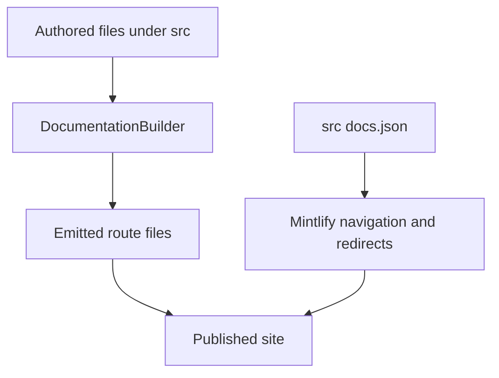

`src/` is the authored documentation tree. Two separate contracts turn it into the published site:

- `pipeline/core/builder.py` owns discovery, preprocessing, and emission into `build/`.
- `src/docs.json` owns Mintlify presentation: products, menu placement, tabs, groups, generated OpenAPI sections, and redirects.

A route being emitted does not make it discoverable in the intended menu, and a menu label does not select a source directory. For example, `src/langsmith/fleet/` supplies `/langsmith/fleet/...`, but its menu item is **No-code agents**. Change the source and navigation contracts together.

This diagram distinguishes route ownership by the builder from navigation and redirect ownership by Mintlify configuration.

## Source-to-route map

| Authored domain | Emitted route family | Primary Mintlify placement |
| --- | --- | --- |
| `src/index.mdx`, other root MDX | Matching root route, such as `/` and `/build-overview` | Lifecycle → Home or Build → Overview |
| Shared `src/oss/` content, including `langchain/`, `langgraph/`, and `deepagents/` except `code/` | `/oss/python/...` and `/oss/javascript/...` | Lifecycle → Build language dropdowns |
| `src/oss/python/` or `src/oss/javascript/` | Matching language route with that leading source segment removed | Matching Build dropdown |
| `src/oss/openwiki/` | `/oss/openwiki/...` once | Build → OpenWiki |
| `src/oss/deepagents/code/` | `/oss/deepagents/code/...` once | Products and setup → Deep Agents Code |
| Direct `src/langsmith/*.mdx`, except `managed-deep-agents*` | `/langsmith/...` | Test, Deploy, Monitor, or Products and setup |
| Direct `src/langsmith/managed-deep-agents*.mdx` | `/langsmith/python/...` and `/langsmith/javascript/...` | Build → Managed Deep Agents |
| `src/langsmith/fleet/` | `/langsmith/fleet/...` | Products and setup → No-code agents |
| `src/snippets/` | Importable MDX/components, not public pages | Used by authored MDX |
| `src/docs.json`, assets, styles, and scripts | Copied shared inputs | Configuration or static site resources |

## Builder responsibilities and safety boundaries

`DocumentationBuilder.build_all()` clears the output, emits Python and JavaScript OSS trees, emits the two deliberately unversioned OSS products, emits unversioned LangSmith content, then adds Managed Deep Agents variants and shared files. Shared OSS pages resolve language fences independently for each target; use those fences rather than duplicate sources when only parts of a page differ.

OpenWiki and Deep Agents Code are the exceptions: each is emitted exactly once and processed using the Python fence branch. Links to those products remain unprefixed, while links from their pages to ordinary OSS material resolve to the Python tree.

For a language-targeted page, the builder preprocesses MDX before rewriting snippet imports and links. It scopes unqualified `/snippets/` MDX imports to `/snippets/python/` or `/snippets/javascript/`; inserts the target language into eligible absolute `/oss/` links; and converts unversioned Managed Deep Agents links to the current language route. Existing language prefixes, image URLs, and the two unversioned product roots are protected from rewriting.

Source collection is a security boundary. The builder skips symlinks—even symlinks to regular files—and ignores files resolving outside the collection root. Thus a committed source-tree path cannot bring a host file into an artifact. Focused builder tests cover language prefixes, one-time output, variant routes, scoped snippets, and containment.

## Lifecycle navigation

**AGENT DEVELOPMENT LIFECYCLE** has five menu items: **Home**, **Build**, **Test**, **Deploy**, and **Monitor**. Build has Python and TypeScript dropdowns, each with ten tabs. Test, Deploy, and Monitor instead place flat `src/langsmith/` source families through `docs.json`; their hierarchy does not follow directories.

| Menu item | Tabs relevant to source placement |
| --- | --- |
| Test | Get started; Datasets & Experiments; Evaluators; Annotation Queues; Test from Playground; Test from Studio |
| Deploy | Get started; Agent Server; Deploy to Cloud; Deploy to Self-hosted; Prompt & Context Hub; Sandboxes |
| Monitor | Overview; Trace; Debug; Observe; Reference |

The Monitor **Overview** route is `langsmith/observability`, distinct from the Trace, Debug, Observe, and Reference tabs. Its landing page links tracing setup, trace investigation, dashboards and alerts, automations, feedback, and Engine. The Deploy **Sandboxes** tab is likewise a navigation placement over direct LangSmith routes for snapshots, service URLs, download links, auth proxy, mounts, permissions, CLI, SDK, and Harbor integrations.

### Managed Deep Agents and delegation

A direct `src/langsmith/managed-deep-agents*.mdx` source is excluded from ordinary LangSmith output and emitted twice under `/langsmith/python/` and `/langsmith/javascript/`. Unversioned legacy URLs redirect to Python routes; they are not duplicate emitted pages. Both Build dropdowns place it in **Get started**, **Agent capabilities**, and **Build and deploy**. The project-structure source is language-fenced: Python requires a root `agent.py` export named `agent` created with `define_deep_agent`, while TypeScript requires `agent.ts` or `agent.tsx` and `defineDeepAgent`. Deployment includes named managed paths but excludes `.env` and generated `.mda/evals/` content.

`src/oss/deepagents/subagents.mdx` emits to both language trees and is placed under the Deep Agents **Delegation** group. Synchronous delegation blocks the coordinator for the final result; without synchronous subagents the task tool is absent, and asynchronous subagents use a separate mechanism. A deep agent supplies or receives a default `general-purpose` synchronous subagent, and subagent runs record their agent name in `lc_agent_name` for LangSmith filtering.

### Prompt & Context Hub and coding-agent tracing

`langsmith/playground-model-providers` is a direct LangSmith route in Deploy → **Prompt & Context Hub** → **Prompts**, alongside prompt engineering and model-configuration documentation. The page is the provider capability and configuration reference for the Playground, including provider-specific authentication; for example, it documents the Bedrock IAM trusted-entity approach and the self-hosted Azure workload-identity path.

The three coding-agent pages are direct LangSmith routes in Monitor → Trace → Tracing setup → Integrations → **Developer tools**, beside the coding-agent metadata contract. They are integrations rather than builder-special cases:

- Claude Code tracing is enabled per project or shell environment and uses a plugin; its conversation trace includes messages, tool calls, compaction, subagents, and assistant replies, while turns in a session share a `thread_id`.
- Codex and Cursor use an enabled flag plus an API key, accept scoped config files and environment variables, and resolve environment settings after config sources. Both can replicate traces to additional destinations.
- All three apply the shared secret-redaction preset before upload by default. It redacts known credential shapes in inputs, outputs, errors, and metadata, but is a safety net rather than access control. Cursor attachment bytes bypass redaction, so `LANGSMITH_CURSOR_ATTACHMENTS=false` is required when those bytes must not be sent.

The generic SDK page, `langsmith/redact-secrets`, belongs in Monitor → Trace → Configuration & troubleshooting → **Data & privacy**. It exposes the same preset through `create_secret_anonymizer` / `createSecretAnonymizer`; the preset replaces matches with `[SECRET_DETECTED]`, has a 24-level traversal limit by default, and supports extra rules. It does not redact run names, tags, or attachments, and `LANGSMITH_HIDE_INPUTS` or `LANGSMITH_HIDE_OUTPUTS` suppresses the anonymizer instead of combining with it.

## Products and setup navigation

**PRODUCTS AND SETUP** contains **LangSmith setup**, **LLM Gateway**, **No-code agents**, **Engine**, and **Deep Agents Code**. Only LangSmith setup is tabbed: Overview, Account, Cloud, BYOC, Self-hosted, and Govern.

- **LLM Gateway** is flat `src/langsmith/llm-gateway*.mdx`. Navigation separates Core capabilities, Administration and governance, and Advanced, placing credits in the first group and model-access policies in the second.
- **No-code agents** is the menu label for the `fleet/` source directory and route prefix.
- **Engine** is flat `src/langsmith/engine*.mdx`; its direct pages cover overview, issue workflow, GitHub integration, categories, webhooks, security, and self-hosted operation. Engine detects recurring trace issues, diagnoses against traces and source, proposes a pull request, tracks matching traces and evaluation examples, and reopens resurfacing issues.
- **Deep Agents Code** is the unversioned `src/oss/deepagents/code/` surface. Its expanded **Configuration** group is rooted at `oss/deepagents/code/configuration` and contains credentials, config file, hooks, and MCP tools. It captures `DEEPAGENTS_HOME` before dotenv loading and reports effective settings and origins without printing secrets.

### BYOC

The **BYOC** setup tab contains `langsmith/byoc` followed by the reason, architecture, shared-responsibility, onboarding, networking, migration, usage, operations, billing, and FAQ routes. BYOC is Enterprise-only and generally available on AWS. It separates LangChain’s cloud control plane from customer-AWS data-plane resources: sensitive application data stays in the selected data-plane region, while control-plane metadata is in `us-east-2`.

Onboarding creates a cross-account IAM role using the supplied external ID, then moves a data plane from `Requested` through `Provisioning` to `Active`. A workspace belongs to exactly one selected data plane and cannot be moved afterward. For BYOVPC, customer-managed base networking changes the role and provisioning inputs but not the control/data-plane division.

### Self-hosted and the changelog

The **Self-hosted** setup tab configures direct `/langsmith/self-host...` routes. Its SmithDB group is hidden, while `self-host-smithdb-metrics` is visible under **Reference**. That same Reference group places `langsmith/self-hosted-changelog` before release-version and endpoint-deprecation references.

The changelog is an RSS-enabled release ledger, not a generated OpenAPI surface. Each entry maps a Helm chart release to its packaged LangSmith application version and download artifact; stable and preview entries can coexist. Review it before upgrades because it carries release-specific changes and upgrade notes.

## Generated LangSmith REST API reference

Monitor → Reference has a **LangSmith REST API** group. `docs.json` binds its OpenAPI source, `langsmith/langsmith-platform-openapi.json`, to the generated `langsmith/smith-api` directory, with `langsmith/smith-api-ref` as the reference landing page. Mintlify creates endpoint pages at deploy time rather than the local builder emitting authored MDX for each endpoint.

The checked-in specification describes the LangSmith API host and its authentication requirements. It is maintained by a daily GitHub Actions workflow that fetches the live API specification, post-processes it, and opens or appends to one refresh PR. Post-processing hides Fleet/internal operations and adds readable tag groups, so do not hand-edit the generated JSON; update `scripts/process_langsmith_openapi.py` when the public-reference selection or grouping policy must change.

## Safe change procedure

1. Start with the authored domain and resulting route; never infer either from a visible menu label.
2. Add or change the MDX source, then place its emitted route in the exact product, menu item, dropdown or tab, and group in `src/docs.json`.
3. When a public route changes, add or retain a `docs.json` redirect instead of retaining an authored duplicate.
4. For shared OSS and Managed Deep Agents, check both outputs, including fence resolution, rewritten links, and snippet imports. For OpenWiki and Deep Agents Code, verify only the unversioned output.
5. For an OpenAPI change, change the post-processor or let the scheduled refresh update the spec; validate the result with `make check-openapi`.
6. Run `make build` and `make broken-links`; extend builder tests for emission, rewriting, or containment changes.

## Related pages

- [Build system architecture](/openwiki/architecture/build-system.md)
- [Versioning](/openwiki/concepts/versioning.md)
- [Mintlify integration](/openwiki/integrations/mintlify.md)
- [Reference docs](/openwiki/integrations/reference-docs.md)
- [Adding pages](/openwiki/operations/adding-pages.md)
- [Quickstart](/openwiki/quickstart.md)
