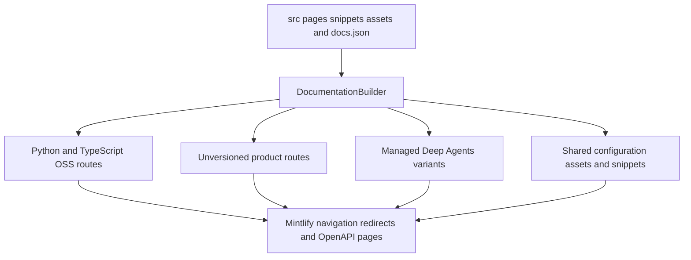

## Authority and route model

`src/` is the manually authored documentation tree. `src/docs.json` is the site-configuration and navigation authority: its product, menu, dropdown, tab, group, page, OpenAPI, and redirect declarations determine public placement and visibility. Update the appropriate `docs.json` entry with every page addition, move, or removal.

A source directory identifies the content domain but does not reliably identify the customer-facing navigation label. For example, `src/langsmith/fleet/` supplies **No-code agents**, while the URL retains `fleet`.



This shows the ownership flow from source inputs through preprocessing to Mintlify-visible routes.

## Select the owning source domain

| Change | Authoritative source | Public route model and navigation owner |
| --- | --- | --- |
| Site home | `src/index.mdx` | `/`; Lifecycle → Home |
| Shared OSS framework, conceptual, reference, or contribution content | `src/oss/langchain/`, `src/oss/langgraph/`, `src/oss/deepagents/` except `code/`, and shared OSS areas | Both `/oss/python/...` and `/oss/javascript/...`; Build navigation entries in `docs.json` |
| Language-specific OSS content | `src/oss/python/` or `src/oss/javascript/` | The matching language route tree only |
| OpenWiki | `src/oss/openwiki/` | One `/oss/openwiki/...` route family; Build → OpenWiki |
| Deep Agents Code | `src/oss/deepagents/code/` | One `/oss/deepagents/code/...` route family; Products and setup → Deep Agents Code |
| Ordinary LangSmith documentation | `src/langsmith/`, including `fleet/` | `/langsmith/...`; topic-specific Test, Deploy, Monitor, setup, Gateway, Engine, or No-code agents navigation |
| Managed Deep Agents documentation | A direct `src/langsmith/managed-deep-agents*.mdx` file | Both `/langsmith/python/...` and `/langsmith/javascript/...`; Build → Managed Deep Agents |
| Reusable MDX or local snippet component | `src/snippets/` | Imported content; language-scoped processed copies for versioned consumers |
| Executable documentation example | `src/code-samples/` | Testable supporting source, not a route family |

Most authored OSS content is emitted as separate Python and TypeScript route trees: `/src/oss/python/` and `/src/oss/javascript/` are included only in their matching output, while shared OSS directories such as `/src/oss/langchain/`, `/src/oss/langgraph/`, and `/src/oss/deepagents/` are built for both languages with conditional fences resolved per target. Author shared material once and use `:::python` and `:::js` fences for language-specific content.

OpenWiki and Deep Agents Code are the two OSS exceptions to language duplication: `/src/oss/openwiki/` builds once at `/oss/openwiki/...` and `/src/oss/deepagents/code/` builds once at `/oss/deepagents/code/...`, both using the Python conditional-content branch. The OSS link rewriter leaves these product roots untouched, but prefixes another unqualified `/oss/...` link for the current language. Explicit language-qualified links remain unchanged, which matters when an unversioned LangSmith page intentionally targets one SDK.

### Managed Deep Agents variants

A Managed Deep Agents page is determined by both location and name: it must be a `.md` or `.mdx` file directly in `src/langsmith/` whose name begins `managed-deep-agents`. The ordinary LangSmith pass excludes it; the dedicated pass emits Python and JavaScript variants. It preprocesses conditional content, scopes snippet imports, rewrites ordinary OSS links, and changes an unversioned Managed Deep Agents link in each variant to that variant's route.

Files named `managed-deep-agents*.mdx` in `/src/langsmith/` generate language-prefixed routes (`/langsmith/python/managed-deep-agents-...` and `/langsmith/javascript/managed-deep-agents-...`) appearing in the Build tab Managed Deep Agents, with unversioned URLs redirecting to the Python routes. Do not add a duplicate unversioned page for a redirect.

## Navigation map

The current configuration has two products. Directory structure constrains URL routes, but directory names do not perfectly mirror navigation labels; for example, `/src/langsmith/fleet/` maps to 'No-code agents' in the navigation UI.

### AGENT DEVELOPMENT LIFECYCLE

The AGENT DEVELOPMENT LIFECYCLE product has five menu items: Home, Build, Test, Deploy, Monitor. Build contains two language dropdowns (Python, TypeScript), each with 10 tabs. Test, Deploy, and Monitor contain flat tabs with no language split.

| Menu item | Source and shape |
| --- | --- |
| Home | `src/index.mdx` |
| Build | Python and TypeScript dropdowns: Overview, Deep Agents, Managed Deep Agents, LangChain, LangGraph, OpenWiki, Integrations, Learn, Reference, and Contribute |
| Test | Six flat LangSmith topic tabs |
| Deploy | Six flat LangSmith topic tabs, including the Agent Server and Control Plane reference group |
| Monitor | Five flat LangSmith topic tabs, including LangSmith REST API |

Test, Deploy, and Monitor menu items draw from files flat in `/src/langsmith/` organized by functional topic without directory structure constraints. The Build dropdown is what assigns an entry to Python or TypeScript; its integration entries use the matching `oss/{python,javascript}/integrations/` domain, while the one OpenWiki route family is listed in both dropdowns.

Managed Deep Agents is marked `BETA` and has matching Python and TypeScript navigation: Get started, Agent definition, and Build and deploy groups. The connections page is authored once at `src/langsmith/managed-deep-agents-connections.mdx`, imported snippets included, and appears in each language's Agent definition group.

### PRODUCTS AND SETUP

The PRODUCTS AND SETUP product contains five menu items: LangSmith setup (with 6 tabs), LLM Gateway, No-code agents (Fleet), Engine, and Deep Agents Code, all drawing from flat `/src/langsmith/` or `/src/oss/` structures.

| Menu item | Owning source and route family |
| --- | --- |
| LangSmith setup | Flat `src/langsmith/` pages at `/langsmith/...` |
| LLM Gateway | `src/langsmith/llm-gateway*.mdx` at `/langsmith/llm-gateway...` |
| No-code agents | `src/langsmith/fleet/` at `/langsmith/fleet/...` |
| Engine | `src/langsmith/engine*.mdx` at `/langsmith/engine...` |
| Deep Agents Code | `src/oss/deepagents/code/` at `/oss/deepagents/code/...` |

## Shared inputs and generated-input ownership

Reusable MDX snippets are stored in `/src/snippets/` and imported into multiple pages, requiring careful path segments in links to ensure correct resolution when imported into pages at varying depths. For a versioned page, use an import from `/snippets/...`: the builder rewrites its MDX import to `/snippets/python/...` or `/snippets/javascript/...` and creates the corresponding processed snippet copies. Snippets themselves do not receive source-edit footers.

Shared asset directories include `/src/images/`, `/src/images/brand/`, `/src/images/providers/` (with dark/light variants), `/src/style.css`, `/src/docs.json`, and `/src/fonts/`. The builder also carries root JavaScript and `.well-known` content as shared inputs. It skips symlinks and source files resolving outside the traversed source root, preventing host-file inclusion in emitted artifacts.

### Managed Deep Agents OAuth catalog

The OAuth provider table is a generated snippet at `src/snippets/langsmith/mda-oauth-catalog.mdx`; `src/langsmith/managed-deep-agents-connections.mdx` imports it. The table is not a manually maintained provider catalog: `scripts/refresh_mda_oauth_catalog.py` obtains JSON from `mda connections catalog --json`, sorts entries by service, renders the `--oauth` service, app-registration link, and default scopes, then writes the table only when invoked with `--write`.

The catalog is compiled into the locally installed `mda` binary, so it reflects that CLI version and needs neither a LangSmith API key nor workspace ID. Upgrade the CLI before refreshing, inspect the no-write output if needed, and commit the regenerated snippet—not hand edits:

```bash
uv tool upgrade --pre managed-deepagents
uv run python scripts/refresh_mda_oauth_catalog.py --write
```

The generator rejects a missing binary, timeout, failed command, malformed JSON, empty catalog, and an output path outside the repository. It accepts only absolute HTTPS registration URLs for linked provider names; a missing or invalid registration URL renders the display name without a link.

### Integration listing tables

Integration download tables are generated snippets under `src/snippets/oss/`: the refresh script reads frontmatter from hosted guides under `src/oss/{python,javascript}/integrations/` and merges third-party rows from `scripts/data/integration_external_docs.yaml`, whose name links point to `docs_url` rather than hosted pages.

Use the external YAML for integrations without a hosted guide. Its `docs_url` must be `https://`, `http://`, or a single-slash site-relative path; protocol-relative and executable schemes are rejected. `--check-docs-urls` performs that validation without network requests or writes. In normal generation, package download lookup retries rate limits, warns and leaves downloads unavailable on fetch failure, sorts rows by available downloads then name, and writes only components whose source directory and rows exist.

Generated integration table snippets must not be edited by hand; `scripts/refresh_integration_downloads.py` renders them with sortable wrappers, while the site-wide `integration-downloads-table.js` enhances them and refreshes download sort values from badge SVGs after render. Change hosted-guide frontmatter, external metadata, the generator, or the enhancement script—then run:

```bash
uv run python scripts/refresh_integration_downloads.py --write
```

`packages.yml` is metadata for package indexes, partner package tables, and download data, rather than an API-reference build input.

## OpenAPI reference ownership

Three OpenAPI-generated reference sections exist: Agent Server API (from `/src/langsmith/agent-server-openapi.json` at `/langsmith/agent-server-api/`), Control Plane API (from remote URL at `/api-reference/`), and LangSmith REST API (from `/src/langsmith/langsmith-platform-openapi.json` at `/langsmith/smith-api/`). Their containing navigation groups and `openapi` declarations are in `docs.json`; endpoint pages are generated by Mintlify at deployment time rather than authored as MDX.

The daily LangSmith OpenAPI refresh workflow runs `scripts/process_langsmith_openapi.py`, which fetches from the allow-listed `api.smith.langchain.com` host, writes `src/langsmith/langsmith-platform-openapi.json`, hides excluded operations, and maintains one standing refresh PR. The processor hides fleet, internal, health, and configured-prefix endpoints and applies human-readable group metadata to retained tags. Do not manually edit that refreshed specification.

## Safe changes and focused verification

1. Choose the source domain and route model first; add or change authored MDX, snippets, specs, metadata, examples, or assets only at that owner.
2. Update the exact `src/docs.json` navigation entry in the same change; preserve or add redirects for public moves.
3. Regenerate a catalog or table after its upstream source changes. Do not patch its emitted snippet output.
4. Use `make build` to exercise preprocessing, `make broken-links` for page or link changes, and `make check-openapi` for specification changes.
5. Extend the focused builder tests for any route, language, snippet, or containment boundary change.

Builder tests assert the key route boundaries: language-prefix rewriting, one-time unversioned OSS output, dual Managed Deep Agents routes, language-scoped snippet imports, and source-symlink exclusion.

See [Preprocessing](/openwiki/concepts/preprocessing.md), [Versioning](/openwiki/concepts/versioning.md), [Reference docs](/openwiki/integrations/reference-docs.md), [Adding pages](/openwiki/operations/adding-pages.md), and [Integration listing automation](/openwiki/workflows/integration-listing-automation.md).
