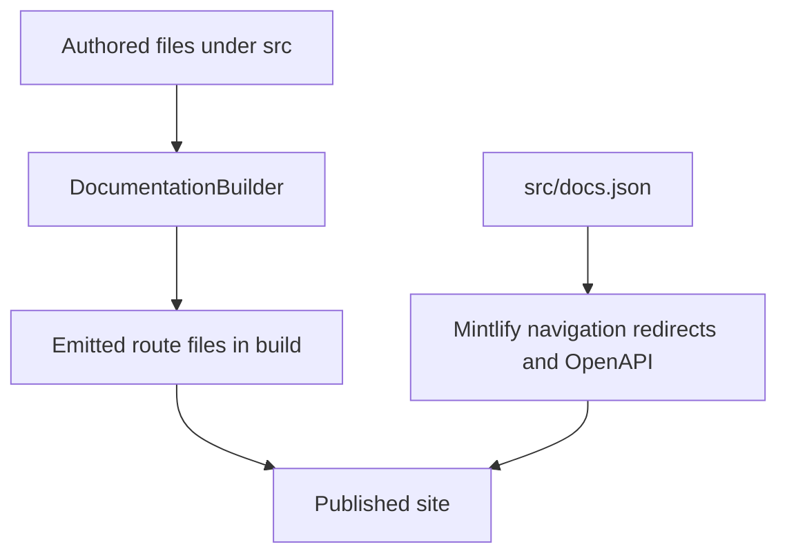

`src/` is the authored documentation tree. Two independent contracts turn it into the published site:

- `pipeline/core/builder.py` discovers and preprocesses supported source files, then emits the local `build/` route tree.
- `src/docs.json` tells Mintlify how emitted routes appear in products, menu items, dropdowns, tabs, and groups; it also owns redirects and OpenAPI-generated reference sections.

A route can be emitted without being placed in the intended navigation, and a navigation label need not name its source directory. For example, `src/langsmith/fleet/` emits below `/langsmith/fleet/`, while its menu item is **No-code agents**. Treat source location, emitted URL, and Mintlify placement as separate changes.

This shows the division between builder-owned route emission and Mintlify-owned presentation, redirects, and generated API routes.

## Source-to-route map

| Authored domain or input | Emitted route family | Navigation or runtime role |
| --- | --- | --- |
| Root pages such as `src/index.mdx` and `src/build-overview.mdx` | Matching root routes such as `/` and `/build-overview` | Lifecycle **Home** and shared **Build → Overview** |
| Shared `src/oss/` content, including `langchain/`, `langgraph/`, `deepagents/`, `concepts/`, `contributing/`, and `reference/` | `/oss/python/...` and `/oss/javascript/...` | Build's matching language dropdown |
| `src/oss/python/` and `src/oss/javascript/` | Only the matching language route, with that source segment removed | Build's matching language dropdown |
| `src/oss/openwiki/` | `/oss/openwiki/...` once | Build → OpenWiki in both dropdowns |
| `src/oss/deepagents/code/` | `/oss/deepagents/code/...` once | Products and setup → Deep Agents Code |
| Direct `src/langsmith/*.mdx`, excluding `managed-deep-agents*.mdx` | `/langsmith/...` | Test, Deploy, Monitor, or Products and setup according to `docs.json` |
| Direct `src/langsmith/managed-deep-agents*.mdx` | `/langsmith/python/...` and `/langsmith/javascript/...` | Build → Managed Deep Agents in each dropdown |
| `src/langsmith/fleet/` | `/langsmith/fleet/...` | Products and setup → No-code agents |
| `src/snippets/` | Imported MDX or components, not public routes | Reusable content; language copies are made when needed |
| `src/langsmith/*-openapi.json` and remote OpenAPI URLs configured in `docs.json` | Mintlify endpoint routes at deployment time | Generated API references, not authored MDX endpoint pages |
| `src/docs.json`, images, fonts, styles, and scripts | Shared build inputs | Configuration and static resources |

## Builder-owned route rules

`DocumentationBuilder.build_all()` clears `build/`, emits the Python and JavaScript OSS trees, emits the two deliberately unversioned OSS products, emits ordinary LangSmith content, adds Managed Deep Agents variants, and then copies shared inputs. Files in shared OSS directories build twice and language fences resolve separately for each target. Files under `oss/python/` and `oss/javascript/` participate only in their respective output; the leading source-language directory does not appear after the URL language prefix.

OpenWiki and Deep Agents Code are explicit exceptions. They emit once at unversioned paths and use the Python conditional-content branch. Consequently, links to those products stay unprefixed, while a bare link from one of their pages to ordinary OSS content resolves to the Python route.

For a language-targeted MDX file, the builder preprocesses content before it rewrites imports and links. It scopes unqualified MDX snippet imports to `/snippets/python/` or `/snippets/javascript/`, adds the target language to eligible absolute `/oss/` links, and maps bare Managed Deep Agents links to the matching language route. Already language-qualified links, image paths, and the two unversioned product roots are deliberately not rewritten.

Source discovery is also a containment boundary: collection skips symlinks and files whose resolved location escapes the collection root. Focused builder tests cover dual versus one-time route emission, link and snippet rewriting, Managed Deep Agents variants, and this source-containment behavior.

## Navigation-owned placement and generated surfaces

The **AGENT DEVELOPMENT LIFECYCLE** product has five menu items: **Home**, **Build**, **Test**, **Deploy**, and **Monitor**. Build has Python and TypeScript dropdowns, each with ten tabs. Test, Deploy, and Monitor consume direct, flat `src/langsmith/` page families: their grouping is defined by `docs.json`, not by a directory hierarchy.

The current direct LangSmith placement includes:

- **Test**: Get started; Datasets & Experiments; Evaluators; Annotation Queues; Test from Playground; Test from Studio.
- **Deploy**: Get started; Agent Server; Deploy to Cloud; Deploy to Self-hosted; Prompt & Context Hub; Sandboxes. Sandboxes is a flat direct-route tab for the landing page, snapshots, service URLs, download links, auth proxy, mounts, permissions, CLI, SDK, and Harbor integrations.
- **Monitor**: Overview; Trace; Debug; Observe; Reference. `langsmith/observability` is the separate Overview landing route; the Trace tab's developer-tools group contains `langsmith/trace-claude-code` alongside the other coding-agent tracing guides.

The Deploy Get started → Reference group mixes authored landing pages with two OpenAPI sections: Agent Server uses committed `langsmith/agent-server-openapi.json` and is generated under `/langsmith/agent-server-api/`; Control Plane fetches `https://api.host.langchain.com/openapi.json` at deployment time. Monitor → Reference similarly generates the LangSmith REST API below `/langsmith/smith-api/` from committed `langsmith/langsmith-platform-openapi.json`. Mintlify generates endpoint pages during deployment, so they are not authored MDX and do not exist in local `build/` output.

### Managed Deep Agents

A direct `src/langsmith/managed-deep-agents*.mdx` file is omitted from ordinary LangSmith emission and produced twice, at `/langsmith/python/` and `/langsmith/javascript/`. `docs.json` maps unversioned and legacy Managed Deep Agents URLs to the Python route; they are redirects, not duplicate pages. Both Build dropdowns organize this surface into **Get started** (Beta), **Agent capabilities** (with a nested Channels group), and **Build and deploy**.

This source family is authored once but uses language fences. For example, the project-structure page requires a root `agent.py` named `agent` built with `define_deep_agent` in Python, or `agent.ts`/`agent.tsx` named `agent` built with `defineDeepAgent` in TypeScript. It also distinguishes ordinary imported modules from managed paths and excludes `.env` and generated `.mda/evals/` content from the deployment archive.

Shared Deep Agents pages similarly appear in both language trees. `src/oss/deepagents/subagents.mdx` is under the **Delegation** group in both dropdowns: synchronous delegation blocks the supervisor until a result, and removing both the default and caller-provided synchronous subagent removes `SubAgentMiddleware` and the `task` tool. Async subagents use a separate mechanism.

### Products and setup

**PRODUCTS AND SETUP** currently contains **LangSmith setup**, **LLM Gateway**, **No-code agents**, **Engine**, and **Deep Agents Code**. LangSmith setup alone has tabs: Overview, Account, Cloud, BYOC, Self-hosted, and Govern.

- **LLM Gateway** is the flat `src/langsmith/llm-gateway*.mdx` family. It is tagged Beta and divides pages into **Core capabilities**, **Administration and governance**, and **Advanced**. Credits are in the first group; administrator setup, access, monitoring, and policies are in the second; direct model access is in the third. Admin setup requires organization setup and appropriate workspace roles before users invoke the gateway; credits use a LangSmith API key without a provider secret for hosted model IDs.
- **No-code agents** is the presentation name for the `fleet/` source directory and route prefix.
- **Engine** is flat `src/langsmith/engine*.mdx`, with direct pages for overview, workflow, GitHub integration, categories, webhooks, security, and self-hosted operation. Its documented workflow is a closed loop from recurring trace issue detection through diagnosis and proposed change to tracking and resurfacing/reopening.
- **Deep Agents Code** is the unversioned `src/oss/deepagents/code/` surface. Its expanded Configuration group is rooted at `oss/deepagents/code/configuration` and includes credentials, config file, hooks, and MCP tools. Configuration captures `DEEPAGENTS_HOME` before dotenv loading and its inspection commands report origins without disclosing secrets.

BYOC and self-hosted material are also flat LangSmith source families placed by the setup tabs. BYOC documentation separates LangChain cloud control-plane responsibilities from sensitive customer-AWS data-plane resources; onboarding uses a cross-account role and a data-plane lifecycle of Requested, Provisioning, then Active. The Self-hosted tab contains direct `/langsmith/self-host...` routes; its SmithDB group is configured as hidden, while its metrics route remains visible in Reference.

## Redirect and verification procedure

When changing documentation structure:

1. Identify the authored domain and expected emitted route first. Do not infer either from a visible menu label.
2. Add or move the source, then place the resulting route under the exact product, menu item, dropdown or tab, and group in `src/docs.json`.
3. Preserve public URLs with `docs.json` redirects instead of retaining an authored duplicate. In particular, keep Managed Deep Agents legacy URLs pointed at their Python destinations.
4. For shared OSS and Managed Deep Agents, inspect both language outputs, including conditional fences, rewritten links, and snippet imports. For OpenWiki and Deep Agents Code, inspect only their unversioned route tree.
5. Distinguish authored landing pages from OpenAPI output. Update or validate the API specification rather than attempting to add generated endpoint MDX pages.
6. Run `make build` and `make broken-links`; the latter enables Mintlify redirect checks and filters deploy-time OpenAPI routes and standalone snippet false positives. Extend `tests/unit_tests/test_builder.py` when changing route emission, rewriting, or source containment.

## Related pages

- [Build system architecture](/openwiki/architecture/build-system.md)
- [Versioning](/openwiki/concepts/versioning.md)
- [Mintlify integration](/openwiki/integrations/mintlify.md)
- [Reference docs](/openwiki/integrations/reference-docs.md)
- [Adding pages](/openwiki/operations/adding-pages.md)
- [Quickstart](/openwiki/quickstart.md)
