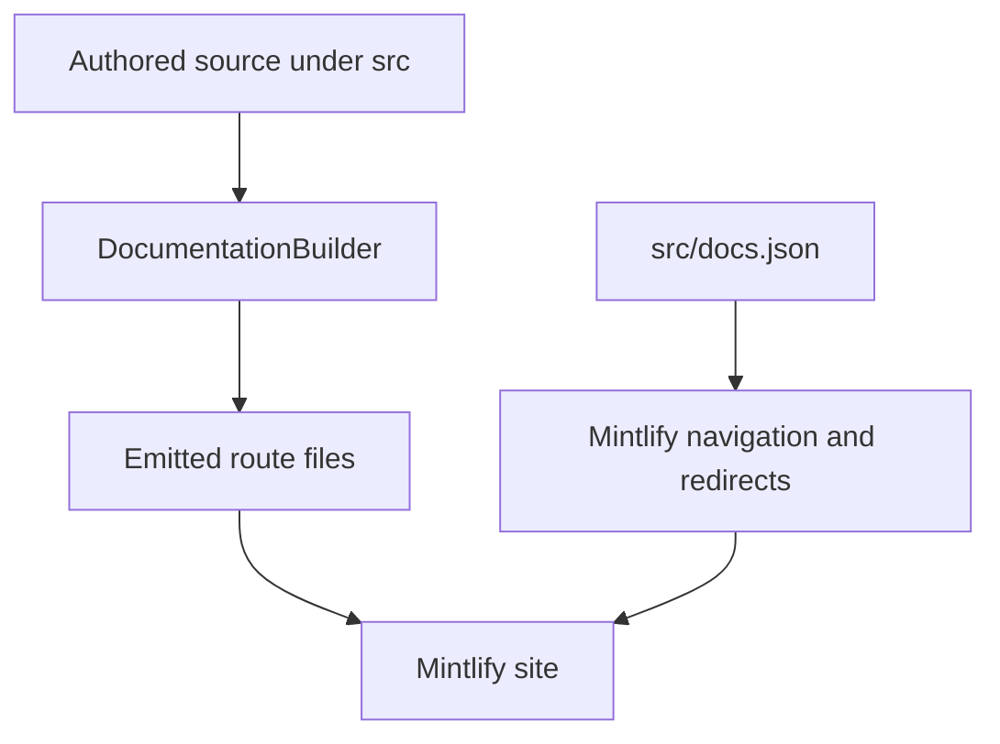

`src/` is the authored documentation tree. Route emission and visible navigation are separate contracts: `pipeline/core/builder.py` selects files, writes their output locations, and applies language-sensitive transformations; `src/docs.json` is the Mintlify configuration that places emitted routes in products, menu items, dropdowns, tabs, groups, and redirects. Directory names therefore do not determine the label a reader sees. For example, `src/langsmith/fleet/` is presented as **No-code agents**.

The diagram shows the ownership boundary: the builder emits routes, while `docs.json` chooses their navigation and retains legacy URLs. Edit authored files and `src/docs.json`, never `build/`, which is generated output.

## Source-to-route map

| Authored domain | Emitted route family | Configuration location |
| --- | --- | --- |
| `src/index.mdx` | `/` | Lifecycle → Home |
| `src/oss/langchain/`, `src/oss/langgraph/`, and `src/oss/deepagents/` except `code/` | `/oss/python/...` and `/oss/javascript/...` | Lifecycle → Build language dropdowns |
| `src/oss/python/` | `/oss/python/...`, with `python/` removed from the remainder | Python Build dropdown |
| `src/oss/javascript/` | `/oss/javascript/...`, with `javascript/` removed from the remainder | TypeScript Build dropdown |
| `src/oss/openwiki/` | `/oss/openwiki/...` once | Build → OpenWiki |
| `src/oss/deepagents/code/` | `/oss/deepagents/code/...` once | Products and setup → Deep Agents Code |
| Direct `src/langsmith/*.mdx` other than Managed Deep Agents | `/langsmith/...` | Lifecycle or Products and setup according to `docs.json` |
| Direct `src/langsmith/managed-deep-agents*.mdx` | `/langsmith/python/...` and `/langsmith/javascript/...` | Build → Managed Deep Agents |
| Direct `src/langsmith/self-host*.mdx` | `/langsmith/self-host...` | Products and setup → LangSmith setup → Self-hosted |
| `src/langsmith/fleet/` | `/langsmith/fleet/...` | Products and setup → No-code agents |
| `src/oss/python/integrations/` and `src/oss/javascript/integrations/` | Matching `/oss/python/integrations/...` and `/oss/javascript/integrations/...` families | Build → Integrations in the matching language dropdown |
| `src/snippets/` | Imported components, not public page routes | Referenced by MDX |
| `src/docs.json`, images, fonts, root CSS and JavaScript | Shared build inputs copied once | `docs.json` owns Mintlify configuration |

Most authored OSS content is emitted as separate Python and TypeScript route trees: `/src/oss/python/` and `/src/oss/javascript/` are included only in their matching output, while shared OSS directories such as `/src/oss/langchain/`, `/src/oss/langgraph/`, and `/src/oss/deepagents/` are built for both languages with conditional fences resolved per target. Use `:::python` and `:::js` in shared material rather than duplicating a page solely for language-fenced content.

OpenWiki and Deep Agents Code are the two OSS exceptions to language duplication: `/src/oss/openwiki/` builds once at `/oss/openwiki/...` and `/src/oss/deepagents/code/` builds once at `/oss/deepagents/code/...`, both using the Python conditional-content branch. The OSS-link rewriter leaves those product roots unversioned but adds the current language segment to an otherwise unqualified `/oss/...` link.

## Navigation hierarchy

`src/docs.json` defines two products.

- **AGENT DEVELOPMENT LIFECYCLE** has **Home**, **Build**, **Test**, **Deploy**, and **Monitor**. Build has Python and TypeScript dropdowns with ten tabs each. Test, Deploy, and Monitor have flat tabs, rather than language dropdowns, containing direct LangSmith-topic routes.
- **PRODUCTS AND SETUP** has **LangSmith setup**, **LLM Gateway**, **No-code agents**, **Engine**, and **Deep Agents Code**. LangSmith setup is tabbed; the other menu items are page/group lists.

Test, Deploy, and Monitor source pages are flat files in `src/langsmith/`, organized by subject rather than by navigation-directory structure. This makes a `docs.json` update mandatory when changing a page's visible placement.

### Managed Deep Agents

A Managed Deep Agents page is a `.md` or `.mdx` file directly under `src/langsmith/` whose filename starts `managed-deep-agents`. Ordinary LangSmith collection excludes those pages; the dedicated collection writes a Python and a JavaScript variant. The Build → Managed Deep Agents tab has the **Get started** (Beta), **Agent capabilities**, and **Build and deploy** groups for both dropdowns. `docs.json` redirects unversioned Managed Deep Agents URLs to the Python variant; do not create an unversioned duplicate in the source or output.

The project-structure page is one such authored source. Its language fences are resolved into the two routes: each variant describes one required root `agent` export (`agent.py` with `define_deep_agent`, or `agent.ts`/`agent.tsx` with `defineDeepAgent`), while named top-level paths enable managed capabilities. It also distinguishes ordinary imported application modules from discovered declarations and excludes `.env` and generated `.mda/evals/` files from deployment archives. These are page semantics, not a reason to relocate the source from the flat Managed Deep Agents family.

### LangSmith setup and BYOC

LangSmith setup has **Overview**, **Account**, **Cloud**, **BYOC**, **Self-hosted**, and **Govern** tabs. The BYOC tab is a flat source surface: overview, rationale, architecture, shared responsibility, onboarding, BYOVPC, migration, usage, operations, billing, and FAQ are direct `src/langsmith/byoc*.mdx` routes.

BYOC architecture assigns authentication, organization configuration, billing, provisioning, monitoring, and orchestration to LangChain's cloud control plane; sensitive application data and the VPC, EKS, databases, and related resources belong to the customer AWS data plane. The customer creates a cross-account IAM role during onboarding; the role's external ID must match the value supplied by LangChain, and it is infrastructure-scoped rather than granted data-reading APIs. The data-plane lifecycle is `Requested` → `Provisioning` → `Active`; `Provisioning Failed` requires contacting LangChain, and a workspace cannot later move to another data plane.

The operations page belongs beside those setup sources, not in self-hosted content: LangChain operates the BYOC data plane after provisioning, including scaling, monitoring, patching, and rolling daily LangSmith upgrades. Potentially disruptive maintenance is coordinated in a scheduled window; troubleshooting data access is either customer-run or explicitly granted break-glass access.

### Self-hosted and SmithDB

Self-hosted pages remain direct `src/langsmith/` sources and are placed by the **Self-hosted** tab rather than by a dedicated source directory. The configuration explicitly nests provider quickstarts, Terraform guides, installation management, configuration, external services, platform access control, observability, hybrid, scripts, and reference pages. Its **SmithDB** group is marked `hidden`, although the routes remain configured; the metrics page is instead in the visible Reference group.

`self-host-smithdb.mdx` is the SmithDB landing source. It documents SmithDB as an opt-in trace datastore that serves ingestion and queries alongside ClickHouse, using durable object storage and a per-pod disk cache. This is an operational route family, not a new navigation product: related install, infrastructure, scale, observability, migration, troubleshooting, and metrics pages are all LangSmith self-hosted routes.

### Integration route families

The **Integrations** Build tab is a language-dropdown surface, not a shared directory inferred from its label. `docs.json` names separate `oss/python/integrations/...` and `oss/javascript/integrations/...` pages, including each language's `providers/all_providers` route. The corresponding authored provider indexes differ in scope—Python describes a collection of 1000+ integrations, while JavaScript/TypeScript describes hundreds—so edits belong in the matching source tree. Their unqualified `/oss/integrations/...` links are transformed by the builder when the language-specific pages are emitted.

### Other Products and setup surfaces

- **LLM Gateway** uses flat `src/langsmith/llm-gateway*.mdx` sources. Its Beta menu groups are **Core capabilities**, **Administration and governance**, and **Advanced**; credits are in the first and model-access policies in the second. The landing page requires an administrator to enable the gateway, add a provider secret, and grant workspace access before developers call supported API formats with a workspace-scoped LangSmith API key. Model IDs choose the upstream provider route or Gateway Credits, calls are traced, and policies are centrally applied. A model-access policy blocks a provider or model with `403`; the most-specific matching scope wins in API key, user, workspace, organization order, while same-tier matches intersect.
- **No-code agents** is the Fleet label. Keep its pages in `src/langsmith/fleet/`, which emits `/langsmith/fleet/...`; configuration groups are Get started, Configure, Tools and automation, Advanced, and Additional resources.
- **Engine** is flat `src/langsmith/engine*.mdx` content with direct navigation pages for overview, issue workflow, GitHub integration, issue categories, webhooks, security, and self-hosted operation.
- **Deep Agents Code** is unversioned. Its expanded **Configuration** group is rooted at `oss/deepagents/code/configuration` and includes credentials, config file, hooks, and MCP tools. The configuration landing page records separate precedence for general options, provider keys, dotenv files, and provider endpoints. `DEEPAGENTS_HOME` is captured before dotenv loading, preventing a project dotenv from relocating the trusted profile root; `dcode config` commands report effective settings and origins without printing secret values.

## Builder invariants

For each target language, the builder preprocesses MDX, rewrites versioned snippet imports, rewrites unqualified OSS links unless they are already language-qualified or belong to an unversioned OSS product, and rewrites unversioned Managed Deep Agents links to the target-language route. This preserves valid links and imported snippets within both output trees.

Source collection rejects symlinks and files that resolve outside its collection root, preventing a committed path from pulling host files into generated artifacts. Focused builder tests cover language-prefix rewriting, one-time unversioned OSS output, Managed Deep Agents dual routes, language-scoped snippet imports, and source-symlink exclusion.

## Safe change checklist

1. Choose the authored source owner from the map; a desired menu label does not choose a directory.
2. Add or update the authored MDX and its exact product, menu item, dropdown or tab, and group entry in `src/docs.json`.
3. Retain or add a `docs.json` redirect when a public route moves. Do not add source duplicates to serve legacy URLs.
4. For shared OSS and Managed Deep Agents, inspect both language outputs and rewritten links/imports. For OpenWiki and Deep Agents Code, confirm that only the unversioned output exists.
5. Run `make build` and `make broken-links`; extend builder tests when changing route emission, rewriting, or source-containment behavior. Do not edit `build/`.

## Related pages

- [Build system architecture](/openwiki/architecture/build-system.md)
- [Versioning](/openwiki/concepts/versioning.md)
- [Mintlify integration](/openwiki/integrations/mintlify.md)
- [Adding pages](/openwiki/operations/adding-pages.md)
- [Quickstart](/openwiki/quickstart.md)
