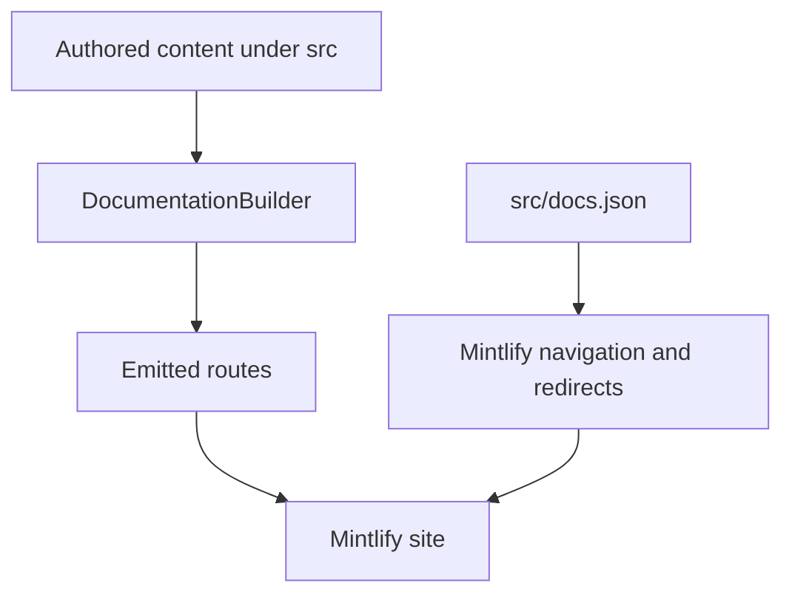

`src/` is the manually authored documentation tree. Two independent contracts turn it into the site:

- `pipeline/core/builder.py` selects source files, emits route files, and applies language-sensitive preprocessing.
- `src/docs.json` defines Mintlify products, menu placement, tabs, groups, and legacy-route redirects.

A directory can constrain a route without determining the visible label. For example, `src/langsmith/fleet/` emits the `langsmith/fleet` route family, but Mintlify presents it as **No-code agents**. Change the authored source and navigation contract together; a route emitted by the builder is not automatically discoverable in the intended navigation.

This shows the ownership boundary: the builder determines route emission, while `docs.json` determines presentation and redirect behavior.

## Source-to-route map

| Authored domain | Emitted route family | Mintlify placement |
| --- | --- | --- |
| `src/index.mdx` | `/` | Lifecycle → Home |
| `src/oss/langchain/`, `src/oss/langgraph/`, `src/oss/deepagents/` except `code/`, plus shared OSS domains | `/oss/python/...` and `/oss/javascript/...` | Lifecycle → Build language dropdowns |
| `src/oss/python/` | `/oss/python/...`, removing `python/` from the remainder | Python Build dropdown |
| `src/oss/javascript/` | `/oss/javascript/...`, removing `javascript/` from the remainder | TypeScript Build dropdown |
| `src/oss/openwiki/` | `/oss/openwiki/...` once | Build → OpenWiki |
| `src/oss/deepagents/code/` | `/oss/deepagents/code/...` once | Products and setup → Deep Agents Code |
| Direct `src/langsmith/*.mdx` other than Managed Deep Agents | `/langsmith/...` | Lifecycle or Products and setup, as specified in `docs.json` |
| Direct `src/langsmith/managed-deep-agents*.mdx` | `/langsmith/python/...` and `/langsmith/javascript/...` | Build → Managed Deep Agents |
| `src/langsmith/fleet/` | `/langsmith/fleet/...` | Products and setup → No-code agents |
| `src/snippets/` | Imported components rather than public routes | Referenced by MDX imports |
| `src/docs.json`, static assets, CSS, and JavaScript | Shared inputs copied once | `docs.json` is Mintlify configuration |

Most OSS material is built twice. The Python- and JavaScript-specific trees are included only in their matching output, while shared OSS domains are processed for both targets and resolve `:::python` / `:::js` fences per target. Use fences for language-specific portions of genuinely shared material instead of duplicating whole pages.

Two OSS products are intentionally unversioned: OpenWiki and Deep Agents Code. They each emit once and process conditional material with the Python target. Links to their own roots remain unprefixed, while a link from either product to ordinary OSS material is rewritten to the Python route.

### Builder processing and safety boundaries

For language-targeted content, preprocessing runs before the builder rewrites imports and links. Unscoped MDX imports from `/snippets/` point to the target's `/snippets/python/` or `/snippets/javascript/` copy. Absolute `/oss/` links gain the target language unless they already name a language, refer to an image, or point to OpenWiki or Deep Agents Code. Unversioned Managed Deep Agents links are similarly changed to the current target's route. These exceptions prevent double language prefixes and links to routes that do not exist.

Source discovery is containment-protected: the builder skips symlinks and any file whose resolved location falls outside the collection root. That prevents a committed source path from including host files in emitted artifacts. Focused builder tests cover route prefixes, unversioned product output, language-scoped snippets, Managed Deep Agents variants, and symlink exclusion.

## Mintlify navigation map

`src/docs.json` declares two products. It is a navigation and redirect contract, not an input that determines how the builder maps source paths.

- **AGENT DEVELOPMENT LIFECYCLE** has **Home**, **Build**, **Test**, **Deploy**, and **Monitor**. Build has Python and TypeScript dropdowns with ten tabs each. Test, Deploy, and Monitor are flat-tab LangSmith surfaces rather than language splits.
- **PRODUCTS AND SETUP** has **LangSmith setup**, **LLM Gateway**, **No-code agents**, **Engine**, and **Deep Agents Code**. LangSmith setup has Overview, Account, Cloud, BYOC, Self-hosted, and Govern tabs; the other menu items contain direct pages and groups.

Test, Deploy, and Monitor pages are direct files in `src/langsmith/`, arranged by subject rather than by menu hierarchy. Thus, moving a page in navigation normally requires only the relevant `docs.json` entry, not moving the authored file.

### Managed Deep Agents

A Managed Deep Agents source is a direct `src/langsmith/` `.md` or `.mdx` file whose name starts `managed-deep-agents`. The ordinary LangSmith collection omits it; the dedicated collection emits Python and JavaScript variants. Both Build dropdowns place those routes under **Managed Deep Agents**, with **Get started** (Beta), **Agent capabilities**, and **Build and deploy** groups. The unversioned legacy URLs redirect to Python routes in `docs.json`; they are not emitted as duplicate pages.

`managed-deep-agents-project-structure.mdx` demonstrates why this is a single language-fenced source: its output differs by target. Python requires a root `agent.py` named `agent` made with `define_deep_agent`; TypeScript requires `agent.ts` or `agent.tsx` named `agent` made with `defineDeepAgent`. Named project paths declare managed capabilities, whereas most `tools/` and `middleware/` files are normal imported application modules. `.env` and generated `.mda/evals/` files are excluded from the deployment archive.

### Deep Agents profiles

`src/oss/deepagents/profiles.mdx` is shared Deep Agents content, so it appears in both `oss/python/deepagents/profiles` and `oss/javascript/deepagents/profiles`, within the **Context management** group of each Deep Agents Build tab. It documents harness profiles that alter agent behavior per provider or model; these overlays are registered before agent creation, resolve provider defaults with model-specific settings, and merge rather than replace prior registrations. Provider profiles and entry-point plugin registration are Python-only; TypeScript supports harness profiles but registers them directly. This language distinction belongs in fences in the shared source, not in separate route families.

### LLM Gateway

LLM Gateway is a Beta Products and setup item sourced by flat `src/langsmith/llm-gateway*.mdx` files. `docs.json` puts credits in **Core capabilities**, model-access policies in **Administration and governance**, and direct model access in **Advanced**.

The landing page's operational path is: an administrator enables the gateway, stores a provider secret when using a bring-your-own provider, and grants workspace access; a developer then authenticates to a supported API format with a workspace-scoped LangSmith API key. The model ID chooses either a configured provider secret or Gateway Credits; gateway calls are traced and governance policies can apply. Gateway Credits use LangChain-hosted models and no provider secret, but require a paid plan and a key with the stated workspace permissions. Model-access policies return `403` for excluded providers or models. The most specific applicable tier—API key, user, workspace, then organization—replaces broader tiers, while policies at the same tier intersect; changes take effect immediately.

### Other Products and setup surfaces

- **No-code agents** is the navigation label for the `src/langsmith/fleet/` source and route family.
- **Engine** is flat `src/langsmith/engine*.mdx` content. Its direct navigation pages cover the overview, issue workflow, GitHub integration, categories, webhooks, security, and self-hosted operation.
- **Deep Agents Code** is unversioned. Its expanded **Configuration** group is rooted at `oss/deepagents/code/configuration` and contains credentials, config file, hooks, and MCP tools. General settings, provider keys, dotenv files, and provider endpoints each use distinct precedence rules. `DEEPAGENTS_HOME` is captured before dotenv loading so a project `.env` cannot relocate the trusted profile root; `dcode config` reports effective values and origins without revealing secrets.

### LangSmith setup surfaces

BYOC and self-hosted content are flat LangSmith source families placed by configuration rather than directories. The BYOC tab includes overview, architecture, shared responsibility, onboarding, BYOVPC, migration, usage, operations, billing, and FAQ pages. Its architecture distinguishes LangChain's cloud control plane from sensitive data-plane resources in the customer AWS account. Onboarding creates a cross-account IAM role and advances a data plane from `Requested` through `Provisioning` to `Active`; a workspace belongs permanently to its selected data plane. LangChain operates the data plane after provisioning, coordinating potentially disruptive maintenance and using customer-run queries or explicit break-glass access for data troubleshooting.

The Self-hosted tab contains direct `/langsmith/self-host...` routes. Its SmithDB group is hidden even though its routes remain configured, while the metrics route is visible in Reference. SmithDB is an opt-in trace datastore that serves ingestion and queries alongside ClickHouse, using durable object storage with a per-pod disk cache.

## Safe change procedure

1. Select the authored domain from the source-to-route map; do not infer it from a menu label.
2. Add or update the MDX source, then add or adjust its exact product, menu item, dropdown or tab, and group in `src/docs.json`.
3. When a public URL changes, retain or add a `docs.json` redirect rather than adding an authored duplicate for the old route.
4. For shared OSS and Managed Deep Agents, inspect both language outputs, including rewritten links and snippet imports. For OpenWiki and Deep Agents Code, confirm only the unversioned route exists.
5. Run `make build` and `make broken-links`. Extend builder tests when changing emission, rewriting, or source-containment behavior.

## Related pages

- [Build system architecture](/openwiki/architecture/build-system.md)
- [Versioning](/openwiki/concepts/versioning.md)
- [Mintlify integration](/openwiki/integrations/mintlify.md)
- [Reference docs](/openwiki/integrations/reference-docs.md)
- [Adding pages](/openwiki/operations/adding-pages.md)
- [Versioned content workflow](/openwiki/workflows/versioned-content.md)
