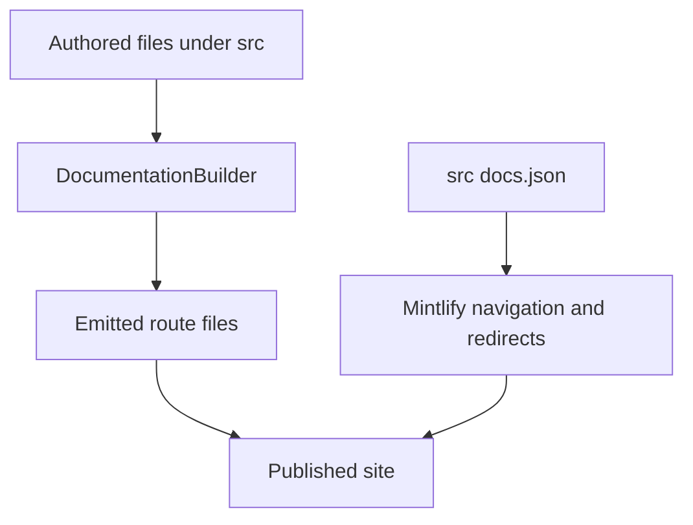

`src/` is the authored documentation tree. Two separate contracts turn it into the published site:

- `pipeline/core/builder.py` owns discovery, preprocessing, and emission into `build/`.
- `src/docs.json` owns Mintlify presentation: products, menu placement, tabs, groups, generated OpenAPI sections, and redirects.

A route being emitted does not make it discoverable in the intended menu, and a menu label does not select a source directory. For example, `src/langsmith/fleet/` supplies `/langsmith/fleet/...`, but its menu item is **No-code agents**. Change the source and the navigation contract together.

This diagram distinguishes route ownership by the builder from navigation and redirect ownership by Mintlify configuration.

## Source-to-route map

| Authored domain | Emitted route family | Primary Mintlify placement |
| --- | --- | --- |
| `src/index.mdx`, other root MDX | Matching root route, such as `/` and `/build-overview` | Lifecycle → Home or Build → Overview |
| Shared `src/oss/` content, including `langchain/`, `langgraph/`, and `deepagents/` except `code/` | `/oss/python/...` and `/oss/javascript/...` | Lifecycle → Build language dropdowns |
| `src/oss/python/` or `src/oss/javascript/` | Matching language route with that leading source segment removed | Matching Build dropdown |
| `src/oss/openwiki/` | `/oss/openwiki/...` once | Build → OpenWiki |
| `src/oss/deepagents/code/` | `/oss/deepagents/code/...` once | Products and setup → Deep Agents Code |
| Direct `src/langsmith/*.mdx`, except `managed-deep-agents*` | `/langsmith/...` | Test, Deploy, Monitor, or Products and setup |
| Direct `src/langsmith/managed-deep-agents*.mdx` | `/langsmith/python/...` and `/langsmith/javascript/...` | Build → Managed Deep Agents |
| `src/langsmith/fleet/` | `/langsmith/fleet/...` | Products and setup → No-code agents |
| `src/snippets/` | Importable MDX/components, not public pages | Used by authored MDX |
| `src/docs.json`, assets, styles, and scripts | Copied shared inputs | Configuration or static site resources |

## Builder responsibilities and invariants

`DocumentationBuilder.build_all()` clears the output, emits Python and JavaScript OSS trees, emits the two deliberately unversioned OSS products, emits unversioned LangSmith content, then adds Managed Deep Agents variants and shared files. Shared OSS pages resolve language fences independently for each target; use those fences rather than duplicate sources when only parts of a page differ.

OpenWiki and Deep Agents Code are the exceptions: each is emitted exactly once and is processed using the Python fence branch. Links to those products remain unprefixed, while links from their pages to ordinary OSS material resolve to the Python tree.

For a language-targeted page, the builder preprocesses MDX before rewriting snippet imports and links. It scopes unqualified `/snippets/` MDX imports to `/snippets/python/` or `/snippets/javascript/`; inserts the target language into eligible absolute `/oss/` links; and converts unversioned Managed Deep Agents links to the current language route. Existing language prefixes, image URLs, and the two unversioned product roots are protected from rewriting.

Source collection is a security boundary. The builder skips symlinks—even symlinks to regular files—and ignores files resolving outside the collection root. Thus a committed source-tree path cannot bring a host file into an artifact. The focused builder tests exercise the language prefixes, one-time output, variant routes, scoped snippets, and this containment behavior.

## Lifecycle navigation

**AGENT DEVELOPMENT LIFECYCLE** has five menu items: **Home**, **Build**, **Test**, **Deploy**, and **Monitor**. Build is split into Python and TypeScript dropdowns, each with ten tabs. Its Deep Agents tab now groups shared Deep Agents routes by concerns including execution environment, context management, delegation, steering, middleware, frontend, and protocols; `subagents.mdx` is a shared source that therefore supplies both language routes under **Delegation**.

Test, Deploy, and Monitor use flat `src/langsmith/` source families; their hierarchy comes from `docs.json`, not directories. Their current high-level map is:

| Menu item | Tabs that matter for route placement |
| --- | --- |
| Test | Get started; Datasets & Experiments; Evaluators; Annotation Queues; Test from Playground; Test from Studio |
| Deploy | Get started; Agent Server; Deploy to Cloud; Deploy to Self-hosted; Prompt & Context Hub; Sandboxes |
| Monitor | Overview; Trace; Debug; Observe; Reference |

The Monitor **Overview** route is `langsmith/observability`. Its `observability.mdx` landing page sends readers into tracing setup, investigation, dashboards and alerts, automations, feedback, and Engine; these are separate direct LangSmith routes arranged by the Monitor tabs and groups. The Deploy **Sandboxes** tab is likewise a navigation placement over direct LangSmith sandbox routes. Its landing route, `langsmith/sandboxes`, leads to snapshots, service URLs, auth proxy, mounts, permissions, CLI, SDK usage, and self-hosted setup.

### Managed Deep Agents

A direct `src/langsmith/managed-deep-agents*.mdx` source is excluded from ordinary LangSmith output and emitted twice under `/langsmith/python/` and `/langsmith/javascript/`. Unversioned legacy URLs redirect to Python routes; they are not duplicate emitted pages. The two Build dropdowns place the expanded surface in **Get started** (Beta), **Agent capabilities** (including nested Channels), and **Build and deploy**. This is why source naming is a routing contract while the tab and groups remain a `docs.json` contract.

`managed-deep-agents-project-structure.mdx` is language-fenced shared source: the Python output requires a root `agent.py` export named `agent` created with `define_deep_agent`, while TypeScript requires `agent.ts` or `agent.tsx` and `defineDeepAgent`. Deployment includes named managed paths but excludes `.env` and generated `.mda/evals/` content.

### Deep Agents delegation

`src/oss/deepagents/subagents.mdx` emits to both language trees and is placed under the Deep Agents **Delegation** group. It documents synchronous delegation: a deep agent supplies or receives a default `general-purpose` subagent, and the coordinator blocks for its final result. Removing both the default and caller-provided synchronous subagents removes `SubAgentMiddleware` and the `task` tool; asynchronous subagents remain a separate mechanism. Subagent runs carry their agent name in `lc_agent_name`, making the corresponding LangSmith traces filterable.

## Products and setup navigation

**PRODUCTS AND SETUP** contains **LangSmith setup**, **LLM Gateway**, **No-code agents**, **Engine**, and **Deep Agents Code**. Only LangSmith setup is tabbed: Overview, Account, Cloud, BYOC, Self-hosted, and Govern. The other items are direct pages and groups.

- **LLM Gateway** is flat `src/langsmith/llm-gateway*.mdx`. Navigation puts credits and fallbacks in **Core capabilities**, administrative access, monitoring, and policies in **Administration and governance**, and direct model access in **Advanced**. Administrators enable access and configure provider credentials or credits before workspace developers call it with a workspace-scoped API key; model-access policies deny excluded provider/model access with `403` and apply the most specific scope.
- **No-code agents** is the menu label for the `fleet/` source directory and route prefix.
- **Engine** is flat `src/langsmith/engine*.mdx`, with direct navigation for overview, issue workflow, GitHub integration, categories, webhooks, security, and self-hosted operation. Its workflow detects recurring trace issues, diagnoses against traces and optional code, proposes a pull request, tracks matching traces and evaluation examples, and reopens resurfacing issues. Organization enablement precedes project setup, and spend limits pause new runs when reached.
- **Deep Agents Code** is the unversioned `src/oss/deepagents/code/` surface. Its expanded **Configuration** group is rooted at `oss/deepagents/code/configuration` and contains credentials, config file, hooks, and MCP tools. It captures `DEEPAGENTS_HOME` before dotenv loading and reports effective settings and origins without printing secrets.

BYOC and self-hosted pages remain flat LangSmith source families positioned by the setup tabs. BYOC separates LangChain's cloud control plane from customer-AWS data-plane resources; onboarding uses a cross-account role, progresses a plane from `Requested` through `Provisioning` to `Active`, and permanently associates a workspace with its selected plane. The Self-hosted tab has direct `/langsmith/self-host...` routes. Its SmithDB group is hidden but configured, while the metrics route is visible under Reference.

## Safe change procedure

1. Start with the authored domain and resulting route; never infer either from a visible menu label.
2. Add or change the MDX source, then place its emitted route in the exact product, menu item, dropdown or tab, and group in `src/docs.json`.
3. When a public route changes, add or retain a `docs.json` redirect instead of retaining an authored duplicate.
4. For shared OSS and Managed Deep Agents, check both outputs, including fence resolution, rewritten links, and snippet imports. For OpenWiki and Deep Agents Code, verify only the unversioned output.
5. Run `make build` and `make broken-links`; extend builder tests for emission, rewriting, or containment changes.

## Related pages

- [Build system architecture](/openwiki/architecture/build-system.md)
- [Versioning](/openwiki/concepts/versioning.md)
- [Mintlify integration](/openwiki/integrations/mintlify.md)
- [Adding pages](/openwiki/operations/adding-pages.md)
- [Versioned content workflow](/openwiki/workflows/versioned-content.md)
