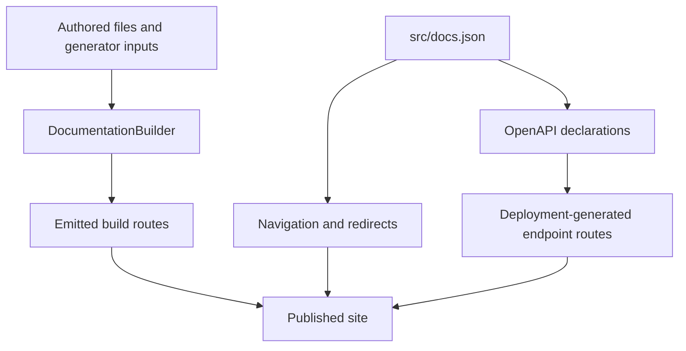

`src/` is an authored-content tree, not a public-site hierarchy. A discoverable page is the result of separate contracts that must not be inferred from one another:

1. **Source ownership and emission** — `DocumentationBuilder` selects a source family, writes one or more build routes, and applies language processing.
2. **Navigation projection** — `src/docs.json` explicitly defines products, menus, tabs, groups, ordering, and redirects. Emitting a route does not add it to navigation.
3. **Deployment-generated reference** — OpenAPI declarations in `docs.json` cause Mintlify to generate endpoint reference during deployment. Those endpoint pages are not authored MDX and do not occur in local build output.

```mermaid
flowchart TD
    Source["Authored files and generator inputs"] --> Builder["DocumentationBuilder"]
    Builder --> Routes["Emitted build routes"]
    Config["src/docs.json"] --> Navigation["Navigation and redirects"]
    Config --> Reference["OpenAPI declarations"]
    Reference --> Generated["Deployment-generated endpoint routes"]
    Routes --> Site["Published site"]
    Navigation --> Site
    Generated --> Site
```

This shows the ownership boundary: a source file establishes neither a menu position nor an OpenAPI endpoint route, and a navigation entry does not establish an emitted file.

## Change model

| Concern | Primary owner | Safe change rule |
| --- | --- | --- |
| Output route and language variants | Source family and `pipeline/core/builder.py` | Identify the source family before choosing a URL or editing internal links. |
| Menu placement, order, labels, and redirects | `src/docs.json` | Add, move, or redirect an emitted route explicitly. |
| Root landing page | `src/index.mdx` plus the `Home` projection in `docs.json` | Treat it as a custom, shared root page, not as an OSS-language page. |
| Integration tables and provider catalogue | Hosted integration frontmatter, `scripts/data/integration_external_docs.yaml`, `packages.yml`, and their generators | Regenerate the appropriate listing; do not hand-edit generated tables. |
| API endpoint reference | OpenAPI declaration and Mintlify deployment | Change the specification or declaration, never invent endpoint MDX. |

`build_all()` deletes and recreates the build tree before producing the language-specific OSS trees, unversioned products, ordinary LangSmith content, Managed Deep Agents variants, and shared inputs. It skips `TEMPLATE.mdx` and unsupported extensions. Source collection rejects symlinks and files resolving outside the collection root, so an in-tree link cannot pull a host file into artifacts.

## Route ownership and emission

| Authored family | Emitted public family | Mapping rule |
| --- | --- | --- |
| Shared OSS content under `src/oss/` | `/oss/python/...` and `/oss/javascript/...` | Built twice; `:::python` and `:::js` content is selected for each target. |
| `src/oss/python/` or `src/oss/javascript/` | Only its matching language tree | The source-language segment is removed and the other language pass skips it. |
| `src/oss/openwiki/` | `/oss/openwiki/...` | Built once with the Python conditional branch. |
| `src/oss/deepagents/code/` | `/oss/deepagents/code/...` | Built once with the Python conditional branch. |
| Ordinary `src/langsmith/` | `/langsmith/...` | Built once as unversioned content with the Python target. |
| Direct `src/langsmith/managed-deep-agents*.mdx` | `/langsmith/python/...` and `/langsmith/javascript/...` | Excluded from ordinary LangSmith output and rendered once per language. |
| `src/snippets/`, images, fonts, `.well-known`, root shared files, JS and CSS | Shared import/static inputs | Copied independently of the ordinary page families; snippet MDX also receives language-specific copies. |

For a language render, the builder preprocesses MDX, scopes unqualified MDX snippet imports under `/snippets/python/` or `/snippets/javascript/`, rewrites eligible absolute `/oss/` links, and rewrites unversioned Managed Deep Agents links to the current language. It leaves already-qualified OSS URLs, image URLs, OpenWiki URLs, and Deep Agents Code URLs alone. This preserves roots deliberately emitted once.

### Versioned OSS and single-route exceptions

OpenWiki and Deep Agents Code are Build exceptions: each has one unversioned OSS output tree. `docs.json` lists the same OpenWiki routes in both Build language dropdowns; that is duplicated navigation, not duplicated route emission. Deep Agents Code is instead projected under **Products and setup**.

Managed Deep Agents is the inverse exception. Its direct LangSmith sources emit Python and JavaScript variants only; `docs.json` redirects unversioned compatibility URLs to Python. Do not create an authored unversioned counterpart. When changing this family, test both rendered variants, its link rewriting, and the redirect convention.

### Shared snippets are build inputs

Snippet source is not ordinary navigation content. The builder emits a Python and JavaScript copy of each snippet MDX with language-specific conditional content and absolute language-prefixed OSS links; it keeps a Python-default copy at the original snippet path for unversioned importers. Versioned pages have unqualified MDX snippet imports rewritten to their language copy. NPM-supplied sandbox components are copied after source-tree shared files and therefore replace same-named source copies when available.

## Navigation is an explicit projection

The `AGENT DEVELOPMENT LIFECYCLE` product projects Home, Build, Test, Deploy, and Monitor. Build has Python and TypeScript dropdowns and can combine OSS and selected LangSmith routes. `src/index.mdx` is the custom Home page, linking the lifecycle and product entrypoints; `docs.json` is still what places it under Home.

The distinct `PRODUCTS AND SETUP` product projects unversioned LangSmith content according to reader intent. Its **LangSmith setup → Overview** starts at `langsmith/langsmith-setup-overview`; the **Agent-based workspaces** group, marked Beta, explicitly includes `langsmith/agents` and related pages. Source location remains `src/langsmith/`: a navigation label is not a source-family rename.

### Integration ownership and MCP

Python and TypeScript **Integrations** use different group structures. Python lists provider overview/all providers and component landing pages under **Integrations by component**. TypeScript uses Popular Providers, General integrations, and RAG integrations, and a route may intentionally appear in more than one TypeScript group. Therefore an integration `index.mdx` requires a language-prefixed `docs.json` entry to be navigated.

Integration listings have a second ownership layer beyond navigation:

- `scripts/refresh_integration_downloads.py` scans frontmatter from hosted pages below `src/oss/{python,javascript}/integrations/`, merges third-party rows from `scripts/data/integration_external_docs.yaml`, and writes generated download tables. External rows point to a validated external or site-relative `docs_url` rather than a hosted guide. Use `--check-docs-urls` to validate URL schemes.
- `packages.yml` is the package/repository registry. `pipeline/tools/partner_pkg_table.py` filters and enriches it to generate the Python provider catalogue, resolving each provider link in order from an explicit page, a hosted page, a matching all-providers card, GitHub, then PyPI. Package metadata therefore affects generated catalogue links, not route emission or `docs.json` placement.

The MCP guide under `src/oss/langchain/mcp/` is shared source, emitted for both OSS languages and listed in both Build language menus. The JavaScript-specific MCP adapter migration source is emitted and navigated only at the JavaScript migration route.

### LangSmith route families and product labels

| Authored family | `docs.json` projection | Architectural distinction |
| --- | --- | --- |
| `langsmith/fleet/` | **No-code agents** | Directory-owned, ordinary unversioned LangSmith output projected as get-started, configuration, automation, advanced, and resources. |
| `langsmith/llm-gateway*.mdx` | **LLM Gateway** | Projected as core capabilities, administration and governance, and advanced content. |
| `langsmith/engine*.mdx` | **Engine** | Projects overview, issue workflow, GitHub, notifications, security, and self-hosted routes. |
| evaluator pages under `langsmith/` | Test or Monitor workflow groups | `tuned-evaluators` is under Monitor → Observe → Online evaluators without gaining a source family. |
| `langsmith/application-structure.mdx` | Deploy → Agent Server → Develop your application | Ordinary unversioned LangSmith output. |
| `langsmith/sandboxes.mdx` | Deploy → Sandboxes | Ordinary unversioned LangSmith output and a separate-tab landing page. |

The labels carry product semantics but do not alter the ownership map: LLM Gateway mediates provider calls and records trace/usage metadata; Engine operates on recurring trace issues; Fleet is the No-code agents projection; and Tuned Evaluators are online evaluators. Keep these source pages in their LangSmith family and change placement in `docs.json` rather than moving files to resemble their product labels.

## Deployment-generated API reference

`docs.json` configures three OpenAPI surfaces. Overview/reference MDX pages in the surrounding groups are ordinary emitted routes; Mintlify creates endpoint pages when deploying.

| Surface | Specification input | Generated directory |
| --- | --- | --- |
| Agent Server API | Committed `src/langsmith/agent-server-openapi.json` | `langsmith/agent-server-api` |
| Control Plane API | Remote `https://api.host.langchain.com/openapi.json` | Mintlify default (`/api-reference/`) |
| LangSmith REST API | Committed `src/langsmith/langsmith-platform-openapi.json` | `langsmith/smith-api` |

The LangSmith REST specification is a committed, post-processed input. `scripts/process_langsmith_openapi.py` accepts only the live LangSmith API host when fetching, hides fleet/internal/health operations, assigns and orders human-readable tag groups, and normalizes operation titles before writing it. This is a public-reference policy boundary, not an MDX-generation step.

The daily refresh workflow runs that processor, checks whether the committed specification changed, and creates or appends to one `chore/refresh-langsmith-openapi` pull request. Review that PR as a proposed change to deployment-generated public API reference. Do not manually edit the refreshed file.

## Focused validation and safe changes

1. Start with the intended public route and select the emission family before changing content or links.
2. For shared OSS content, inspect Python and JavaScript output. For OpenWiki and Deep Agents Code, inspect only the unversioned output and preserve those absolute paths.
3. Add the emitted route to the intended `docs.json` menu explicitly, and change redirects separately when moving a public URL.
4. For Managed Deep Agents, verify both language variants and the unversioned-to-Python redirect.
5. For a hosted integration, update frontmatter or the external-row YAML as appropriate, run the table generator, and validate external URLs. For a provider catalogue change, update `packages.yml` and regenerate its table.
6. For API endpoints, update the OpenAPI input/configuration rather than adding MDX. For LangSmith REST, use or review `scripts/process_langsmith_openapi.py` and its refresh PR.
7. Extend focused `tests/unit_tests/test_builder.py` assertions when changing language routing, link rewriting, snippets, unversioned products, Managed Deep Agents, or source-tree safety.

## Related pages

- [Versioning](/openwiki/concepts/versioning.md)
- [Mintlify integration](/openwiki/integrations/mintlify.md)
- [Reference documentation](/openwiki/integrations/reference-docs.md)
- [Adding pages](/openwiki/operations/adding-pages.md)
- [Integration listing automation](/openwiki/workflows/integration-listing-automation.md)
