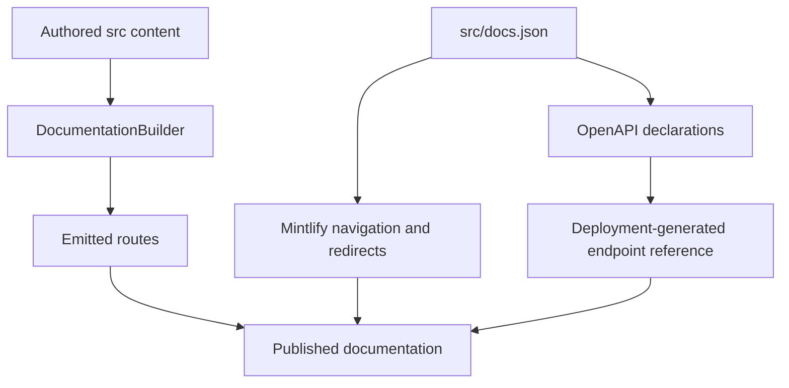

`src/` is authored input, not the published site hierarchy. Keep these ownership planes separate:

1. **Route emission:** `DocumentationBuilder` preprocesses source families and writes disposable build routes.
2. **Navigation and compatibility:** `src/docs.json` explicitly defines Mintlify labels, groups, ordering, redirects, and OpenAPI declarations.
3. **Deployment-generated reference:** Mintlify uses declared OpenAPI specifications to generate endpoint pages at deployment.
4. **Product documentation:** ordinary MDX explains a product, but its directory does not determine its product label or navigation placement.

```mermaid
flowchart TD
    Source["Authored src content"] --> Builder["DocumentationBuilder"]
    Builder --> Routes["Emitted routes"]
    Config["src/docs.json"] --> Navigation["Mintlify navigation and redirects"]
    Config --> Specs["OpenAPI declarations"]
    Specs --> Reference["Deployment-generated endpoint reference"]
    Routes --> Published["Published documentation"]
    Navigation --> Published
    Reference --> Published
```

This diagram shows independent publication inputs: emitting an MDX route does not add navigation, and an OpenAPI endpoint page is not authored MDX. Do not treat `build/` as durable source.

## Builder-owned route emission

A full build deletes and recreates the build directory, renders OSS for Python and JavaScript, renders special unversioned and LangSmith families, then copies shared inputs. MDX is preprocessed; supported non-MDX files are copied. Source discovery skips symlinks and any file resolving outside the collection root, so a committed link cannot copy host data into build artifacts.

| Authored family | Emitted route family | Ownership rule |
| --- | --- | --- |
| Shared `src/oss/` content | `/oss/python/...` and `/oss/javascript/...` | Render twice, selecting conditional content for each target. |
| `src/oss/python/` or `src/oss/javascript/` | Only its corresponding language tree | The language directory is removed in output; the opposite pass skips it. |
| `src/oss/openwiki/` | `/oss/openwiki/...` | Render once with the Python conditional branch. |
| `src/oss/deepagents/code/` | `/oss/deepagents/code/...` | Render once with the Python conditional branch. |
| Ordinary `src/langsmith/` | `/langsmith/...` | Render once, unversioned, with the Python conditional branch. |
| Direct `src/langsmith/managed-deep-agents*.mdx` | `/langsmith/python/...` and `/langsmith/javascript/...` | Excluded from ordinary LangSmith output and rendered for each language. |
| `src/snippets/`, images, fonts, `docs.json`, JS, and CSS | Shared emitted inputs | Support content and site runtime; they do not infer navigation. |

Preprocessing scopes unqualified MDX snippet imports under `/snippets/python/` or `/snippets/javascript/` and rewrites eligible `/oss/` links. Images, already-qualified links, and the unversioned OpenWiki and Deep Agents Code roots remain unprefixed.

### Route exceptions that must not be flattened

**OpenWiki** and **Deep Agents Code** have one unversioned OSS route family. `docs.json` can place a single OpenWiki route in both Build language dropdowns, but those are two menu references, not two outputs. Deep Agents Code instead appears as a Products and setup item; redirects preserve former language-prefixed Code URLs.

**Managed Deep Agents** is the inverse: one source family produces Python and JavaScript routes. Its Build tabs point to the corresponding variant, while legacy unversioned Managed Deep Agents URLs redirect to Python. Do not create duplicate unversioned MDX; test both variants and the redirects.

## `docs.json`: explicit navigation and redirects

`src/docs.json` is the sidebar source of truth, not a directory scan. A built route can be unlisted; a redirect is a compatibility rule rather than content. Adding or moving `index.mdx` therefore does not establish reader-facing placement. Update the explicit navigation route and any necessary redirect separately.

### Build menus and shared OSS content

Python and TypeScript Build integration menus intentionally use different group structures. Component landing pages need an explicit language-qualified placement. The shared `src/oss/langchain/mcp/` source emits for both language trees and is listed in both menus; conditional branches carry language-specific instructions. Conversely, `src/oss/javascript/migrate/langchain-mcp-adapters.mdx` is JavaScript-only in both output and navigation.

The provider directories likewise contain language-owned integration catalogs, not a common generated registry: the Python all-providers page describes a 1000+ ecosystem, while the JavaScript catalog has its own structure and top-provider selection. Keep a provider catalog change in the intended language source family and add it to the matching Build menu deliberately.

### LangSmith source versus product projection

Ordinary `src/langsmith/` content emits unversioned even when a product label differs from the source directory.

| Source or route cluster | Current `docs.json` projection |
| --- | --- |
| `langsmith/agents.mdx` and related environment, navigation, creation, UI, and deployment pages | Products and setup → LangSmith setup → Overview → **Agent-based workspaces** (Beta) |
| `langsmith/application-structure.mdx` | Deploy → Agent Server → **Develop your application** |
| `langsmith/sandboxes.mdx`, snapshots, service URLs, downloads, auth proxy, mounts, permissions, CLI, SDK, and Harbor pages | Deploy → **Sandboxes** tab |
| Self-hosted sandbox architecture, scaling, and operations | Separate self-hosted **Sandboxes** group |
| `langsmith/self-host-smithdb*.mdx` | Self-hosted **SmithDB** group |
| `langsmith/llm-gateway*.mdx` | Products and setup → **LLM Gateway** (Beta), with Get started, core capabilities, administration and governance, and advanced groups |
| `langsmith/fleet/` | Products and setup → **No-code agents** |
| `langsmith/engine*.mdx` | Products and setup → **Engine** |
| `langsmith/managed-deep-agents*.mdx` | Build → language-specific **Managed Deep Agents** tabs |
| `oss/deepagents/code/` | Products and setup → **Deep Agents Code** |

This projection is a user-facing taxonomy, not a reason to move authored files.

## Product clusters and operational boundaries

### LLM Gateway

The standard gateway authenticates and authorizes the caller, resolves the route and upstream credential, evaluates governance policies, translates formats when needed, invokes the provider, and records trace, usage, cost, routing, and policy metadata. Direct model access retains identity, credential resolution, policy enforcement, and tracing but skips request and response translation. Gateway Credits select LangChain-hosted models with a LangSmith API key and no provider secret; provider-prefixed model IDs select configured bring-your-own-provider secrets.

### Sandboxes: four related but distinct surfaces

- **LangSmith Sandboxes** are isolated managed resources for risky code and filesystem work. The landing page owns user-facing SDK, CLI, snapshots, service URLs, auth proxy, mounts, permissions, and availability guidance. Restricted-egress sandboxes cannot evade the managed destination allowlist through local proxy settings.
- **Managed Deep Agents sandboxes** are a deployment-owned integration with LangSmith Sandboxes. The `sandbox/` declaration enables the capability, and reuse is one sandbox per durable thread.
- **Deep Agents Code remote sandboxes** keep the local `dcode` LLM loop, memory, and tool dispatch local while filesystem and command calls run in the remote sandbox. That is not Managed Deep Agents hosting.
- **Self-hosted Sandboxes** are an infrastructure cluster: `sandbox-host` pods manage Firecracker microVMs on dedicated KVM-capable nodes, while shared storage holds persistent state independently of a node. A rolling host restart is not live migration; clients must tolerate interruption and reconnection.

### Managed Deep Agents

Managed Deep Agents runs the OSS Deep Agents harness, while moving compilation and infrastructure ownership to the `mda` CLI and managed runtime. Runtime server information has verified caller identity; client-supplied context is not an authorization source. `mda deploy` compiles the project into a managed LangGraph app, syncs deploy-owned instructions and skills to Context Hub, uploads compiled source, and triggers a hosted Agent Server deployment with its API and MCP endpoint. It routes local inputs to different owners: deploy-owned context, non-reserved hosted secrets, a `.mda/build` source archive, and post-deployment cron schedules. In CI, provide a target-region `LANGSMITH_API_KEY`; noninteractive deployment cannot fall back to browser sign-in.

### SmithDB

SmithDB is an opt-in, columnar self-hosted trace datastore that keeps durable data in object storage with per-pod disk cache and can run alongside ClickHouse. Its source cluster owns a staged rollout: prepare a dedicated metastore, object storage, and cache; deploy services; enable dual ingestion; validate capacity and optionally migrate historical data; then enable SmithDB queries. Dual ingestion alone does **not** enable SmithDB-dependent features. Query cutover gates features such as trajectory views and evaluators, filter syntax, newer dashboards, thread workflows, and Gateway usage monitoring; tracing, thread listing, datasets, and experiments still work through either datastore. Rollback first returns traffic to ClickHouse, then disables SmithDB workloads, avoiding a race with shutdown.

### OSS persistence and Deep Agents memory

LangGraph persistence distinguishes checkpointers from stores: checkpointers save graph state per thread for continuity, interrupts, and recovery; stores hold application-defined key-value data across threads. Deep Agents memory is filesystem-backed and uses backends to decide storage and access. This means an OSS memory page is not a LangSmith managed-memory route merely because both discuss durable agent knowledge; Agent Server abstracts checkpointer and store infrastructure when it hosts a graph.

### Agent Server deployment planes

Control-plane and data-plane pages are ordinary unversioned LangSmith source but describe a directional operational relationship: the control plane stores desired deployment state, while the data-plane listener polls its APIs and reconciles deployments, revisions, and deletion. The control plane never opens a direct connection to the data plane. Express route and menu changes in `docs.json`, not by changing those source locations.

## Deployment-generated API reference

The three `docs.json` OpenAPI declarations create endpoint reference pages at deployment. Their overview/reference landing pages are authored routes; their endpoint pages are Mintlify-generated and are not local build artifacts.

| Surface | Specification input | Generated location |
| --- | --- | --- |
| Agent Server API | Committed `src/langsmith/agent-server-openapi.json` | `langsmith/agent-server-api` |
| Control Plane API | `https://api.host.langchain.com/openapi.json` | Mintlify default location |
| LangSmith REST API | Committed `src/langsmith/langsmith-platform-openapi.json` | `langsmith/smith-api` |

The LangSmith REST specification is a committed post-processed publication input. Its processor allow-lists the live LangSmith host, hides fleet, internal, sandbox-internal, and health operations, assigns and orders readable tag groups, and normalizes visible operation titles. The daily refresh runs the processor; when the committed specification is unchanged it makes no commit, and otherwise it reuses the open `chore/refresh-langsmith-openapi` pull request.

## Safe change procedure

1. Start with the public URL and classify it as emitted MDX, navigation, redirect, or deployment-generated reference.
2. For ordinary OSS content, verify both Python and JavaScript output. For OpenWiki and Deep Agents Code, verify the single unversioned output and preserve unprefixed links.
3. Update `src/docs.json` explicitly for labels, placement, order, redirects, and OpenAPI declarations. The builder does not infer them.
4. For Managed Deep Agents, verify both language outputs, the unversioned-to-Python redirects, and whether the change affects the CLI-to-Agent-Server deployment contract.
5. Keep LangSmith product content in `src/langsmith/`; use `docs.json` to project it as Gateway, No-code agents, Engine, Sandboxes, or SmithDB.
6. For sandbox work, decide whether the intended owner is managed resource usage, Managed Deep Agents integration, Deep Agents Code remote tools, OSS sandbox backends, or self-hosted infrastructure.
7. For SmithDB work, keep deployment stage, query cutover, migration, and rollback semantics aligned; do not advertise a query-gated feature merely because dual ingestion is enabled.
8. Change endpoint reference through its OpenAPI input and declaration, never through generated endpoint MDX. Review the processor and refresh workflow for LangSmith REST changes.
9. Extend focused `tests/unit_tests/test_builder.py` coverage when source-family routing, preprocessing, special-family behavior, or source-tree safety changes.

## Related pages

- [Build system](/openwiki/architecture/build-system.md)
- [Preprocessing](/openwiki/concepts/preprocessing.md)
- [Versioning](/openwiki/concepts/versioning.md)
- [Reference docs](/openwiki/integrations/reference-docs.md)
- [Adding pages](/openwiki/operations/adding-pages.md)
- [LangSmith OpenAPI refresh](/openwiki/workflows/langsmith-openapi-refresh.md)
- [Quickstart](/openwiki/quickstart.md)
