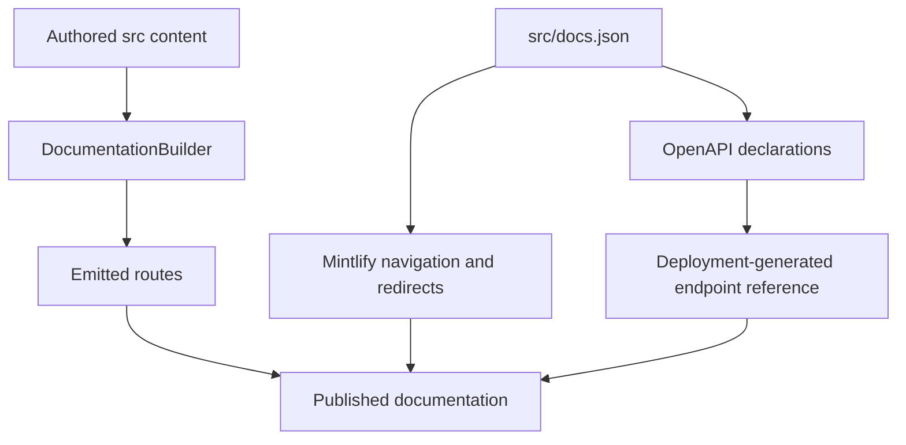

`src/` is authored input, not the site hierarchy. Keep four ownership planes separate:

1. **Route emission:** `DocumentationBuilder` reads source families, preprocesses MDX, and writes disposable output routes.
2. **Navigation and compatibility:** `src/docs.json` explicitly supplies Mintlify menu labels, grouping, ordering, OpenAPI declarations, and redirects.
3. **Deployment-generated reference:** Mintlify consumes declared OpenAPI specifications and generates endpoint pages at deployment.
4. **Product documentation:** ordinary source pages explain the product; their location does not choose their reader-facing product label or menu placement.

```mermaid
flowchart TD
    Source["Authored src content"] --> Builder["DocumentationBuilder"]
    Builder --> Routes["Emitted routes"]
    Config["src/docs.json"] --> Navigation["Mintlify navigation and redirects"]
    Config --> Specs["OpenAPI declarations"]
    Specs --> Reference["Deployment-generated endpoint reference"]
    Routes --> Published["Published documentation"]
    Navigation --> Published
    Reference --> Published
```

This shows independent inputs to the published site: route emission does not create navigation, and generated endpoint reference is not an authored MDX route. Never treat `build/` as durable source.

## Emission families and boundaries

A full build deletes and recreates the build directory, renders OSS for Python and JavaScript, then renders special unversioned and LangSmith families and copies shared assets. Supported non-MDX inputs are copied; MDX is preprocessed; `TEMPLATE.mdx` is skipped. Source collection rejects symlinks and anything resolving outside its collection root, preventing a committed source link from leaking host files into artifacts.

| Authored family | Emitted route family | Ownership rule |
| --- | --- | --- |
| Shared `src/oss/` content | `/oss/python/...` and `/oss/javascript/...` | Render twice, resolving conditional content per target language. |
| `src/oss/python/` or `src/oss/javascript/` | Only the matching language tree | The source-language segment is removed from the output; the opposite pass skips it. |
| `src/oss/openwiki/` | `/oss/openwiki/...` | Render once with the Python conditional branch. |
| `src/oss/deepagents/code/` | `/oss/deepagents/code/...` | Render once with the Python conditional branch. |
| Ordinary `src/langsmith/` | `/langsmith/...` | Render once as unversioned LangSmith content with the Python branch. |
| Direct `src/langsmith/managed-deep-agents*.mdx` | `/langsmith/python/...` and `/langsmith/javascript/...` | Excluded from the ordinary LangSmith pass and rendered per language. |
| `src/snippets/`, images, fonts, `docs.json`, JS, and CSS | Shared emitted inputs | These support pages or site runtime; they are not inferred as navigation. |

For language output, preprocessing selects conditional blocks, scopes unqualified MDX snippet imports under `/snippets/python/` or `/snippets/javascript/`, and rewrites eligible `/oss/` links. It leaves images, already-qualified links, OpenWiki, and Deep Agents Code unprefixed because those products have single route roots.

### Unversioned exceptions

OpenWiki and Deep Agents Code are unversioned OSS products, not Python/TypeScript route trees. `docs.json` projects the same OpenWiki routes into both Build language dropdowns; that is two menu placements for one output. Deep Agents Code is instead placed under Products and setup.

Managed Deep Agents is the reverse exception. Its one authored family produces two language variants, while `docs.json` redirects unversioned legacy Managed Deep Agents URLs to Python. Do not add a duplicate unversioned MDX page; test both variants and redirects when changing this family.

## `docs.json`: navigation, redirects, and product naming

`src/docs.json` is authoritative for the sidebar, not a source-tree scan. An emitted page may be absent from a menu; conversely, a redirect is a compatibility rule rather than emitted content. Adding an `index.mdx` or moving a file does not establish reader-facing placement—add or update the explicit route in `docs.json` and manage redirect entries separately.

### Build and the shared MCP surface

Python and TypeScript Build menus have deliberately different integration group structures. Python includes **Integrations by component**, while TypeScript uses different broad groupings. Component landing pages therefore require a deliberately placed, language-qualified navigation route.

The MCP overview source at `src/oss/langchain/mcp/` is shared: the builder emits it in both language trees and each language menu points to its own emitted route. Its conditional branches own language-specific instructions: Python documents `langchain.mcp` and FastMCP, while JavaScript uses `@langchain/mcp-adapters` 2.0 or later. In contrast, `src/oss/javascript/migrate/langchain-mcp-adapters.mdx` is JavaScript-owned: it emits and appears only at the JavaScript migration route. Keep cross-language conceptual content shared; keep adapter migration behavior in the JavaScript source family.

### LangSmith route ownership and reader-facing labels

Ordinary `src/langsmith/` files stay at unversioned `/langsmith/...` routes even when navigation labels differ from their source directory.

| Source / route family | Current `docs.json` projection |
| --- | --- |
| `langsmith/agents.mdx` and related environment, navigation, creation, UI, and deployment pages | Products and setup → LangSmith setup → Overview → **Agent-based workspaces** (Beta) |
| `langsmith/application-structure.mdx` | Deploy → Agent Server → **Develop your application** |
| `langsmith/sandboxes.mdx` | Deploy → **Sandboxes** tab |
| `langsmith/fleet/` | Products and setup → **No-code agents** |
| `langsmith/llm-gateway*.mdx` | Products and setup → **LLM Gateway** (Beta) |
| `langsmith/engine*.mdx` | Products and setup → **Engine** |
| `langsmith/managed-deep-agents*.mdx` | Build → language-specific **Managed Deep Agents** tabs |

These labels expose genuine product boundaries, not merely renamed folders:

- **LLM Gateway** authenticates and authorizes standard calls, resolves route and credentials, evaluates governance policy, translates formats when required, invokes the provider, and records trace and usage metadata. Direct model access retains identity, credential, policy, and tracing operations while bypassing translation. Gateway Credits use a LangChain-hosted upstream credential and a LangSmith API key; provider-prefixed IDs use configured provider secrets.
- **No-code agents** is the reader-facing Fleet product. Its agent sidebar configures channels, sharing, connections and approval mode, knowledge, schedules, and advanced settings; a tool can run automatically or wait for approval.
- **Engine** scans production traces on a dynamic schedule, clusters and prioritizes issues, then follows an issue loop of detection, diagnosis, proposed fix, matching-trace tracking, and reopening after recurrence. It can create ground-truth dataset examples from production inputs. The Engine menu contains overview, issue workflow, GitHub, notifications, security, and self-hosted pages.
- **Tuned Evaluators** remain ordinary LangSmith source content placed in Monitor. They select eligible threads, use LangChain-managed specialized judges, and attach feedback; organization enablement and compatible threaded messages gate creation, and disabling pauses rather than deletes saved configurations.

### Agent Server deployment planes

Control plane and data plane pages are ordinary unversioned LangSmith source, but explain a directional deployment boundary. The control plane stores deployment desired state and exposes APIs; the data-plane listener polls those APIs and reconciles Agent Server deployments, revisions, and deletion. The control plane never connects directly to the data plane. Place route and menu changes in `docs.json`; do not model this operational relationship by moving source files.

## Deployment-generated API reference

The three OpenAPI declarations in `docs.json` create endpoint reference at deployment. Their overview pages are ordinary authored routes, but endpoint pages are Mintlify-generated rather than MDX content and are not local build artifacts.

| Surface | Specification input | Generated location |
| --- | --- | --- |
| Agent Server API | Committed `src/langsmith/agent-server-openapi.json` | `langsmith/agent-server-api` |
| Control Plane API | `https://api.host.langchain.com/openapi.json` | Mintlify default location |
| LangSmith REST API | Committed `src/langsmith/langsmith-platform-openapi.json` | `langsmith/smith-api` |

The LangSmith REST specification is a committed post-processed publication input. Its processor allow-lists the live host, hides fleet, internal, and health operations, assigns and orders public tag groups, and normalizes operation titles. The daily workflow runs that processor, exits without a commit for an unchanged spec, and reuses the `chore/refresh-langsmith-openapi` pull request while it remains open.

## Safe change procedure

1. Begin with the intended public URL. Identify whether it is emitted MDX, an explicit navigation entry, a redirect, or deployment-generated reference.
2. For ordinary OSS content, check Python and JavaScript output. For OpenWiki and Deep Agents Code, check the single unversioned output and retain unprefixed links.
3. Edit `src/docs.json` explicitly for menu placement, labels, ordering, OpenAPI declarations, and redirects. Do not expect the builder to infer any of those.
4. For Managed Deep Agents, verify both language outputs and the unversioned-to-Python compatibility redirects.
5. Keep ordinary LangSmith source in `src/langsmith/`; use `docs.json` to express product positioning. This includes Engine, LLM Gateway, Fleet, control plane, and data plane material.
6. Change API endpoint reference through the applicable OpenAPI input and declaration—not endpoint MDX. Review processing and the refresh workflow for LangSmith REST changes.
7. Extend focused `tests/unit_tests/test_builder.py` coverage when modifying source-family routing, preprocessing/rewrite policy, special-family behavior, or source-tree safety.

## Related pages

- [Build system](/openwiki/architecture/build-system.md)
- [Preprocessing](/openwiki/concepts/preprocessing.md)
- [Versioning](/openwiki/concepts/versioning.md)
- [Reference docs](/openwiki/integrations/reference-docs.md)
- [Adding pages](/openwiki/operations/adding-pages.md)
