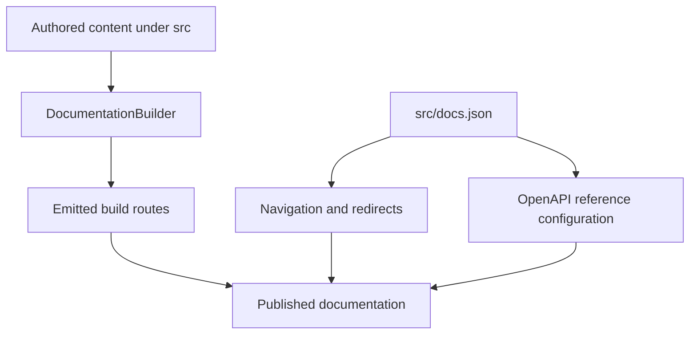

`src/` is an authored-content tree, not the public-site hierarchy. A discoverable page depends on three independent contracts:

1. **Source ownership and emission** — `DocumentationBuilder` selects a source family, creates one or more build routes, and applies language processing.
2. **Navigation projection** — `src/docs.json` explicitly supplies menus, tabs, groups, ordering, and redirects. A directory name does not place its pages in navigation.
3. **Deployment-generated reference** — `docs.json` OpenAPI declarations tell Mintlify to generate endpoint reference at deployment. Those endpoints are not authored MDX files.

```mermaid
flowchart TD
    Source["Authored content under src"] --> Builder["DocumentationBuilder"]
    Builder --> Routes["Emitted build routes"]
    Config["src/docs.json"] --> Navigation["Navigation and redirects"]
    Config --> Reference["OpenAPI reference configuration"]
    Routes --> Site["Published documentation"]
    Navigation --> Site
    Reference --> Site
```

This diagram is the ownership boundary: route emission, navigation, and generated reference are separate inputs to the published site.

## Change model

| Concern | Primary owner | Safe change rule |
| --- | --- | --- |
| Output route and language variants | Source family and `pipeline/core/builder.py` | Identify the source family before choosing a URL or editing internal links. |
| Menu placement, order, visible label, and redirects | `src/docs.json` | Add, move, or redirect the emitted route explicitly. Emitting a page does not add a menu entry. |
| Shared imports and static inputs | `src/snippets/`, assets, and root shared inputs | Treat as copied/imported build inputs, not ordinary navigation pages. |
| API endpoint reference | OpenAPI declaration plus Mintlify deployment | Change the specification or declaration, never invent endpoint MDX. |

A full build clears and recreates the build tree, then emits OSS language variants, Deep Agents Code, OpenWiki, ordinary LangSmith content, Managed Deep Agents variants, and shared inputs. It skips `TEMPLATE.mdx` and unsupported extensions. The builder also rejects symlinks and paths that resolve outside the collected root, preventing a committed content link from importing host files into the build.

## Source families and route ownership

| Authored family | Emitted public family | Mapping rule |
| --- | --- | --- |
| Shared OSS content under `src/oss/` | `/oss/python/...` and `/oss/javascript/...` | Built twice; conditional `:::python` and `:::js` content is selected per target. |
| `src/oss/python/` or `src/oss/javascript/` | Only its matching language tree | The source-language segment is removed and the opposite language pass skips it. |
| `src/oss/openwiki/` | `/oss/openwiki/...` | Built once with the Python conditional branch. |
| `src/oss/deepagents/code/` | `/oss/deepagents/code/...` | Built once with the Python conditional branch. |
| Ordinary `src/langsmith/` | `/langsmith/...` | Built once as unversioned content with the Python target. |
| Direct `src/langsmith/managed-deep-agents*.mdx` | `/langsmith/python/...` and `/langsmith/javascript/...` | Excluded from ordinary LangSmith output and rendered once per language. |
| `src/snippets/` | Shared and language-scoped import inputs | Markdown snippets are copied for Python and JavaScript imports; JSX and TSX components remain shared. |

For a language render, the builder preprocesses MDX, scopes unqualified MDX snippet imports under `/snippets/python/` or `/snippets/javascript/`, rewrites eligible absolute `/oss/` links, and rewrites unversioned Managed Deep Agents links to the current language. It does not rewrite an already language-qualified OSS URL, image URL, OpenWiki URL, or Deep Agents Code URL. This preserves the roots that are deliberately emitted only once.

### Versioned OSS versus single-route products

OpenWiki and Deep Agents Code are presentation exceptions within Build: the builder emits each only once at an unversioned OSS path. `docs.json` repeats the OpenWiki route list in both Build language dropdowns, which is duplicated navigation rather than a second output tree. Deep Agents Code is instead presented as a Products and setup surface, with its Configuration group rooted at `oss/deepagents/code/configuration`.

Managed Deep Agents is the inverse exception: its direct LangSmith sources produce Python and JavaScript routes only. The unversioned URLs are compatibility redirects to Python, so adding an authored unversioned counterpart would create an orphaned duplicate. Test link rewriting and both output variants whenever changing that family.

## Navigation is a projection, not a scanner

The **AGENT DEVELOPMENT LIFECYCLE** product has Home, Build, Test, Deploy, and Monitor. Build has Python and TypeScript dropdowns; it can project both OSS output and selected LangSmith output. Test, Deploy, Monitor, and Products and setup project ordinary unversioned LangSmith routes according to product intent. For example, `src/langsmith/fleet/` is shown to readers as **No-code agents**, not as “Fleet.”

### Integration ownership and MCP routes

Python and TypeScript **Integrations** intentionally have different group structures. Python lists provider overview/all-providers before Popular Providers and then presents component landing pages under **Integrations by component**. TypeScript uses Popular Providers, General integrations, and RAG integrations; a route may intentionally appear in more than one TypeScript group. Consequently, a source path and a menu label are not enough to infer inclusion: a component `index.mdx` needs an explicit language-prefixed entry in `docs.json`.

The MCP guide is shared source content at `src/oss/langchain/mcp/`, so it is emitted under both `/oss/python/langchain/mcp/...` and `/oss/javascript/langchain/mcp/...`; both Build language menus list its overview, tools, connections, and authentication pages. Language-specific migration sources are different: `src/oss/javascript/migrate/langchain-mcp-adapters.mdx` emits the JavaScript migration route and is explicitly listed in that language's migration menu. The shared MCP overview uses language branches: Python documents the built-in `langchain.mcp`/FastMCP path, while JavaScript requires `@langchain/mcp-adapters` 2.0 or later and points 1.x users at the migration guide.

### LangSmith route families and product labels

| Authored family | `docs.json` projection | Architectural distinction |
| --- | --- | --- |
| `langsmith/fleet/` | **No-code agents** | Navigation calls out get-started, configuration, tools and automation, advanced, and resources; the directory still owns ordinary unversioned LangSmith pages. |
| `langsmith/llm-gateway*.mdx` | **LLM Gateway** (Beta) | The surface has overview/quickstart/behavior/API formats, then core, administration and governance, and advanced groups. |
| `langsmith/engine*.mdx` | **Engine** | One flat product group projects overview, issue workflow, GitHub, notifications, security, and self-hosted pages. |
| evaluator pages under `langsmith/` | Test or Monitor workflow groups | `tuned-evaluators` appears under Monitor → Observe → Online evaluators without acquiring a distinct source family. |
| `langsmith/application-structure.mdx` | Deploy → Agent Server → Develop your application | Ordinary unversioned LangSmith output, positioned for Agent Server developers. |
| `langsmith/sandboxes.mdx` | Deploy → Sandboxes | Ordinary unversioned LangSmith output, and the landing page for a separate tab. |

### What the labels mean operationally

The map is not only cosmetic: it helps maintain source and route contracts while retaining the product behavior each route documents.

- **LLM Gateway** sits between an application and configured providers. A standard request authenticates and authorizes the caller, resolves route and credential, applies governance, translates when required, invokes the provider, translates the response, and records usage and trace metadata. Direct provider access skips translation only. Gateway Credits use LangChain-hosted model IDs and a LangSmith API key without a provider secret; provider-prefixed model IDs use configured provider secrets.
- **Engine** is a trace-driven loop: detect a recurring issue, diagnose it, propose a fix, attach later matching traces, and reopen the issue when it recurs. It can create ground-truth dataset examples from production inputs. In self-hosted installations, orchestration remains in the customer VPC while model work goes to LangSmith Intelligence with a short-lived license JWT; unavailable LSI causes the work to stop and retry on a later scan rather than fall back to another model service.
- **No-code agents** is the Fleet projection. Fleet essentials describe tools, channels, connections, knowledge, schedules, and advanced settings in the agent sidebar. Tools can run automatically or pause for human approval.
- **Tuned Evaluators** select eligible threaded traces, send them to a LangChain-managed specialized judge, and attach feedback. Organization enablement and compatible thread/message data gate creation; disabling pauses rather than deletes saved evaluator configurations.

## Deployment-generated API reference

`docs.json` configures three OpenAPI surfaces. The authored reference overview pages listed beside these groups are normal routes; endpoint pages are generated by Mintlify during deployment.

| Surface | Specification input | Mintlify directory |
| --- | --- | --- |
| Agent Server API | Committed `src/langsmith/agent-server-openapi.json` | `langsmith/agent-server-api` |
| Control Plane API | Remote `https://api.host.langchain.com/openapi.json` | No directory configured |
| LangSmith REST API | Committed `src/langsmith/langsmith-platform-openapi.json` | `langsmith/smith-api` |

The LangSmith REST document is deliberately a checked-in, post-processed deployment input rather than an MDX endpoint tree. `scripts/process_langsmith_openapi.py` fetches only `https://api.smith.langchain.com/openapi.json` unless given a local input, writes the committed file with `--write`, and transforms the specification before it reaches Mintlify: it hides fleet/internal/health operations, groups and orders public tags, and normalizes operation titles, including visible non-sandbox v2 labels. This is an API-publication policy boundary, not an incidental formatting step.

A daily GitHub Actions workflow runs that processor, compares the resulting `src/langsmith/langsmith-platform-openapi.json`, exits without a commit when unchanged, and maintains at most one `chore/refresh-langsmith-openapi` pull request by appending to an open refresh PR. Review that PR as a proposed change to the generated public API reference.

## Safe-change checklist

1. Start with the intended public route; select the emission family before editing content or links.
2. For shared OSS content, verify both Python and JavaScript output. For OpenWiki and Deep Agents Code, verify only the unversioned route and preserve their absolute links.
3. Add the emitted route to the appropriate `docs.json` menu explicitly; update redirects independently when a public URL moves.
4. For a Managed Deep Agents page, test both language variants and preserve the unversioned-to-Python redirect convention.
5. For LangSmith product content, keep it in the ordinary `langsmith/` route family and use `docs.json` to change its product placement rather than moving it to match a label.
6. For API endpoints, update the OpenAPI input/configuration instead of adding MDX. For LangSmith REST, run or review `scripts/process_langsmith_openapi.py` output and the refresh workflow's PR behavior.
7. Extend focused `tests/unit_tests/test_builder.py` assertions when changing route policy, language rewriting, snippets, unversioned products, or source-tree safety.

## Related pages

- [Build system](/openwiki/architecture/build-system.md)
- [Preprocessing](/openwiki/concepts/preprocessing.md)
- [Versioning](/openwiki/concepts/versioning.md)
- [Mintlify integration](/openwiki/integrations/mintlify.md)
- [Quickstart](/openwiki/quickstart.md)
