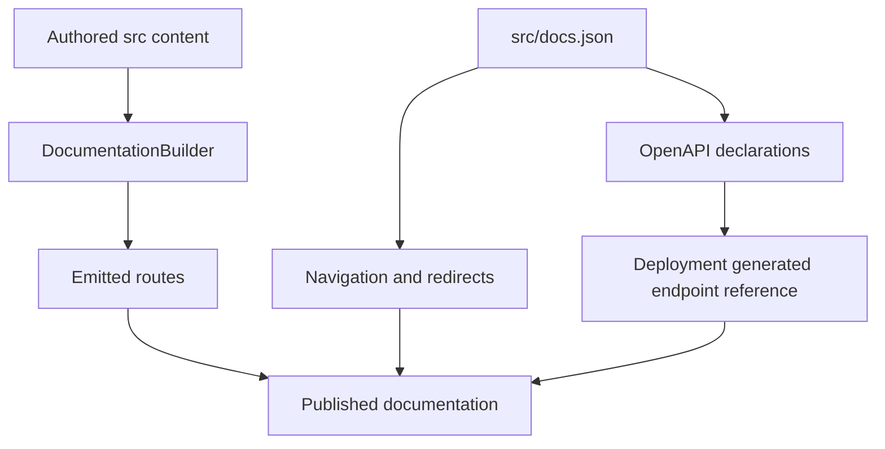

`src/` is authored input, not the published-site hierarchy. Keep these ownership planes separate:

1. **Route emission:** `DocumentationBuilder` processes source families into disposable build routes.
2. **Navigation and compatibility:** `src/docs.json` explicitly defines Mintlify labels, ordering, page placement, redirects, and OpenAPI declarations.
3. **Deployment-generated reference:** Mintlify generates API endpoint pages from declared OpenAPI specifications during deployment.
4. **Product documentation:** an MDX directory expresses authoring ownership, not necessarily the product name or sidebar location.

```mermaid
flowchart TD
    Source["Authored src content"] --> Builder["DocumentationBuilder"]
    Builder --> Routes["Emitted routes"]
    Config["src/docs.json"] --> Navigation["Navigation and redirects"]
    Config --> Specs["OpenAPI declarations"]
    Specs --> Reference["Deployment generated endpoint reference"]
    Routes --> Published["Published documentation"]
    Navigation --> Published
    Reference --> Published
```

The diagram shows independent publication inputs: emitting an MDX route does not add it to navigation, and a generated endpoint page is not authored MDX. Do not treat `build/` as durable source.

## Builder-owned route emission

A full build recreates the build directory, renders OSS Python and JavaScript output, renders special unversioned and LangSmith families, and then copies shared inputs. MDX is preprocessed; supported non-MDX files are copied. Collection rejects source-tree symlinks and files whose resolved path escapes the collection root, preventing a build artifact from copying host data.

| Authored family | Emitted route family | Rule |
| --- | --- | --- |
| Shared `src/oss/` content | `/oss/python/...` and `/oss/javascript/...` | Rendered twice with language-conditional content selected per target. |
| `src/oss/python/` or `src/oss/javascript/` | Its corresponding language tree only | The source language directory is removed from the emitted path; the other pass skips it. |
| `src/oss/openwiki/` | `/oss/openwiki/...` | Rendered once with Python conditional content. |
| `src/oss/deepagents/code/` | `/oss/deepagents/code/...` | Rendered once with Python conditional content. |
| Ordinary `src/langsmith/` | `/langsmith/...` | Rendered once, unversioned, with Python conditional content. |
| Direct `src/langsmith/managed-deep-agents*.mdx` | `/langsmith/python/...` and `/langsmith/javascript/...` | Excluded from ordinary LangSmith output and rendered once per language. |
| `src/snippets/`, assets, `docs.json`, JS, and CSS | Shared build inputs | Supporting content or runtime configuration; navigation is still explicit. |

Preprocessing scopes unqualified snippet imports under `/snippets/python/` or `/snippets/javascript/` and rewrites eligible `/oss/` links. Images, already-qualified links, and the unversioned OpenWiki and Deep Agents Code roots stay unprefixed.

### Intentional route exceptions

**OpenWiki** and **Deep Agents Code** each have a single unversioned OSS route family. `docs.json` may reference an OpenWiki route in both Build language menus, but those are two navigation references, not two emitted pages. Deep Agents Code is instead a Products and setup item; redirects preserve former language-prefixed Code URLs.

**Managed Deep Agents** is the inverse: one authored family produces Python and JavaScript routes. Its Build tabs select the respective variant, while unversioned Managed Deep Agents URLs redirect to Python. Do not add duplicate unversioned MDX; verify both variants and their redirects.

## `docs.json`: navigation, redirects, and product projection

`src/docs.json` is the sidebar source of truth, not a directory scan. A built route may be unlisted, and a redirect is a compatibility rule rather than content. Add or move an `index.mdx` only with the corresponding explicit page reference and any needed redirect.

### Build menus

Python and TypeScript Build integration menus intentionally use different group structures. Component landing pages need an explicit language-qualified placement. Shared `src/oss/langchain/mcp/` source emits to both language trees and is listed in both menus, while `src/oss/javascript/migrate/langchain-mcp-adapters.mdx` is JavaScript-only in both output and navigation.

### LangSmith source versus displayed product

Ordinary `src/langsmith/` content emits unversioned even where the displayed product differs from the directory. The current projection includes:

| Authored cluster or route | `docs.json` placement |
| --- | --- |
| `langsmith/application-structure.mdx` | Deploy → Agent Server → Develop your application |
| `langsmith/sandboxes.mdx` and resource-use guides | Deploy → Sandboxes tab |
| Self-hosted sandbox architecture, scaling, and operations | Deploy → Self-hosted → Install an instance → Additional features → Enable Sandboxes |
| `langsmith/llm-gateway*.mdx` | Products and setup → LLM Gateway: Get started, Core capabilities, Administration and governance, and Advanced |
| `langsmith/fleet/` | Products and setup → No-code agents: Get started, Configure, Tools and automation, Advanced, and Additional resources |
| `langsmith/engine*.mdx` | Products and setup → Engine |
| `langsmith/managed-deep-agents*.mdx` | Build → language-specific Managed Deep Agents tabs |
| `oss/deepagents/code/` | Products and setup → Deep Agents Code |

This is user-facing taxonomy, not a reason to move files. The self-hosted overview makes the boundary explicit: base LangSmith is extended by optional Sandboxes, Engine, Fleet, LLM Gateway, and Deployment; those optional components have distinct prerequisites and operational owners.

## Product clusters that affect safe route changes

### Application and Agent Server

`application-structure.mdx` is a deployment-authoring guide, not a navigation mechanism. A deployable LangSmith application supplies graphs, `langgraph.json`, dependencies, and optionally environment variables. The route belongs in Agent Server’s **Develop your application** group because `docs.json` says so, not because the file is called `application-structure`.

### LLM Gateway

The standard gateway authenticates and authorizes the caller, resolves route and upstream credential, evaluates governance policies, translates formats where needed, invokes the provider, and records trace and usage metadata. Direct model access retains identity, credential resolution, policy enforcement, and tracing but skips translation. Gateway Credits use LangChain-hosted models with a LangSmith API key and no provider secret; provider-prefixed model IDs use configured provider secrets.

The self-hosted source is an operational extension of that same product route: Helm chart version 0.17.1 or later enables `agent-gateway`; it needs PostgreSQL, Redis, and other LangSmith services. The intended external path is the shared ingress at `/gateway/`, and disabling it removes the service and makes gateway-routed calls fail. Do not model this as a separate emitted documentation family.

### Sandboxes

The **Sandboxes** tab owns managed-resource usage: SDK and CLI access, snapshots, service URLs, auth proxy, mounts, permissions, and Harbor. Restricted-egress sandboxes cannot evade the managed allowlist by naming additional proxy destinations.

Keep these related surfaces distinct:

- **Managed Deep Agents sandboxes** are a deployment-owned integration with LangSmith Sandboxes. A `sandbox/` declaration enables it, and reuse is one sandbox per durable thread.
- **Deep Agents Code remote sandboxes** keep the `dcode` LLM loop, memory, and tool dispatch local; only filesystem and command tools execute remotely.
- **Self-hosted Sandboxes** are infrastructure. `sandbox-host` pods manage Firecracker microVMs on dedicated KVM-capable nodes, while shared storage separates persistent state from a specific node. A graceful stop may save memory for a later restore, but host loss loses running memory and clients must reconnect.

### Fleet and Engine

`src/langsmith/fleet/` documents the no-code agent product. Its landing page describes template-based agent creation, connected accounts, and approvals; the navigation groups configuration, automation, code/API and MCP integration, oversight, and self-hosted material under **No-code agents**. It is ordinary unversioned LangSmith output.

`engine*.mdx` is likewise ordinary unversioned output projected under **Engine**. Engine’s documented lifecycle is: detect recurring trace issues, diagnose them against traces and optional connected source, propose a pull request, track matching traces and dataset examples, and reopen a closed issue if it resurfaces. On self-hosted installs it remains an optional feature with prerequisites including Sandboxes; source placement does not establish those requirements.

### Self-hosted LangSmith

`self-hosted.mdx` is the overview for operating LangSmith in customer infrastructure. It separates base platform services from optional features and directs an operator to feature-specific setup. In particular, Fleet does not require LangSmith Deployment; Engine needs Sandboxes and entitlement; and LLM Gateway deploys `agent-gateway`. Keep feature configuration documentation in its authored LangSmith source and use `docs.json` only for reader placement.

### Other mapped LangSmith and OSS boundaries

- `langsmith/agents.mdx` and its environment, navigation, creation, UI, and deployment companions are projected as **Agent-based workspaces (Beta)** under Products and setup → LangSmith setup → Overview; they are not a special builder family.
- The control plane stores Agent Server deployment desired state. A data-plane listener polls its APIs and reconciles deployments, revisions, and deletion; the control plane never initiates a connection to the data plane.
- Self-hosted **SmithDB** is an opt-in columnar trace datastore using object storage and a per-pod disk cache, and can operate alongside ClickHouse. Its dedicated group describes staged rollout: deploy service, dual ingest, optionally migrate history, then cut queries over. Dual ingestion does not turn on SmithDB-gated features.
- LangGraph checkpointers persist graph state per thread, while stores hold application-defined key-value data across threads; Agent Server hosts both mechanisms. Deep Agents long-term memory is filesystem-backed, with backend choice determining storage and access, while short-term conversation memory is thread-scoped state.

## Deployment-generated API reference

The `docs.json` OpenAPI declarations create endpoint-reference pages during deployment. Authored overview pages are routes; generated endpoint pages are not local build artifacts.

| Surface | Specification input | Generated location |
| --- | --- | --- |
| Agent Server API | Committed `src/langsmith/agent-server-openapi.json` | `langsmith/agent-server-api` |
| Control Plane API | `https://api.host.langchain.com/openapi.json` | Mintlify default location |
| LangSmith REST API | Committed `src/langsmith/langsmith-platform-openapi.json` | `langsmith/smith-api` |

The LangSmith REST specification is a committed, post-processed input. The processor restricts live fetches to the LangSmith API host, hides fleet/internal/health operations, assigns readable tag groups, and normalizes visible titles. Its daily workflow writes nothing when the committed specification is unchanged; otherwise it appends to the one open `chore/refresh-langsmith-openapi` pull request.

## Safe change procedure

1. Start from the public URL and classify it as authored route emission, navigation, redirect, or deployment-generated reference.
2. Change the appropriate source family for content and `src/docs.json` separately for labels, order, placement, redirects, or OpenAPI declarations.
3. For ordinary OSS content, verify Python and JavaScript output. For OpenWiki and Deep Agents Code, verify the single unversioned output and preserve unprefixed links.
4. For Managed Deep Agents, verify both language outputs and unversioned-to-Python redirects.
5. For product changes, retain the owning `src/langsmith/` family; update the explicit projection rather than moving files to mirror UI labels.
6. For self-hosted pages, distinguish a product-use guide from installation, infrastructure, and optional-feature prerequisites.
7. Change generated endpoint reference through its OpenAPI input and declaration, never through fictional generated MDX. Review the processor and refresh workflow for LangSmith REST changes.
8. Extend focused `tests/unit_tests/test_builder.py` coverage when source-family routing, preprocessing, special-family behavior, or source-tree safety changes.

## Related pages

- [Build system](/openwiki/architecture/build-system.md)
- [Versioning](/openwiki/concepts/versioning.md)
- [Reference docs](/openwiki/integrations/reference-docs.md)
- [Adding pages](/openwiki/operations/adding-pages.md)
- [LangSmith OpenAPI refresh](/openwiki/workflows/langsmith-openapi-refresh.md)
