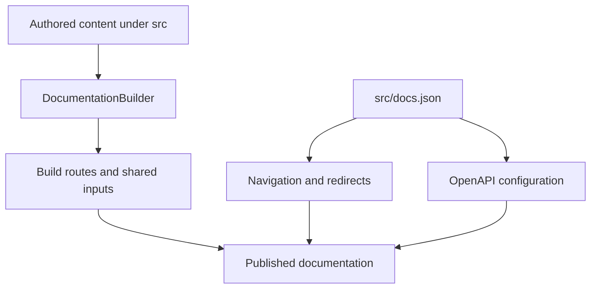

`src/` is an authored-content tree, not the public site map. `DocumentationBuilder` transforms supported source inputs into `build/`; independently, `src/docs.json` projects those routes into Mintlify menus and supplies redirects and OpenAPI configuration. Consequently, an emitted route need not be navigated, and a navigation label need not match its source directory: `src/langsmith/fleet/` is presented as **No-code agents**.

```mermaid
flowchart TD
    Source["Authored content under src"] --> Builder["DocumentationBuilder"]
    Builder --> Output["Build routes and shared inputs"]
    Config["src/docs.json"] --> Navigation["Navigation and redirects"]
    Config --> Api["OpenAPI configuration"]
    Output --> Site["Published documentation"]
    Navigation --> Site
    Api --> Site
```

This flow separates route emission from Mintlify presentation and deployment-owned API reference.

## Ownership boundaries

| Concern | Durable owner | Change implication |
| --- | --- | --- |
| Page processing and output path | `src/` plus `pipeline/core/builder.py` | Select the emission family first, then check the emitted path. |
| Tabs, groups, ordering, visibility, and redirects | `src/docs.json` | Add or move an emitted route explicitly; directory placement alone does not add navigation. |
| Shared imports and static inputs | `src/snippets/`, assets, root CSS/JS, and `docs.json` | These are copied/imported inputs, not ordinary menu pages. |
| Endpoint reference | OpenAPI entries in `docs.json` and Mintlify deployment | Change the specification or configuration, not a hypothetical endpoint MDX page. |

## Emission families and control flow

`build_all()` deletes the previous build directory, emits the two OSS language trees, emits Deep Agents Code and OpenWiki once, emits ordinary LangSmith pages and then Managed Deep Agents variants, copies shared inputs, and copies available sandbox components from `@langchain/docs-sandbox`. `TEMPLATE.mdx` and unsupported extensions do not emit.

| Authored family | Output | Rule that matters |
| --- | --- | --- |
| Shared OSS, including `src/oss/langchain/`, `langgraph/`, and `deepagents/` except `code/` | `/oss/python/...` and `/oss/javascript/...` | Conditional `:::python` and `:::js` content resolves once per target. |
| `src/oss/python/` or `src/oss/javascript/` | Only its corresponding output tree | The source-language segment is removed; the opposite subtree is skipped. |
| `src/oss/openwiki/` | `/oss/openwiki/...` once | Uses the Python conditional branch, with no language copies. |
| `src/oss/deepagents/code/` | `/oss/deepagents/code/...` once | Also uses the Python conditional branch, with no language copies. |
| Ordinary `src/langsmith/` files | `/langsmith/...` | Built with the Python target; placement under Test, Deploy, Monitor, or setup is a navigation decision. |
| Direct `src/langsmith/managed-deep-agents*.mdx` files | `/langsmith/python/...` and `/langsmith/javascript/...` | Excluded from ordinary unversioned LangSmith emission. |
| `src/snippets/` | Importable MDX/component inputs, including language-scoped MDX copies | Not navigation pages. |

### Language-aware processing

For a target language, the builder preprocesses MDX—including conditional blocks—then scopes unqualified MDX snippet imports under `/snippets/python/` or `/snippets/javascript/`, rewrites eligible absolute `/oss/` links, and rewrites unversioned Managed Deep Agents links to the target-language route. It preserves already-qualified OSS links, image paths, and the unversioned OpenWiki and Deep Agents Code roots.

Shared MDX snippets are emitted in Python and JavaScript forms with absolute language-prefixed links; the original snippet path is a Python-default form for unversioned consumers. This prevents nested pages from relying on a fragile relative link depth. Local `.jsx` and `.tsx` snippet components remain shared, and the build may overwrite selected sandbox components with the installed npm package versions.

## Navigation is a projection

The **AGENT DEVELOPMENT LIFECYCLE** product contains Home, Build, Test, Deploy, and Monitor. Build has Python and TypeScript dropdowns and can reference OSS and LangSmith output; Test, Deploy, Monitor, and setup mostly project ordinary `src/langsmith/` pages. The **PRODUCTS AND SETUP** product separately exposes LLM Gateway, No-code agents, Engine, and Deep Agents Code. A route change and its menu placement are therefore independent changes.

Notable projections:

- **OpenWiki** places the same unversioned `/oss/openwiki/...` routes in both Build dropdowns. This duplicates presentation, not route trees.
- **Deep Agents Code** is an unversioned Products and setup surface. Its expanded **Configuration** group is rooted at `oss/deepagents/code/configuration` and contains credentials, config file, hooks, and MCP tools. The landing page defines distinct resolution rules for general options, provider keys, dotenv files, and provider endpoints.
- **Engine** is a flat, six-route Products and setup surface: overview, issue workflow, GitHub integration, notifications, security, and self-hosted documentation. Its issue workflow detects recurring trace issues, diagnoses a root cause, proposes a pull request, tracks matching traces and dataset examples, and reopens an issue if it resurfaces.

### Evaluation and integrations

Evaluator documents are ordinary unversioned LangSmith pages, but navigation is organized by reader workflow: evaluation concepts appear in Test; evaluator management and implementation guidance are in Test → **Evaluators**; production evaluator configuration is in Monitor → Observe → **Online evaluators**. This aligns with the content model: offline evaluation runs against dataset examples and can use reference outputs, whereas online evaluation runs against production runs or threads without them. Workspace-level evaluators can attach to multiple projects and datasets.

The two Build **Integrations** tabs intentionally differ. Python uses **Popular Providers** and **Integrations by component**; the latter contains the checkpointer and long-term-memory landing pages. Checkpointers persist and resume LangGraph state, while stores persist and retrieve long-term memory across threads. TypeScript instead uses **Popular Providers**, **General integrations**, and **RAG integrations**. Thus the separate Python and JavaScript `all_providers.mdx` sources are emitted only in their respective families, and a JavaScript page such as `integrations/chat/openrouter.mdx` cannot be a Python route.

## Managed Deep Agents

A direct `managed-deep-agents*.mdx` file produces both language variants. `docs.json` places those variants in the matching Build → **Managed Deep Agents** tab; both variants put Identity in **Agent capabilities** and Deploy in **Build and deploy**. The source's conditional fences supply the language-specific content, while link rewriting keeps links within the selected variant.

There is no ordinary unversioned emitted MDA page. `docs.json` redirects unversioned Managed Deep Agents URLs, including overview, identity, and deploy, to Python routes. Preserve that convention rather than adding a duplicate MDX file that would sit outside the managed navigation.

## Deployment-generated reference

`docs.json` configures three OpenAPI surfaces:

| Surface | Specification source | Configured generated directory |
| --- | --- | --- |
| Agent Server API | Committed `src/langsmith/agent-server-openapi.json` | `/langsmith/agent-server-api/` |
| Control Plane API | Remote `https://api.host.langchain.com/openapi.json` | No directory configured |
| LangSmith REST API | Committed `src/langsmith/langsmith-platform-openapi.json` | `/langsmith/smith-api/` |

Mintlify generates endpoint pages during deployment, rather than from authored MDX. Accordingly, local link checks filter deployment-only OpenAPI reports and standalone snippet reports; `make broken-links` first builds, invokes `mint broken-links --check-redirects`, filters known false positives, and fails if actionable indented reports remain.

## Invariants and safe changes

- Source collection skips symlinks and files resolving outside the collected root, so a committed source path cannot pull host files into build artifacts.
- When changing route policy, link rewriting, snippets, an unversioned product, or Managed Deep Agents, extend focused `tests/unit_tests/test_builder.py` coverage and inspect the build output for every relevant family.
- Start from the intended route, identify its emission family, and then update `docs.json` independently. Explicitly check both language outputs for ordinary shared OSS content; check only the unversioned route for OpenWiki and Deep Agents Code.
- For an integration, place the source in the language subtree and add its emitted route to that language's current navigation group. For MDA, test both variants and preserve the unversioned-to-Python redirect. For OpenAPI, update the spec/configuration rather than adding endpoint MDX.

## Related pages

- [Build system](/openwiki/architecture/build-system.md)
- [Versioning](/openwiki/concepts/versioning.md)
- [Mintlify integration](/openwiki/integrations/mintlify.md)
- [Adding pages](/openwiki/operations/adding-pages.md)
- [Quickstart](/openwiki/quickstart.md)
