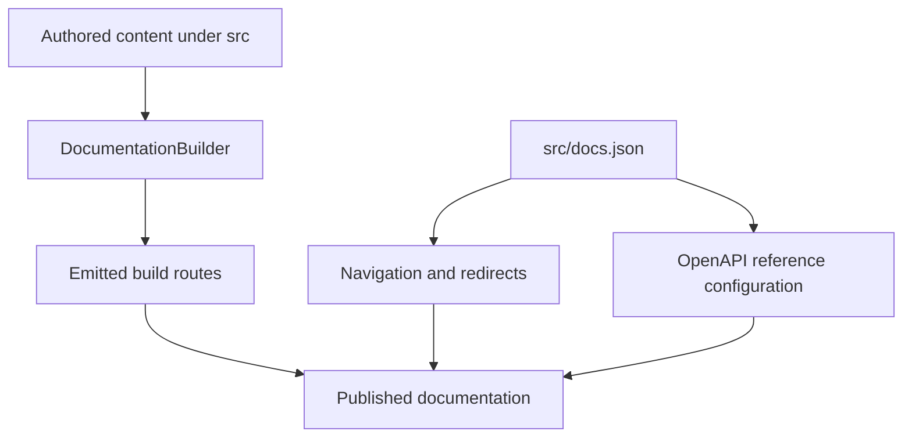

`src/` is an authored-content tree, not a public-site hierarchy. Three independent contracts make a page discoverable:

1. **Source ownership and emission** — `DocumentationBuilder` chooses which source family a file belongs to, creates its route(s), and applies language preprocessing.
2. **Navigation projection** — `src/docs.json` names the menus, tabs, groups, ordering, and visible routes. A menu label is not a source-directory owner: for example, `src/langsmith/fleet/` is projected as **No-code agents**.
3. **Deployment-generated reference** — OpenAPI entries in `docs.json` cause Mintlify to generate endpoint reference during deployment; those endpoint pages do not originate as authored MDX.

```mermaid
flowchart TD
    Source["Authored content under src"] --> Builder["DocumentationBuilder"]
    Builder --> Routes["Emitted build routes"]
    Config["src/docs.json"] --> Navigation["Navigation and redirects"]
    Config --> Reference["OpenAPI reference configuration"]
    Routes --> Site["Published documentation"]
    Navigation --> Site
    Reference --> Site
```

This flow separates route emission, navigation projection, and deployment-generated reference.

## Ownership boundaries

| Contract | Owner | Safe change rule |
| --- | --- | --- |
| Emitted path and language variants | Source family plus `pipeline/core/builder.py` | Establish the source family and inspect its emitted route(s). |
| Menus, tabs, groups, ordering, visibility, and redirects | `src/docs.json` | Add or move every route explicitly; placing a file in a directory does not add it to a menu. |
| Shared imports and static inputs | `src/snippets/`, assets, and root shared inputs | Treat them as copied/imported inputs, not ordinary navigation pages. |
| Endpoint reference pages | OpenAPI declarations in `docs.json` and Mintlify deployment | Update the declared specification or configuration, not invented endpoint MDX. |

## Route-emission families

`build_all()` clears the prior build directory, emits Python and JavaScript OSS trees, emits Deep Agents Code and OpenWiki once, emits ordinary LangSmith content, emits Managed Deep Agents language variants, then copies shared files and sandbox components. `TEMPLATE.mdx` and unsupported extensions do not emit.

| Authored family | Emitted route family | Important rule |
| --- | --- | --- |
| Shared OSS material | `/oss/python/...` and `/oss/javascript/...` | Conditional `:::python` and `:::js` content is resolved per target. |
| `src/oss/python/` or `src/oss/javascript/` | Its corresponding language tree only | The source-language segment is removed; the opposite subtree is skipped. |
| `src/oss/openwiki/` | `/oss/openwiki/...` once | Built with the Python conditional branch, without language copies. |
| `src/oss/deepagents/code/` | `/oss/deepagents/code/...` once | Also built with the Python conditional branch, without language copies. |
| Ordinary `src/langsmith/` content | `/langsmith/...` | Built as unversioned content with the Python target; its lifecycle menu placement is a separate `docs.json` decision. |
| Direct `src/langsmith/managed-deep-agents*.mdx` files | `/langsmith/python/...` and `/langsmith/javascript/...` | Excluded from ordinary LangSmith emission. |
| `src/snippets/` | Shared and language-scoped import inputs | Not menu pages. |

### Language processing and links

For a language target, the builder preprocesses MDX, resolves conditional blocks, scopes unqualified MDX snippet imports under `/snippets/python/` or `/snippets/javascript/`, rewrites eligible absolute `/oss/` links, and rewrites unversioned Managed Deep Agents links to the target variant. It deliberately leaves language-qualified OSS links, image paths, OpenWiki, and Deep Agents Code URLs untouched. This preserves the unversioned product roots while ensuring shared OSS links follow the selected language.

Shared MDX snippets receive Python and JavaScript copies with absolute language-prefixed OSS links, so a nested consumer does not depend on its relative path depth. Local `.jsx` and `.tsx` snippet components remain shared.

## Mintlify navigation is a projection

The **AGENT DEVELOPMENT LIFECYCLE** product contains Home, Build, Test, Deploy, and Monitor. Build presents Python and TypeScript dropdowns and can project both OSS and LangSmith output. Test, Deploy, Monitor, and setup largely project ordinary unversioned LangSmith routes. The separate **PRODUCTS AND SETUP** product projects LLM Gateway, No-code agents, Engine, and Deep Agents Code. Therefore a route change and a menu-placement change are independent work.

### OSS and Managed Deep Agents

- **OpenWiki** appears in both Build language dropdowns, but both entries point at the same unversioned `/oss/openwiki/...` routes; this is duplicated presentation, not duplicated output.
- **Deep Agents Code** is an unversioned Products and setup surface. Its explicit **Configuration** group is rooted at `oss/deepagents/code/configuration` and includes credentials, config file, hooks, and MCP tools.
- **Managed Deep Agents** sources emit both language variants and each Build dropdown projects its own variant. `docs.json` redirects legacy/unversioned Managed Deep Agents URLs to Python, so do not create an unversioned duplicate page.
- `langsmith/application-structure` and `langsmith/sandboxes` are both ordinary unversioned LangSmith output, but the former is under Deploy → Agent Server → Develop your application and the latter leads the separate Deploy → Sandboxes tab.

### Integrations are language-owned sources, not labels

The Python and TypeScript Build **Integrations** tabs deliberately use different navigation structures. Python places `providers/overview` and `providers/all_providers` before **Popular Providers** and **Integrations by component**; its component group includes landing pages such as chat, middleware, checkpointers, long-term memory, and document loaders. TypeScript uses **Popular Providers**, **General integrations**, and **RAG integrations**; the same `stores` landing route is intentionally shown in two TypeScript groups.

A Python-only provider listing source emits only into Python, and a JavaScript chat source emits only into JavaScript. Navigation must name its language-prefixed emitted route explicitly. A component landing page is an authored page plus a `docs.json` placement; a nearby integration document is not automatically listed merely because its directory sounds related.

### LangSmith product surfaces

`src/langsmith/` owns these authored families, while `docs.json` chooses their product labels and groups:

| Authored family | Projection | What the mapping conveys |
| --- | --- | --- |
| `langsmith/fleet/` | **No-code agents** | Fleet is a no-code agent surface, organized into get-started, configuration, tools and automation, advanced, and resource groups. The essentials page documents core agent capabilities such as tools, channels, memory, sub-agents, and approvals. |
| `langsmith/llm-gateway*.mdx` | **LLM Gateway** (Beta) | Gateway gets its own overview, quickstart, behavior/API-format pages, then Core capabilities, Administration and governance, and Advanced groups. Gateway Credits is a core-capability route, not a separate source family. |
| `langsmith/engine*.mdx` | **Engine** | The flat surface projects overview, issue workflow, GitHub integration, notifications, security, and self-hosted operations. |
| evaluator pages under `langsmith/` | Test and Monitor workflow groups | `tuned-evaluators` is projected under Monitor → Observe → Online evaluators even though it is ordinary unversioned LangSmith content. |

This product map should be read as presentation, not directory ownership. In particular, Engine’s lifecycle and self-hosted behavior are described by its authored content, while the **Engine** label and six-route grouping are configured independently in `docs.json`.

## Product-specific operational boundaries

### LLM Gateway

The gateway sits between an application and configured model providers. Its request path authenticates and authorizes the caller, resolves a model route and upstream credential, evaluates spend/rate/model-access/data policies, translates formats if required, invokes the provider, translates the response, then records trace and usage metadata. Direct provider access bypasses only the request/response translation; it still authenticates, enforces policy, resolves credentials, and traces the call.

The documentation family distinguishes two credential paths: an administrator can store a provider secret, or Gateway Credits can use LangChain-hosted models with a LangSmith API key and no provider secret. This is why credits belong beneath the gateway surface rather than under provider integrations.

### Engine

Engine’s authored overview defines a closed loop: it detects recurring production-trace issues, diagnoses a root cause, proposes a fix, attaches later matching traces, and reopens a closed issue if the issue returns. It also creates ground-truth dataset examples from production inputs. The product surface links this lifecycle to setup, GitHub, notifications, security, and self-hosted operations.

For self-hosted use, orchestration remains in the customer VPC, but model work calls LangSmith Intelligence (LSI) with a short-lived license JWT. The cluster must permit outbound HTTPS to LSI; if LSI is unavailable, Engine fails that work and retries on a later scheduled scan rather than falling back to an in-cluster model or a secondary provider. Installation also requires an entitled Helm chart and a separately configured Engine feature path.

### Fleet and online evaluators

Fleet’s navigation label intentionally conceals its source directory (`fleet/`): it exposes no-code agents that can use channels, tools, configured connections, instructions, knowledge, schedules, and approvals. An approval set to **Ask** pauses the agent until a person accepts or rejects the tool action.

LangChain Tuned Evaluators are a separate ordinary LangSmith page projected under online evaluation. A tuned evaluator selects eligible threads, evaluates them with a LangChain-managed specialized judge, and attaches feedback and an explanation. Organization enablement and compatible thread/message prerequisites gate creation; disabling the organization feature pauses saved evaluators rather than deleting their configuration.

## Deployment-generated API reference

`docs.json` configures three OpenAPI surfaces:

| Surface | Specification source | Configured generated directory |
| --- | --- | --- |
| Agent Server API | Committed `src/langsmith/agent-server-openapi.json` | `/langsmith/agent-server-api/` |
| Control Plane API | Remote `https://api.host.langchain.com/openapi.json` | No directory configured |
| LangSmith REST API | Committed `src/langsmith/langsmith-platform-openapi.json` | `/langsmith/smith-api/` |

Mintlify generates endpoint pages during deployment rather than from authored MDX. Authored reference overview pages may sit adjacent to the generated sections, but they do not replace the endpoints.

## Invariants and safe changes

- Source collection rejects symlinks and paths resolving outside the collected root; a committed source path cannot import host files into build artifacts.
- Start from the intended public route, identify the emission family, then update `docs.json` separately. Test both language outputs for shared OSS content and only the unversioned route for OpenWiki or Deep Agents Code.
- For integrations, place a source in the appropriate language subtree and explicitly list the emitted language route in that language’s current navigation grouping.
- For Managed Deep Agents, test both variants and preserve the unversioned-to-Python redirect convention.
- For Gateway, Engine, Fleet, or evaluator content, retain the underlying `langsmith/` route family and change product placement only through `docs.json`.
- For OpenAPI, update the specification/configuration rather than adding endpoint MDX. Extend focused `tests/unit_tests/test_builder.py` coverage when changing route policy, preprocessing, snippets, or an unversioned product.

## Related pages

- [Build system](/openwiki/architecture/build-system.md)
- [Versioning](/openwiki/concepts/versioning.md)
- [Mintlify integration](/openwiki/integrations/mintlify.md)
- [Integration listing automation](/openwiki/workflows/integration-listing-automation.md)
- [Versioned content](/openwiki/workflows/versioned-content.md)
