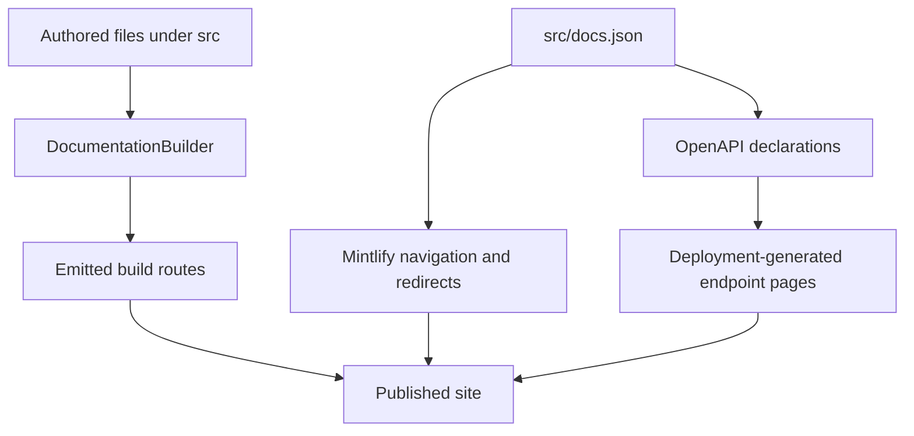

`src/` is an authored-content tree, not the public-site hierarchy. A page can be emitted without being discoverable in a menu, and a discoverable reference endpoint might have no authored MDX file. Treat these as three separate contracts:

1. **Emission:** `DocumentationBuilder` selects a source family, writes one or more routes, and applies language-aware processing.
2. **Navigation and compatibility:** `src/docs.json` owns Mintlify menus, labels, ordering, OpenAPI declarations, and redirects.
3. **Deployment-generated reference:** Mintlify reads the declared OpenAPI specifications and creates endpoint pages during deployment.

```mermaid
flowchart TD
    Source["Authored files under src"] --> Builder["DocumentationBuilder"]
    Builder --> Routes["Emitted build routes"]
    Config["src/docs.json"] --> Nav["Mintlify navigation and redirects"]
    Config --> OpenAPI["OpenAPI declarations"]
    OpenAPI --> Generated["Deployment-generated endpoint pages"]
    Routes --> Site["Published site"]
    Nav --> Site
    Generated --> Site
```

This diagram shows the ownership boundary: route emission, menu projection, and generated reference are independent inputs to the published site.

## Route emission

A full build removes and recreates the build directory, emits Python and JavaScript OSS trees, emits unversioned product families, and then copies shared inputs. Only supported extensions are copied; `TEMPLATE.mdx` is skipped. The collector rejects symlinks and files resolving outside its root, so a source-tree link cannot import host files into an artifact.

| Authored family | Emitted route family | Rule |
| --- | --- | --- |
| Shared OSS content under `src/oss/` | `/oss/python/...` and `/oss/javascript/...` | Build twice, resolving Python/JS conditional content for each target. |
| `src/oss/python/` or `src/oss/javascript/` | The matching language tree only | The language source segment is removed; the opposite-language pass skips it. |
| `src/oss/openwiki/` | `/oss/openwiki/...` | Build once; conditional content uses the Python target. |
| `src/oss/deepagents/code/` | `/oss/deepagents/code/...` | Build once; conditional content uses the Python target. |
| Ordinary `src/langsmith/` | `/langsmith/...` | Build once as unversioned LangSmith content, with the Python target. |
| Direct `src/langsmith/managed-deep-agents*.mdx` | `/langsmith/python/...` and `/langsmith/javascript/...` | Omitted from the ordinary pass and rendered once per language. |
| `src/snippets/`, images, fonts, root configuration, JS, and CSS | Shared build inputs | Copied or processed for import/runtime use rather than inferred as navigation pages. |

For a language render, the builder preprocesses MDX, scopes unqualified MDX snippet imports to `/snippets/python/` or `/snippets/javascript/`, rewrites eligible absolute `/oss/` links, and rewrites unversioned Managed Deep Agents links to the current language. It intentionally does **not** prefix already language-qualified paths, images, OpenWiki, or Deep Agents Code, because those products have single-route roots.

### Exceptions to the ordinary language split

**OpenWiki** and **Deep Agents Code** are unversioned OSS products. The Build UI repeats OpenWiki routes in both language dropdowns; that is two navigation projections of one route set, not two generated trees. Deep Agents Code is instead presented under **Products and setup**.

**Managed Deep Agents** is the converse: direct source files build Python and JavaScript variants, while unversioned legacy URLs redirect to Python. Do not add authored unversioned duplicates. When changing this family, verify both outputs and the corresponding redirect behavior.

## Navigation is explicit, not a source-tree scan

`src/docs.json` starts with the **AGENT DEVELOPMENT LIFECYCLE** product (Home, Build, Test, Deploy, and Monitor) and has a separate **PRODUCTS AND SETUP** product. The root `src/index.mdx` is the Home page and links readers into lifecycle and product routes, but its cards do not define sidebar placement. A directory name likewise does not define a public label.

### Build navigation

Build provides Python and TypeScript dropdowns. Each dropdown contains language-specific OSS output, plus selected LangSmith content such as its respective **Managed Deep Agents** tab. The Managed Deep Agents tabs now expose grouped get-started, agent-capability, and build/deploy routes in both languages; redirects preserve unversioned incoming links to the Python variant.

The **OpenWiki** tab appears in both language dropdowns even though its output remains `/oss/openwiki/...`. The two **Integrations** tabs intentionally differ:

- Python leads with provider overview/all providers and **Popular Providers**, then places component landing pages under **Integrations by component**.
- TypeScript groups the same broad area as **Popular Providers**, **General integrations**, and **RAG integrations**. A TypeScript route can deliberately occur in more than one group, such as stores.

Thus, an integration `index.mdx` is not discoverable merely because it exists. It needs the appropriate explicitly language-prefixed `docs.json` route. The document-loader landing pages illustrate both route ownership and the content divergence: Python documents `load()` and `lazy_load()`, while JavaScript documents `load()` and `loadAndSplit()` and subdivides file versus web loaders.

Shared MCP source under `src/oss/langchain/mcp/` is emitted for both languages and listed in both Advanced usage → MCP groups. The JavaScript MCP adapter v2 migration guide is language-specific, so it has only the JavaScript migration route and menu entry. The shared overview itself selects the relevant language branch: Python documents `langchain.mcp`/FastMCP, while JavaScript requires `@langchain/mcp-adapters` 2.0 or later and directs 1.x users to the migration guide.

### Expanded LangSmith navigation and labels

Ordinary files under `src/langsmith/` still emit as unversioned `/langsmith/...` pages. Their placement can be far from the source directory semantics:

| Source / route family | Current navigation projection | Important distinction |
| --- | --- | --- |
| `langsmith/agents.mdx` and related pages | Products and setup → LangSmith setup → Overview → **Agent-based workspaces** (Beta) | The group contains Agents, environments, navigation, creation, UI building, and deployment-to-environment pages; it is not a separate builder family. |
| `langsmith/application-structure.mdx` | Deploy → Agent Server → **Develop your application** | Ordinary unversioned LangSmith output. |
| `langsmith/sandboxes.mdx` | Deploy → **Sandboxes** | The landing page of a separate tab, still ordinary unversioned output. |
| `langsmith/fleet/` | Products and setup → **No-code agents** | “Fleet” is source ownership, not the reader-facing product name. |
| `langsmith/llm-gateway*.mdx` | Products and setup → **LLM Gateway** (Beta) | Contains introductory routes plus Core capabilities, Administration and governance, and Advanced. |
| `langsmith/engine*.mdx` | Products and setup → **Engine** | A flat product page sequence: overview, issue workflow, GitHub, notifications, security, and self-hosted. |
| `langsmith/managed-deep-agents*.mdx` | Build → language-specific **Managed Deep Agents** tabs | The one LangSmith source family that emits language-qualified routes. |

The agent-based-workspaces projection matters because its concepts are operational, not just renamed pages: a LangSmith agent is a workspace organizing unit, traces arrive under one of its four environments, and datasets/custom dashboards are scoped differently. Keep those sources in `langsmith/` and change their placement through `docs.json`, not by moving files to resemble the product label.

The product surfaces also describe real operating boundaries:

- **LLM Gateway** authenticates and authorizes each standard request, selects a route and credential, enforces spend/rate/model-access/data policies, translates when needed, invokes the provider, and records trace and usage metadata. Direct model access preserves the identity, credential, policy, and tracing steps while omitting request/response translation. Gateway Credits use LangChain-hosted upstream credentials and a LangSmith API key rather than a provider secret.
- **Engine** detects recurring trace issues, diagnoses and proposes fixes, associates later matching traces, reopens a closed issue if it recurs, and can create ground-truth dataset examples. On self-hosted LangSmith, orchestration stays in the customer VPC, but an administrator can select either LangSmith Intelligence or supported customer model providers; LSI outages stop Engine work until a later scan, while the rest of LangSmith remains unaffected.
- **No-code agents** is the Fleet label. Its sidebar exposes channels, connections and tool approval mode, knowledge, schedules, and advanced settings; tools can run automatically or pause for approval.
- **Tuned Evaluators** remain ordinary LangSmith content placed in the Monitor workflow. They select eligible threads, use LangChain-managed judges, and attach feedback; organization enablement and compatible threaded messages gate creation, and disabling pauses rather than deletes configurations.

## Deployment-generated API reference

The three OpenAPI declarations in `docs.json` create endpoint reference at deployment. Their authored overview pages are normal routes, but the endpoint pages are not authored MDX and do not appear in the local build output.

| Surface | Specification input | Mintlify directory |
| --- | --- | --- |
| Agent Server API | Committed `src/langsmith/agent-server-openapi.json` | `langsmith/agent-server-api` |
| Control Plane API | Remote `https://api.host.langchain.com/openapi.json` | Mintlify default directory |
| LangSmith REST API | Committed `src/langsmith/langsmith-platform-openapi.json` | `langsmith/smith-api` |

The LangSmith REST specification is a checked-in, post-processed publication input. `scripts/process_langsmith_openapi.py` accepts only the live LangSmith API host for network fetches, hides fleet/internal/health operations, assigns and orders public tag groups, and normalizes visible operation titles before writing the committed file. The daily workflow runs the processor, makes no commit when the result is unchanged, and appends to an existing `chore/refresh-langsmith-openapi` pull request so only one refresh PR remains open.

## Safe change procedure

1. Start from the intended public URL and determine its emission family before editing content or links.
2. For shared OSS pages, inspect Python and JavaScript output. For OpenWiki and Deep Agents Code, inspect the single unversioned output and retain their unprefixed links.
3. Add, move, or remove a menu route explicitly in `src/docs.json`; update redirects independently. Emission does not create navigation.
4. For Managed Deep Agents, test both language variants and preserve unversioned-to-Python compatibility redirects.
5. Keep LangSmith product content in the ordinary `langsmith/` source family unless it is Managed Deep Agents. Use `docs.json` to change product placement or reader-facing labels.
6. Change endpoint reference through its OpenAPI input/declaration, not by creating endpoint MDX. Review the post-processing and refresh PR for LangSmith REST changes.
7. Extend focused `tests/unit_tests/test_builder.py` coverage whenever changing route policy, rewriting, special source families, or source-tree safety.

## Related pages

- [Build system](/openwiki/architecture/build-system.md)
- [Versioning](/openwiki/concepts/versioning.md)
- [Mintlify integration](/openwiki/integrations/mintlify.md)
- [Reference docs](/openwiki/integrations/reference-docs.md)
- [Adding pages](/openwiki/operations/adding-pages.md)
