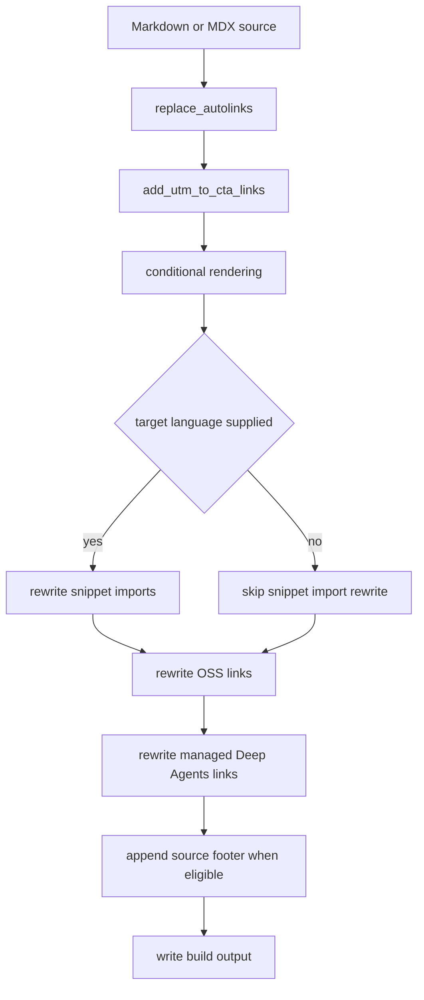

## Purpose and entrypoints

The documentation builder turns source Markdown/MDX into build output rather than copying it verbatim. `DocumentationBuilder._process_markdown_file()` reads a Markdown-family source, delegates content transformation to `_process_markdown_content()`, appends the contribution footer when applicable, changes `.md` output to `.mdx`, and writes the result. Exceptions from content processing are logged with the source path and re-raised, so an unexpected preprocessing failure fails the build rather than producing a partial file.

`preprocess_markdown()` is the core preprocessor. Its `target_language` is `python` or `js`; when the caller omits it, it reads `TARGET_LANGUAGE`, defaulting to `python`. Unless explicitly supplied, the cross-reference default scope is the target language. This is the coupling that makes one source file produce language-specific prose and API links.



This is the actual per-file transformation order. In particular, references and CTA URLs are processed **before** conditional blocks are retained or removed; the conditional pass is last within `preprocess_markdown()` so escaped `\:::` markers can be unescaped in the final content. The builder then applies the post-processing rewrites in the order shown.

## Scoped `@[]` references

Authors use semantic references instead of embedding reference-doc URLs:

```markdown
@[StateGraph]
@[state management][StateGraph]
@[`StateGraph`]
```

These become normal Markdown links using the active scope’s entry in `SCOPE_LINK_MAPS`. The simple form uses the key as its label; the two-part form uses the first bracket as custom text; and backticks in the simple form are retained in the generated label. The registry is assembled from `LINK_MAPS`: every entry supplies a host, scope, and key-to-path mapping, with relative paths expanded against the host. It provides separate `python` and `js` maps, including core APIs, Deep Agents APIs, and integration symbols. Adding or moving an API reference is therefore a registry change, not a sweep of authored URLs.

`replace_autolinks()` is line-oriented. It starts in `default_scope`; an unescaped `:::python` or `:::js` fence changes the scope for later ordinary lines, while a bare `:::` resets it to the default scope. Other fence names are also assigned as scopes by the renderer, which means their references ordinarily miss the two registered maps. The special `global` scope is not a combined lookup: it logs an error and falls back to Python.

Regular fenced code blocks—three or more backticks or tildes, including indented fences—are passed through and do not change scope. An unclosed code fence consequently prevents reference replacement for the rest of the file. A missing key is an info-level diagnostic containing file, line, name, and scope; its original `@[]` syntax remains in the output. Escape `\@[` suppresses replacement and is later unescaped.

### The checker turns diagnostics into an authoring gate

Build-time unresolved references are non-fatal by design, but `scripts/check_cross_refs.py` validates source ahead of time. It scans `.md` and `.mdx` below `src/`, ignores `snippets/code-samples/` and `node_modules`, and shares the renderer’s fence and reference patterns. It ignores escaped references and references in code fences.

The check chooses scopes from the source path: `oss/python/` is Python-only, `oss/javascript/` is JS-only, shared `oss/` content is checked in **both** scopes, and other content defaults to Python. A language conditional overrides that current scope; any other conditional fence restores the path-derived defaults. Crucially, unfenced shared-OSS content must resolve in *all* of its build scopes, not merely one. The command exits 0 when no failures exist; otherwise it prints every file, line, key, and scopes and exits 1. Fix a reported reference by correcting it or adding the appropriate map entry.

## Conditional rendering: a regex pass, not a Markdown parser

`:::python` and `:::js` blocks allow a shared source page to contain alternative content. `_apply_conditional_rendering()` requires target language `python` or `js`, retaining the matching block body and removing the nonmatching body. It leaves unsupported opening language names unchanged. The opening and closing fences must have matching indentation; escaped `\:::` markers are preserved literally after their backslashes are removed.

There is an important implementation boundary: conditional rendering uses one multiline regular expression over the complete text. Unlike autolink and UTM handling, it does **not** track Markdown code-fence state. Thus an apparent conditional block inside a fenced code example can still match and be rendered; authors who need literal conditional syntax must escape its `:::` markers. The expression is non-nesting: it pairs an opening fence with the next same-indentation unescaped closing fence. Do not rely on nested conditional blocks or malformed/unclosed fences for structured behavior.

An invalid target language raises `ValueError`. At the builder boundary that exception is logged and re-raised. There is no recover-and-continue behavior for conditional parsing errors.

## CTA decoration and post-processing rewrites

### LangSmith CTA UTM parameters

`add_utm_to_cta_links()` recognizes Markdown links whose URL begins exactly with `https://smith.langchain.com`. It decorates only the root and `/agents` paths (with or without a trailing slash), appending `utm_source=docs`, `utm_medium=cta`, `utm_campaign=langsmith-signup`, and a `utm_content` value derived from the source path after `src/` (for example, `src/langsmith/home.mdx` becomes `langsmith-home`). Existing query text and an optional Markdown link title are retained.

This narrow path allowlist intentionally leaves functional or deep links—such as settings, hubs, projects, public runs, and studio—alone, as well as other hosts such as `api.smith.langchain.com`. The transform tracks backtick and tilde code fences and does not decorate their contents. As with autolinks, a malformed unclosed fence suppresses later CTA decoration.

### Build-route rewrites

After core preprocessing, language-targeted builds rewrite supported MDX snippet imports from `/snippets/path.mdx` to `/snippets/{python|javascript}/path.mdx`. Only `from` imports ending in `.md` or `.mdx` match; already prefixed imports remain unchanged. This makes a versioned page consume the corresponding generated snippet variant.

The next pass rewrites matched Markdown and HTML absolute `/oss/` links by inserting the target URL name (`python` or `javascript`). It skips rewrites when there is no target language, the URL contains `images`, the route already starts with either language, or it is an unversioned `/oss/deepagents/code` or `/oss/openwiki` route. A final route pass rewrites `/langsmith/managed-deep-agents...` links to the target language’s managed-Deep-Agents route. These passes are regex-based URL rewriting, so use the supported Markdown/HTML link forms rather than expecting arbitrary URL text to change.

### Generated contribution footer

For source paths inside the builder’s `src_dir`, `_add_suggested_edits_link()` appends a Mintlify `source-links` section. It includes an MCP connection callout plus GitHub links to edit the exact repository-relative source path and to open an issue. The root `index.mdx` and any path component named `snippets` receive no footer; paths outside `src_dir` are returned unchanged. Footer generation is deliberately best-effort: unexpected errors are logged and leave the original content intact.

## Build variants and safe changes

The builder creates Python and JavaScript variants for ordinary `oss/` pages. `oss/deepagents/code/...` and `oss/openwiki/...` are deliberately built once, using Python to resolve conditionals while preserving their language-agnostic route. Normal `langsmith/` pages are built once with Python; managed Deep Agents pages are an exception and emit both language-prefixed routes. These output decisions explain both the post-processing target language and the checker’s path-derived scope rules.

When changing this system:

1. Add a cross-reference key to the correct scoped map and run `python scripts/check_cross_refs.py`; shared unfenced OSS prose needs an entry in both maps.
2. Put language-specific references inside the matching `:::python` or `:::js` fence. Do not put live conditional syntax in code samples without escaping it.
3. Extend `_CTA_PATHS` only for genuine conversion destinations; it controls tracking behavior globally.
4. Preserve the transformation order when adding a pass. A pass that needs original conditional alternatives must run before rendering; a pass that needs final route-specific text belongs afterward.
5. Exercise focused tests: `tests/unit_tests/test_handle_auto_links.py`, `tests/unit_tests/test_utm_links.py`, `tests/unit_tests/test_check_cross_refs.py`, and the link/import rewrite tests in `tests/unit_tests/test_builder.py` cover the principal invariants and regressions.

For build layout and target variants, see [Build System](/openwiki/architecture/build-system.md). For author-facing reference use and operational remediation, see [Reference Docs](/openwiki/integrations/reference-docs.md) and [Cross-References](/openwiki/operations/cross-references.md).
