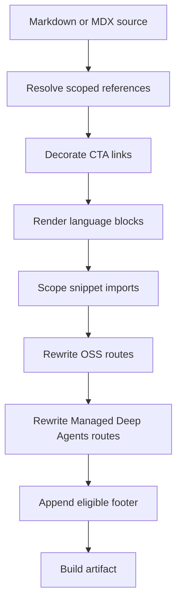

## Overview

`DocumentationBuilder` transforms source Markdown and MDX while writing build artifacts; these steps do not edit the source files under `src/`. This lets one shared page produce Python and JavaScript variants without authors manually qualifying every API reference, route, snippet import, or CTA.

For a regular Markdown file, `preprocess_markdown()` resolves scoped cross-references, decorates eligible LangSmith CTA links, and renders conditional language blocks. The builder then scopes snippet imports, rewrites routes, appends an eligible source footer, and writes the artifact.

This is the ordered regular-file path. Snippet Markdown uses a dedicated path that emits language-specific copies and bypasses footer generation.

## Entry points and language selection

`_process_markdown_file()` reads a `.md` or `.mdx` input, delegates content work to `_process_markdown_content()`, appends the footer, converts `.md` output to `.mdx`, and writes the result. `_process_markdown_content()` calls `preprocess_markdown()`, scopes Markdown snippet imports when a target is supplied, then rewrites OSS and Managed Deep Agents routes.

The preprocessing target keys are `python` and `js`; `DocumentationBuilder.language_url_names` turns them into the route segments `python` and `javascript`. If `preprocess_markdown()` receives no target, it uses `TARGET_LANGUAGE`, defaulting to `python`; its `default_scope` likewise defaults to that target. Conditional rendering rejects any other target with `ValueError`.

Build routing selects those targets deliberately:

- Ordinary `oss/` Markdown is emitted for Python and JavaScript.
- `oss/deepagents/code` and `oss/openwiki` are emitted once with Python selection and retain language-agnostic routes.
- Ordinary LangSmith Markdown is built once with Python selection, while Managed Deep Agents pages emit Python and JavaScript routes.
- Each Markdown snippet is emitted below `build/snippets/python/` and `build/snippets/javascript/`, plus a Python-default base copy for unversioned consumers.

For the wider route model, see [Language Versioning Strategy](/openwiki/concepts/versioning.md) and [Build System Architecture](/openwiki/architecture/build-system.md).

## Source-level transformations

### 1. Scoped cross-references

Authors can write `@[link_name]`, `@[title][link_name]`, and `@[`link_name`]`. `replace_autolinks()` looks up the key in `SCOPE_LINK_MAPS` and produces a Markdown link; a custom title is retained, and the simple backticked form retains backticks in its generated link text. Prefix a reference with `\` to show it literally: it is not resolved, and the final pass removes the escape.

Resolution starts in `default_scope`. A `:::python` or `:::js` line changes the active scope; a bare closing `:::` resets it to the default scope. These fences remain in place until conditional rendering. Regular backtick and tilde code fences prevent both reference replacement and scope changes within their content. An unclosed regular fence protects the remaining input from reference replacement.

`SCOPE_LINK_MAPS` is derived from host-and-scope `LINK_MAPS` entries: relative targets are joined to a map host, while absolute targets remain absolute. Its Python and JS mappings cover the core LangChain and LangGraph APIs, Deep Agents, MCP, deployment, and provider integrations, with selected cross-scope aliases. The special runtime `global` scope logs an error and falls back to Python.

A missing key is deliberately non-fatal: preprocessing logs it at info level with file, line, key, and scope, then leaves the authored marker literal. Add or correct mappings in `pipeline/preprocessors/link_map.py`, then run the cross-reference validator. See [Cross-Reference Links](/openwiki/operations/cross-references.md).

### 2. LangSmith CTA attribution

`add_utm_to_cta_links()` recognizes only Markdown-link URLs beginning `https://smith.langchain.com` whose parsed path is empty, `/`, `/agents`, or `/agents/`. It adds `utm_source=docs`, `utm_medium=cta`, `utm_campaign=langsmith-signup`, and `utm_content`, which is derived from the file path after `src/`; for example, `src/langsmith/home.mdx` produces `langsmith-home`. Existing query parameters and an optional Markdown link title are preserved.

Functional routes such as settings, hub, projects, public traces, and Studio are not decorated. Links on another host, including `api.smith.langchain.com`, are also unchanged. Backtick and tilde fenced code is skipped.

### 3. Conditional language blocks

`:::python ... :::` and `:::js ... :::` are processed after references and CTA decoration. The selected block emits its content without fences and the other supported block is removed. Unsupported language identifiers are left intact; unclosed blocks do not match and remain intact. Escaped `\:::` markers are unescaped, allowing literal conditional syntax in output.

The implementation is a whole-input regular-expression transformation, rather than a nested-block parser: the first eligible closing marker at the opening indentation ends the match. Unlike the two earlier transformations, it is not code-fence-aware. Escape literal `:::` syntax in examples that must not be rendered. See [Conditional Rendering Tests](/openwiki/testing/conditional-rendering.md).

## Validation and fence boundaries

`make check-cross-refs` is the authoring gate for missing mappings; preprocessing only logs unresolved references. The command runs `scripts/check_cross_refs.py` on Markdown and MDX under `src/`, reusing the cross-reference and fence patterns. It skips regular code fences, escaped references, `snippets/code-samples/`, and paths containing `node_modules`; files that cannot be decoded as UTF-8 are skipped with a warning.

The validator checks a shared, unfenced `oss/` reference against **both** Python and JS maps because that content is built for both variants. `oss/python/` and `oss/javascript/` instead use one scope, as do language fences. Any unresolved reference makes the command exit with status 1.

## Output-time rewrites

After source preprocessing, the regular-file path applies these transformations in order:

1. **Snippet import scoping.** An MDX import from `/snippets/...md` or `.mdx` becomes `/snippets/{python|javascript}/...` for a language build. Imports already prefixed with `python/` or `javascript/` remain unchanged. The rewrite intentionally targets Markdown snippet imports, whose language-specific copies contain absolute OSS links for consumers at arbitrary nesting depth.
2. **OSS route rewriting.** Markdown URLs and HTML `href` values beginning `/oss/` receive the selected language segment. Paths already prefixed with a language, paths containing `images`, and the language-agnostic `/oss/deepagents/code` and `/oss/openwiki` paths remain unchanged.
3. **Managed Deep Agents routes.** Bare Markdown or HTML `/langsmith/managed-deep-agents...` URLs become `/langsmith/{language}/managed-deep-agents...`. Already language-qualified URLs do not match the bare-route pattern.
4. **Source footer.** `_add_suggested_edits_link()` appends a Mintlify callout with a documentation/MCP connection link and GitHub edit and issue links only for files below `src/`. It excludes the root `index.mdx` and a path with a `snippets` segment.

Snippet Markdown is processed separately for each language, with preprocessing plus OSS and Managed Deep Agents rewriting, then written below `build/snippets/{python|javascript}/`. A Python-default base copy is also written for unversioned imports. This path does not add the source footer.

## Failure behavior and safe changes

- Missing references are non-fatal during preprocessing, but should fail `make check-cross-refs` before merge.
- Invalid conditional targets, and exceptions from regular content or file processing, are logged and re-raised, stopping that build path.
- Source-footer generation is best-effort: an internal failure is logged and the original content is returned.

When extending this pipeline, preserve the order. Scope-sensitive references must resolve while conditional fences still exist. Keep the rewrite exclusion guards: removing them can double-prefix routes or break the deliberately language-agnostic products. New reusable Markdown snippets must continue to receive language-specific copies because importing pages can be deeply nested.

## Focused regression coverage

`tests/unit_tests/test_handle_auto_links.py` covers replacement outside regular fences, preservation inside backtick, tilde, extended, indented, labelled, and unclosed fences, conditional-looking lines inside code, and escaping. `tests/unit_tests/test_utm_links.py` covers the CTA allowlist, path-derived attribution, preservation of query strings and titles, functional/API-domain exclusions, and fence skipping.

`tests/unit_tests/test_check_cross_refs.py` covers scope-aware validation, the both-scope requirement for shared OSS content, titled and backticked references, and exclusions. Builder tests cover language route insertion and exemptions, scoped snippet copies, and Managed Deep Agents variants. See [Test Overview](/openwiki/testing/test-overview.md) for the wider suite.
