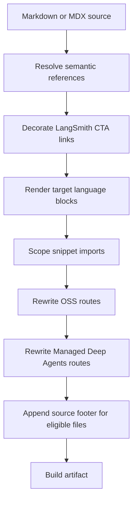

## Overview

`DocumentationBuilder` transforms Markdown and MDX as it emits build artifacts. The pipeline lets one source document serve Python and JavaScript variants without requiring authors to hardcode API-reference URLs or language-qualified internal routes. Its two responsibilities are deliberately separate:

- `preprocess_markdown()` performs source-level substitutions: semantic cross-references, LangSmith CTA attribution, then conditional rendering.
- Builder methods perform output-route work: snippet imports, OSS links, Managed Deep Agents links, and finally the contribution footer for ordinary source pages.

An unresolved semantic reference is an authoring signal, not a build failure: it is logged and retained literally. Conversely, an exception while transforming a file is logged and re-raised, stopping that file/build path.

This is the transformation order for a regular markdown file. Snippet output follows the same source preprocessing and route rewrites, but is emitted as language-specific copies and does not receive the footer.

## Entry points and language selection

`_process_markdown_file()` reads a `.md` or `.mdx` source file, delegates content processing to `_process_markdown_content()`, adds the source footer, converts `.md` output to `.mdx`, and writes the result. `_process_markdown_content()` calls `preprocess_markdown()`, then—when a target is present—rewrites MDX snippet imports, rewrites OSS links, and rewrites Managed Deep Agents routes.

A target is `"python"` or `"js"` internally; the builder maps those keys to URL segments such as `python` and `javascript`. When `preprocess_markdown()` is called without a target, it reads `TARGET_LANGUAGE`, defaulting to `python`; its cross-reference `default_scope` likewise defaults to the chosen target. Conditional rendering rejects any other target with `ValueError`.

Build routing supplies that target intentionally:

- Ordinary versioned OSS pages are built twice, once for Python and once for JavaScript.
- Language-agnostic OSS content under `oss/deepagents/code` and `oss/openwiki` builds once using Python selection, even though selected links to other versioned OSS pages become Python routes.
- Ordinary LangSmith content builds once with Python selection. Managed Deep Agents source pages instead emit Python and JavaScript route variants.
- Markdown snippets are processed for every configured language into `build/snippets/{python|javascript}/...`, plus a Python-default copy at the base snippet path for unversioned importers.

For the broader branching model, see [Language Versioning Strategy](/openwiki/concepts/versioning.md) and [Build System Architecture](/openwiki/architecture/build-system.md).

## Source-level transformations

### 1. Cross-reference resolution

Authors express an API reference as `@[link_name]`, `@[title][link_name]`, or (for the simple form) `@[`link_name`]`. `replace_autolinks()` replaces a resolved reference with normal Markdown link syntax, preserving a custom title or wrapping the simple backticked title in backticks. A preceding backslash suppresses resolution; the final result removes that backslash so the literal `@[...]` is displayed.

Resolution walks the document line by line with a current scope. It starts at `default_scope`; a top-level `:::python` or `:::js` fence selects that scope, and a closing `:::` resets to the default. Scope fences themselves remain in the content for the later conditional-rendering pass. The special `global` scope currently logs an error and uses the Python map.

`SCOPE_LINK_MAPS` is the assembled registry. `LINK_MAPS` entries pair a scope and host with symbol-to-path mappings; assembly joins relative paths to their host and retains absolute targets as-is. The registry covers core LangChain and LangGraph symbols, Deep Agents types, middleware, backends, and deployment clients; it also contains MCP adapter/client, tool, prompt, resource, interceptor, callback, and connection APIs. Provider and integration coverage includes, among others, OpenAI, Anthropic, Google, Groq, Ollama, AWS, and LangSmith SDK references. Some cross-scope aliases deliberately point to the other language's reference when a matching API is unavailable.

Maintain this registry when adding a semantic reference or when generated reference routes move. Add the key in the appropriate Python and/or JS map, use a relative path under that map's host where possible, and use an absolute URL only for a cross-site target. Then exercise the reference in each intended scope; the focused autolink tests mock the registry so they test replacement mechanics rather than the full catalog. See [Cross-Reference Links](/openwiki/operations/cross-references.md) and [API Reference Integration](/openwiki/integrations/reference-docs.md) for authoring and reference-site context.

### 2. LangSmith CTA attribution

`add_utm_to_cta_links()` considers Markdown links to `https://smith.langchain.com` conversion CTAs only when the parsed path is empty, `/`, `/agents`, or `/agents/`. It appends `utm_source=docs`, `utm_medium=cta`, `utm_campaign=langsmith-signup`, and a `utm_content` value derived from the source path after `src` (for example, `src/langsmith/home.mdx` becomes `langsmith-home`). Existing query parameters and an optional Markdown link title are preserved.

All other paths—including settings, hub, projects, public traces, and Studio—are functional links and remain untouched; other domains, including `api.smith.langchain.com`, also do not match. This is a build-time decoration rather than an author-visible source convention.

### 3. Conditional rendering

`:::python ... :::` and `:::js ... :::` blocks are resolved after cross-reference and CTA processing. A block matching the target retains its content but removes its fences; the other supported-language block is removed. Unsupported identifiers are returned unchanged. Opening and closing fences must have the same indentation, and escaped `\:::` markers are unescaped only after block substitution.

Do not nest these blocks: matching is regex-based and the first eligible closing fence terminates the match. An unclosed block does not match and is left as written; there is no separate conditional-block parse diagnostic. Importantly, conditional rendering itself is **not** code-fence-aware. Do not place live conditional fences in a fenced example and expect them to be protected; escape literal fence syntax when documenting it.

## Fence and escaping invariants

Cross-reference resolution and CTA decoration independently track regular code fences beginning with at least three backticks or tildes. They copy the opening fence, its contents, and the closing fence without resolving `@[...]`, changing the reference scope, or adding UTM parameters. An unclosed code fence therefore protects the remainder of the document from those two transformations. The focused tests cover backtick and tilde fences, extended and indented fences, language specifiers, a conditional-looking fence inside code, and a regex containing `@[`.

This protection does not extend to the later conditional-rendering regex, so “code fences protect preprocessing” is not a universal invariant. Escaped autolinks are unescaped at the end of autolink processing, including within code fences; escaped conditional markers are similarly unescaped by the conditional pass.

## Builder route transformations

After source preprocessing, the builder applies route-specific rewrites in this order:

1. **Snippet import scoping.** An MDX `from '/snippets/...md'` or `.mdx` import is rewritten to `/snippets/{language}/...` for a target-language build. Imports already starting with `python/` or `javascript/`, and imports of non-Markdown snippet components, are left unchanged.
2. **OSS route rewriting.** Markdown URLs and HTML `href` values beginning `/oss/` receive the language URL segment. Already-prefixed Python or JavaScript routes, paths containing `images`, and the language-agnostic `/oss/deepagents/code` and `/oss/openwiki` roots/subtrees are preserved.
3. **Managed Deep Agents route rewriting.** A Markdown or HTML link to the bare `/langsmith/managed-deep-agents...` route is changed to `/langsmith/{language}/managed-deep-agents...`. A URL already containing a language segment does not match this rewrite.

These guards make the first two rewrites safe against the common double-prefix failure. The snippet strategy avoids depth-dependent relative URLs: a nested versioned page can import its matching preprocessed snippet copy, whose OSS links are already absolute and language-qualified.

Finally, `_add_suggested_edits_link()` appends a Mintlify callout with an MCP connection link plus GitHub edit and issue links, but only for a source file under `src/`. It excludes the root `index.mdx` and paths containing the `snippets` directory; a path outside `src` is returned unchanged.

## Failures and operational expectations

Treat warnings and exceptions differently when operating the build:

- **Missing semantic link:** `_transform_link()` logs at info level with the file, line, unresolved key, and scope, then leaves the original marker untouched. This permits incremental registry maintenance without preventing output.
- **Unsupported scope:** any non-`global` scope simply has no map unless defined, so references in it follow the same unresolved-link path. `global` is additionally logged at error level and resolves against Python.
- **Invalid language target or any unexpected transformation error:** `_process_markdown_content()` logs the source path and re-raises. `_process_markdown_file()` does the same around reading, transforming, and writing. Snippet processing also logs and re-raises I/O, decoding, and regex errors. These are build-stopping failures, not warnings to ignore.
- **Footer failure:** the source-footer helper is intentionally best-effort: except for the outside-`src` case, its internal failures are logged and the unmodified content is returned.

## Focused regression coverage

`test_handle_auto_links.py` verifies resolution outside code blocks; preservation inside backtick, tilde, extended, indented, language-labelled, and unclosed fences; scope stability when a conditional fence appears in code; whitespace preservation; and escaped markers. `test_utm_links.py` verifies the CTA allowlist, `utm_content` derivation, existing queries, optional titles, functional/deep/API-domain exclusions, and code-fence skipping. Builder tests cover language insertion and exemptions for OSS routes, language-scoped snippet imports and generated snippet variants, and Managed Deep Agents route insertion.
