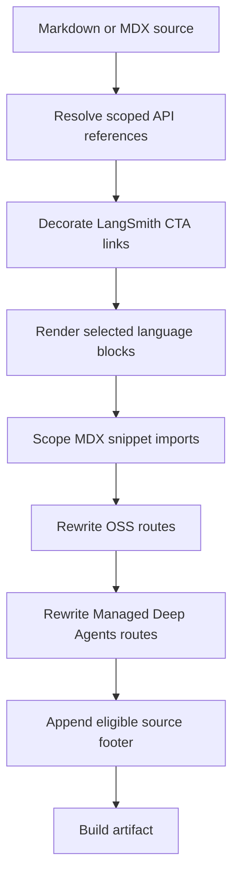

## Overview

`DocumentationBuilder` reads source Markdown and MDX and writes transformed artifacts to the build directory. The transformations are build-time output behavior: they do **not** modify files under `src/`. A shared source page can therefore yield Python and JavaScript artifacts without embedding language-qualified API URLs, routes, or CTA attribution in the source.

For a regular Markdown file, `preprocess_markdown()` resolves scoped references, decorates eligible LangSmith CTAs, and renders conditional language blocks. The builder then scopes snippet imports, rewrites routes, appends an eligible footer, and writes the artifact.

This flow shows the ordered transformation of a regular Markdown file; it is output-only. Snippet Markdown follows a dedicated path that emits language-specific copies and no footer.

## Entry points and language selection

`_process_markdown_file()` reads a `.md` or `.mdx` input, delegates content work to `_process_markdown_content()`, appends the footer, changes `.md` output to `.mdx`, and writes the result. `_process_markdown_content()` invokes `preprocess_markdown()`, scopes Markdown snippet imports when a target is present, then applies OSS and Managed Deep Agents route rewrites.

The internal target keys are `python` and `js`; `DocumentationBuilder.language_url_names` maps them to the route segments `python` and `javascript`. When no target is passed to `preprocess_markdown()`, `TARGET_LANGUAGE` supplies it and defaults to `python`; `default_scope` then defaults to that target. Conditional rendering rejects another target with `ValueError`.

Build routing deliberately chooses targets:

- Ordinary `oss/` Markdown is emitted for both Python and JavaScript.
- `oss/deepagents/code` and `oss/openwiki` are emitted once with Python selection, while retaining their language-agnostic routes.
- Ordinary LangSmith Markdown is built once with Python selection. Managed Deep Agents Markdown is emitted at both Python and JavaScript routes.
- A Markdown snippet is emitted under `build/snippets/python/` and `build/snippets/javascript/`, plus a Python-default copy at its base snippet path for unversioned consumers.

For the wider route model, see [Language Versioning Strategy](/openwiki/concepts/versioning.md) and [Build System Architecture](/openwiki/architecture/build-system.md).

## Source-level transformations

### 1. Scoped API references

Authors can write `@[link_name]`, `@[title][link_name]`, and `@[`link_name`]`. `replace_autolinks()` resolves a known key through `SCOPE_LINK_MAPS`; the titled form retains its title and the backticked simple form retains backticks in the generated link text. A preceding `\` suppresses replacement, and the final pass removes that escape so literal source syntax appears in the artifact.

Processing begins in `default_scope`. A `:::python` or `:::js` fence switches the active scope; a bare closing `:::` resets it to the default. Fences are retained at this stage for conditional rendering. `SCOPE_LINK_MAPS` assembles each scope from `LINK_MAPS`, joining relative targets to their map host while retaining absolute URLs. The registry covers LangChain, LangGraph, Deep Agents, MCP, deployment, and provider/reference APIs, including selected aliases for cross-scope compatibility. If the runtime scope is `global`, resolution logs an error and falls back to Python.

A missing key is not a preprocessing failure: it is logged at info level with file, line, key, and scope, and the authored marker remains in the artifact. Add or correct mappings in `pipeline/preprocessors/link_map.py`, then validate applicable scopes. See [Cross-Reference Links](/openwiki/operations/cross-references.md).

### 2. LangSmith CTA attribution

`add_utm_to_cta_links()` considers a Markdown-link URL beginning `https://smith.langchain.com` to be a conversion CTA only when its parsed path is empty, `/`, `/agents`, or `/agents/`. It appends `utm_source=docs`, `utm_medium=cta`, `utm_campaign=langsmith-signup`, and path-derived `utm_content`. For example, `src/langsmith/home.mdx` yields `langsmith-home`. Existing query text and an optional Markdown link title are preserved.

Functional paths such as settings, hub, projects, public traces, and Studio are not decorated. Links outside the matching Markdown URL pattern, including `api.smith.langchain.com`, are also left unchanged.

### 3. Conditional language blocks

`:::python ... :::` and `:::js ... :::` run after reference resolution and CTA decoration. A block for the selected target emits its content without fences; a block for the other supported target is removed. Unsupported identifiers and unclosed blocks remain unchanged. The closing marker is matched at the opening indentation, and escaped `\:::` markers are unescaped so literal fence text survives.

This is a regex transformation, not a nested-block parser: the first eligible closing marker terminates a match. It is also not code-fence-aware, so live conditional syntax in a fenced example can still be transformed. Escape literal `:::` syntax when documenting it. See [Conditional Rendering Tests](/openwiki/testing/conditional-rendering.md).

## Fence boundaries and cross-reference validation

Autolink resolution and CTA decoration independently track lines starting with at least three backticks or tildes, and skip content while their fence state is active. A conditional-looking line inside a regular code fence cannot change autolink scope. An unclosed regular fence protects the remainder of the input from those two transformations. This protection does **not** apply to the later conditional-rendering regex. Escaped autolinks are unescaped by the final autolink pass, including inside a code fence.

`make check-cross-refs` is the stricter authoring gate; preprocessing itself only logs unresolved references. The command runs `scripts/check_cross_refs.py` over Markdown and MDX below `src/`, using the same reference and fence patterns. It skips fenced code, escaped references, `snippets/code-samples/`, and `node_modules`; invalid UTF-8 input is skipped with a warning. An unfenced reference in a shared `oss/` page must exist in **both** maps, while `oss/python/` and `oss/javascript/` use their respective single scopes. An unresolved reference makes the command exit with status 1.

## Builder-level transformations

After source preprocessing, the regular-file path applies these output transformations:

1. **Snippet import scoping.** An MDX import whose source is `/snippets/...md` or `.mdx` becomes `/snippets/{python|javascript}/...` for a language build. Imports already beginning `python/` or `javascript/`, and non-Markdown snippet component imports, stay unchanged. This selects a copy whose absolute OSS links work for deeply nested consumers.
2. **OSS route rewriting.** Markdown URLs and HTML `href` values beginning `/oss/` receive the selected route segment. Already prefixed routes, any path containing `images`, and `/oss/deepagents/code` and `/oss/openwiki` routes are preserved to avoid duplicate prefixes and retain language-agnostic products.
3. **Managed Deep Agents routes.** Bare Markdown or HTML `/langsmith/managed-deep-agents...` URLs become `/langsmith/{language}/managed-deep-agents...`. Already language-qualified URLs do not match that bare-route pattern.
4. **Source footer.** `_add_suggested_edits_link()` appends a Mintlify source-links section with MCP connection, GitHub edit, and issue links only for inputs below `src/`. It excludes root `index.mdx` and any path containing a `snippets` directory; an input outside `src` passes through unchanged.

Snippet Markdown is handled separately because it may be imported from arbitrary page depth. For each language, the builder preprocesses it, rewrites OSS and Managed Deep Agents links, and writes an absolute-link copy below `build/snippets/{python|javascript}/`. It also writes a Python-default base copy for unversioned importers. This dedicated path intentionally bypasses footer generation.

## Failures and safe changes

Distinguish diagnostics from failures:

- Missing references are intentionally non-fatal during preprocessing, but should be caught before merge with `make check-cross-refs`.
- An invalid target language, or an exception while processing regular Markdown content or a file, is logged and re-raised, stopping that build path.
- Snippet processing logs and re-raises I/O, decoding, and regex errors.
- Footer generation is best-effort: an internal failure is logged and returns the unmodified input content.

When extending the pipeline, preserve its order. Scope-sensitive references must resolve before conditional fences disappear. Snippets need language-specific copies because consumers may be deeply nested. Route rewriters must retain their exclusion guards so artifacts do not contain double-prefixed or invalid language-agnostic links.

## Focused regression coverage

`tests/unit_tests/test_handle_auto_links.py` covers replacement outside regular fences; preservation inside backtick, tilde, extended, indented, language-labelled, and unclosed fences; conditional-looking fences within code; whitespace; escapes; and regex-like text. `tests/unit_tests/test_utm_links.py` covers CTA allowlisting, path attribution, query and title preservation, functional and API-domain exclusions, and code-fence skipping.

`tests/unit_tests/test_check_cross_refs.py` covers scope-aware validation, both-scope checks for shared OSS pages, titled and backticked references, and exclusions. Builder tests cover language route insertion and exemptions, language-scoped snippet copies, output routing, and Managed Deep Agents variants. See [Test Overview](/openwiki/testing/test-overview.md) for the wider suite.
