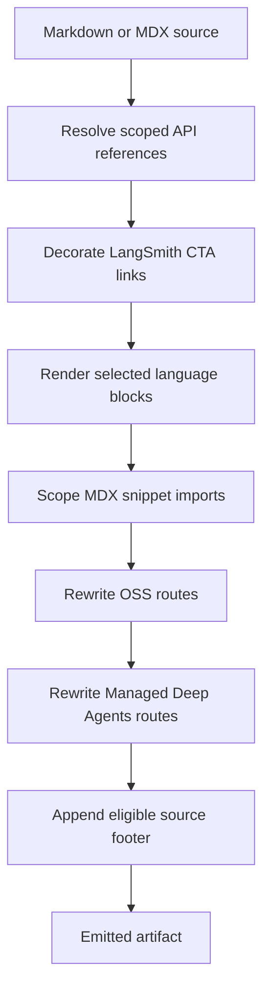

## Overview

`DocumentationBuilder` converts source Markdown and MDX into emitted documentation artifacts. The pipeline allows a shared source file to produce Python and JavaScript variants without hard-coding reference URLs, language-qualified routes, or campaign attribution in authored content.

For an ordinary Markdown file, `preprocess_markdown()` performs source-level transformations in this order: scoped cross-reference resolution, LangSmith CTA attribution, and conditional rendering. The builder then scopes snippet imports, rewrites OSS and Managed Deep Agents routes, and appends an eligible source footer before writing the artifact.

This diagram shows the regular Markdown-file transformation order. Snippets are preprocessed into separate language-specific artifacts and do not receive a footer.

## Entry points and language selection

`_process_markdown_file()` reads a `.md` or `.mdx` file, delegates to `_process_markdown_content()`, appends the footer, changes `.md` output to `.mdx`, and writes it. `_process_markdown_content()` invokes `preprocess_markdown()` and then, when a target is supplied, scopes Markdown snippet imports before applying the two route rewrites.

The internal target keys are `python` and `js`; `DocumentationBuilder.language_url_names` supplies their route segments (`python` and `javascript`). If `preprocess_markdown()` receives no target, it uses `TARGET_LANGUAGE`, defaulting to `python`; `default_scope` defaults to that target. Conditional rendering raises `ValueError` for any other target.

Build routing deliberately selects targets:

- Ordinary OSS Markdown is emitted twice, for Python and JavaScript.
- `oss/deepagents/code` and `oss/openwiki` are emitted once with Python selection and remain language-agnostic at those roots.
- Ordinary LangSmith Markdown is emitted once with Python selection. Managed Deep Agents Markdown emits Python and JavaScript routes instead.
- A Markdown snippet is emitted under `build/snippets/python/` and `build/snippets/javascript/`, plus a Python-default copy at its base snippet path for unversioned consumers.

For the broader route model, see [Language Versioning Strategy](/openwiki/concepts/versioning.md) and [Build System Architecture](/openwiki/architecture/build-system.md).

## Source-level transformations

### 1. Scoped API references

Authors can write `@[link_name]`, `@[title][link_name]`, and `@[`link_name`]`. `replace_autolinks()` resolves a known key to a Markdown link from `SCOPE_LINK_MAPS`; the titled form retains its title and the backticked simple form keeps the backticks in link text. Prefixing an autolink with `\` suppresses resolution, then the final pass removes that escape so the literal marker is emitted.

Resolution scans lines using a current scope. It starts at `default_scope`; a top-level `:::python` or `:::js` selects that scope, while a closing `:::` returns to the default. Those fences are retained for the later conditional-rendering transformation. `SCOPE_LINK_MAPS` assembles entries in `LINK_MAPS`: it joins relative symbol paths to each map host and retains absolute target URLs. It contains Python and JavaScript LangChain, LangGraph, Deep Agents, MCP, deployment, and provider/reference entries, with aliases where cross-scope compatibility needs them. The special `global` scope logs an error and uses the Python map.

A missing key is not a build failure: it is logged at info level with file, line, key, and scope, and the authored marker is retained. Add or correct mappings in `pipeline/preprocessors/link_map.py`, then validate the relevant scopes. See [Cross-Reference Links](/openwiki/operations/cross-references.md).

### 2. LangSmith CTA attribution

`add_utm_to_cta_links()` recognizes Markdown links to `https://smith.langchain.com` as conversion CTAs only if their parsed path is empty, `/`, `/agents`, or `/agents/`. It appends `utm_source=docs`, `utm_medium=cta`, `utm_campaign=langsmith-signup`, and path-derived `utm_content`; for example, `src/langsmith/home.mdx` yields `langsmith-home`. Existing query parameters and an optional Markdown link title are preserved.

Other LangSmith paths—such as settings, hub, projects, public traces, and Studio—are functional links and are not decorated. Other domains, including `api.smith.langchain.com`, do not match.

### 3. Conditional language blocks

`:::python ... :::` and `:::js ... :::` are processed after references and CTA links. A block for the selected target emits its content without fences; the other supported-language block is removed. Unsupported identifiers and unclosed blocks remain unchanged. Opening and closing markers must use the same indentation. Escaped `\:::` markers are ultimately unescaped, preserving literal fence text.

The matcher is regex-based rather than a nested-block parser: the first eligible closing fence ends a match. Conditional rendering is also not code-fence-aware, so live conditional syntax inside a fenced example can still be transformed. Escape literal `:::` syntax when documenting it. See [Conditional Rendering Tests](/openwiki/testing/conditional-rendering.md).

## Fence boundaries and validation

Autolink resolution and CTA decoration independently recognize a line beginning with at least three backticks or tildes and skip content while inside such a fence. A conditional-looking fence inside code cannot change autolink scope. An unclosed regular fence protects the remainder of the document from both transformations. This protection does **not** apply to the later conditional-rendering regex. Escaped autolinks are unescaped even when they occur in a code fence.

`make check-cross-refs` provides the stricter authoring gate that the build transformation itself does not. It scans `src/` Markdown/MDX, ignores fenced code and escaped references, and honors `:::python`/`:::js` scopes. Shared `oss/` pages are checked against **both** maps for an unfenced reference, while language-specific paths use one map; any unresolved reference makes the command exit with status 1. It skips `snippets/code-samples/`, `node_modules`, and invalid UTF-8 files (the last with a warning).

## Builder-level transformations

After source preprocessing, the builder applies the following transformations:

1. **Snippet import scoping.** A Markdown/MDX import from `/snippets/...md` or `.mdx` becomes `/snippets/{python|javascript}/...` in a target-language build. Imports already beginning `python/` or `javascript/`, and non-Markdown snippet component imports, are unchanged. This lets arbitrarily nested pages import a copy whose absolute OSS links are already language-qualified.
2. **OSS route rewriting.** Markdown URLs and HTML `href` values beginning `/oss/` receive the selected route segment. Already-prefixed routes, paths containing `images`, and `/oss/deepagents/code` and `/oss/openwiki` paths are preserved, preventing a duplicate prefix and retaining their language-agnostic routes.
3. **Managed Deep Agents routes.** Bare Markdown or HTML `/langsmith/managed-deep-agents...` URLs become `/langsmith/{language}/managed-deep-agents...`. URLs already containing a language segment do not match the bare-route pattern.
4. **Source footer.** `_add_suggested_edits_link()` appends a Mintlify callout containing an MCP connection link plus GitHub edit and issue links only for files below `src/`. It excludes root `index.mdx` and anything below a `snippets` directory; an input outside `src` passes through unchanged.

## Failures and safe changes

Distinguish authoring diagnostics from transformation failures:

- Missing references are intentionally non-fatal during preprocessing, but should be caught before merge with `make check-cross-refs`.
- Invalid language targets and exceptions while processing content or a Markdown file are logged and re-raised; they stop that build path.
- Snippet processing separately logs and re-raises I/O, decoding, and regex errors.
- Footer generation is best-effort: an internal footer error is logged and returns the original content.

When extending the pipeline, preserve the order. In particular, scope-sensitive references must resolve before conditional fences are removed; snippets need their own language copies because their consumers can be deeply nested; and route rewriters must retain their exclusion guards to avoid broken double-prefixed or language-agnostic links.

## Focused regression coverage

`tests/unit_tests/test_handle_auto_links.py` verifies replacement outside regular fences; preservation inside backtick, tilde, extended, indented, language-labelled, and unclosed fences; scope stability for a conditional-looking fence in code; whitespace; escaped markers; and regex-like text. `tests/unit_tests/test_utm_links.py` verifies the CTA allowlist, path attribution, query and title preservation, functional/API-domain exclusions, and code-fence skipping.

`tests/unit_tests/test_check_cross_refs.py` covers scope-aware validation, both-scope checking for shared OSS pages, titled/backticked references, and exclusions. Builder tests cover language route insertion and exemptions, language-scoped snippet copies, and Managed Deep Agents variants. See [Test Overview](/openwiki/testing/test-overview.md) for the wider suite.
