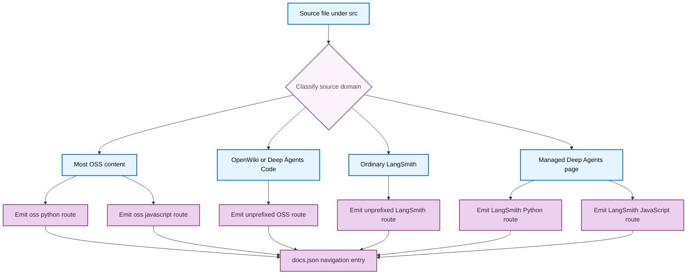

# Language Versioning Strategy

Language versioning is a build and navigation model, not a filesystem naming convention. A source location determines how `DocumentationBuilder` renders a file, the build determines its emitted route, and `src/docs.json` determines where that route appears in Mintlify navigation. The three surfaces must agree.

## Map source domains to routes and navigation

| Authored source domain | Emitted route family | Navigation consequence |
| --- | --- | --- |
| Most `src/oss/` content, including LangChain, LangGraph, Deep Agents, concepts, reference, and contributing | `/oss/python/...` and `/oss/javascript/...` | Use the corresponding entries under the Python or TypeScript Build dropdown. |
| `src/oss/python/` or `src/oss/javascript/` | Only the matching `/oss/python/...` or `/oss/javascript/...` route, without the source-language directory repeated | Put the resulting language route only in its matching dropdown. |
| `src/oss/deepagents/code/` | `/oss/deepagents/code/...` | One language-agnostic product route. |
| `src/oss/openwiki/` | `/oss/openwiki/...` | One language-agnostic product route, listed from the same unprefixed routes in both Build dropdowns. |
| Ordinary `src/langsmith/` content | `/langsmith/...` | Place it in the relevant LangSmith or lifecycle navigation group, which has no language split. |
| A direct `src/langsmith/managed-deep-agents*.mdx` page | `/langsmith/python/...` and `/langsmith/javascript/...` | List each emitted route in the Managed Deep Agents tab of its corresponding Build dropdown. |

For example, `src/oss/langgraph/overview.mdx` emits two artifacts, while `src/oss/python/integrations/chat/example.mdx` participates only in the Python pass and emits as `/oss/python/integrations/chat/example`. Do not create generated copies of a shared source just to match an emitted route.



This shows that source classification selects emitted routes, while `docs.json` independently exposes those routes in navigation.

## Build the variants

`build_all()` first recreates `build/`, then renders Python OSS, JavaScript OSS, unversioned Deep Agents Code, unversioned OpenWiki, ordinary LangSmith, and Managed Deep Agents variants. It next copies shared files and npm snippet components, then generates the LLM-oriented indexes. This ordering means generated indexes see the final route tree.

Each Markdown artifact passes through standard preprocessing, language-aware snippet-import rewriting, OSS-link rewriting, and Managed Deep Agents-link rewriting before it is written. Internal target keys are `python` and `js`; the latter becomes the public route segment `javascript`.

A single-file `build_file()` uses the same source classification: ordinary OSS creates both variants, the two unversioned OSS products create one artifact, and direct Managed Deep Agents files create their two language artifacts. Root-level and shared inputs are copied once. Use a full build after broad route or navigation changes because it removes stale output and regenerates derived artifacts.

## Keep OpenWiki and Deep Agents Code unversioned

OpenWiki and Deep Agents Code are explicit product exceptions inside the OSS tree. Each is rendered once at its unprefixed route with `python` as the conditional-content target. This does not make them Python documentation: it defines the deterministic fallback for any `:::python` or `:::js` fences in an otherwise language-agnostic product.

Their own routes remain unprefixed. However, a link from one of these pages to ordinarily versioned OSS content is processed with the Python target, so an unqualified `/oss/deepagents/quickstart` becomes `/oss/python/deepagents/quickstart`. This is an intentional default-target link choice, not a second copy of the unversioned product.

## Treat Managed Deep Agents as a LangSmith routing exception

Managed Deep Agents content is authored in the unversioned LangSmith domain, but a direct file qualifies only when its name starts with `managed-deep-agents` and it has a `.md` or `.mdx` extension. The full build's bulk variant pass discovers `.mdx` files matching that pattern. Ordinary LangSmith emission excludes qualifying pages, so it does not create an unversioned artifact that could become an orphaned page.

Each variant receives its matching conditional content, snippet imports, OSS links, and bare Managed Deep Agents links. For example, the shared quickstart source contains `:::python` and `:::js` setup commands and unprefixed `/langsmith/managed-deep-agents-*` cross-links; the build turns those cross-links into the current variant's route.

`docs.json` supplies the public default for unversioned and historical Managed Deep Agents URLs: configured redirects point them to Python routes. Separately, its Python and TypeScript Build dropdowns contain the language-specific Managed Deep Agents page entries. Keep redirects, emitted routes, and both navigation branches synchronized when adding, renaming, or removing one of these pages.

## Author language-specific content safely

Use `:::python` and `:::js` fences only where a shared source needs different material:

```markdown
:::python
Python-only content.
:::

:::js
JavaScript-only content.
:::
```

For a selected target, the preprocessor removes the enclosing fences and retains the matching block's content; it removes a nonmatching supported block completely. Unsupported labels and unclosed blocks are unchanged. Opening and closing conditional markers must have matching indentation. Escape a marker as `\:::` when the rendered page must show conditional syntax literally.

Conditional rendering is regex-based and is not code-fence-aware. Do not assume a literal conditional-looking marker inside a fenced example is protected; escape it when documenting this syntax. Nested conditionals are also unsafe because the first eligible closing marker ends the match.

## Let build-time rewrites preserve route intent

Author an unqualified absolute OSS link when it should follow the active language variant:

```mdx
<!-- openwiki: broken internal link [/oss/langgraph/overview] file "/oss/langgraph/overview" does not exist. Fix the href or restore the target, then delete this comment. -->
[LangGraph overview](/oss/langgraph/overview)
```

A Python artifact receives `/oss/python/langgraph/overview`; a JavaScript artifact receives `/oss/javascript/langgraph/overview`. The rewriter leaves already-prefixed routes, URLs containing `images`, and the OpenWiki and Deep Agents Code product roots unchanged. These guards prevent double-prefixes and preserve routes that have no language variants.

In a versioned page, import an MDX snippet from its unprefixed source path:

```mdx
import Example from '/snippets/example.mdx'
```

The builder changes that import to `/snippets/python/example.mdx` or `/snippets/javascript/example.mdx`. It does not rewrite an already scoped `python/` or `javascript/` MDX import, and it does not rewrite JSX/TSX component imports. The scoped snippet copies ensure that snippet links resolve correctly from consumers at different route depths.

Bare `/langsmith/managed-deep-agents...` links are also rewritten during a target-language render. Use an explicitly language-qualified link only when a page intentionally needs to point to a particular variant rather than follow the current one.

## Change the model without breaking it

1. Choose the source domain from the route and audience, not only from the navigation label.
2. Add or modify the authored source under `src/`; never edit generated `build/` output.
3. Add the extensionless **emitted route** to the correct `src/docs.json` product, menu, dropdown, tab, and group. A navigation entry can refer to a route emitted from a differently shaped shared source path.
4. For a public move, retain the old published route with a `docs.json` redirect, including language prefixes where they are part of the old URL.
5. Run `make build`, inspect both variants for versioned material, and run `make broken-links`. Extend `tests/unit_tests/test_builder.py` when changing routing, link-rewrite exemptions, snippet scoping, or Managed Deep Agents behavior.

## See also

- [Build system architecture](/openwiki/architecture/build-system.md)
- [Source directory map](/openwiki/architecture/source-map.md)
- [Markdown preprocessing pipeline](/openwiki/concepts/preprocessing.md)
- [Adding and modifying documentation pages](/openwiki/operations/adding-pages.md)
- [Writing versioned content](/openwiki/workflows/versioned-content.md)
