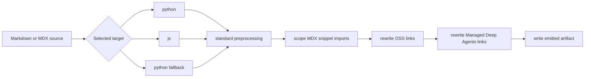
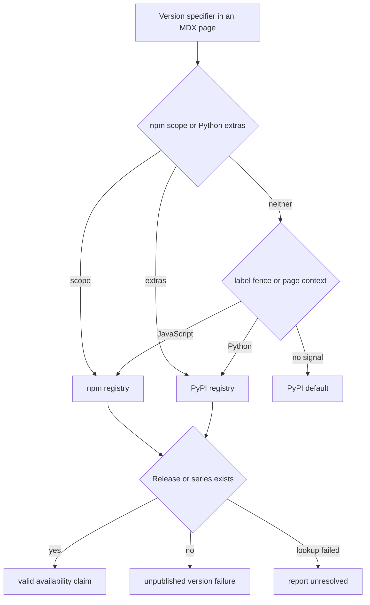
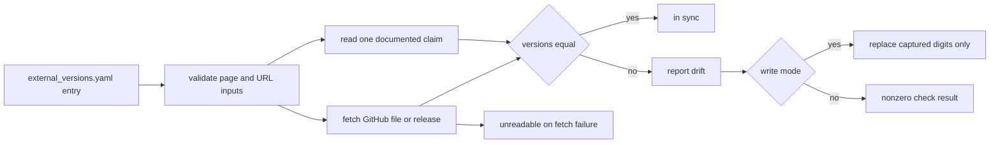

# Language Versioning Strategy

This repository has two separate meanings of **versioning**:

1. **Language-route rendering** turns one authored documentation tree into Python and JavaScript route families where appropriate.
2. **Version-claim validation** checks version specifiers written in documentation. It establishes either that a named package release was published or that a requirement deliberately mirrored from another project still agrees with that project's source.

They use some of the same language signals (`:::python`, `:::js`, and source paths), but solve different problems. A route prefix does not establish a package's minimum supported version, and a package floor such as `langchain>=1.3.2` does not select an output route.

## Language-route rendering

`DocumentationBuilder` owns emitted documentation artifacts beneath `build/`; `src/docs.json` independently exposes those routes in navigation and redirects retired URLs. Source placement selects builder behavior, while navigation entries must name routes that the builder emits.

| Authored source domain | Emitted route family | Navigation consequence |
| --- | --- | --- |
| Most `src/oss/` content, including LangChain, LangGraph, and Deep Agents outside `code/` | `/oss/python/...` and `/oss/javascript/...` | Add the emitted route to the corresponding Python or TypeScript Build dropdown. |
| `src/oss/python/` or `src/oss/javascript/` | Only the matching route, with the source-language directory removed | Put the route only in its matching dropdown. |
| `src/oss/deepagents/code/` | `/oss/deepagents/code/...` | Keep the product route unprefixed. |
| `src/oss/openwiki/` | `/oss/openwiki/...` | Keep one unprefixed artifact family; the same routes appear in both Build dropdowns. |
| Ordinary `src/langsmith/` content | `/langsmith/...` | Place it in its applicable LangSmith navigation group. |
| A direct `src/langsmith/managed-deep-agents*.mdx` page | `/langsmith/python/...` and `/langsmith/javascript/...` | List both emitted routes in the corresponding Managed Deep Agents tabs. |


This diagram shows source classification and emitted routes; package requirements in page prose are a separate validation input.

### Lifecycle and content transforms

`build_all()` removes and recreates `build/`, renders Python OSS, JavaScript OSS, the two unversioned OSS products, ordinary LangSmith, and Managed Deep Agents variants, then copies shared files and npm snippets and generates `llms.txt` artifacts. Clearing output first prevents stale generated routes from surviving a full build.

For each Markdown or MDX artifact, the builder first performs standard preprocessing, then—when a target language exists—rewrites MDX snippet imports, rewrites OSS links, and rewrites Managed Deep Agents links. Internal target `js` maps to the public `javascript` path segment. A `.md` input is emitted as `.mdx`; authored `src/` content is not modified.



This diagram shows the ordered transforms applied to one emitted Markdown artifact.

`build_file()` follows the same classification for an existing individual file: ordinary OSS produces two artifacts; either unversioned OSS product produces one; a Managed Deep Agents page produces two; and shared or root-level inputs copy once. It raises `AssertionError` for a nonexistent file. Use a full build after broad route changes because it also clears stale output and regenerates derived indexes.

### Shared, language-only, and unversioned OSS

Ordinary OSS pages are the dual-route case: a shared source produces `/oss/python/...` and `/oss/javascript/...`. Within that domain, a file below `src/oss/python/` or `src/oss/javascript/` participates only in its matching pass; the leading source-language directory is removed from the emitted route. Use those directories for genuinely language-specific material, not duplicate copies of shared pages.

OpenWiki and Deep Agents Code are deliberate exceptions. They build once at `/oss/openwiki/...` and `/oss/deepagents/code/...`; conditional rendering uses the Python branch as a deterministic fallback. That fallback does **not** make either product Python documentation. Links within these product roots remain unprefixed, while an unqualified link from an unversioned product to ordinary OSS is rendered with the Python target.

### Conditional blocks, links, and snippets

Use `:::python` and `:::js` only where one shared source needs distinct content:

```markdown
:::python
Python-only content.
:::

:::js
JavaScript-only content.
:::
```

For a selected target, preprocessing removes the fences and retains matching content, while it removes a nonmatching supported block. Escaped `\:::` markers become literal `:::`. Unsupported labels and unclosed blocks remain unchanged. Opening and closing markers must use matching indentation. The renderer is regex-based and not code-fence-aware, so escape literal markers when documenting this syntax and do not rely on a Markdown code fence or nesting to protect them.

In a target-language render, an unqualified absolute OSS link such as `/oss/langgraph/overview` becomes `/oss/python/langgraph/overview` or `/oss/javascript/langgraph/overview`. The rewriter leaves already prefixed links, image paths, and OpenWiki and Deep Agents Code roots unchanged. A bare `/langsmith/managed-deep-agents...` link similarly follows the selected target; an explicitly qualified link stays explicit.

Versioned MDX pages should import Markdown snippets from `/snippets/...`. The builder redirects `.md` or `.mdx` imports to `/snippets/python/...` or `/snippets/javascript/...` and leaves already scoped imports untouched. JSX and TSX component imports are not rewritten.

### Managed Deep Agents

Managed Deep Agents is a LangSmith exception: a direct file under `src/langsmith/` whose name begins `managed-deep-agents` and extension is `.md` or `.mdx` is classified as a language-variant page. Ordinary LangSmith emission excludes it, avoiding an unversioned artifact. The full-build discovery pass, however, glob-matches only `managed-deep-agents*.mdx`; an individually built `.md` is recognized and emitted, but it is absent from a normal full build. Use `.mdx` for these pages.

Each emitted variant gets matching conditional content, language-scoped snippet imports, rewritten OSS links, and Managed Deep Agents links pointing at its own route. `docs.json` redirects unversioned and historical Managed Deep Agents URLs to Python routes, while its Python and TypeScript Build dropdowns list their distinct variant routes. Keep the naming rule, both navigation routes, and applicable legacy redirects synchronized when changing these pages.

## Package-version claims: availability, not feature policy

`scripts/check_version_claims.py` scans documentation for `>=` floors and `==` pins such as `langchain>=1.3.2`, `langsmith[livekit]>=0.11.2`, and `@langchain/langgraph>=1.4.0`. It checks `.mdx` pages under `src/` by default, or only existing `.mdx` paths supplied with `--files`.

The checker answers one narrow question: **was the written version published in the relevant registry?** It does not decide that a feature first appeared in that release, does not bump an old floor to the current release, and does not interpret a published release as proof that the requirement is sufficient. The feature owner must make that human compatibility decision.

### Ecosystem selection

Python and npm can publish packages with the same unscoped name on unrelated version lines. The checker therefore resolves an ecosystem for each discovered specifier rather than assuming that a route or name is enough. Its precedence is:

1. An `@scope/` prefix is npm-only.
2. Python extras (`package[extra]`) are PyPI-only.
3. The nearest Python or JavaScript/TypeScript label on the same line wins.
4. Otherwise, the enclosing `:::python` or `:::js` fence decides.
5. Otherwise, a `/python/` or `/javascript/` source path decides, including the explicit JavaScript-only LangSmith-page override.
6. Remaining bare specifiers default to PyPI.

Thus `deepagents>=0.5.0` in a Python fence is checked on PyPI and `deepagents>=1.9.0` in a JavaScript fence is checked on npm. This is validation-time language context, not a request to emit a different documentation route.



This diagram shows registry selection and availability checking; it intentionally does not infer a feature's minimum version.

### Lookup, results, and exceptions

The checker fetches the complete published release set plus the latest release from PyPI or npm, concurrently across packages. An exact version must be present. A shortened floor such as `>=0.7` is also accepted when any release begins `0.7.`; it must not match a longer series such as `1.14` for `1.1`. Registry failures, malformed payloads, and unsafe package names are unresolved rather than classified as nonexistent releases, so an outage or private package is not reported as a ghost version.

`version_claims_ignore.txt` is a reviewed, exact-specifier exception list. Its entries cover intentional “any release” sentinel floors whose version was never published and placeholders in examples. Prefer correcting documentation over adding an exception; each entry is a standing statement that the lookup cannot establish the specifier's availability.

Run the checker locally with:

```bash
uv run python scripts/check_version_claims.py
uv run python scripts/check_version_claims.py --files src/langsmith/evaluators.mdx
uv run python scripts/check_version_claims.py --advisory-only
```

The pull-request workflow runs it only for changed `src/**/*.mdx` files and fails when a named release was never published. The scheduled full sweep uses `--advisory-only`, so its findings do not turn the scheduled workflow red.

## Mirrored upstream requirements

Some documentation repeats a requirement owned by an external project rather than stating a locally determined feature floor. `scripts/check_external_versions.py` manages this different case through `scripts/data/external_versions.yaml`. Each registry entry supplies a stable ID and label, the page under `src/`, a page regex with exactly one named `version` capture, and an upstream GitHub file or latest-release source.

The checker validates the registry before acting: target pages must resolve inside `src/`; repository slugs and upstream file paths are allowlisted before they are interpolated into GitHub URLs; and both applicable patterns require a `version` capture. It fetches a GitHub file from `HEAD` or the latest release tag, compares the upstream version with the one exact page match, and reports drift or unreadable entries.



This diagram shows synchronization of an externally owned requirement, rather than package-registry availability or route rendering.

Use:

```bash
uv run python scripts/check_external_versions.py
uv run python scripts/check_external_versions.py --only codex-cli
uv run python scripts/check_external_versions.py --write
```

Without `--write`, drift or an unreadable entry returns a nonzero status. With `--write`, the tool updates only the captured version digits and returns success even when an upstream request is unavailable, allowing scheduled synchronization to update entries it can resolve. A write is never a complete semantic review: inspect surrounding prose for changed flags, peer dependencies, or other prerequisites that a version-only replacement cannot detect.

## Safe changes and focused tests

When changing routes, first choose the source domain based on intended language behavior; edit `src/`, not generated `build/`; then add extensionless emitted routes to the appropriate `docs.json` group and redirects for public moves. Run `make build`, inspect both language artifacts where relevant, and run `make broken-links`.

When adding a package claim, make the ecosystem unambiguous with a scope, extras, nearby label, fence, or language-specific path where needed. Verify the written release exists, but separately confirm the human claim that it is the minimum feature version. Add an external-registry entry only when the documentation must equal an upstream-owned requirement, not for a feature floor.

Builder tests cover unversioned OSS output and link behavior, scoped snippet imports, and dual Managed Deep Agents output with target-specific links and conditional content. Version-claim tests cover resolver precedence, truncated series behavior, ignores, safe registry lookup, and outage handling. External-version tests cover exact matching and digit-only rewrites, invalid registry inputs, upstream retrieval, and differing check versus write-mode failure behavior.

## See also

- [Build system](/openwiki/architecture/build-system.md)
- [Source map](/openwiki/architecture/source-map.md)
- [GitHub Actions](/openwiki/integrations/github-actions.md)
- [Conditional rendering tests](/openwiki/testing/conditional-rendering.md)
- [Writing versioned content](/openwiki/workflows/versioned-content.md)
