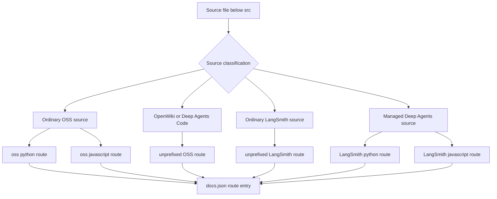
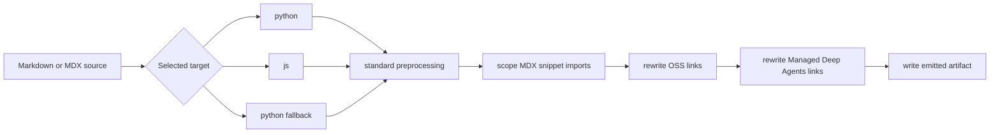

# Language Versioning Strategy

Language versioning is a build and navigation model, not a filesystem naming convention. A source location determines how `DocumentationBuilder` renders a file; that render produces an emitted public route; and `src/docs.json` independently decides which emitted routes appear in Mintlify navigation or redirect from retired routes. Keep these three surfaces distinct and synchronized.

## Source classification is not route or navigation classification

| Authored source domain | Emitted public route family | `docs.json` consequence |
| --- | --- | --- |
| Most `src/oss/` content, including LangChain, LangGraph, and Deep Agents except `code/` | `/oss/python/...` and `/oss/javascript/...` | Add each emitted route to the corresponding Python or TypeScript Build dropdown. |
| `src/oss/python/` or `src/oss/javascript/` | Only the matching `/oss/python/...` or `/oss/javascript/...` route, with the source-language directory removed | Put the route only in its matching dropdown. |
| `src/oss/deepagents/code/` | `/oss/deepagents/code/...` | One language-agnostic product route; do not add a language prefix. |
| `src/oss/openwiki/` | `/oss/openwiki/...` | One language-agnostic product route; the same unprefixed routes are listed in both Build dropdowns. |
| Ordinary `src/langsmith/` content | `/langsmith/...` | Place the emitted route in its applicable LangSmith navigation group, which is not inherently language-split. |
| A direct `src/langsmith/managed-deep-agents*.mdx` page | `/langsmith/python/...` and `/langsmith/javascript/...` | List each emitted route in the Managed Deep Agents tab of its corresponding Build dropdown. |

For example, `src/oss/langgraph/overview.mdx` emits two artifacts, while `src/oss/python/integrations/chat/example.mdx` participates only in the Python pass and emits as `/oss/python/integrations/chat/example`. Do not make generated source copies merely to resemble an emitted route.



This routing classification shows that emitted routes are builder output; `docs.json` exposes or redirects them and does not generate them.

## Build lifecycle and language-output flow

`build_all()` first removes and recreates `build/`. It then renders Python OSS, JavaScript OSS, unversioned Deep Agents Code, unversioned OpenWiki, ordinary LangSmith, and Managed Deep Agents variants; copies shared files; copies npm snippet components; and generates `llms.txt` and `llms-full.txt`. A full build therefore removes stale output before its derived indexes inspect the final route tree.

For each Markdown or MDX artifact, the builder runs standard preprocessing first, then scopes MDX snippet imports when a target is present, rewrites OSS links, and finally rewrites Managed Deep Agents links. Internal targets are `python` and `js`; `js` maps to the public `javascript` route segment. A `.md` input is written as `.mdx` output.



This language-output flow applies once per emitted Markdown artifact; source content under `src/` is not modified.

`build_file()` applies the same routing choice for an individual existing file: ordinary OSS creates both variants, the two unversioned OSS products create one artifact, and a Managed Deep Agents file creates two language artifacts. Shared and root-level inputs copy once. It raises `AssertionError` for a nonexistent input. Prefer a full build after broad route or navigation changes because it also removes stale output and refreshes derived artifacts.

## Shared OSS and language-specific directories

Shared OSS sources are the normal dual-version case. A shared page is rendered for the `python` target at `/oss/python/...` and for the `js` target at `/oss/javascript/...`. An unqualified absolute OSS link can consequently follow the current artifact.

The `src/oss/python/` and `src/oss/javascript/` subtrees have a different contract: the builder includes a file only in the matching pass and removes that leading source-language directory from the output path. Use them for material that genuinely exists in one language, not for a copy of shared content.

## Intentional unversioned OSS products

OpenWiki and Deep Agents Code are explicit exceptions within `src/oss/`. They build once at `/oss/openwiki/...` and `/oss/deepagents/code/...`, respectively, with `python` selected as the deterministic fallback target for conditional content. This fallback does not make either product Python documentation, and links within those product roots remain unprefixed.

An unqualified link from either unversioned product to ordinarily versioned OSS content is nevertheless rendered with the Python target: `/oss/deepagents/quickstart` becomes `/oss/python/deepagents/quickstart`. This is a default-target link decision, not a second copy of the unversioned product.

## Managed Deep Agents: unversioned source, dual output

Managed Deep Agents is a LangSmith routing exception. A direct `.md` or `.mdx` file in `src/langsmith/` whose name begins `managed-deep-agents` is recognized as a Managed Deep Agents page. Ordinary LangSmith emission excludes recognized pages, avoiding an unversioned artifact that would be orphaned outside the Managed Deep Agents navigation.

The dedicated full-build pass discovers `managed-deep-agents*.mdx` files and emits Python and JavaScript artifacts. `build_file()` recognizes either `.md` or `.mdx`, so a Managed Deep Agents `.md` can be emitted when built individually but is not discovered by the bulk variant glob. Use `.mdx` for pages that must participate in a normal full build.

Each language artifact receives its matching conditional content, scoped snippet imports, OSS links, and unqualified Managed Deep Agents cross-links. The overview source demonstrates both contracts: it contains `:::python` and `:::js` branches plus unprefixed `/langsmith/managed-deep-agents...` links, so each output keeps the matching material and links to its own language route.

`docs.json` supplies the public default for unversioned and historical Managed Deep Agents URLs: configured redirects send them to Python routes. Separately, its Python and TypeScript Build dropdowns contain language-specific Managed Deep Agents entries. When adding, renaming, or removing a page, keep the source naming rule, both emitted route entries, and any legacy redirects synchronized.

## Conditional content contract

Use `:::python` and `:::js` only where a shared source needs different material:

```markdown
:::python
Python-only content.
:::

:::js
JavaScript-only content.
:::
```

For the selected target, preprocessing removes the fences and retains the matching block content; it removes a nonmatching supported block completely. Unsupported labels and unclosed blocks remain unchanged. Opening and closing markers must have matching indentation. Escape a literal marker as `\:::` when the rendered page must display conditional syntax.

Conditional rendering is regex-based rather than code-fence-aware. Do not rely on a normal Markdown code fence to protect literal conditional-looking syntax, and do not nest conditionals: the first eligible closing marker ends the match. Escape both markers when documenting the syntax literally.

## Link and snippet rewrite contract

Author an unqualified absolute OSS link when its destination should follow the active language. For example, a Markdown link whose destination is `/oss/langgraph/overview` becomes `/oss/python/langgraph/overview` in the Python artifact and `/oss/javascript/langgraph/overview` in the JavaScript artifact. The rewriter leaves already-prefixed routes, paths containing `images`, and the OpenWiki and Deep Agents Code roots unchanged. These guards prevent double-prefixes and preserve routes that have no language variants.

In a versioned page, import a Markdown snippet from its unprefixed source path:

```mdx
import Example from '/snippets/example.mdx'
```

The builder changes that import to `/snippets/python/example.mdx` or `/snippets/javascript/example.mdx`. Already scoped MDX imports are not rewritten, nor are JSX or TSX component imports. The language-scoped snippet copies allow consumers at different route depths to resolve snippets consistently.

Bare `/langsmith/managed-deep-agents...` links are likewise rewritten during a target-language render. Explicitly language-qualified links remain untouched, so use one only when the destination must intentionally be a particular variant rather than follow the current render.

## Navigation and safe changes

`src/docs.json` is navigation configuration, not the source tree. It independently assigns Python and TypeScript emitted routes to their Build dropdowns, including distinct Managed Deep Agents paths. The unprefixed OpenWiki family appears in both dropdowns even though it has one emitted artifact family. A route must exist in generated output before a navigation entry can safely expose it.

When changing this model:

1. Choose the source domain from the intended public route and language behavior, not only from a navigation label.
2. Change authored content under `src/`; never patch generated `build/` output.
3. Add the extensionless **emitted route** to the correct `docs.json` product, menu, dropdown, tab, and group. Do not use a source path or an `.mdx` filename as a navigation route.
4. Preserve a public move with a `docs.json` redirect, including a language prefix when it is part of the retired URL.
5. Run `make build`, inspect both artifacts for versioned content, and run `make broken-links`. Update focused builder coverage when changing classification, route exemptions, snippet scoping, or Managed Deep Agents behavior.

## Focused regression coverage

`tests/unit_tests/test_builder.py` tests the boundary conditions most likely to regress: ordinary OSS prefix insertion, preservation of language-qualified and unversioned-product links, one-time output for the two unversioned OSS products, language-scoped MDX imports, and Managed Deep Agents dual output. The Managed Deep Agents fixture verifies matching page links, OSS links, scoped snippets, and conditional snippet content in both variants; it also verifies that unversioned Managed Deep Agents pages are not emitted.

## See also

- [Build system](/openwiki/architecture/build-system.md)
- [Source directory map](/openwiki/architecture/source-map.md)
- [Markdown preprocessing pipeline](/openwiki/concepts/preprocessing.md)
- [Builder test guidance](/openwiki/testing/builder-tests.md)
- [Writing versioned content](/openwiki/workflows/versioned-content.md)
