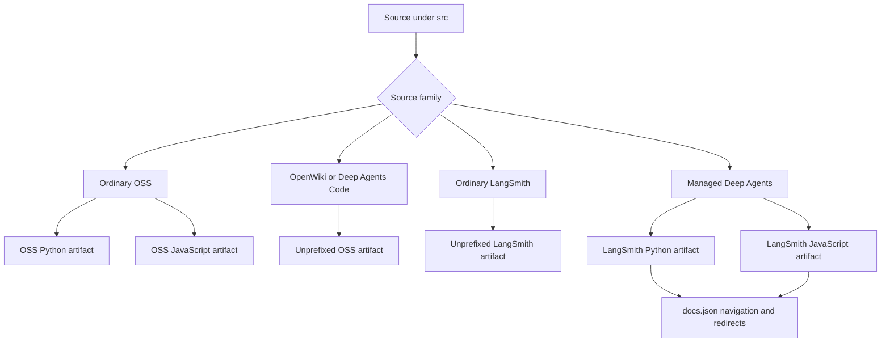
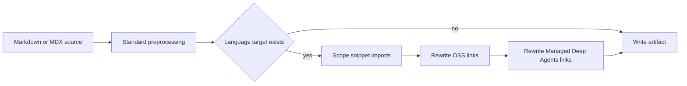

# Versioned Documentation and Routes

`DocumentationBuilder` derives artifacts and route families from paths below `src/`. `src/docs.json` is a separate public configuration for navigation and redirects. A navigation entry must refer to a route that the builder emits, but it neither creates that route nor establishes its source owner. Treat **source ownership**, **emitted artifacts**, **navigation**, and **redirects** as distinct contracts.

## Route families

| Source family | Output route family | Target used for Markdown preprocessing |
| --- | --- | --- |
| Ordinary `src/oss/` content, including Deep Agents outside `code/` | `/oss/python/...` and `/oss/javascript/...` | `python` and `js` |
| `src/oss/python/...` or `src/oss/javascript/...` | Only its matching OSS family; the ownership directory is removed | Matching target |
| `src/oss/deepagents/code/...` | `/oss/deepagents/code/...` | `python` fallback |
| `src/oss/openwiki/...` | `/oss/openwiki/...` | `python` fallback |
| Ordinary `src/langsmith/...` | `/langsmith/...` | `python` fallback |
| Direct `src/langsmith/managed-deep-agents*.mdx` | `/langsmith/python/...` and `/langsmith/javascript/...` | `python` and `js` |

```mermaid
flowchart TD
    Source["Source under src"] --> Family{"Source family"}
    Family --> Oss["Ordinary OSS"]
    Oss --> OssPy["OSS Python artifact"]
    Oss --> OssJs["OSS JavaScript artifact"]
    Family --> Product["OpenWiki or Deep Agents Code"]
    Product --> PlainProduct["Unprefixed OSS artifact"]
    Family --> Smith["Ordinary LangSmith"]
    Smith --> PlainSmith["Unprefixed LangSmith artifact"]
    Family --> Managed["Managed Deep Agents"]
    Managed --> ManagedPy["LangSmith Python artifact"]
    Managed --> ManagedJs["LangSmith JavaScript artifact"]
    ManagedPy --> Config["docs.json navigation and redirects"]
    ManagedJs --> Config
```

This flow is the builder's verified source-path routing. Navigation configuration follows the generated route model; it is not an ownership classifier.

A full `build_all()` clears `build/`, builds ordinary OSS for Python and JavaScript, then Deep Agents Code, OpenWiki, ordinary LangSmith, and Managed Deep Agents variants. It subsequently copies shared files and npm snippet components. Removing the old output is important when a page changes families or moves, because it prevents stale artifacts from surviving a full build.

`build_file()` applies the same classification to one existing file. Ordinary OSS emits twice except for the two unversioned product roots. Ordinary LangSmith emits once, while a Managed Deep Agents page emits twice. Shared and root-level files copy once; a missing requested file raises `AssertionError`.

### Shared versus language-owned OSS

Ordinary OSS sources are shared sources: one file produces both language variants, and `:::python` / `:::js` blocks select the target-specific content. The LangChain customer-support handoff tutorial and LangGraph persistence and Functional API pages are examples of shared OSS sources containing both branches.

A source under `src/oss/python/` or `src/oss/javascript/` is instead language-owned. During the other target's pass it is skipped; during its own pass the ownership segment is stripped. Thus `src/oss/python/concepts/example.mdx` emits at `/oss/python/concepts/example`, not `/oss/python/python/concepts/example`. Put a source in an owned subtree when its page itself belongs to one SDK, not merely because it will appear under a particular navigation menu.

## Markdown transformation contract

For every Markdown or MDX artifact, standard preprocessing runs first. For a language-targeted artifact the builder then rewrites MDX snippet imports, OSS links, and Managed Deep Agents links, in that order. Internal target `js` is rendered in routes as `javascript`; a `.md` source is written as `.mdx`.

```mermaid
flowchart LR
    Input["Markdown or MDX source"] --> Prep["Standard preprocessing"]
    Prep --> Target{"Language target exists"}
    Target -->|"yes"| Imports["Scope snippet imports"]
    Target -->|"no"| Output["Write artifact"]
    Imports --> OssLinks["Rewrite OSS links"]
    OssLinks --> ManagedLinks["Rewrite Managed Deep Agents links"]
    ManagedLinks --> Output
```

This diagram shows the transform ordering for one generated Markdown artifact.

Conditional rendering accepts `:::python` and `:::js`. It retains matching content without the fences and removes the nonmatching supported block. Escaped `\:::` is restored to literal `:::`; unsupported labels and unclosed blocks are unchanged. This renderer is regex-based and is not code-fence-aware, so escape a literal conditional marker rather than assuming a Markdown code fence protects it.

Autolinks are resolved before conditional rendering. The autolink processor uses an active conditional fence as its scope, otherwise the target language as its default scope, and ignores normal Markdown code fences. Keep SDK-specific `@[...]` references inside their corresponding conditional branch.

For a language-targeted artifact, a bare `/oss/...` link receives the target route prefix. Rewriting does not alter images, already-prefixed routes, or the unversioned Deep Agents Code and OpenWiki families. Likewise, a Markdown snippet import such as `from '/snippets/component.mdx'` becomes `/snippets/python/component.mdx` or `/snippets/javascript/component.mdx`; an already scoped import is not rewritten again.

Shared Markdown snippets are emitted as Python and JavaScript copies with target-specific preprocessing and absolute target-prefixed links. The original snippet path is a Python-targeted default for unversioned consumers. Targeted pages must import their corresponding copy so nested page depth cannot change link resolution.

## Unversioned OSS exceptions

Deep Agents Code and OpenWiki are explicit exceptions to ordinary OSS duplication. Their sources build once under unprefixed `/oss/deepagents/code/` and `/oss/openwiki/` families. `python` is only a deterministic fallback for conditional content; it does not create Python routes. A bare link from either family to ordinary OSS is consequently rewritten to Python, while links within either unversioned family remain unprefixed.

OpenWiki is emitted only in its unprefixed family. `docs.json` includes those unprefixed pages in the OpenWiki tabs of both Build dropdowns, and `language-toggle.js` suppresses the language switcher below `/oss/openwiki`. Those UI choices reflect the lack of alternate generated routes; they do not determine it.

Deep Agents Code retains compatibility for former language-prefixed URLs. `docs.json` redirects both former roots and their `:path*` descendants from `/oss/python/deepagents/code` and `/oss/javascript/deepagents/code` into `/oss/deepagents/code`. These are redirect-only compatibility paths, not generated versioned Code pages.

## Ordinary LangSmith and Managed Deep Agents

Ordinary LangSmith files build once under `/langsmith/` with the Python preprocessing target. Managed Deep Agents is the exception: a direct `src/langsmith/` file whose name starts `managed-deep-agents` and whose extension is `.md` or `.mdx` is classified as a dual-language page for a single-file build. It produces only `/langsmith/python/...` and `/langsmith/javascript/...` artifacts, not an unversioned page.

The full Managed Deep Agents pass is narrower than the single-file classifier: it discovers only direct `managed-deep-agents*.mdx` files. A matching `.md` file can be built individually but is skipped by that bulk discovery, so a page intended for the full build must be a direct `.mdx` file.

Author links that should follow the variant as bare `/langsmith/managed-deep-agents...` URLs. For a targeted artifact, the builder inserts `python` or `javascript` in Markdown-link destinations and quoted `href` values; an already-prefixed URL remains intentionally pinned. The HTTP-channel and deployment sources use this form, allowing their common links and cards to resolve within either variant.

### Navigation and redirects

The current Python and TypeScript Managed Deep Agents tabs use corresponding language-prefixed page suffixes. Each organizes the family into **Get started**, **Agent capabilities**—including the nested **Channels** group—and **Build and deploy**. Navigation is a discoverability contract: add paired entries only after confirming both generated artifacts exist.

Unversioned `/langsmith/managed-deep-agents...` URLs are compatibility inputs rather than generated pages. `docs.json` redirects the root, overview, and current page paths—including the HTTP channel and deployment pages—to the Python family. It also maps selected historical `invoke`, SDK, API, channel, and connector aliases to Python destinations. This establishes Python as the legacy default without replacing the JavaScript artifacts or their navigation.

When adding or moving a Managed Deep Agents page:

1. Create a direct `src/langsmith/managed-deep-agents*.mdx` source file.
2. Use bare family links where the destination should follow the output target; prefix a URL only when pinning a language is deliberate.
3. Verify both generated artifacts, then add matching Python and TypeScript navigation entries as appropriate.
4. Add or update an unversioned-to-Python redirect only for public compatibility paths.
5. Run a full build and inspect conditional branches, links, and snippet imports in both outputs.

## Operational checks and focused tests

Builder tests verify that Deep Agents Code and OpenWiki build once and preserve their unprefixed internal links while ordinary OSS links become Python-targeted under the fallback. They also cover language-scoped snippet imports and Managed Deep Agents dual output, including language-specific links, conditional snippet contents, and the absence of an unversioned Managed Deep Agents artifact. Separate tests cover quoted-`href` rewrites and source collection's rejection of symlinks and resolved paths outside a build root.

For a route change, change source rather than `build/`; decide the source family before changing navigation; and run a full build after moving or removing pages. For target-specific content, inspect both artifacts and verify that every `docs.json` navigation entry names a generated route and every redirect is a compatibility mapping, not a substitute for a page.

## See also

- [Build system](/openwiki/architecture/build-system.md)
- [Source map](/openwiki/architecture/source-map.md)
- [Preprocessing](/openwiki/concepts/preprocessing.md)
- [Adding pages](/openwiki/operations/adding-pages.md)
- [Builder tests](/openwiki/testing/builder-tests.md)
- [Changing versioned content](/openwiki/workflows/versioned-content.md)
