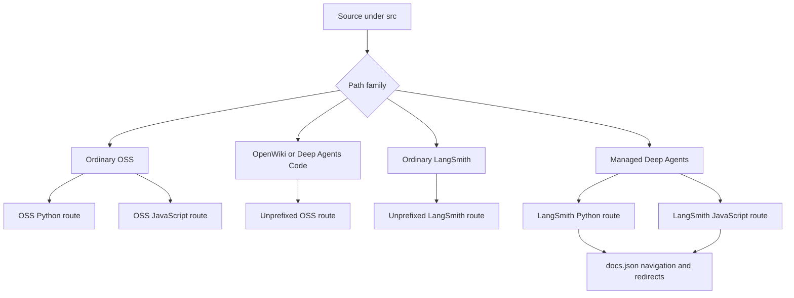
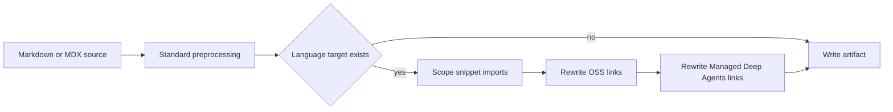

# Versioned Documentation and Routes

`DocumentationBuilder` derives generated documentation routes from source paths under `src/`. `src/docs.json` is a separate public-navigation and redirect configuration: its entries must refer to routes the builder emits, but a sidebar entry neither creates a page nor determines its source ownership. Treat **source ownership**, **emitted routes**, **navigation**, and **compatibility redirects** as four separate contracts.

## Route families

| Source family | Emitted route(s) | Preprocessing target |
| --- | --- | --- |
| Ordinary `src/oss/` content, including Deep Agents outside `code/` | `/oss/python/...` and `/oss/javascript/...` | `python` and `js` |
| `src/oss/python/...` or `src/oss/javascript/...` | Only the matching route family, without the source-language directory | Matching target |
| `src/oss/deepagents/code/...` | `/oss/deepagents/code/...` | `python` fallback |
| `src/oss/openwiki/...` | `/oss/openwiki/...` | `python` fallback |
| Ordinary `src/langsmith/...` | `/langsmith/...` | `python` fallback |
| Direct `src/langsmith/managed-deep-agents*.mdx` files | `/langsmith/python/...` and `/langsmith/javascript/...` | `python` and `js` |

```mermaid
flowchart TD
    Source["Source under src"] --> Family{"Path family"}
    Family --> Oss["Ordinary OSS"]
    Oss --> OssPy["OSS Python route"]
    Oss --> OssJs["OSS JavaScript route"]
    Family --> Product["OpenWiki or Deep Agents Code"]
    Product --> PlainProduct["Unprefixed OSS route"]
    Family --> Smith["Ordinary LangSmith"]
    Smith --> PlainSmith["Unprefixed LangSmith route"]
    Family --> Managed["Managed Deep Agents"]
    Managed --> ManagedPy["LangSmith Python route"]
    Managed --> ManagedJs["LangSmith JavaScript route"]
    ManagedPy --> Config["docs.json navigation and redirects"]
    ManagedJs --> Config
```

This is builder routing by source path. Configuration follows it; it is not an ownership classifier.

## Build lifecycle and ownership rules

A full `build_all()` removes and recreates `build/`, builds ordinary OSS for Python and JavaScript, then unversioned Deep Agents Code, OpenWiki, ordinary LangSmith, and Managed Deep Agents variants. It finally copies shared files and npm snippet components. Clearing output prevents stale artifacts after a full build.

`build_file()` applies the same policy for one existing source file: ordinary OSS emits twice except under the two unversioned product roots; ordinary LangSmith emits once; and a Managed Deep Agents page emits twice. Shared and root-level files copy once. A missing requested file raises `AssertionError`.

Language-owned OSS directories filter a dual build rather than appear in the final route. In a Python pass, `src/oss/javascript/...` is skipped, and vice versa. The selected `python` or `javascript` source component is removed before output, so `src/oss/python/concepts/example.mdx` emits at `/oss/python/concepts/example`, not a doubled path.

Ordinary LangSmith documents are emitted once below `/langsmith/`, excluding Managed Deep Agents files, and use the Python preprocessing target. That target is a rendering default; it does not make every ordinary LangSmith page Python documentation.

The full-build collectors reject symlinks—even links to regular files—and resolved paths outside the collection root. This prevents a source-tree link from introducing host files into an artifact.

## Transform an emitted Markdown page

For Markdown and MDX, the builder applies standard preprocessing first. If an output has a language target, it then scopes Markdown snippet imports, rewrites OSS links, and rewrites Managed Deep Agents links, in that order. Internal target `js` becomes public route segment `javascript`; `.md` output is written with an `.mdx` suffix.

```mermaid
flowchart LR
    Input["Markdown or MDX source"] --> Prep["Standard preprocessing"]
    Prep --> Target{"Language target exists"}
    Target -->|"yes"| Imports["Scope snippet imports"]
    Target -->|"no"| Output["Write artifact"]
    Imports --> OssLinks["Rewrite OSS links"]
    OssLinks --> ManagedLinks["Rewrite Managed Deep Agents links"]
    ManagedLinks --> Output
```

This diagram shows the transformation ordering for a regular generated Markdown artifact.

Use `:::python` and `:::js` only for content that differs by target. Conditional rendering keeps matching content without its fences and removes the nonmatching supported block. Escaped `\:::` becomes literal `:::`, while unsupported labels and unclosed blocks remain unchanged. The renderer is regex-based rather than code-fence-aware; escape a literal conditional marker instead of relying on a Markdown code fence to protect it.

An unqualified absolute OSS link such as `/oss/deepagents/overview` becomes `/oss/python/deepagents/overview` or `/oss/javascript/deepagents/overview` in a targeted artifact. Rewriting skips image URLs, already-prefixed URLs, and the language-agnostic Deep Agents Code and OpenWiki roots. In targeted MDX, an import from `/snippets/component.mdx` likewise becomes `/snippets/python/component.mdx` or `/snippets/javascript/component.mdx`; an already scoped import remains unchanged.

Shared Markdown snippets are emitted as Python and JavaScript copies with target-specific preprocessing and absolute rewritten links. The original snippet path is a Python-targeted default for unversioned importers; targeted pages import their matching copy. This avoids links whose correctness depends on a consumer's nesting depth.

## Unversioned OSS products

Deep Agents Code and OpenWiki are explicit exceptions to ordinary OSS duplication. They emit once at their unprefixed roots, and `python` is used only as a deterministic conditional-rendering fallback. Links within those roots remain unprefixed; a bare link from either product to ordinary OSS resolves to the Python OSS route.

`docs.json` lists the same unprefixed OpenWiki routes in the OpenWiki tab of both the Python and TypeScript Build dropdowns. The language-toggle script hides the switcher on `/oss/openwiki` because no alternate language route exists. Deep Agents Code is likewise unversioned regardless of where navigation places it.

## Managed Deep Agents: variants and legacy URLs

Managed Deep Agents is the LangSmith exception. A direct child of `src/langsmith/` named `managed-deep-agents*` with a `.md` or `.mdx` extension is classified as a variant page for an individual build. It produces Python and JavaScript artifacts, each with target-specific conditional content, snippets, and rewritten OSS and Managed Deep Agents links; it does not produce an unversioned artifact.

Author internal family links as bare `/langsmith/managed-deep-agents...` URLs when they should follow the reader's target. This includes Markdown links and quoted `href` values, as used by the current Managed Deep Agents pages such as the MCP endpoint and deployment page. For a language-targeted artifact, the final rewrite inserts `python` or `javascript`; an already-prefixed URL is deliberately left as-is. Thus one source can link within its own output family, whereas an ordinary LangSmith page built with the Python target resolves a bare Managed Deep Agents URL to Python.

The dedicated full-build discovery pass only selects direct `managed-deep-agents*.mdx` files. Although the individual-file classifier accepts `.md`, the full pass will not emit a `.md` page. Use a direct `.mdx` file for a Managed Deep Agents page that must appear in a full build.

### Navigation versus redirects

The Python and TypeScript Build dropdowns each contain a **Managed Deep Agents** tab. Both enumerate corresponding language-prefixed suffixes in **Get started**, **Agent capabilities** (including a nested **Channels** group), and **Build and deploy**; the latter includes the MCP endpoint. When adding a new variant, add matching entries to both tabs only after confirming both emitted routes exist.

Unversioned `/langsmith/managed-deep-agents...` URLs are compatibility inputs, not generated pages. `docs.json` redirects current unversioned routes—including overview, quickstart, channels, deployment, CLI, identity, MCP connectors, and other family pages—to Python. It also maps historical aliases such as `managed-deep-agents-invoke`, `-sdk`, `-api`, older channel paths, and connector paths to Python destinations. These redirects preserve inbound links and establish Python as the legacy default; they do not replace the JavaScript artifacts or navigation.

When adding or moving a Managed Deep Agents page:

1. Create a direct `src/langsmith/managed-deep-agents*.mdx` source file.
2. Use bare internal family URLs where the link should track the output language; use a prefixed URL only to intentionally pin a language.
3. Confirm both generated routes, then add matching Python and TypeScript navigation entries in `src/docs.json`.
4. Add or update an unversioned-to-Python redirect for a public, renamed, or legacy URL.
5. Run a full build and inspect both variants, including conditional branches, links, and snippet imports.

## Verification and safe changes

Builder regression tests cover unversioned Deep Agents Code and OpenWiki output and links, scoped snippet imports, and Managed Deep Agents dual output. The Managed Deep Agents fixture verifies language-specific links and conditional snippet content while confirming that no unversioned artifact is emitted. Other tests cover bare Markdown-link and quoted-`href` Managed Deep Agents rewrites and reject source-tree symlinks.

For a route change, modify source rather than `build/`; decide the source family before touching navigation; and use a full build when removing or moving pages. Inspect both emitted language variants where relevant, then verify that `docs.json` navigation names actual routes and that redirects are only compatibility mappings.

## See also

- [Source map](/openwiki/architecture/source-map.md)
- [Preprocessing](/openwiki/concepts/preprocessing.md)
- [Adding pages](/openwiki/operations/adding-pages.md)
- [Quickstart](/openwiki/quickstart.md)
- [Changing versioned content](/openwiki/workflows/versioned-content.md)
