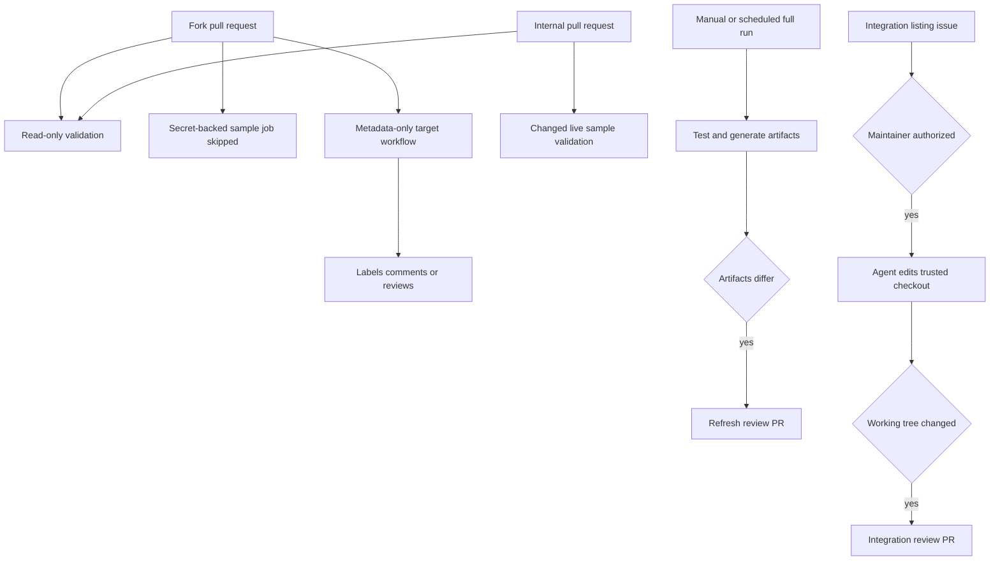
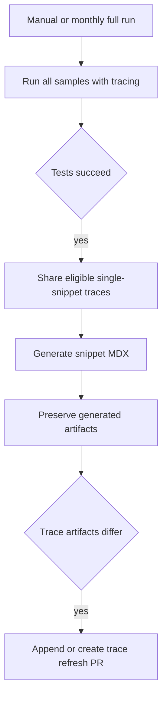
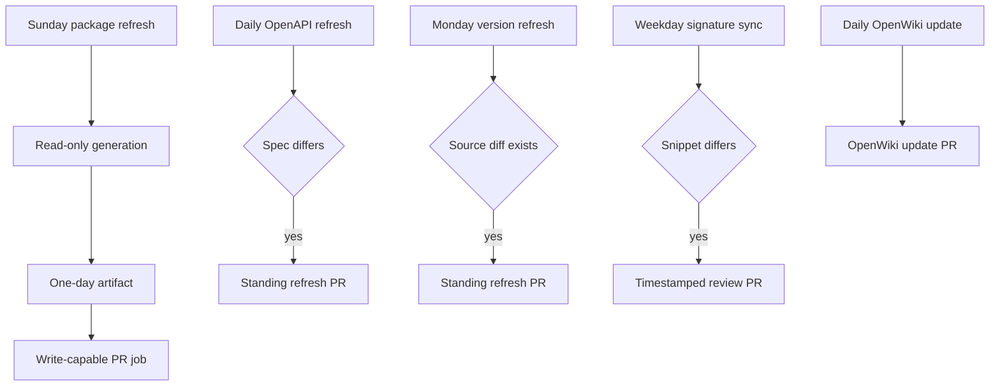

## Topology and trust boundary

The workflows fall into three security classes. Ordinary `pull_request` validation may check out and execute the proposed revision, but fork code must not receive secrets or a repository-writing token. `pull_request_target` workflows have a base-repository token, so their safe role is metadata-only policy and mutation: read base-ref configuration and GitHub API data, then label, comment, or request review without checking out or executing the PR head. Scheduled and manually dispatched writers run on the trusted repository and may use secrets or write branches and PRs.



This diagram maps the trust boundary from pull-request input through validation, gated automation, and review PRs.

This topology prevents untrusted input from becoming secret-backed execution or an uncontrolled write. A trusted writer still publishes only a non-empty candidate diff for review, except the package-download workflow which also enables its generated PR for squash auto-merge.

## Core CI and documentation gates

`ci.yml` runs for pull requests, pushes to `main`, and manual dispatch. It calls reusable test, lint, and documentation-link workflows on Python 3.13, and also checks unresolved merge markers, source cross-references, external-listing URL schemes, and the generated provider overview. Its concurrency group is the workflow plus ref and cancels a superseded in-progress run, prioritizing feedback for the latest commit.

The reusable test and lint workflows each use the requested Python version, make a shallow checkout, synchronize the `test` dependency group, and run `make test` or `make lint` in the requested working directory. The link workflow has read-only `contents` permission and a 20-minute limit; it uses Python 3.13 plus Node 22 and Mintlify, then runs `make broken-links-with-anchors` and `make check-openapi`. None of these reusable workflows receives a secret through its declared call interface.

### Generated overview and external URLs

`check-generated-files` regenerates `src/oss/python/integrations/providers/overview.mdx` using `pipeline/tools/partner_pkg_table.py` and fails if the result differs from the checkout. Change `packages.yml` or the generator, regenerate, and commit the output rather than hand-editing it. The check is intentionally bypassed for the expected `github-actions[bot]` package-download PR title and by a `bypass-auto-check` label.

The independent URL gate runs:

```bash
uv run python scripts/refresh_integration_downloads.py --check-docs-urls
```

It is write-free and accepts only `http(s)` or a single-slash site-relative `docs_url`; it rejects blank, protocol-relative, and unsafe schemes. The generator applies the same safety predicate before rendering an external URL into Markdown. This protects the link-href boundary but does not prove that a remote site is reachable. See [Integration Listing Automation](/openwiki/workflows/integration-listing-automation.md).

Useful local equivalents are:

```bash
make test
make lint
make broken-links-with-anchors
make check-cross-refs
uv run python scripts/refresh_integration_downloads.py --check-docs-urls
uv run python pipeline/tools/partner_pkg_table.py
```

### Changed-document version claims

`check-version-claims.yml` is a separate, read-only pull-request gate. It finds the merge base, selects changed `src/**/*.mdx` files, does nothing when none qualify, and otherwise passes only those paths to `check_version_claims.py --files`. The checker resolves documented `>=` and `==` package versions to the appropriate PyPI or npm registry. Exact ignore-list exceptions are honored; registry lookup failures are unresolved notes; and the gate fails only when a successfully resolved requested release was never published. It verifies availability, not whether a stated feature floor is semantically sufficient.

## Live code samples and trace refresh

`test-code-samples.yml` runs when code samples or its workflow change in a pull request, on manual dispatch, and monthly at 00:00 UTC on day one. It declares write permissions because full runs can publish a refresh PR, but its credential-dependent test job explicitly runs PR code only for non-fork PRs. Fork PRs therefore do not get provider-secret-backed execution.

For internal PRs, the workflow checks out full history, computes the merge base with the PR base, and selects changed supported `.py`, `.ts`, `.java`, `.kt`, `.go`, and `.sh` files below `src/code-samples/`. Manual and scheduled runs set `RUN_ALL=true`; they test all samples and have a 90-minute limit instead of the PR job's 60 minutes. The runner provisions pgvector PostgreSQL, Python and `uv`, Node, Java/JBang, and Go from `src/code-samples/go.mod`.

The sample runner retries recognized LangSmith HTTP 429 output up to three attempts and records persistent rate limiting as a skip. Ordinary sample failures and trace-collection failures fail the run. Only a manual or monthly full run enables `CODE_SAMPLE_TRACING`: after successful samples, it finds an eligible agent-like LangSmith root run, shares it publicly, and records its identifiers and link in `src/code-samples/trace-links.json`. A source file with more than one snippet marker is recorded as `skipped_multi_snippet`; it must be split before one trace can safely represent it.



This diagram shows the full-run ordering that prevents a trace refresh PR from representing a failed test run.

The trace refresh is ordered: successful test, trace collection, snippet generation, artifact comparison, then PR creation. It restores a clean checkout before applying artifacts to `chore/refresh-code-sample-traces`, appends to that PR while it is open, and exits without a write when the trace manifest and generated snippets are unchanged. Thus a refresh PR cannot represent a failed test run.

```bash
make test-code-samples FILES="src/code-samples/langchain/return-a-string.py"
make test-code-samples
make update-code-sample-traces FILES="src/code-samples/deepagents/overview-quickstart.py"
```

See [Code Sample Lifecycle](/openwiki/workflows/code-sample-lifecycle.md) for snippet markers and public-trace implications.

## Safe mutations for fork-facing PRs

`pull_request_target` is not a way to safely run a fork. The PR-facing target workflows retain base-repository permissions only for the narrowly scoped mutations below and query policy or PR data through GitHub APIs.

- **Path labels:** `labeler.yml` uses `fuxingloh/multi-labeler` with `.github/labeler.yml`. The protected `internal` and `external` labels have `sync: false`, so path synchronization does not overwrite them.
- **Owner summary:** for a non-draft opened or ready PR, `pr-welcome-comment.yml` reads `.github/OWNERS` from `pr.base.ref`, applies last-match ownership rules to changed-file metadata, optionally requests opted-in owners other than the author, and posts the ownership summary. It does not check out PR code.
- **External-integration nudge:** `external-integration-pr-comment.yml` identifies relevant external contributions from changed-file metadata, treats membership lookup errors conservatively as external, labels qualifying PRs, and posts one marker-idempotent issue-form nudge. It reads only candidate MDX front matter through the GitHub API to avoid the nudge for `featured: true` pages; it never checks out or executes fork content.

Do not add a fork-head checkout, execute a PR-supplied script, or interpolate untrusted PR fields into shell in these workflows. Put executable validation on ordinary `pull_request`; put secret-backed or repository-writing work on a controlled trusted path.

## Maintainer-gated integration listing

`integration-submission.yml` has contents, pull-request, and issue write permissions, but an issue opening does not start the agent. It starts from manual dispatch or an `integration-run` label. Before checkout, it verifies that the triggering actor has `admin`, `maintain`, or `write` permission; an unauthorized label event removes the label and comments on the issue. The `integration-automation` label prevents duplicate processing.

After authorization, the workflow parses issue-form headings into JSON without evaluating field values. The Deep Agents prompt treats them only as untrusted listing metadata and instructs the agent to leave local uncommitted edits, not push, open a PR, or comment. Parse errors, a blocker file, agent failure, and an empty diff are reported on the issue. Only a real diff lets the trusted workflow create `integration/issue-<number>`, open and label the integration PR, and link it back to the issue. This is maintainer-approved generation followed by review, not automatic acceptance of an issue submission.

## Trusted schedules, writers, and escalation



This diagram shows scheduled generation and the review-PR boundary for each writer.

The scheduled topology separates candidate generation from publishing where practical and relies on no-change exits. Standing branches prevent repetitive refresh jobs from stacking review PRs.

### Package downloads and Linear candidates

`update-package-downloads.yml` runs Sunday at 23:59 UTC or manually. Its read-only `generate-downloads` job refreshes eligible package counts, generates the provider overview and integration-download snippets, and uploads those surfaces as a one-day artifact. It creates Linear hosted-documentation candidate issues only if both `LINEAR_API_KEY` and `LINEAR_TEAM_KEY` are configured; otherwise candidate detection is dry-run.

The subsequent `commit-downloads` job alone has contents and pull-request write permission. It downloads the artifact and exits if `packages.yml`, the overview, and integration snippets do not differ; otherwise it creates a timestamped package-download PR and requests squash auto-merge. The artifact boundary narrows the point at which repository write capability is used, but this remains trusted automation.

### Scheduled checks and failure tickets

`htmltest.yml` is a read-only, 90-minute workflow run manually or at 08:00 UTC Monday. Its same-ref concurrency cancels obsolete runs and it runs:

```bash
make export-htmltest
```

This external-URL check of the Mint export is distinct from CI's build/link check. `htmltest-linear.yml` creates a Linear issue only when a scheduled **Htmltest Mint Export** run fails or is cancelled, attaching the failed run URL with the Linear secret and team-key variable. `test-code-samples-linear.yml` has the same scheduled-only `workflow_run` safeguard for failed or cancelled **Test Code Samples** runs. These producer-event guards must remain: they are escalation paths, not general issue creators.

### Standing refresh PRs and signature snippets

`refresh-external-versions.yml` runs Monday at 08:00 UTC or manually with write permissions. `check_external_versions.py --write` can rewrite only validated, exactly-once captured version digits from allowed sources. If `src/` has no diff, it exits; otherwise it appends to an open `chore/refresh-external-versions` PR or creates it. In write mode unreadable upstream entries are reported without blocking other resolvable updates, so reviewers still need to assess the surrounding requirement.

`refresh-langsmith-openapi.yml` runs daily at 10:00 UTC or manually. It processes the LangSmith specification, saves the generated `src/langsmith/langsmith-platform-openapi.json`, then appends to an existing `chore/refresh-langsmith-openapi` PR or creates one only if the processed file differs. Review the generated diff rather than hand-editing it; see [Reference Documentation](/openwiki/integrations/reference-docs.md).

`sync-deepagents-signatures.yml` is a trusted weekday 09:00 UTC or manual writer. It runs `scripts/sync_deepagents_signatures.py`, checks exactly the Python and JavaScript Deep Agents configuration-option snippet files, and creates a timestamped PR only when either changed. Unlike the standing refresh workflows, each changed run uses a new timestamped branch.

`openwiki-update.yml` is a separate daily 08:00 UTC or manual writer with repository-wide `contents: write` and `pull-requests: write` permissions. It uses a full-history checkout because `openwiki code --update --print` compares HEAD to the last documented commit. The command receives the configured OpenAI provider credential, the LangSmith connector credential, and optional LangSmith tracing credential through secret references; the workflow file contains no secret values.

The pull-request action maintains the `openwiki/update` branch and is restricted to `openwiki`, `AGENTS.md`, and `.github/workflows/openwiki-update.yml`. Review this allowlist as a security and ownership boundary: an OpenWiki run cannot place its automated PR changes elsewhere. In particular, the current workflow does not copy `AGENTS.md` to `CLAUDE.md`; keep any required guide synchronization explicit outside this workflow.

## Safe-change checklist

1. Keep fork-head code on ordinary validation paths without secrets or write tokens. Keep `pull_request_target` workflows metadata-only.
2. Change a generator input or generator, regenerate, and commit generated output; do not weaken the generated-file gate casually.
3. Retain both offline external-URL validation and render-time URL safety checks.
4. Skip forks before secret-dependent sample execution; retain merge-base selection for internal PRs and all-sample selection for full runs.
5. Preserve trace refresh ordering: test, generate, compare artifacts, then create or update a PR.
6. For trusted writers, retain their no-change exits and branch strategy: standing branches where configured, timestamped branches where configured.
7. Keep maintainer authorization before checkout and agent invocation, and keep all GitHub writes owned by the workflow.
8. Keep Linear escalation limited to failed or cancelled scheduled producer runs.

## Related pages

- [Mintlify](/openwiki/integrations/mintlify.md)
- [Reference Documentation](/openwiki/integrations/reference-docs.md)
- [Testing Overview](/openwiki/testing/test-overview.md)
- [Code Sample Lifecycle](/openwiki/workflows/code-sample-lifecycle.md)
- [Integration Listing Automation](/openwiki/workflows/integration-listing-automation.md)
- [Agent Skills](/openwiki/operations/agent-skills.md)
