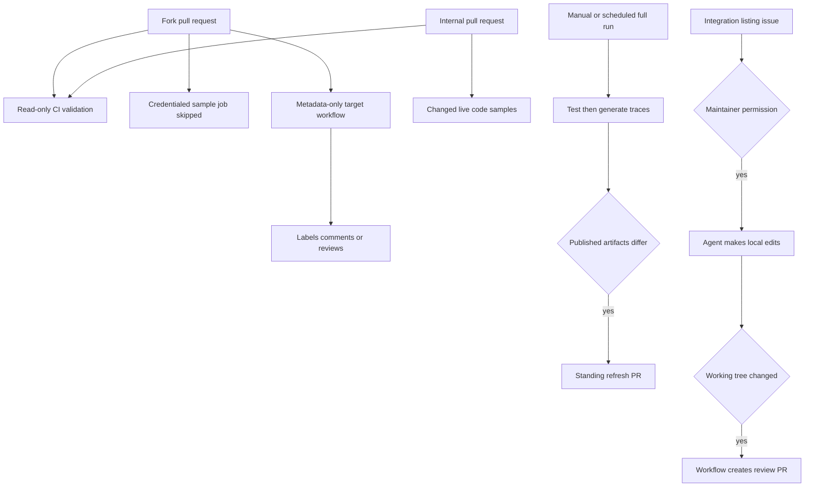
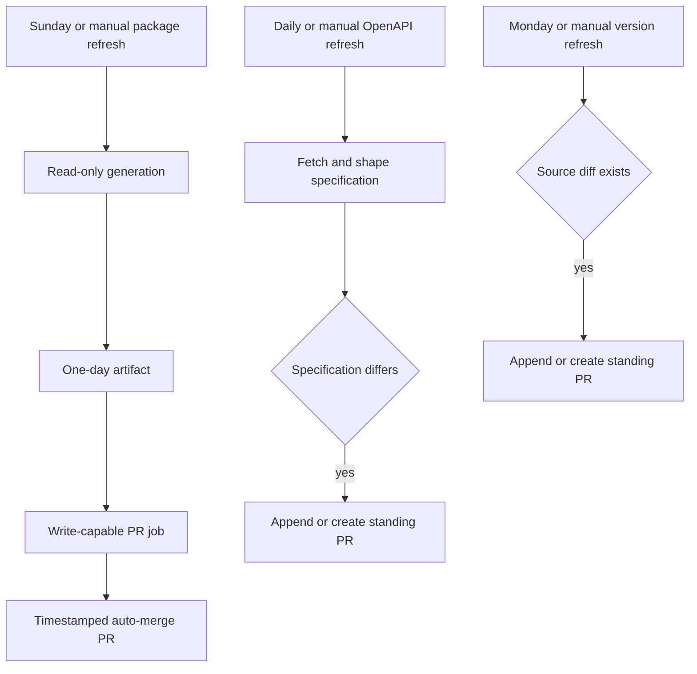

## Topology and trust boundary

Workflows have two intentionally separate roles. An ordinary `pull_request` workflow may check out and execute the proposed revision to validate it, but fork code must not receive secrets or a token that can write repository state. A job that needs provider credentials or creates GitHub or Linear state must instead be a trusted scheduled/manual path, explicitly skip forks, or—when handling fork PRs with `pull_request_target`—read API metadata only and never check out or run the head revision.



This shows the important publication invariant: untrusted input can be validated or read as data, but it does not gain secret-backed execution or control repository writes. Trusted automation publishes only a reviewed, non-empty generated or agent-produced diff.

## Core CI: validation and generated-file ownership

`ci.yml` runs on pull requests, pushes to `main`, and manual dispatch. It calls the reusable test, lint, and documentation-link workflows on Python 3.13, then independently detects unresolved merge markers, validates source cross-references, validates external-listing `docs_url` schemes, and verifies a generated provider overview. The reusable test and lint workflows install the test dependency group before `make test` or `make lint`; the link workflow installs Node 22 and Mintlify, runs `make broken-links-with-anchors`, then `make check-openapi`.

The CI concurrency group combines workflow and ref and cancels an older in-progress run after a newer push. This deliberately trades obsolete work for quicker feedback and runner availability.

### URL scheme gate

`check-external-docs-urls` runs:

```bash
uv run python scripts/refresh_integration_downloads.py --check-docs-urls
```

This mode checks the external-listing YAML and exits without network access or writes. A `docs_url` must be `https://`, `http://`, or a site-relative path beginning with one `/`; blank values, `javascript:` and `data:` schemes, and protocol-relative `//host` URLs fail. The generator applies the same predicate before making a Markdown link and rejects an unsafe external row during collection. Thus both CI and rendering protect the link-href boundary; neither establishes that a remote documentation site is reachable. See [Integration Listing Automation](/openwiki/workflows/integration-listing-automation.md) for the listing data model.

### Generated overview gate

`check-generated-files` regenerates `src/oss/python/integrations/providers/overview.mdx` with `pipeline/tools/partner_pkg_table.py` and fails when the checkout differs afterward. Update `packages.yml` or the generator, rerun it, and commit the result—do not hand-edit the output. The job intentionally bypasses the expected `github-actions[bot]` PR whose title includes `update package download counts`, and a PR labeled `bypass-auto-check`.

Useful local equivalents are:

```bash
make test
make lint
make broken-links-with-anchors
make check-cross-refs
uv run python scripts/refresh_integration_downloads.py --check-docs-urls
uv run python pipeline/tools/partner_pkg_table.py
```

### Changed-document package versions

`check-version-claims.yml` is a separate read-only PR gate. It computes the merge-base with the base branch, selects changed `src/**/*.mdx` paths using its configured Git diff filters, and skips when none qualify. Otherwise it invokes `scripts/check_version_claims.py --files` for only that set. The checker resolves `>=` and `==` claims to PyPI or npm using npm scope syntax, Python extras, nearby language labels, language fences, page-path context, then a PyPI default, and queries the resulting package set concurrently. An exact release—or a truncated series with a published release in that series—passes; a successfully looked-up release that was never published fails. Lookup failures, malformed registry responses, and unsafe package names are unresolved notes, while exact reviewed ignore-list entries are excluded. This checks release **availability**, not whether a feature needs a newer floor.

## Live code samples: selection, toolchains, and trace publication

`test-code-samples.yml` triggers for changes under `src/code-samples/**` or to its workflow definition, manual dispatch, and at 00:00 UTC on the first day of each month. Its repository permissions support trace-refresh publication, and samples may require provider secrets; consequently its only PR execution path is an internal PR (`head.repo.fork == false`). Fork PRs receive a skipped job, not secret-backed sample execution.

For an internal PR, a full checkout lets the job calculate the merge-base against the PR base and select changed `.py`, `.ts`, `.java`, `.kt`, `.go`, and `.sh` files below `src/code-samples/`. An empty selection succeeds without running the target. Manual and scheduled events set `RUN_ALL=true`, so they exercise all supported samples; their job limit is 90 minutes rather than the PR limit of 60.

The job supplies pgvector PostgreSQL, Python 3.13 and `uv`, Node 20, Java 21 plus JBang, and Go. `actions/setup-go` reads `src/code-samples/go.mod`, whose `go 1.25.0` directive is the Go toolchain declaration and whose direct requirements include `github.com/google/uuid` and `github.com/langchain-ai/langsmith-go`. Go samples run from `src/code-samples/` using `go run <relative-file>`, so that shared module resolves their dependencies; TypeScript and shell samples likewise run from that directory, Python runs through `uv`, and Java/Kotlin runs through JBang pinned to Java 21.

The runner defaults each sample timeout to 1,200 seconds, inheriting the workflow environment (including provider keys and `POSTGRES_URI`). It retries output recognized as a LangSmith HTTP 429 up to three total attempts with delays, then reports that sample as skipped. An ordinary nonzero result, timeout, or missing executable remains a failure. A rate-limit skip is not a successful validation and cannot create a trace.

### Full-run trace refresh

Only manual and monthly full runs set `CODE_SAMPLE_TRACING=1`; PR runs neither collect public traces nor publish generated artifacts. After each successful traced sample, the runner searches the configured `docs-code-samples` project for an eligible agent-like root run near that sample's start time, shares it publicly, and records its URL and identifiers in `src/code-samples/trace-links.json`. Trace-collection exceptions fail the run. A source with more than one `:snippet-start:` marker is recorded in `skipped_multi_snippet` and is not associated with one ambiguous trace; split it into one-snippet files to make it eligible.

Only after successful testing does a full run execute `make code-snippets`. Only after that succeeds does the workflow preserve `trace-links.json` and `src/snippets/code-samples`, restore a clean checkout, and compare those artifacts on `chore/refresh-code-sample-traces`. No diff means no write. A diff appends a commit to the existing open PR for that branch, or force-pushes a new branch and opens a PR to `main`. This ordering prevents a trace or generated-snippet PR from representing failed sample execution.

```bash
make test-code-samples FILES="src/code-samples/langchain/return-a-string.py"
make test-code-samples
make update-code-sample-traces FILES="src/code-samples/deepagents/overview-quickstart.py"
```

See [Code Sample Lifecycle](/openwiki/workflows/code-sample-lifecycle.md) for markers, generation, and public-trace implications.

## Safe GitHub mutations around fork PRs

`pull_request_target` has a base-repository token and is therefore a metadata/mutation boundary, not a safe way to execute a fork. The PR-facing workflows use `contents: read` and `pull-requests: write`, retrieve policy from the base ref, and query changed-file or head-file content through GitHub APIs without a head checkout.

- **Path labels:** `labeler.yml` delegates changed-path labels to `fuxingloh/multi-labeler` using `.github/labeler.yml`. `internal` and `external` have `sync: false`, leaving them to their protected-label automation.
- **Owner summary:** on non-draft opened or ready PRs, `pr-welcome-comment.yml` reads `.github/OWNERS` at `pr.base.ref`, applies last-matching ownership rules, and requests only `# auto-request` owners other than the author. It then comments with the ownership summary without executing PR code.
- **External-integration nudge:** `external-integration-pr-comment.yml` identifies qualifying non-bot external contributions from file metadata, checks organization membership, and treats lookup errors conservatively as external. It labels the PR and posts one marker-idempotent issue-form nudge unless a candidate head MDX front matter declares `featured: true`. It reads that front matter through `repos.getContent`, not a checkout.

Never add a fork-head checkout, execute a PR-provided script, or interpolate untrusted PR fields into shell in one of these workflows. Put code execution in an ordinary `pull_request` workflow; put secret or repository-write activity on a controlled trusted path.

## Maintainer-gated integration listing

`integration-submission.yml` has repository write permissions, but issue creation alone cannot start it. It runs only for manual dispatch with an issue number or an `integration-run` label event. Before checkout, it queries the triggering actor's collaborator permission and permits only `admin`, `maintain`, or `write`. An unauthorized label event removes that label and comments on the issue; an existing `integration-automation` label suppresses duplicate work.

After authorization, the workflow parses `###` form headings into JSON without evaluating submitted values. It treats those values solely as untrusted listing metadata in the Deep Agents prompt, and instructs the agent to make uncommitted local edits only—no push, PR, or GitHub comment. Parse failure, agent failure, a blocker file, and an empty diff are reported to the issue. Only a real diff leads the trusted workflow to create `integration/issue-<number>`, open and label the listing PR, and link it from the issue. This is deliberately a maintainer-approved review workflow, not automatic acceptance of an issue submission.

## Scheduled maintenance and escalation



The diagram separates read-only production of a candidate from a job that can publish it. Even trusted scheduled writers should preserve no-change exits and a deterministic standing-PR branch so routine runs do not create duplicate review work.

### Package downloads and hosted-doc candidates

`update-package-downloads.yml` runs Sundays at 23:59 UTC or manually. Its first job has read-only contents permission: it refreshes eligible package download counts, regenerates the provider overview and integration download snippets, and uploads only those surfaces as a one-day artifact. It calls `flag_hosted_docs_candidates.py --create` only when both `LINEAR_API_KEY` and `LINEAR_TEAM_KEY` exist; otherwise candidate detection is dry-run.

The second job alone has contents and pull-request write permissions. It downloads the artifact, exits if `packages.yml`, the overview, and integration snippets have no diff, or creates a timestamped `chore/update-package-downloads-*` PR and enables squash auto-merge. The artifact split narrows when write capability is used, but the workflow remains a trusted path because it can create Linear issues and a repository PR.

### Scheduled checks and Linear tickets

`htmltest.yml` is a read-only, 90-minute workflow run manually or at 08:00 UTC on Mondays. Its same-ref concurrency cancels obsolete runs and it runs:

```bash
make export-htmltest
```

This is an external-URL check of the Mint export, distinct from CI's built link-and-anchor check. `htmltest-linear.yml` watches completed **Htmltest Mint Export** runs and creates a Linear issue only for failed or cancelled *scheduled* runs, attaching the run URL with the Linear secret and team-key variable.

`test-code-samples-linear.yml` applies the same scheduled-only `workflow_run` condition to **Test Code Samples**. It creates a Linear ticket for failure or cancellation with the workflow URL; manual and PR runs cannot create it. Preserve these producer-event guards—these workflows are escalation paths, not general issue creators.

### Version refresh and OpenAPI refresh

`refresh-external-versions.yml` is a Monday 08:00 UTC or manual trusted writer. It runs `scripts/check_external_versions.py --write`, exits if `src/` has no diff, and otherwise maintains one open `chore/refresh-external-versions` PR by appending to it or creating it. The external-version registry constrains each entry to a safe `src/` page, an exactly-once capture of the documented version, and an allowed GitHub upstream source; the script replaces only captured digits. In write mode unreadable upstream entries are reported rather than blocking other resolvable updates, so reviewers must still confirm the surrounding semantic requirement.

`refresh-langsmith-openapi.yml` is another trusted writer with `contents: write` and `pull-requests: write`. It runs daily at 10:00 UTC or manually, processes the allow-listed LangSmith public specification with:

```bash
uv run python scripts/process_langsmith_openapi.py --write
```

The processor fetches only `api.smith.langchain.com`, marks configured fleet/internal operations hidden, shapes tag groups and titles for public documentation, and writes `src/langsmith/langsmith-platform-openapi.json`. The workflow saves the candidate, restores a clean tree, then uses `chore/refresh-langsmith-openapi`. If that branch has an open PR, it checks it out and appends a commit; otherwise it opens a new PR. It exits without a commit when the processed spec has no diff. Review this standing PR and change processor rules or its authorized source rather than hand-editing the generated output. See [Reference Documentation](/openwiki/integrations/reference-docs.md) for the Mintlify route boundary.

`openwiki-update.yml` is a separate daily 08:00 UTC or manual trusted writer. It needs full Git history for `openwiki code --update --print` to compare against the last documented commit, synchronizes `CLAUDE.md` from `AGENTS.md`, and maintains the `openwiki/update` PR. As with the other writers, it runs against the trusted base repository and must not be redirected to execute fork-head code.

## Safe-change checklist

1. Keep fork PR code on ordinary validation paths without secrets or write tokens. For `pull_request_target`, use only base-ref policy and API metadata.
2. Preserve the generated-file gate: change the input or generator, regenerate, and commit the result.
3. Keep external `docs_url` validation offline and retain both validation and render-time scheme checks.
4. Explicitly skip forks before any secret-dependent sample execution. Keep the merge-base changed-file selection for internal PRs and all-sample selection for manual/scheduled runs.
5. Keep trace publication full-run-only and preserve test, generate, artifact-diff, then PR ordering.
6. For a trusted writer, publish only a non-empty diff and reuse its standing branch while its PR remains open.
7. Retain maintainer authorization before checkout and agent use; retain workflow ownership of all GitHub writes.
8. Keep Linear ticket creation limited to failed or cancelled scheduled producer runs.

## Related pages

- [Reference Documentation](/openwiki/integrations/reference-docs.md)
- [Quickstart](/openwiki/quickstart.md)
- [Testing Overview](/openwiki/testing/test-overview.md)
- [Code Sample Lifecycle](/openwiki/workflows/code-sample-lifecycle.md)
- [Integration Listing Automation](/openwiki/workflows/integration-listing-automation.md)
