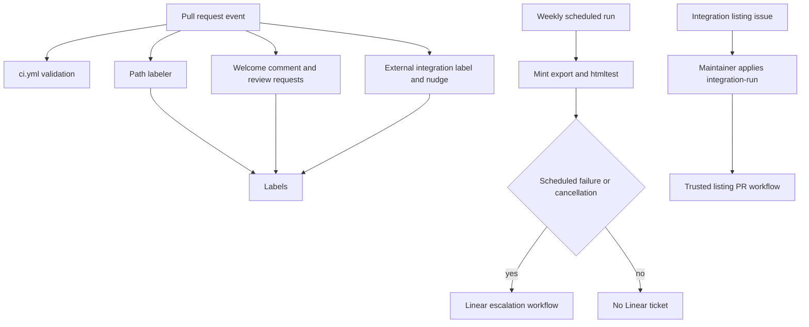

## Topology and trust boundary

Workflows have two different jobs: validate a revision, or mutate GitHub state. `ci.yml` is the broad validation entrypoint for pull requests, pushes to `main`, and manual dispatch. PR-facing workflows use `pull_request_target` only where they need the base repository token to label, comment, or request review for a fork contribution. Scheduled and manually dispatched repository workflows can have separate write permissions and secrets, but must not be repurposed to run fork code.



This flow distinguishes read-oriented validation from GitHub mutations and routes only unsuccessful scheduled export checks to Linear.

## Core CI: revision validation

`ci.yml` calls reusable test, lint, and documentation-link workflows, then independently checks unresolved merge markers, source cross-references, safe schemes in external integration `docs_url` values, and whether the generated provider overview is current. It runs on PRs and `main` pushes, and uses a workflow-and-ref concurrency group that cancels an older in-progress run after a newer push. Do not infer branch protection or merge approval policy from a green CI result; those are GitHub repository settings, not workflow behavior.

The generated-file gate reruns `pipeline/tools/partner_pkg_table.py` and fails if `src/oss/python/integrations/providers/overview.mdx` differs. Change its inputs or generator, regenerate, and commit the result rather than editing the overview. The check intentionally skips package-download bot updates with the expected title and PRs labeled `bypass-auto-check`.

Useful local equivalents are:

```bash
make test
make lint
make broken-links-with-anchors
make check-cross-refs
uv run python scripts/refresh_integration_downloads.py --check-docs-urls
uv run python pipeline/tools/partner_pkg_table.py
```

For scope and interpretation of these checks, see [Testing Overview](/openwiki/testing/test-overview.md). Mint's built-tree link check is different from the scheduled export check below.

## Pull-request labels, comments, and reviewers

### Path labels

`labeler.yml` handles `opened`, `synchronize`, `reopened`, and `ready_for_review` events with `pull_request_target`, `contents: read`, and `pull-requests: write`. It delegates path matching to `fuxingloh/multi-labeler` with the base-repository `.github/labeler.yml` configuration. Most path labels are synchronized: a PR touching matching paths receives labels such as `langsmith`, `mda`, `langgraph`, `langchain`, language labels, `ci`, `docs-infra`, `integration`, or `tests`, and the action can remove them as the matching diff changes. `internal` and `external` are explicitly protected with `sync: false`, so path labeling cannot remove labels managed elsewhere.

### Welcome comment and opted-in review requests

`pr-welcome-comment.yml` runs only for non-draft PRs when opened or marked ready for review. It reads `.github/OWNERS` from the PR base ref and obtains the changed-file list through GitHub's API; it does not check out the head revision. It evaluates rules in order with the last match winning, just as CODEOWNERS does. The file is deliberately named `OWNERS`, not `CODEOWNERS`, so GitHub does not independently request reviewers.

For matching ownership rules annotated `# auto-request` (optionally restricted to listed owners), the workflow requests those reviewers except the PR author. It then posts a contributor-facing owner summary. If no product-area owners match, it normally uses the configured general fallback; authors already owning a changed file do not get that fallback comment. Bot PRs take an assignment path instead, including special parsing for supported bot PR bodies and a fallback reviewer.

### External integration contribution nudge

`external-integration-pr-comment.yml` is the specialized fork-safe path. For non-draft, non-bot PRs it lists changed files through the API and continues only if the PR adds a non-template hosted integration file below the Python or JavaScript integration directories, or changes `scripts/data/integration_external_docs.yaml`. It uses a GitHub App token to check whether the author is an active `langchain-ai` member; a 404 or another membership API error is conservatively treated as external.

Eligible external PRs receive `integration` if absent. The workflow then reads each new MDX file directly from the PR head through the API to inspect front matter. A new page with `featured: true` suppresses the nudge, but not labeling. Otherwise it posts one listing-form message directing contributors to the Integration listing issue form; an HTML comment marker makes the comment idempotent across synchronize events.

## Why `pull_request_target` is constrained

`pull_request_target` supplies a token associated with the base repository, which is why these workflows can write labels, comments, and review requests for fork PRs. That capability makes the execution boundary more important than the trigger name:

- Do not check out `github.event.pull_request.head.sha`, run repository scripts from the head, or interpolate PR title/body/file content into shell commands in such a workflow.
- Read trusted policy/configuration from the base ref and use GitHub API metadata for changed files. The welcome workflow does this for `OWNERS`; the external integration workflow reads only specific head MDX content as data for a boolean front-matter decision.
- Keep permissions minimal. The labeler, welcome, and external-integration workflows declare only `contents: read` and `pull-requests: write`; the external workflow's membership check uses its app token rather than expanding a generic checkout job.

If a desired action needs to build or execute a contributor's changes, put it in the ordinary `pull_request` validation path with read-only permissions instead. If it needs repository writes or secrets, require a maintainer-controlled event and clearly separate parsing of untrusted inputs from the write operation.

## Integration issue automation is a separate privileged path

The external PR nudge is not the listing producer. `integration-submission.yml` starts only on manual dispatch with an issue number or a maintainer-applied `integration-run` label. Before checkout, it verifies that the triggering actor has `admin`, `maintain`, or `write` permission. An unauthorized label application is removed and explained; an issue already carrying `integration-automation` is skipped. The workflow parses the issue body into JSON before invoking the agent and treats field values as untrusted metadata. The agent leaves edits uncommitted, while the trusted workflow handles issue comments and creates the review PR only when edits exist.

See [Integration Listing Automation](/openwiki/workflows/integration-listing-automation.md) for the intake schema, parser behavior, agent outcomes, generated surfaces, and retry procedure.

## Weekly Mint export and Linear escalation

`htmltest.yml` runs at 08:00 UTC each Monday or manually, with read-only contents permission and cancellation of obsolete runs for the same workflow/ref. It checks out the repository without persisted credentials, installs test dependencies, configures Node 22, installs or restores Mintlify CLI, applies the KaTeX installation workaround on a cache miss, installs `htmltest`, and runs:

```bash
make export-htmltest
```

The job has a 90-minute limit. This check validates the Mint offline export's external URLs; it is not the internal link and anchor gate used in CI. Reproduce an actionable result locally with the same command and use the [Mintlify Integration](/openwiki/integrations/mintlify.md) page to distinguish export limitations from an external-resource failure.

`htmltest-linear.yml` observes completed runs of **Htmltest Mint Export**. It creates a Linear issue only when the originating event was `schedule` and the result was `failure` or `cancelled`; a manual failure deliberately does not create a ticket. The issue includes the workflow-run URL and uses a timeout-specific title/diagnosis for cancellation, otherwise reporting a failed weekly check. The Linear key and team key are supplied respectively by `LINEAR_API_KEY` secret and `LINEAR_TEAM_KEY` repository variable.

## Other scheduled and write-capable automation

`refresh-langsmith-openapi.yml` runs daily at 10:00 UTC or manually, processes the LangSmith public OpenAPI specification, and maintains at most one open `chore/refresh-langsmith-openapi` PR. `openwiki-update.yml` runs daily at 08:00 UTC or manually with contents and pull-request write permission; it needs full history for `openwiki code --update --print`, synchronizes `CLAUDE.md` from `AGENTS.md`, and maintains `openwiki/update`. These are trusted base-repository jobs with write capability and secret environment configuration, not extension points for PR head execution.

## Change checklist

1. For a new PR-facing mutation, first decide whether `pull_request_target` is necessary. Prefer ordinary `pull_request` for checks that execute changed code.
2. With `pull_request_target`, avoid head checkout and shell interpretation of untrusted fields; use base-ref configuration and API reads only.
3. Add or revise a path label in `.github/labeler.yml`; preserve `sync: false` for labels owned by another automation.
4. For owner messaging, update `.github/OWNERS` with ordering in mind: the last matching rule wins, and add `# auto-request` only where automatic reviewer requests are intended.
5. Test weekly export changes with `make export-htmltest`; ensure Linear escalation remains restricted to failed or cancelled scheduled runs.
6. Keep agent- or secret-backed workflows behind a maintainer-controlled trigger and preserve their authorization and workflow-owned write boundary.

## Related pages

- [Mintlify Integration](/openwiki/integrations/mintlify.md) — build output, export semantics, and publication boundary.
- [Integration Listing Automation](/openwiki/workflows/integration-listing-automation.md) — maintainer-gated issue-to-PR lifecycle.
- [Testing Overview](/openwiki/testing/test-overview.md) — local validation selection and CI failure interpretation.
- [Reference Documentation](/openwiki/integrations/reference-docs.md) — generated reference documentation.
- [Quickstart](/openwiki/quickstart.md) — setup and common local commands.
