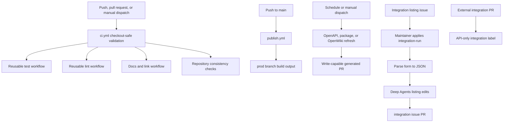

## Overview

Automation is intentionally split by trust boundary. `ci.yml` validates a checked-out revision on pushes to `main`, pull requests, and manual dispatch; its repository-specific jobs explicitly use read-only contents permission. Workflows that publish, call privileged services, create issues, or write branches declare their own write permissions and run from trusted repository events or schedules. A passing CI run is a validation signal, not the repository's merge policy.

`ci.yml` also uses a workflow-and-ref concurrency group and cancels an older in-progress run when a newer push arrives. Results therefore track the newest revision rather than consuming runners on obsolete commits.



This topology shows validation, publishing, scheduled producers, the maintainer-gated issue path, and the API-only fork-safe labeling path.

## Deterministic pull-request validation

The primary workflow calls `_test.yml`, `_lint.yml`, and `_check-links.yml` with Python 3.13, then checks unresolved merge markers, source cross-references, external integration `docs_url` schemes, and the generated provider overview. The reusable workflows install the test dependency group with frozen resolution and operate on a shallow checkout.

- **Tests:** `make test` runs pytest over `tests/unit_tests` with `--disable-socket --allow-unix-socket`. This prevents accidental TCP/network access while permitting Unix-socket use.
- **Lint:** `make lint` runs Ruff format/rule checks, `ty`, and Codespell. Ruff diagnostics use GitHub format for inline annotations.
- **Documentation:** the link workflow builds the docs, runs Mintlify with anchor checking, and validates the agent-server OpenAPI document. It caches Mintlify by the workflow definition and patches the known KaTeX `__VERSION__` installation defect on cache misses. The Make target filters known generated/snippet false positives and fails if link reports remain.
- **Generated artifact invariant:** `check-generated-files` regenerates `src/oss/python/integrations/providers/overview.mdx` and rejects a diff. It bypasses this only for the package-download bot's matching PR title or a PR labeled `bypass-auto-check`; changes belong in its generator or metadata, then the generated output must be committed.

Run checkout-safe failures locally from the repository root:

```bash
make lint
make test
make broken-links-with-anchors
make check-cross-refs
uv run python pipeline/tools/partner_pkg_table.py
```

A docs failure can originate in the build before Mintlify checks links. For a generated-file failure, regenerate and inspect the diff rather than editing the output by hand.

## Executable code samples

`test-code-samples.yml` is deliberately outside core CI because its samples use live dependencies. It runs every Sunday or manually across all samples, and for same-repository pull requests runs only changed supported Python, TypeScript, Java/Kotlin, Go, and shell files. Fork PRs are skipped because provider secrets are unavailable. The runner gives each sample 600 seconds; it retries LangSmith HTTP 429 responses three times and reports a persistent rate limit as skipped, while other sample failures fail the job.

## Publish behavior

`publish.yml` runs on `main` pushes or manual dispatch. It builds documentation with Python 3.13 and `uv`, fails if `build/` was not created, copies that directory beneath `public/build`, and uses the GitHub token to publish `public` to the `prod` branch. This is a write-capable deployment path; it is not a pull-request workflow.

## Integration listing automation and external PR handling

`integration-submission.yml` turns the Integration listing issue form into a reviewable documentation PR, but an issue opening alone cannot start the privileged agent. It runs only when a maintainer applies `integration-run` or when manually dispatched with an issue number. Before checkout it calls the GitHub API to verify that the actor has `admin`, `maintain`, or `write` permission. An unauthorized label event removes the label, comments on the issue, and skips; an issue already marked `integration-automation` also skips to prevent duplicate processing.

The workflow fetches the issue body, and `scripts/parse_integration_submission_issue.py` maps `###` form headings into stable JSON fields without executing or evaluating field values. It requires the core display name, component, docs URL, description, and language-appropriate package names. A parse failure comments with the errors and does not invoke the agent. The parser's unit tests cover successful extraction and the Python-package requirement.

After successful parsing, the workflow labels and comments that automation is in progress, constructs a prompt that treats submission fields as untrusted listing metadata, and invokes Deep Agents with the `submit-integration` skill. The prompt requires uncommitted working-tree edits and forbids the agent from pushing, opening PRs, or commenting on GitHub. The surrounding trusted workflow owns those write operations: blocker file, agent failure, and no-change cases become issue comments; real edits are turned into `integration/issue-<number>` PRs labeled `integration`, assigned to the maintainer, and linked back to the issue and author.

`external-integration-pr-comment.yml` is a distinct privileged integration workflow. It uses `pull_request_target` so it can label fork PRs, but does **not** check out or execute their code. Its GitHub Script reads changed-file metadata through the API, identifies added hosted integration pages or changes to `scripts/data/integration_external_docs.yaml`, checks the author’s organization membership, and adds `integration` only for external non-bot contributors. Membership API errors conservatively classify the author as external. The workflow's former contributor nudge is disabled; only labeling remains.

## Scheduled generated-data PRs

`refresh-langsmith-openapi.yml` runs daily at 10:00 UTC or manually. It runs `scripts/process_langsmith_openapi.py --write`, which fetches the allowlisted `api.smith.langchain.com` spec, writes `src/langsmith/langsmith-platform-openapi.json`, hides fleet/internal/health operations through `x-hidden`, and adds human-readable tag groups. If the output changed, the workflow maintains a single standing `chore/refresh-langsmith-openapi` PR: it appends to its open branch or creates a new branch from `main`; no diff means no commit.

`update-package-downloads.yml` runs Sundays at 23:59 UTC or manually. Its read-only generation job refreshes `packages.yml`, the provider overview, and integration snippets, then transfers the outputs as a one-day artifact to a write-capable PR job. That job exits without a diff; otherwise it creates a timestamped branch, opens a PR, and enables squash auto-merge. Package collection does not query Pepy for records updated within 24 hours, records a missing badge as zero, and raises other request failures. Hosted-doc candidate flagging is dry-run unless both its API secret and team configuration are present.

These workflows contact external systems or write branches, so diagnose them separately from deterministic CI: inspect the failed command and its external response, then distinguish a transformation defect from a service outage, rate limit, or the normal 24-hour no-change gate.

## Daily OpenWiki update PR

`openwiki-update.yml` runs daily at 08:00 UTC or manually with contents and pull-request write permission. It checks out full history because `openwiki code --update --print` compares `HEAD` to the last documented commit; a shallow clone hides that commit and yields an empty change summary. It installs the pinned OpenWiki, Mermaid, and jsdom packages, runs the update, then copies `AGENTS.md` over `CLAUDE.md` before maintaining the `openwiki/update` PR. This synchronization is required because the repository's separate sync check requires the two guidance files to be identical.

The update receives provider, LangSmith connector, and optional tracing configuration through repository-secret environment variables. Values must never be logged, placed in commands, or copied into generated documentation. Because this scheduled base-repository workflow has credentials and branch-write capability, it must not be repurposed to execute untrusted fork code.

## Operating guidance

Keep deterministic checks checkout-safe and reproducible through Make targets. Put a new external fetch, service credential, or repository mutation behind a narrowly triggered workflow with the least permissions it needs; make no-change runs exit before opening noise PRs. When changing integration automation, preserve the authorization gate, the structured parse boundary, and the rule that the agent edits locally while the workflow creates the PR. When changing OpenWiki automation, retain full-history checkout and the `AGENTS.md` to `CLAUDE.md` synchronization.
