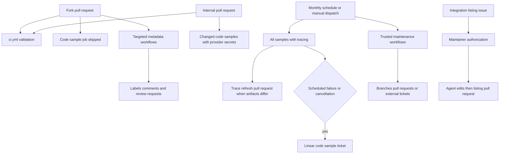
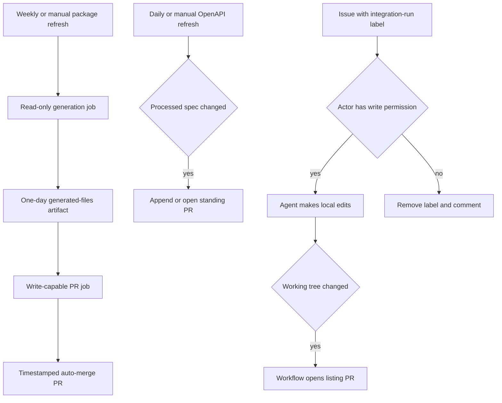
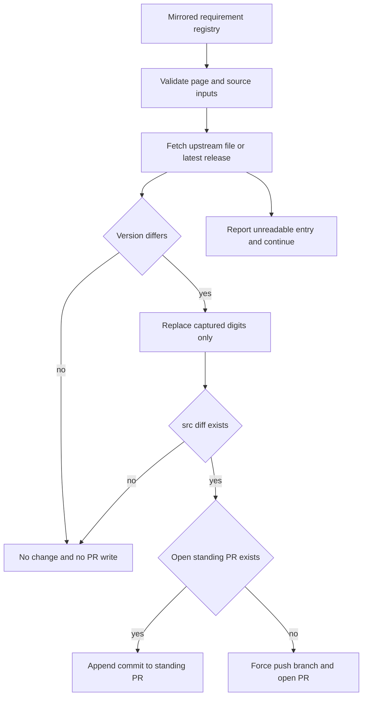

## Topology and trust boundary

Workflows fall into two deliberately different classes. Ordinary `pull_request` workflows validate a revision; they may check out and execute its code, but must not become a path for fork code to receive secrets or mutate repository state. Workflows that use a base-repository token, secrets, or write GitHub/Linear state are constrained to metadata-only fork handling or to maintainer-controlled, scheduled, and manual entrypoints.



This diagram shows the execution and credential boundary: fork PR code may be validated by the ordinary CI path, but the credentialed code-sample job is skipped; `pull_request_target` workflows consume API metadata rather than checking out fork code.

## Untrusted pull-request validation

### Core CI

`ci.yml` runs on pull requests, pushes to `main`, and manual dispatch. It calls reusable test, lint, and documentation-link workflows, then independently checks unresolved merge markers, source cross-references, safe schemes in external integration `docs_url` values, and whether the generated provider overview is current. Its workflow-and-ref concurrency group cancels an older in-progress run after a newer push, avoiding tests of an obsolete revision.

The URL gate is deliberately a non-network validation: `--check-docs-urls` checks every external-listing `docs_url` and writes nothing. It allows `https://`, `http://`, or a single-slash site-relative path, and rejects missing values, `javascript:`/`data:`-style schemes, and protocol-relative `//host` values. The generator repeats this guard before rendering an external link, so a bad listing cannot become an unsafe generated Markdown href.

The reusable test and lint workflows install the test dependency group and run `make test` or `make lint`; the link workflow builds docs and runs `make broken-links-with-anchors` plus `make check-openapi`. The generated-file gate reruns `pipeline/tools/partner_pkg_table.py` and fails if `src/oss/python/integrations/providers/overview.mdx` differs. Update generator inputs, regenerate, and commit the result rather than editing the overview. The gate skips the expected `github-actions[bot]` package-download PR title and PRs labeled `bypass-auto-check`.

### Changed-document package-version gate

`check-version-claims.yml` is a separate, read-only `pull_request` gate. It triggers only when `src/**/*.mdx`, its checker, its ignore list, or the workflow changes. With a full checkout it computes the merge-base against the PR base branch, selects added, copied, modified, renamed, type-changed, unmerged, or unknown changed `.mdx` files below `src/`, and does nothing further when that set is empty. For a nonempty set it installs Python 3.13 and runs `scripts/check_version_claims.py --files` only on those paths.

This boundary validates **availability**, not dependency policy. The checker extracts `>=` and `==` package specifiers and resolves PyPI versus npm from, in order, npm scope, Python extras, a nearby language label, a `:::python` or `:::js` fence, the page path or explicit page override, then a PyPI default. It queries each relevant registry concurrently. An exact release, or a truncated series with a published release in that series, passes; a named version that was never published blocks the PR. Lookup failures, malformed registry responses, and unsafe package names are reported as unresolved notes rather than false unpublished-version failures. Exact reviewed exceptions in `scripts/version_claims_ignore.txt` are excluded.

The gate deliberately cannot establish that a floor is sufficient for a feature or should be raised. Keep that compatibility decision with the feature owner. For a focused local reproduction, run:

```bash
uv run python scripts/check_version_claims.py --files src/langsmith/evaluators.mdx
```

Useful local equivalents are:

```bash
make test
make lint
make broken-links-with-anchors
make check-cross-refs
uv run python scripts/refresh_integration_downloads.py --check-docs-urls
uv run python pipeline/tools/partner_pkg_table.py
```

For scope and interpretation of these checks, see [Testing Overview](/openwiki/testing/test-overview.md). Mint's built-tree link check is distinct from the scheduled export check below.

### Code samples: fork safety and selection

`test-code-samples.yml` is an ordinary `pull_request` workflow limited to changes under `src/code-samples/**` or to its workflow file. It requires provider credentials for some samples and declares repository write permissions for its trace-refresh capability, so its test job runs for an internal PR only; fork PRs produce a skipped job rather than executing samples with unavailable secrets. It also accepts manual dispatch and runs automatically at 00:00 UTC on the first day of each month. Its concurrency policy cancels older runs for the same workflow and ref.

PR runs test only changed executable sample files (`.py`, `.ts`, `.java`, `.kt`, `.go`, and `.sh`) below `src/code-samples/`, comparing the PR head to the merge base of the base branch. A non-PR event would compare `github.event.before`, although this workflow has no push trigger. If that selected set is empty, the job succeeds without invoking the test target. Scheduled and manual runs set `RUN_ALL=true` and run every supported sample, with a 90-minute job limit instead of the 60-minute PR limit.

The job provisions PostgreSQL with pgvector and installs Python/uv, Node 20, Java 21 with JBang, and Go from `src/code-samples/go.mod`. It passes provider keys, `POSTGRES_URI`, and selection variables to `make test-code-samples`. The runner executes language-specific commands; individual samples have a configurable 1,200-second timeout. Persistent LangSmith API 429 responses are retried three times and then reported as skipped rather than failing the run, while an ordinary sample failure fails it.

## Credentialed full runs and trace refresh

Manual and monthly runs additionally set `CODE_SAMPLE_TRACING=1` and `LANGSMITH_PROJECT=docs-code-samples`. After each successful sample, the runner searches LangSmith for an agent-like root run in the sample's time window, makes its trace publicly shareable, and records the link in `src/code-samples/trace-links.json`. Trace collection failure makes the overall run fail. Only a source file containing exactly one `:snippet-start:` marker is eligible; files with multiple markers are recorded as skipped until split, preventing one trace from being attached ambiguously to several snippets.

When the full test and `make code-snippets` both succeed, the workflow copies the refreshed manifest and generated snippet MDX aside, restores a clean checkout, and applies those artifacts to `chore/refresh-code-sample-traces`. If the designated paths have no diff, it writes nothing. Otherwise it appends a commit to the existing open PR for that branch, or force-pushes a new branch and opens a PR targeting `main`. This is a trusted repository write path, not part of fork PR validation.

Use the focused local commands when credentials are available:

```bash
make test-code-samples FILES="src/code-samples/langchain/return-a-string.py"
make test-code-samples
make update-code-sample-traces FILES="src/code-samples/deepagents/overview-quickstart.py"
```

See [Code Sample Lifecycle](/openwiki/workflows/code-sample-lifecycle.md) for authoring and generated-snippet context.

## GitHub mutations for fork PRs

`pull_request_target` supplies a base-repository token, which lets a workflow label, comment on, or request reviewers for a fork PR. It does **not** make a fork safe to execute. The PR-facing workflows here declare `contents: read` and `pull-requests: write`, read trusted configuration from the base ref, and fetch changed-file metadata through GitHub APIs instead of checking out the PR head.

- **Path labels:** `labeler.yml` delegates synchronized path labels to `fuxingloh/multi-labeler` using `.github/labeler.yml`. The `internal` and `external` labels have `sync: false`, so this action cannot remove labels managed by other automation.
- **Welcome and review requests:** for a non-draft PR when opened or marked ready, `pr-welcome-comment.yml` reads `OWNERS` at the base ref. It applies CODEOWNERS-like last-match rules, requests only owners opted in with `# auto-request` while excluding the author, and posts an ownership summary. `OWNERS` is intentionally not named `CODEOWNERS`, avoiding GitHub's independent reviewer assignment.
- **External integration nudge:** `external-integration-pr-comment.yml` considers non-bot, external authors whose PR adds hosted integration MDX or changes the external-listing YAML. It checks membership with an app token and conservatively treats lookup errors as external. It adds `integration` if needed, reads only candidate MDX front matter from the head through the API, and suppresses the one-time listing-form comment if any new page is `featured: true`.

Do not add a head checkout, run head-provided scripts, or interpolate PR fields into shell in a `pull_request_target` workflow. If changed code must run, retain an ordinary `pull_request` validation workflow. If a workflow needs secrets or repository writes, give it a maintainer-controlled, scheduled, or manual entrypoint instead.

## Maintainer-gated integration listing

The PR nudge does not produce an integration listing. `integration-submission.yml` starts only on manual dispatch with an issue number or when an actor applies `integration-run`. Before checkout, it verifies the actor has `admin`, `maintain`, or `write` repository permission; an unauthorized label event removes the label and explains why. It also skips issues already labeled `integration-automation`.

After authorization, it parses issue-form fields into JSON without evaluating them and treats their values as untrusted listing metadata. The Deep Agents prompt prohibits committing, pushing, opening PRs, and GitHub comments; the trusted workflow owns those effects. Parse errors, agent failure, a blocker file, and no-edit results are reported to the issue. Only real working-tree changes cause the workflow to create `integration/issue-<number>`, open and label a listing PR, and link it back to the issue.

See [Integration Listing Automation](/openwiki/workflows/integration-listing-automation.md) for the intake schema, generated surfaces, and retry procedure.

## Scheduled maintenance and Linear boundary



This flow shows that generation and agent edits do not themselves publish repository state: a separately authorized workflow step publishes only a non-empty result.

### Package download updates

`update-package-downloads.yml` runs Sundays at 23:59 UTC or manually. Its read-only generation job updates package download counts (subject to the script's 24-hour freshness guard), regenerates the provider overview and integration download tables, and uploads the changed surfaces as a one-day artifact. It invokes `flag_hosted_docs_candidates.py --create` only when both `LINEAR_API_KEY` and `LINEAR_TEAM_KEY` are present; otherwise it deliberately dry-runs candidate detection.

A separate write-capable job downloads that artifact and exits if there is no diff. For changes, it creates a timestamped `chore/update-package-downloads-*` branch and PR, then enables squash auto-merge. This split keeps computation read-only until a generated artifact is ready to publish, but the scheduled workflow remains privileged because it can create Linear issues and repository changes.

### Export and code-sample escalation

`htmltest.yml` runs manually or at 08:00 UTC on Mondays with read-only contents permission, a 90-minute job limit, and cancellation of obsolete same-ref runs. It builds the Mint export and runs:

```bash
make export-htmltest
```

This validates external URLs in the offline Mint export, not the internal link-and-anchor gate in CI. `htmltest-linear.yml` observes completed **Htmltest Mint Export** runs and creates a Linear issue only for failed or cancelled scheduled runs, never a manual run. It attaches the failed run URL and uses `LINEAR_API_KEY` plus the `LINEAR_TEAM_KEY` repository variable.

The separate `test-code-samples-linear.yml` applies the same escalation boundary to **Test Code Samples**: only a scheduled full-run failure or cancellation creates a Linear ticket with the workflow URL. Manual and PR runs cannot create that ticket; a cancellation is described as a timeout and a failure as one or more failed samples. Keep these `workflow_run` guards when changing either producer: the consumer is an alerting path, not a general issue creator.

### External-version refresh: privileged writer and review lifecycle

`refresh-external-versions.yml` is a distinct, trusted writer job: it runs Monday at 08:00 UTC or by manual dispatch with `contents: write` and `pull-requests: write`. It checks out the base repository, supplies its GitHub token to `scripts/check_external_versions.py --write`, and may modify only the registered pages below `src/`. It must never be folded into the pull-request gate: it fetches upstream GitHub sources and can push a branch and create a PR.

The registry `scripts/data/external_versions.yaml` is the allowlisted state owner for these mirrored requirements. Each entry identifies one `src/` page, an exactly-once page regex with a named `version` capture, and either a GitHub file at `HEAD` with a source regex or a repository's latest release. Before acting, the script rejects a page outside `src/`, unsafe repository slug or upstream path, unknown source type, and patterns without the capture. It replaces only the captured digits, so URLs and surrounding requirement prose survive unchanged.



This lifecycle shows that a scheduled run publishes only an actual version-only diff, while a standing branch prevents duplicate review requests.

**No change:** if every mirrored value is already equal, `--write` leaves `src/` unchanged and the workflow records that outcome in the step summary. It likewise stops after applying its saved patch when there is no remaining `src/` diff. **Drift:** a resolvable mismatch is rewritten in the checkout. The workflow stashes the `src/` patch, restores a clean tree, then either checks out the existing open `chore/refresh-external-versions` PR branch and appends a commit or force-pushes that branch from the current base and creates the PR. Thus there is at most one open refresh PR rather than a weekly series.

**Upstream-read or registry-match failure:** normal check mode exits nonzero on drift or an unreadable entry. Write mode instead reports unreadable entries but exits successfully, so a GitHub outage or one malformed/missing page match does not prevent other resolvable entries from reaching the refresh PR; the committed-registry unit test catches invalid registry/page-pattern structure in ordinary tests. **Human review:** the generated PR explicitly warns that only a version number was changed. Reviewers must verify the upstream requirement as a whole, including flags, peer dependencies, renamed configuration, and other prerequisites that a digit-only rewrite cannot detect.

Use the same checker locally without repository writes, or scope it to one entry:

```bash
uv run python scripts/check_external_versions.py
uv run python scripts/check_external_versions.py --only codex-cli
```

Focused unit tests cover exact matching, digit-only rewrite behavior, malformed registry inputs, file and release retrieval, ambiguous or missing patterns, and the intentionally different check- and write-mode failure semantics. See [Language Versioning Strategy](/openwiki/concepts/versioning.md) for the distinction between package availability claims and upstream-mirrored requirements.

### Other trusted writers

`refresh-langsmith-openapi.yml` runs daily at 10:00 UTC or manually, processes the LangSmith public OpenAPI specification, and maintains at most one open `chore/refresh-langsmith-openapi` PR. `openwiki-update.yml` runs daily at 08:00 UTC or manually with contents and pull-request write permission. It needs full history for `openwiki code --update --print`, synchronizes `CLAUDE.md` from `AGENTS.md`, and maintains `openwiki/update`. These jobs run against the trusted base repository and must not be repurposed to execute fork-head code.

## Change checklist

1. Keep changed-code execution in ordinary `pull_request` validation. For a secret-dependent PR job, explicitly skip forks or redesign the trigger.
2. With `pull_request_target`, use base-ref policy and GitHub API metadata only; never check out or execute a fork head.
3. Preserve full-run-only tracing and its test-then-regenerate ordering. Keep trace artifacts restricted to `trace-links.json` and generated snippet MDX.
4. Keep changed-document package validation read-only and scoped to the merge-base diff. Treat an unpublished release as a hard error, but do not make registry unavailability a false failure or let automation choose a feature floor.
5. For an upstream-mirrored requirement, register an exact page capture and safe upstream source; preserve digit-only rewrites and require review of the surrounding semantic requirement.
6. For a scheduled writer, make no-change and upstream-read failure behavior explicit and keep branch/PR ownership deterministic so runs do not stack duplicate review requests.
7. Preserve the scheduled-only `workflow_run` condition before adding or changing Linear effects.
8. Keep agent- or secret-backed workflows behind authorization and let the workflow, not untrusted input or the agent, perform GitHub writes.

## Related pages

- [Mintlify Integration](/openwiki/integrations/mintlify.md) — build output, export semantics, and publication boundary.
- [Code Sample Lifecycle](/openwiki/workflows/code-sample-lifecycle.md) — source samples, trace links, and generated snippets.
- [Integration Listing Automation](/openwiki/workflows/integration-listing-automation.md) — maintainer-gated issue-to-PR lifecycle.
- [Testing Overview](/openwiki/testing/test-overview.md) — local validation selection and CI failure interpretation.
- [Quickstart](/openwiki/quickstart.md) — setup and common local commands.
