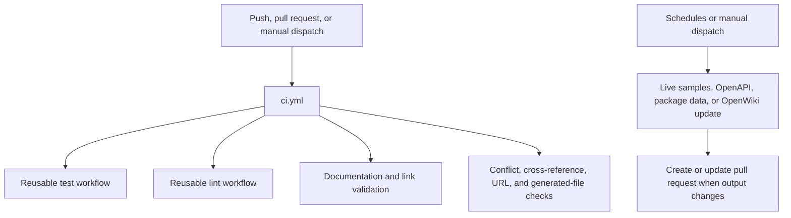

## Overview

GitHub Actions has two deliberately different roles in this repository:

- **deterministic validation** runs for pushes to `main`, pull requests, or manually through `ci.yml`; it checks the repository checkout without provider credentials;
- **scheduled automation** refreshes data or documentation that depends on external services and opens pull requests when an output changes.

The primary workflow cancels an earlier run for the same workflow and Git ref when a newer push arrives. This keeps the reported result focused on the current commit rather than consuming runners on obsolete commits.



This shows the separation between checkout-based CI and scheduled workflows that may contact external systems.

## Core CI

`.github/workflows/ci.yml` runs on `main` pushes, pull requests, and manual dispatch. It invokes reusable workflows for Python 3.13 testing, linting, and documentation validation, then performs repository-specific checks:

- `test` delegates to `_test.yml`, which installs the test dependency group and runs `make test`. The target runs pytest on `tests/unit_tests` with network sockets disabled, except Unix sockets. This makes core tests reproducible without unintended network access.
- `lint` delegates to `_lint.yml` and runs `make lint` with frozen uv resolution and GitHub-formatted Ruff diagnostics. `make lint` checks Ruff formatting and rules, `ty`, and Codespell.
- `links` delegates to `_check-links.yml`. It installs the Mintlify CLI (cached by workflow definition), builds the documentation through `make broken-links-with-anchors`, validates anchors after filtering known generated/snippet cases, and runs `make check-openapi`.
- `check-merge-conflicts` fails if tracked files contain unresolved conflict-marker lines.
- `check-cross-refs` runs `make check-cross-refs`, resolving source `@[ref]` references via the repository mapping.
- `check-external-docs-urls` checks accepted `docs_url` schemes in the external integration metadata.
- `check-generated-files` regenerates `src/oss/python/integrations/providers/overview.mdx` and fails when it differs from the checked-in generated file. It skips only package-download bot PRs or PRs explicitly carrying `bypass-auto-check`; otherwise the generated artifact is an invariant, not a hand-edited page.

CI is not itself a merge policy: branch protection determines which checks are required. The workflow supplies the validation signal.

### Reproducing checkout-based checks

The Makefile is the common local entrypoint. The closest commands are:

```bash
make lint
make test
make broken-links-with-anchors
make check-cross-refs
uv run python pipeline/tools/partner_pkg_table.py
```

`make broken-links-with-anchors` builds first, so failures can result from the documentation pipeline as well as a broken link. It runs Mintlify from `build/`, filters documented false-positive classes, and fails only if remaining link lines are reported. Unlike the workflows below, these commands do not need service credentials; installing the declared Python/Node tooling is still required.

## Executable code samples

`test-code-samples.yml` is intentionally separate from core CI because samples run against real dependencies. It runs every Sunday at 00:00 UTC, on manual dispatch, and for pull requests that change `src/code-samples/**` or its workflow. A PostgreSQL/pgvector service is provided, and the job provisions Python, Node, Java/JBang, and Go for the supported sample languages.

Scheduled and manual runs set `RUN_ALL` and test all samples. For a qualifying same-repository PR, the workflow computes the diff from the PR merge base and passes only changed `.py`, `.ts`, `.java`, `.kt`, `.go`, and `.sh` sample paths through `FILES` to `make test-code-samples`. No changed executable sample is a successful no-op.

The job is skipped for fork pull requests. GitHub does not expose repository secrets to those runs, and some samples require provider keys. This is isolation rather than an indication that fork samples passed; contributors should rely on deterministic checks or maintainers can run the credentialed workflow after review.

The runner validates paths under `src/code-samples/`, excludes dependency/cache directories, executes each language using its native launcher, and imposes a 600-second per-sample timeout. Non-rate-limit failures fail the job. A persistent LangSmith HTTP 429 is retried up to three times with backoff and then reported as skipped rather than failed, because it measures shared live-service capacity rather than sample correctness.

## Generated package and integration tables

`update-package-downloads.yml` runs Sundays at 23:59 UTC or manually. Its first job updates package download metadata, regenerates the provider overview and integration snippets, and transfers the resulting files as a one-day artifact to a second job. The second job creates a timestamped `chore/update-package-downloads-*` branch and PR only if those outputs differ, then enables squash auto-merge.

The data refresh is external-service work. `scripts/packages_yml_get_downloads.py` requests Pepy monthly badge data only for package records whose `downloads_updated_at` is at least 24 hours old; an unindexed package (404) is recorded as zero, while other request errors fail the script. `refresh_integration_downloads.py` derives tables from hosted integration frontmatter and third-party metadata. The workflow can optionally create deduplicated Linear issues for candidates over the hosted-docs threshold; without both the repository secret and configured team variable it explicitly runs that step in dry-run mode.

This workflow uses the GitHub token for repository write and PR operations. The Linear API value is never printed or embedded in generated files.

## LangSmith OpenAPI refresh

`refresh-langsmith-openapi.yml` runs daily at 10:00 UTC or manually. It invokes `scripts/process_langsmith_openapi.py --write`, which fetches only from its allowlisted `api.smith.langchain.com` host and writes `src/langsmith/langsmith-platform-openapi.json`. Post-processing marks fleet, internal, and health-style operations hidden and applies human-readable groups to tags for generated public API navigation.

When the generated spec differs, the workflow maintains one standing `chore/refresh-langsmith-openapi` PR: it appends to an open PR on that branch, or starts a branch from the checkout and opens a PR to `main`. An unchanged spec exits without a commit. The job has repository contents and pull-request write permission and uses `github.token` through `GH_TOKEN`; it does not require a separately disclosed API credential for the spec fetch.

## Daily OpenWiki update PR

`openwiki-update.yml` runs daily at 08:00 UTC and can be dispatched manually. It checks out **full history** (`fetch-depth: 0`), rather than a shallow clone, because `openwiki code --update` compares `HEAD` with the commit that was last documented. With shallow history that commit is hidden and the update receives an empty change summary.

The job installs the pinned OpenWiki, Mermaid, and jsdom packages, runs `openwiki code --update --print`, then uses `create-pull-request` to maintain `openwiki/update` with the intended documentation and configuration paths. Its token permissions allow content and PR writes.

OpenWiki needs an `OPENAI_API_KEY` to use its configured provider and an `OPENWIKI_LANGSMITH_API_KEY` for authenticated LangSmith connector pulls; optional LangSmith tracing uses a separate key. These are repository secrets passed as environment variables, never values to place in a page, command line, or PR. As a scheduled workflow in the base repository it can use those secrets; do not repurpose it for untrusted fork code.

## Operating and extending workflows

Keep fast, deterministic checks in `ci.yml` or its reusable workflows, and place externally dependent or credentialed work in a separately triggered workflow with the least required permissions. Reuse Make targets where practical so maintainers can reproduce failures locally. For a new generated artifact, add both a scheduled producer and a CI freshness check (unless there is a documented reason to bypass it), and ensure no-change runs exit before creating noise PRs.

For failures, start with the failed Action step and run its Make/script command locally when it is checkout-only. For scheduled failures, distinguish an actual transformation or credentials error from external availability, rate limits, or the 24-hour package-refresh gate. Avoid retrying a fork PR merely to obtain secrets; use a reviewed base-repository run instead.
