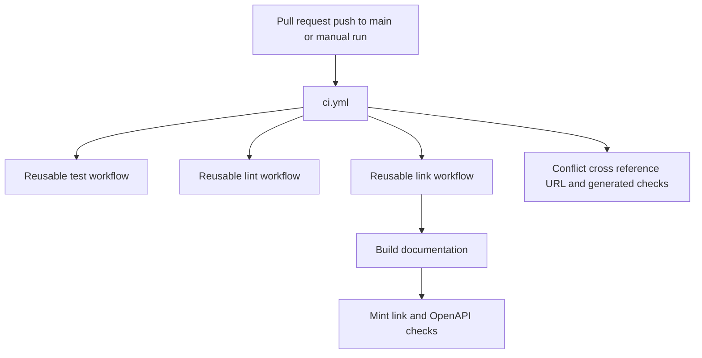

## Scope and entrypoints

GitHub Actions separates fast, repository-local validation from maintenance that must talk to external services or create pull requests. The main workflow, `.github/workflows/ci.yml`, runs for pull requests, pushes to `main`, and manual dispatch. It groups runs by workflow and Git ref and cancels an in-progress run when a newer commit arrives on that ref. This reduces work on obsolete commits; it does **not** itself define branch-protection or merge requirements.

The CI workflow calls reusable test, lint, and documentation-link workflows on Python 3.13, and runs three repository-specific checks alongside them:

- `check-merge-conflicts` fails when tracked text contains unresolved conflict-marker lines.
- `check-cross-refs` runs `make check-cross-refs` after installing the test dependency group.
- `check-external-docs-urls` validates `docs_url` schemes in `scripts/data/integration_external_docs.yaml` through `scripts/refresh_integration_downloads.py --check-docs-urls`.

The `lint` reusable workflow invokes `make lint`, which checks Ruff formatting and rules, `ty`, and `codespell`. The detailed formatting and prose policies are configuration concerns rather than responsibilities of `ci.yml`.



This shows the main CI fan-out and the build-dependent validation path.

## Reusable validation jobs

### Tests are deliberately network-constrained

`_test.yml` is a `workflow_call` interface: callers supply a required working directory and Python version. It checks out a shallow copy, configures the repository's `uv` setup action, installs the `test` dependency group, and runs `make test`. The Make target executes pytest with `--disable-socket --allow-unix-socket`; normal network sockets are blocked while Unix-domain sockets remain available. A caller whose working directory is `./libs/server` also gets `make test_integration`.

This is the ordinary test boundary: a test that unexpectedly requires an external service should fail under the socket restriction rather than silently depend on the network.

### Documentation links validate built output

`_check-links.yml` is likewise reusable and accepts a required Python version. It installs the test dependencies, uses Node 22, caches the global Mint CLI keyed by the workflow file, installs `mint@latest` on a cache miss, and applies a KaTeX `__VERSION__` patch on that first installation. It then runs `make broken-links-with-anchors` and `make check-openapi`.

Both link targets build first. `make broken-links-with-anchors` runs `pipeline build`, invokes `mint broken-links --check-anchors` from `build/`, and filters expected reports for deploy-generated OpenAPI pages and standalone snippets. It fails only if the filtered output still contains reported link lines. `make check-openapi` validates the built `langsmith/agent-server-openapi.json` with `mint openapi-check`. Thus a passing job attests to the generated documentation routes and anchors, not merely raw source-file links.

## Generated-file invariant

`check-generated-files` enforces one narrow generated-output invariant: after regenerating `src/oss/python/integrations/providers/overview.mdx` with `pipeline/tools/partner_pkg_table.py`, the working tree must have no diff for that file. A failure means the checked-in overview was edited manually or was not regenerated after changing its inputs; change package metadata or the generator, rerun the generator, and commit its output.

The job intentionally exits before validation in two cases: a PR created by `github-actions[bot]` whose title contains `update package download counts`, or a PR carrying `bypass-auto-check`. Those are operational exceptions, not evidence that the output is generally safe to hand-edit.

## Executable code samples

`test-code-samples.yml` is intentionally outside the main CI fan-out. It runs on a pull request that changes `src/code-samples/**` or the workflow, by manual dispatch, and every Sunday at 00:00 UTC. Because samples can need provider credentials, its only job runs for scheduled and manual events or for pull requests whose head repository is not a fork. Fork pull requests therefore receive no sample execution rather than an execution with repository secrets.

Scheduled and manual runs select every eligible `.py`, `.ts`, `.java`, `.kt`, `.go`, and `.sh` file. A qualifying same-repository PR computes the merge base with its target branch and selects only changed sample files of those extensions. The job provisions PostgreSQL with pgvector, plus Python 3.13, Node 20, Java 21 with JBang, and Go; it passes provider secrets and `POSTGRES_URI` to `make test-code-samples`.

The runner dispatches each language to its appropriate tool and has a 600-second per-sample timeout. Ordinary failed samples fail the job. A detected HTTP 429 rate-limit response is retried up to three times with 15-second delays; if it remains rate-limited, the sample is recorded as skipped and does not fail the run. This distinction prevents transient live LangSmith API load from being reported as a documentation-example regression.

## Scheduled content maintenance

### LangSmith OpenAPI refresh

`refresh-langsmith-openapi.yml` runs daily at 10:00 UTC and is manually dispatchable. It has write permissions for contents and pull requests, runs `scripts/process_langsmith_openapi.py --write`, and manages a standing branch named `chore/refresh-langsmith-openapi`.

The processor fetches only `https://api.smith.langchain.com/openapi.json` (the script allowlists that host), writes `src/langsmith/langsmith-platform-openapi.json`, hides selected fleet, internal, health, and infrastructure operations with `x-hidden`, and adds presentation metadata such as tag groups. The workflow preserves the generated result while switching to the standing branch. If an open PR already uses that branch, it appends a commit there; otherwise it creates the branch and PR against `main`. If the processed specification is unchanged, it exits without a commit. The result is at most one open refresh PR rather than a daily series of duplicates.

### Package download and integration-table updates

`update-package-downloads.yml` runs every Sunday at 23:59 UTC or manually. Its first job updates stale package download counts, regenerates the provider overview and integration download tables, optionally creates Linear issues for hosted-documentation candidates, and uploads the changed inputs and generated outputs as a one-day artifact. The second job downloads that artifact and creates a timestamped PR only when one of the tracked paths changed; it then enables squash auto-merge.

The count updater does not re-query a package whose `downloads_updated_at` is less than 24 hours old, limiting calls to pepy.tech. A missing pepy badge is recorded as zero, whereas other request failures raise an error. Linear issue creation is secret-gated: without both `LINEAR_API_KEY` and `LINEAR_TEAM_KEY`, the candidate script runs in dry-run mode; with both, it runs with `--create`. This lets the data-generation path remain usable without granting issue-creation credentials.

## Daily OpenWiki maintenance

`openwiki-update.yml` runs daily at 08:00 UTC and can be started manually. It requests content and pull-request write permissions, but its checkout is deliberately full-history (`fetch-depth: 0`): `openwiki code --update` compares `HEAD` with the commit last documented, and a shallow checkout would hide that commit and produce an empty change summary.

The job installs Node 22 plus pinned OpenWiki, Mermaid, and jsdom packages, then runs `openwiki code --update --print`. It supplies the OpenAI provider/model configuration and repository secrets for OpenAI, the LangSmith connector, and optional LangSmith tracing. Finally, `peter-evans/create-pull-request` creates or updates the `openwiki/update` branch with only `openwiki`, `AGENTS.md`, `CLAUDE.md`, and this workflow eligible for inclusion. The fixed branch and PR title make successive automated documentation updates converge on one reviewable PR.

## Operating and reproducing checks

Use the Make targets when debugging the same underlying mechanisms locally:

```bash
make test
make lint
make broken-links-with-anchors
make check-openapi
make check-cross-refs
make test-code-samples
```

`make test-code-samples FILES="src/code-samples/path/example.py"` narrows the sample runner to explicit eligible paths. Unlike the reusable test workflow, sample execution is expected to use live services and may require the environment variables configured by the GitHub workflow. For documentation build behavior itself, see the build-system documentation; for how generated integration tables derive from metadata, see the integration-catalog documentation.
