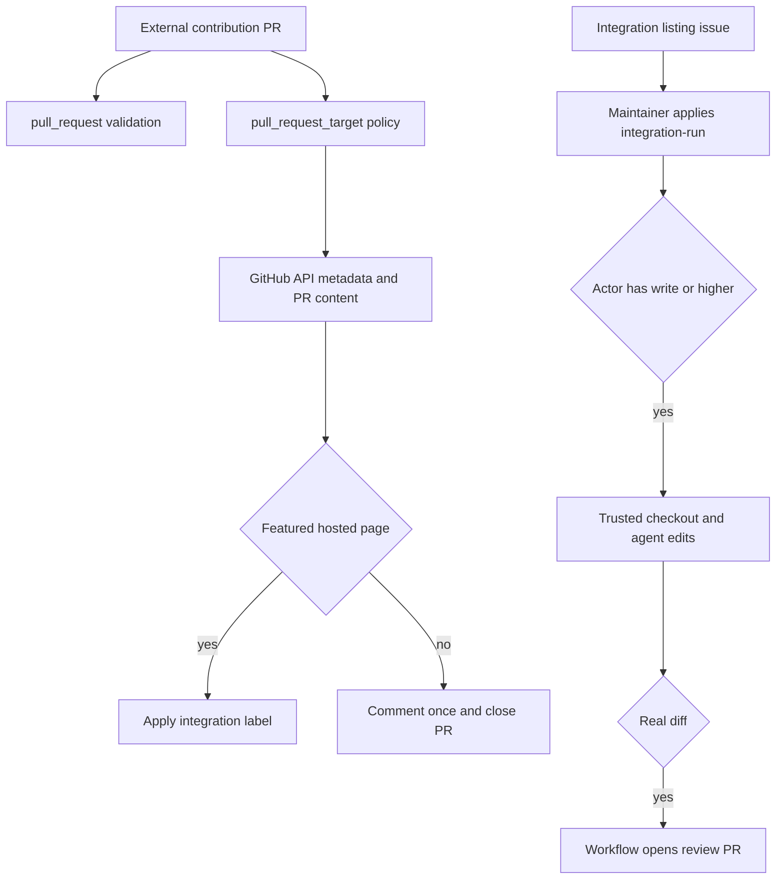
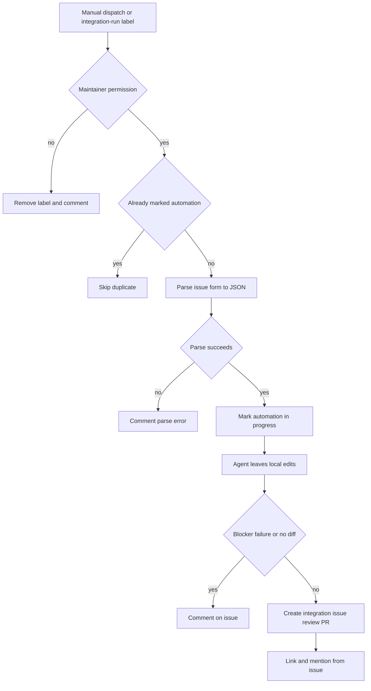
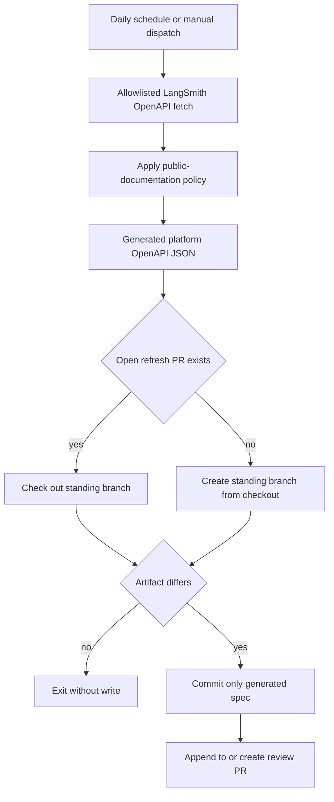

## Trust boundaries

This repository deliberately gives different workflow classes different jobs. Treat the event trigger, checkout, permissions, and write path together when changing a workflow:

| Class | Entrypoints | What it may do | What must remain out of scope |
| --- | --- | --- | --- |
| **Untrusted validation** | `pull_request`, pushes to `main`, and selected manual runs | Check out the proposed revision and run read-only tests, lint, generation checks, and documentation checks. | Repository mutation and secret-backed execution of fork code. |
| **Metadata-only PR policy** | `pull_request_target` | Read PR metadata and selected PR-file content through the GitHub API, then label, comment, close, or request review. | Checking out or executing the PR head, or passing untrusted fields to a shell. |
| **Trusted writers** | Scheduled/manual refreshes and maintainer-authorized issue automation | Use narrowly granted write permissions to create or update a review PR from a trusted checkout. | Treating issue or remote input as an approved change; review remains required. |

`pull_request_target` is **not** a safe way to run a fork. Its purpose here is narrowly scoped GitHub-side policy. In contrast, executable validation belongs on `pull_request`, and the integration agent runs only after an authorized maintainer trigger.


```mermaid
flowchart TD
  Contribution["External contribution PR"] --> Validation["pull_request validation"]
  Contribution --> Policy["pull_request_target policy"]
  Policy --> API["GitHub API metadata and PR content"]
  API --> Decision{"Featured hosted page"}
  Decision -->|"yes"| Label["Apply integration label"]
  Decision -->|"no"| Nudge["Comment once and close PR"]
  Issue["Integration listing issue"] --> Trigger["Maintainer applies integration-run"]
  Trigger --> Authorize{"Actor has write or higher"}
  Authorize -->|"yes"| Agent["Trusted checkout and agent edits"]
  Agent --> Diff{"Real diff"}
  Diff -->|"yes"| ReviewPR["Workflow opens review PR"]
```

This flow separates untrusted contribution input from the metadata policy path and the maintainer-approved writer path.

## Core CI and generated-document gates

`ci.yml` runs reusable test, lint, and documentation-link workflows alongside merge-conflict, cross-reference, external-documentation URL, and generated-file checks for pull requests, pushes to `main`, and manual dispatch. Its concurrency group is the workflow plus ref, with `cancel-in-progress: true`; a newer push to the same PR or branch supersedes an obsolete run.

The reusable test and lint workflows make shallow checkouts, synchronize the `test` dependency group, and run `make test` or `make lint` using the caller's Python and working-directory inputs. The link workflow has read-only `contents` permission and a 20-minute timeout; it installs Python dependencies and Node 22, caches or installs Mintlify CLI, then runs:

```bash
make broken-links-with-anchors
make check-openapi
```

`lint-prose.yml` is a separate pull-request workflow for changed `src/**/*.md` and `src/**/*.mdx` files. It obtains the merge base, skips if no applicable document changed, installs the Vale version selected by `scripts/install-vale.sh`, and calls `make lint_prose` only for the changed paths. This is a focused prose gate, not a replacement for the broader CI lint job.

### Metadata inputs and derived outputs

`packages.yml` is the source of truth for package and repository records used to generate the package index and partner package table. Its package metadata includes calculated download fields; `highlight` bypasses the download filter and is reserved for maintainers. External integration rows instead belong in `scripts/data/integration_external_docs.yaml`, where they are grouped by language and component and supply the external `docs_url` and optional capability metadata.

The generated-output gate regenerates `src/oss/python/integrations/providers/overview.mdx` with `pipeline/tools/partner_pkg_table.py` and fails on a diff. Update `packages.yml` or the generator, regenerate, and commit the result rather than hand-editing the overview. The gate may be skipped by the `bypass-auto-check` label, and automatically skips the expected `github-actions[bot]` package-download update PR.

External listing URLs have an independent, write-free CI check:

```bash
uv run python scripts/refresh_integration_downloads.py --check-docs-urls
```

The generator accepts only `https://`, `http://`, or a site-relative path beginning with one `/`; it rejects blank values, protocol-relative `//...` values, and unsafe schemes before they can become rendered link targets. The check validates the embedding boundary, not remote reachability. See [Integration Listing Automation](/openwiki/workflows/integration-listing-automation.md) for metadata ownership and regeneration.

## External integration PR policy

`external-integration-pr-comment.yml` is a non-draft `pull_request_target` workflow with `contents: read` and `pull-requests: write`. It creates a GitHub App token for membership lookup and uses `actions/github-script` without a checkout. The script considers added integration MDX files below the Python or JavaScript integration directories, excluding `TEMPLATE.mdx`, and any change to `scripts/data/integration_external_docs.yaml`.

For a relevant contribution, bot authors are ignored. `open-swe[bot]` is treated as internal; otherwise the workflow queries organization membership. A 404 or membership-lookup error is deliberately treated as external, so the policy fails closed toward contributor guidance. Qualifying external PRs receive the `integration` label if it is absent.

Hosted pages with `featured: true` in a newly added page's frontmatter are the maintainer path: they are labeled but receive neither the issue-form nudge nor closure. All other qualifying external PRs get one marker-based idempotent comment redirecting authors to the Integration listing issue form, then an open PR is closed. The workflow reads candidate frontmatter from the PR head with the GitHub API, but never checks out or runs that content.

Do not weaken this boundary by adding `actions/checkout`, a PR-head script, or shell interpolation of PR fields to this workflow. An apparent content read is safe here only because the script decodes and pattern-matches it as data; it does not execute it.

## Maintainer-gated integration submission

`integration-submission.yml` is the trusted intake path for the issue form. It has contents, pull-request, and issue write permissions, but an issue opening does not invoke the agent. The `submit` job starts only from manual dispatch or application of `integration-run`; before checkout it checks that the triggering actor has `admin`, `maintain`, or `write` permission. An unauthorized label event removes the label, comments on the issue, and exits. Per-issue concurrency does not cancel an existing run, while the `integration-automation` label blocks repeat processing.

After authorization, the workflow fetches the issue body and parses structured fields to JSON. The prompt explicitly treats those field values as untrusted listing metadata. The Deep Agents action receives a trusted repository checkout and credentials, but is instructed to leave edits uncommitted and not push, create a PR, or comment on GitHub. GitHub mutations remain workflow-owned.


```mermaid
flowchart TD
  Start["Manual dispatch or integration-run label"] --> Permission{"Maintainer permission"}
  Permission -->|"no"| Reject["Remove label and comment"]
  Permission -->|"yes"| Duplicate{"Already marked automation"}
  Duplicate -->|"yes"| Stop["Skip duplicate"]
  Duplicate -->|"no"| Parse["Parse issue form to JSON"]
  Parse --> Parsed{"Parse succeeds"}
  Parsed -->|"no"| ParseComment["Comment parse error"]
  Parsed -->|"yes"| Mark["Mark automation in progress"]
  Mark --> RunAgent["Agent leaves local edits"]
  RunAgent --> Result{"Blocker failure or no diff"}
  Result -->|"yes"| Report["Comment on issue"]
  Result -->|"no"| Create["Create integration issue review PR"]
  Create --> Link["Link and mention from issue"]
```

This lifecycle makes a maintainer-approved generation run visible and reviewable without granting issue text authority to publish directly. A parser error, agent failure, blocker file, or empty diff yields an issue comment rather than a PR. Only a real diff produces the `integration/issue-<number>` branch and labeled PR, whose checklist asks reviewers to confirm eligibility, URL/provider-card data, and generated surfaces. The workflow then links that PR back to the issue.

## LangSmith OpenAPI refresh

`refresh-langsmith-openapi.yml` is a trusted writer that runs daily at 10:00 UTC or manually. Its single job has a 15-minute timeout and only `contents: write` and `pull-requests: write` permissions. It runs `scripts/process_langsmith_openapi.py --write`, then stages only `src/langsmith/langsmith-platform-openapi.json`.

The processor accepts network fetches only from `api.smith.langchain.com`. It applies public-documentation policy deterministically: hide configured fleet, product-feedback, internal, infrastructure, health, and other non-public operations; normalize visible summaries; add or update top-level tags and human-readable `x-group` values; and order groups for navigation. It emits a generated public-reference candidate, not an automatically approved publication.


```mermaid
flowchart TD
  Schedule["Daily schedule or manual dispatch"] --> Fetch["Allowlisted LangSmith OpenAPI fetch"]
  Fetch --> Process["Apply public-documentation policy"]
  Process --> Candidate["Generated platform OpenAPI JSON"]
  Candidate --> Existing{"Open refresh PR exists"}
  Existing -->|"yes"| Branch["Check out standing branch"]
  Existing -->|"no"| Fresh["Create standing branch from checkout"]
  Branch --> Compare{"Artifact differs"}
  Fresh --> Compare
  Compare -->|"no"| Noop["Exit without write"]
  Compare -->|"yes"| Commit["Commit only generated spec"]
  Commit --> Review["Append to or create review PR"]
```

This workflow keeps one outstanding `chore/refresh-langsmith-openapi` review PR. It copies the newly generated specification aside, restores the initial checkout, then either checks out the open PR branch or creates the standing branch. If the artifact is unchanged on that branch it exits; otherwise it appends a commit to the existing PR, or force-pushes the unreferenced standing branch and creates a new PR. Review the diff for exposure, hiding, title, and grouping changes. Do not edit the generated JSON by hand; change processor policy or the authoritative upstream input, regenerate, and review.

Use a local input to reproduce policy work without fetching the live source:

```bash
uv run python scripts/process_langsmith_openapi.py --input /path/to/openapi.json --write
```

The refresh proves neither that all generated endpoint pages render in Mintlify nor that a remote update is correct. Run the separate documentation checks and inspect the refresh PR or deployed output as appropriate. See [LangSmith Platform OpenAPI Refresh](/openwiki/workflows/langsmith-openapi-refresh.md).

## Safe-change checklist

1. Keep fork-head execution on ordinary `pull_request` validation and preserve the metadata-only nature of `pull_request_target` workflows.
2. Keep maintainer authorization before the integration workflow checks out code or starts its agent; leave GitHub writes in the workflow, not the prompt.
3. Change integration metadata at its source, validate external URLs, regenerate derived output, and commit the generated diff rather than editing it by hand.
4. Preserve CI's generated-overview check and treat either bypass as an explicit exception.
5. Keep the OpenAPI host allowlist, processor curation policy, single-artifact staging, no-diff exit, and standing review-PR lifecycle together.
6. Use focused local commands before relying on CI:

   ```bash
   make test
   make lint
   make lint_prose FILES="src/path/page.mdx"
   make broken-links-with-anchors
   make check-openapi
   uv run python scripts/refresh_integration_downloads.py --check-docs-urls
   uv run python pipeline/tools/partner_pkg_table.py
   ```

## Related pages

- [Mintlify](/openwiki/integrations/mintlify.md)
- [Testing Overview](/openwiki/testing/test-overview.md)
- [Integration Listing Automation](/openwiki/workflows/integration-listing-automation.md)
- [LangSmith Platform OpenAPI Refresh](/openwiki/workflows/langsmith-openapi-refresh.md)
- [Agent Skills](/openwiki/operations/agent-skills.md)
