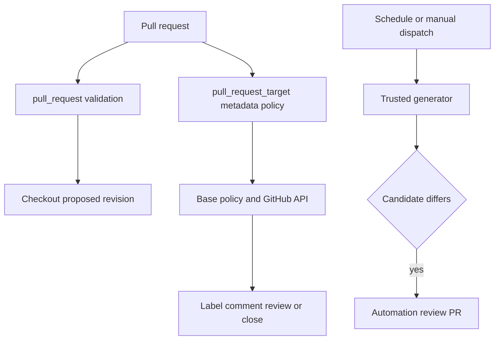
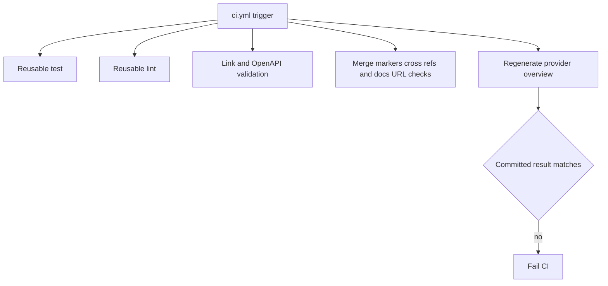
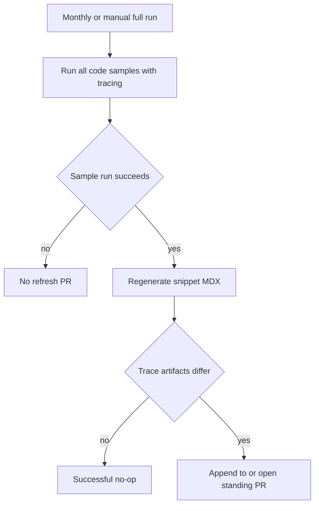

## Trust model

The workflows deliberately use three different contexts. Keep their boundaries intact.

| Context | Entrypoints | Permitted role | Safety boundary |
| --- | --- | --- | --- |
| Untrusted revision validation | `pull_request` | Check out and validate the proposed revision. | Do not rely on repository secrets or writes while handling fork code. |
| Metadata-only PR automation | `pull_request_target` | Read base-branch policy and GitHub API metadata; label, comment, request review, or close. | Never check out, source, or execute fork-head code. Treat PR values and head-file bytes as data. |
| Trusted maintenance writer | Schedule or `workflow_dispatch` in the repository | Use narrowly granted credentials to generate a branch and review PR. | Preserve no-diff exits, limited paths, and review; package-download PRs are the explicit squash-auto-merge exception. |


```mermaid
flowchart TD
  Pull["Pull request"] --> Validate["pull_request validation"]
  Pull --> Metadata["pull_request_target metadata policy"]
  Validate --> Checkout["Checkout proposed revision"]
  Metadata --> API["Base policy and GitHub API"]
  API --> Mutate["Label comment review or close"]
  Trigger["Schedule or manual dispatch"] --> Writer["Trusted generator"]
  Writer --> Diff{"Candidate differs"}
  Diff -->|"yes"| Review["Automation review PR"]
```

This separates executing a proposed revision from privileged PR mutation. Do not convert `pull_request_target` into a fork-testing workaround: do not add a head checkout, run a PR file, or construct shell commands from untrusted title, body, branch, or issue-form values.

## PR expectations and core CI

The PR template asks authors to describe the change and related work, choose a change type, and, as applicable, confirm the contributing and language policy, local `docs dev` validation, working examples, root-relative internal links, and navigation updates. Preview branches are optional for internal team members.

`ci.yml` runs on PRs, pushes to `main`, and manual dispatch. It fans out to reusable test, lint, and documentation-link checks, plus merge-conflict-marker, cross-reference, external `docs_url`, and generated-file checks. Its concurrency group combines the workflow and ref and cancels obsolete runs after a newer push.


```mermaid
flowchart TD
  CI["ci.yml trigger"] --> Test["Reusable test"]
  CI --> Lint["Reusable lint"]
  CI --> Links["Link and OpenAPI validation"]
  CI --> Static["Merge markers cross refs and docs URL checks"]
  CI --> Generated["Regenerate provider overview"]
  Generated --> Match{"Committed result matches"}
  Match -->|"no"| Fail["Fail CI"]
```

This is the CI fan-out; generated-output drift fails rather than being silently repaired in CI.

The reusable test and lint workflows take caller-supplied Python and working-directory inputs, perform shallow checkouts, synchronize the `test` dependency group, and run `make test` or `make lint`. The reusable link workflow has read-only `contents` permission and a 20-minute limit, installs Python dependencies and Node 22/Mintlify, then runs `make broken-links-with-anchors` and `make check-openapi`.

`check-generated-files` runs `pipeline/tools/partner_pkg_table.py` and fails when `src/oss/python/integrations/providers/overview.mdx` differs. Change `packages.yml` or the generator, regenerate, and commit the output rather than hand-editing the overview. The job bypasses this check for the `bypass-auto-check` label and the expected `github-actions[bot]` package-download PR.

The external-listing gate runs:

```bash
uv run python scripts/refresh_integration_downloads.py --check-docs-urls
```

Useful local counterparts are:

```bash
make test
make lint
make broken-links-with-anchors
make check-cross-refs
uv run python scripts/refresh_integration_downloads.py --check-docs-urls
uv run python pipeline/tools/partner_pkg_table.py
```

## HTML export testing and Linear escalation

`htmltest.yml` is a read-only weekly (Monday 08:00 UTC) or manual check. It checks out without persisted credentials, installs Python dependencies, Node 22, the cached Mintlify CLI, and `htmltest`, then runs `make export-htmltest`. That target builds the documentation, exports it with Mintlify, unpacks the ZIP, and runs `htmltest` using the external-URLs-only configuration.

`htmltest-linear.yml` does not run the export or inspect its checkout. It reacts to completion of **Htmltest Mint Export** and creates a Linear issue only when the upstream run was scheduled and failed or was cancelled. Manual failures therefore do not create tickets. The issue includes the upstream run URL and distinguishes a timeout from a build, export, or external-link failure.

Similarly, `test-code-samples-linear.yml` reacts to **Test Code Samples** only for scheduled failures or cancellations and files a Linear issue with the upstream run URL. This keeps PR runs free of an always-skipped ticket job while making recurring maintenance failures visible.

## Metadata-only pull-request automation

### Ownership summary

`pr-welcome-comment.yml` is a `pull_request_target` workflow for non-draft PRs opened or marked ready. It reads `.github/OWNERS` from `pr.base.ref` and changed-file metadata through the GitHub API, applies CODEOWNERS-style last-match-wins matching, and posts an ownership summary. `.github/OWNERS` is deliberately not named `CODEOWNERS`, so GitHub does not request reviewers by default.

A trailing `# auto-request` marker opts a rule into requests; the scoped form limits requests to listed owners. The workflow requests only opted-in owners other than the author. This is base-controlled policy and does not require a PR checkout.

### External integration PRs

`external-integration-pr-comment.yml` is a `pull_request_target` workflow with read-only contents and PR-write permissions. It gets an organization-membership App token and uses GitHub APIs without a checkout. It identifies external authors adding integration content or changing the external-listing YAML, applies the `integration` label, and treats membership lookup errors conservatively as external.

For newly added MDX, it may read PR-head bytes with `repos.getContent` only to detect `featured: true` frontmatter. This is data inspection, not execution. A featured addition stays open after labeling; otherwise the workflow posts one marker-tagged redirect to the integration-listing issue form and closes an open PR. The marker makes repeated `synchronize` events idempotent.

## Maintainer-approved integration listings

`integration-submission.yml` is a trusted writer: it starts only from manual dispatch or the `integration-run` issue label, verifies that the triggering actor has `admin`, `maintain`, or `write` permission **before checkout**, and prevents duplicate work with `integration-automation`. An unauthorized label event removes the trigger label, comments, and exits.

After authorization, it checks out the base repository, parses issue-form fields, and explicitly passes the resulting values to the agent as untrusted listing metadata. The agent must leave local edits only; the workflow owns pushes, PRs, and GitHub comments. Parse errors, a blocker file, agent failure, and an empty diff are reported to the issue. Only a real diff creates `integration/issue-<number>`, opens a labeled review PR, and links it to the issue.

## Code-sample validation and trace refresh

`test-code-samples.yml` runs for code-sample or workflow-file PR changes, manual dispatch, and a monthly schedule. Its secret-dependent job skips fork PRs. Internal PRs compute changed supported sample files from the merge base; scheduled and manual runs test all samples. Full runs have a 150-minute limit, while PR runs have a 60-minute limit.

The workflow provisions PostgreSQL and the language toolchains required by the supported sample types, then calls `make test-code-samples`. Monthly and manual runs set `CODE_SAMPLE_TRACING=1`. Only after a successful test do they regenerate snippet MDX and compare `src/code-samples/trace-links.json` and `src/snippets/code-samples`; a difference updates the standing `chore/refresh-code-sample-traces` PR or opens it.


```mermaid
flowchart TD
  Full["Monthly or manual full run"] --> Samples["Run all code samples with tracing"]
  Samples --> Passed{"Sample run succeeds"}
  Passed -->|"no"| Stop["No refresh PR"]
  Passed -->|"yes"| Snippets["Regenerate snippet MDX"]
  Snippets --> Changed{"Trace artifacts differ"}
  Changed -->|"no"| Noop["Successful no-op"]
  Changed -->|"yes"| TracePR["Append to or open standing PR"]
```

The runner retries a detected LangSmith 429 up to three times and records a persistently rate-limited sample as skipped; ordinary sample failures and trace-collection failures fail the run. Tracing serializes manifest updates across concurrent samples. A source with multiple snippets is recorded as skipped and has stale single-snippet entries removed; for an eligible single-snippet source, a selected agent-like root run is publicly shared and recorded in the trace-link manifest. The local traced equivalent is `make update-code-sample-traces` and requires `LANGSMITH_API_KEY`.

## Trusted scheduled writers

### Package downloads and hosted-doc candidates

`update-package-downloads.yml` runs Sunday at 23:59 UTC or manually. Its read-only `generate-downloads` job updates only package counts whose timestamp is older than 24 hours, regenerates the provider overview and integration download tables, checks hosted-doc candidates, and uploads the candidate surfaces as a one-day artifact. The write-capable `commit-downloads` job alone consumes that artifact.

Hosted-documentation candidate detection uses `flag_hosted_docs_candidates.py --create` only when both `LINEAR_API_KEY` and `LINEAR_TEAM_KEY` are present; otherwise it is dry-run-only. Candidate creation is deduplicated against matching open Linear issues. If the downloaded artifact produces no diff in `packages.yml`, the overview, or snippets, the writer exits successfully. Otherwise it creates a timestamped `chore/update-package-downloads-*` PR and enables squash auto-merge.

### LangSmith OpenAPI refresh

`refresh-langsmith-openapi.yml` is a daily 10:00 UTC or manual writer with a 15-minute limit and contents/pull-request write permissions. It invokes `scripts/process_langsmith_openapi.py --write`. The processor accepts network input only from `api.smith.langchain.com`, hides configured internal, Fleet, and health operations, normalizes visible operation titles, groups tags, and writes deterministic formatted JSON.

The workflow stores the generated candidate while restoring a clean checkout, then reuses the `chore/refresh-langsmith-openapi` review branch when its PR is open. It appends only a changed specification to that PR; otherwise it succeeds with no change. With no standing PR, it force-pushes the standing branch and opens a PR only for a changed specification. It stages only `src/langsmith/langsmith-platform-openapi.json`.

## Safe-change checklist

1. Keep `pull_request_target` metadata-only: never execute or check out fork-head code.
2. Keep secret-backed code-sample execution off fork PRs; use ordinary validation for fork revisions.
3. When generated documentation changes, update its source or generator, regenerate it, and retain the drift check.
4. Preserve authorization before checkout and agent invocation in integration submission; let the workflow, not the agent, create the PR after a real diff.
5. Preserve writer no-op behavior and narrow writes: package downloads cross a short-lived artifact boundary, while trace and OpenAPI refreshes reuse standing review PRs.
6. Treat writer PRs as reviewable public-documentation changes even when generation succeeds.

## Related pages

- [CLI Tools](/openwiki/operations/cli-tools.md)
- [Testing Overview](/openwiki/testing/test-overview.md)
- [Code Sample Lifecycle](/openwiki/workflows/code-sample-lifecycle.md)
- [Integration Listing Automation](/openwiki/workflows/integration-listing-automation.md)
- [LangSmith Platform OpenAPI Refresh](/openwiki/workflows/langsmith-openapi-refresh.md)
